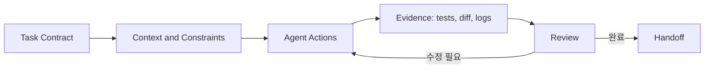



## 문제: 긴 prompt가 좋은 개발 결과를 자동으로 만들지는 않는다

coding agent는 code를 읽고, 수정하고, command를 실행하고, 결과를 검토할 수 있다.

그러나 완료 조건과 경계가 모호하면 다음 문제가 생긴다.

- 요구하지 않은 file까지 정리한다.
- test가 없는 상태를 성공으로 보고한다.
- 기존 사용자 변경을 덮어쓴다.
- 외부 system에 예상보다 큰 변경을 수행한다.
- 여러 agent가 같은 file을 동시에 수정한다.
- command output이 잘렸는데 성공으로 가정한다.
- 구현은 됐지만 재현 가능한 handoff가 없다.

좋은 사용법의 핵심은 prompt 문장 기교보다 `scope -> 실행 -> 검증 -> review -> handoff`의 evidence loop다.

현재 Codex의 구체 기능과 UI는 변할 수 있다.

이 글은 작성 시점에 확인한 공식 [Codex 문서](https://developers.openai.com/codex/)의 일반 원칙을 바탕으로 하며 실제 surface의 최신 문서를 함께 확인한다.

## Mental model: Codex는 권한 안에서 일하는 협업자다



### task contract

무엇을 바꾸고 무엇을 건드리지 않을지 정의한다.

### context

repository 구조, build command, style, 관련 문서, 실패 증상을 제공한다.

### authority

sandbox와 approval은 agent가 읽고 쓰고 실행할 수 있는 범위를 제한한다.

### evidence

test 결과, lint, build, diff, 재현 log, 생성 artifact가 주장을 뒷받침한다.

### handoff

무엇이 바뀌었고 무엇이 검증됐으며 무엇이 남았는지 전달한다.

## Prompt를 작업 계약으로 쓰는 법

공식 Codex manual은 goal, context, constraints, done criteria를 구체적으로 주는 방향을 권장한다.

### 목표

`로그인 고쳐줘`보다 관찰 가능한 결과를 쓴다.

예: `만료된 session으로 요청하면 refresh를 한 번 시도하고, 실패하면 login 화면으로 보내며, 무한 loop가 없어야 한다.`

### 범위

- 수정 가능한 directory
- 제외할 file
- public API 변경 가능 여부
- dependency 추가 가능 여부
- migration 허용 여부
- commit, push, PR 권한 여부

git push나 외부 issue 작성은 별도 권한으로 본다.

### 완료 조건

- 재현 test가 먼저 실패한다.
- 수정 뒤 관련 test가 통과한다.
- full suite 또는 영향 범위 check가 통과한다.
- lint와 type check가 통과한다.
- 문서와 migration이 갱신된다.
- 남은 위험을 보고한다.

## AGENTS.md로 반복 지침을 저장한다

공식 manual은 `AGENTS.md`를 repository에서 agent가 자동으로 읽는 지속 지침으로 설명한다.

좋은 내용은 실무적이고 검증 가능하다.

```md
# Repository guidance

## Build and test
- Install: `npm ci`
- Unit tests: `npm test`
- Type check: `npm run typecheck`

## Change rules
- Do not edit generated files under `dist/`.
- Preserve public API compatibility unless the task says otherwise.
- Add a regression test for every bug fix.

## Handoff
- Report changed files, commands run, and remaining failures.
```

너무 긴 철학 문서보다 실제 command와 금지 경계가 유용하다.

하위 directory에 더 구체적인 `AGENTS.md`가 있을 수 있으므로 scope를 확인한다.

반복 실수가 발견될 때 지침을 점진적으로 추가한다.

## Workflow: agentic 개발을 안전하게 운영

### Step 1. 현재 상태를 먼저 보존한다

agent가 수정 전 다음을 확인하게 한다.

- current branch
- working tree status
- untracked file
- 최근 관련 commit
- 적용되는 `AGENTS.md`
- build와 test baseline

dirty working tree의 변경은 사용자의 것일 수 있다.

관련 없는 변경을 되돌리거나 포함하지 않는다.

### Step 2. 재현 가능한 문제 정의를 만든다

bug라면 최소 재현, 실제 결과, 기대 결과를 기록한다.

가능하면 failing test로 바꾼다.

환경 의존 문제라면 version, OS, config, command, sanitized log를 남긴다.

원인을 모르는 상태에서 바로 대규모 refactor를 요청하지 않는다.

### Step 3. 읽기와 쓰기를 구분한다

먼저 code path, dependency, test, history를 읽는다.

변경 후보와 위험을 좁힌 뒤 수정한다.

diagnosis 요청이면 원인 보고까지만 하고 자동으로 fix 범위를 넓히지 않게 한다.

implementation 요청이면 정상적인 수정과 검증을 끝까지 수행하게 한다.

### Step 4. 작은 patch와 명확한 invariant를 선호한다

한 번에 architecture 전체를 바꾸기보다 실패 원인을 직접 해결하는 최소 change를 만든다.

예외는 요구사항 자체가 구조 변경을 필요로 할 때다.

invariant 예시는 다음과 같다.

- 같은 request는 중복 record를 만들지 않는다.
- unauthenticated user는 protected data를 받지 않는다.
- cancellation 뒤 background task가 남지 않는다.
- old schema와 new schema가 rollout 동안 공존한다.

### Step 5. 병렬 agent는 독립 subtask에 사용한다

공식 Codex manual은 exploration, test, log 분석처럼 독립적이고 read-heavy한 작업을 병렬화하는 방식을 설명한다.

좋은 분할 예시는 다음과 같다.

- agent A: failure path와 root cause 조사
- agent B: 기존 test gap 조사
- agent C: security와 compatibility review

같은 file을 여러 agent가 동시에 수정하면 conflict와 판단 불일치가 생긴다.

쓰기 ownership을 file 또는 component 단위로 분리한다.

root agent가 결과를 통합하고 최종 검증한다.

### Step 6. sandbox와 approval을 안전 경계로 사용한다

공식 문서상 Codex는 sandbox와 approval policy로 file·network·command 범위를 통제한다.

기본은 필요한 최소 권한이다.

다음 action은 특히 target과 영향 확인이 필요하다.

- destructive file operation
- credential 또는 secret 접근
- dependency download
- 외부 API mutation
- git push와 PR 생성
- cloud resource 변경
- production command

approval은 귀찮은 popup이 아니라 authority 전환 지점이다.

### Step 7. test pyramid를 작업 위험에 맞춘다

변경 직후 가장 좁고 빠른 test를 실행한다.

그 뒤 영향 범위를 넓힌다.

1. 새 regression test
2. 관련 unit test
3. component 또는 integration test
4. lint와 type check
5. build
6. 필요한 end-to-end test

모든 task에 무조건 가장 비싼 suite를 요구하지 않는다.

반대로 핵심 authentication 변경을 unit test 하나로 끝내지 않는다.

### Step 8. command 결과를 evidence로 읽는다

exit code, stdout, stderr, test count, skipped test, timeout을 확인한다.

output truncation이 있으면 관련 구간을 다시 읽는다.

`command succeeded`와 `요구사항이 충족됨`을 구분한다.

생성된 artifact가 있으면 실제 path와 내용 또는 render를 확인한다.

### Step 9. diff를 독립적으로 review한다

test가 통과해도 diff를 읽는다.

- scope 밖 변경
- dead code
- secret과 개인 경로
- debug print
- overly broad exception
- dependency lock drift
- generated file
- backward compatibility
- migration과 rollback

agent에게 자신의 patch를 review하게 할 수 있지만 최종 책임자는 별도 관점으로 확인해야 한다.

### Step 10. 실패를 숨기지 않는 handoff를 요구한다

최종 보고에는 최소한 다음이 있어야 한다.

- 결과 요약
- 변경 file
- 검증 command와 결과
- 실행하지 못한 check와 이유
- 알려진 제한과 후속 작업
- commit 여부와 branch
- 생성 artifact link

`완료했습니다`만으로는 재현 가능한 handoff가 아니다.

## 실전 예제: API idempotency bug 수정 요청

### 작업 계약

```text
목표: 동일 idempotency key의 동시 요청이 record 하나만 만들게 수정한다.
범위: api/와 tests/만 수정한다. public response schema는 유지한다.
제약: 새 production dependency를 추가하지 않는다.
완료: concurrency regression test가 수정 전 실패하고 수정 후 통과한다.
검증: 관련 unit/integration test, lint, type check를 실행한다.
보고: 변경 파일과 실행한 명령, 남은 race 가능성을 적는다.
```

### agent workflow

1. repo guidance와 working tree를 확인한다.
2. request handler에서 database constraint까지 code path를 추적한다.
3. 이미 존재하는 unique index를 확인한다.
4. 동시에 두 요청을 보내는 regression test를 추가한다.
5. application check-then-insert race를 재현한다.
6. database conditional insert와 conflict readback으로 수정한다.
7. 응답 schema와 status compatibility를 확인한다.
8. 관련 test와 broader check를 실행한다.
9. diff에서 scope와 migration을 review한다.
10. evidence와 남은 database별 차이를 보고한다.

## 작업 규모별 운영

### 작은 bug

재현, 최소 patch, regression test, diff review로 충분할 수 있다.

### 중간 feature

계획, API contract, implementation, integration test, docs를 단계별 checkpoint로 나눈다.

### 대규모 migration

architecture decision, compatibility matrix, feature flag, data migration, canary, rollback을 별도 task로 관리한다.

agent가 하루 이상 실행되는 거대한 한 task보다 독립적으로 검증 가능한 여러 milestone이 안전하다.

각 milestone마다 file snapshot 또는 commit 같은 복구 지점을 만든다.

## 검증 Checklist

### 요청

- [ ] 목표가 observable behavior로 표현되어 있다.
- [ ] 수정 범위와 금지 범위가 있다.
- [ ] 외부 mutation 권한이 명시되어 있다.
- [ ] 완료 조건과 검증 command가 있다.
- [ ] 모호한 선택의 owner가 정해져 있다.

### repository

- [ ] 적용되는 AGENTS.md를 확인했다.
- [ ] dirty working tree를 보존했다.
- [ ] generated file과 secret 경계를 확인했다.
- [ ] dependency와 version 제약을 확인했다.
- [ ] branch와 base revision을 기록했다.

### 실행

- [ ] 원인과 가설을 evidence로 좁혔다.
- [ ] patch가 요구사항 범위 안에 있다.
- [ ] subagent 쓰기 영역이 충돌하지 않는다.
- [ ] destructive·external action은 승인을 거친다.
- [ ] command output과 exit code를 확인했다.

### 완료

- [ ] regression test가 의도한 failure를 잡는다.
- [ ] 관련 test, lint, type check, build 결과가 있다.
- [ ] diff를 security와 compatibility 관점에서 읽었다.
- [ ] 미실행 check와 제한이 공개되어 있다.
- [ ] artifact와 handoff가 재현 가능하다.

## 자주 겪는 실패와 한계

### 한 prompt에 모든 목표를 넣는다

scope와 우선순위가 충돌한다.

독립 완료 조건을 가진 milestone으로 나눈다.

### agent가 말한 test 통과를 확인 없이 믿는다

실행 directory, skipped test, stale artifact, truncated output을 확인해야 한다.

### 모든 작업에 병렬 agent를 쓴다

작은 change는 coordination overhead가 더 클 수 있다.

독립적으로 병렬화 가능한 작업에 사용한다.

### 권한을 처음부터 최대화한다

오입력과 prompt injection의 영향 범위가 커진다.

필요할 때 target이 명확한 approval로 확장한다.

### agent 기록을 유일한 backup으로 본다

대화 상태와 임시 workspace는 영구 저장소가 아니다.

중요 milestone은 repository commit, patch, archive, artifact store에 보존한다.

### code review를 test로 대체한다

test는 명시한 경우를 검증하고 diff review는 예상하지 못한 범위를 찾는다.

둘은 상호 보완적이다.

## 공식 참고자료

- [OpenAI Codex Documentation](https://developers.openai.com/codex/)
- [Codex AGENTS.md Guide](https://developers.openai.com/codex/guides/agents-md/)
- [Codex Security and Approvals](https://developers.openai.com/codex/security/)
- [Codex CLI Documentation](https://developers.openai.com/codex/cli/)
- [Codex Best Practices](https://developers.openai.com/codex/)

## 마무리

Codex를 잘 쓰는 핵심은 agent에게 더 많은 말을 하는 것이 아니라 완료를 증명할 구조를 주는 것이다.

scope, durable repository guidance, 최소 권한, 독립 subtask, regression test, diff review, handoff를 하나의 loop로 만들자.

대화 기록이 아니라 repository와 검증 evidence를 source of truth로 삼을 때 agentic 개발은 빠르면서도 복구 가능해진다.
