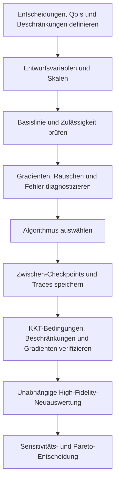



Optimierung bedeutet nicht, eine Solver-Schaltfläche zu drücken. Sie ist **der Prozess, eine Entscheidung mathematisch zu definieren und zu prüfen, dass diese Definition rechnerisch handhabbar ist**.
Sind Zielfunktion, Beschränkungen, Variablenbereiche, Rauschen oder Rechenfehler falsch definiert, findet selbst ein fortgeschrittener Algorithmus sehr schnell die falsche Antwort.

## 1. Standardformulierung

Ein allgemeines beschränktes Optimierungsproblem wird geschrieben als

$$
\min_{x\in\mathbb R^n} f(x)
$$

unter den Nebenbedingungen

$$
g_i(x)\le0,\quad i=1,\ldots,m,
$$

$$
h_j(x)=0,\quad j=1,\ldots,p,
$$

$$
l\le x\le u
$$

Beeinflusst die Variable \(x\) den Simulationszustand \(y\), lautet die PDE-/ODE-beschränkte Form

$$
R(y,x)=0,
\qquad
f=f(y,x)
$$

## 2. Vor der Formulierung zu treffende Entscheidungen

- Kontrollierbare Entscheidungen von unsicheren Eingaben unterscheiden.
- Harte Beschränkungen von Präferenzen unterscheiden.
- Entscheiden, ob eine Fehlerregion hinter einer Strafe verborgen oder mit einem Zulässigkeitsklassifikator behandelt wird.
- Skala und Einheiten der Zielfunktion angeben.
- Diskrete, kategoriale und kontinuierliche Variablen unterscheiden.
- Bestimmen, ob eine einzelne Auswertung deterministisch oder stochastisch ist.

Die Lösung hängt davon ab, ob die zu „minimierende“ Größe ein Mittelwert, schlimmster Fall oder Risikomaß ist.

## 3. Skalierung ist Teil des Algorithmus

Unterscheiden sich Variablenskalen stark, verschlechtert sich die Konditionierung von Gradient und Hesse-Matrix.
Verwendet wird die dimensionslose Variable

$$
z_i=\frac{x_i-x_i^{ref}}{s_i}
$$

Auch Zielfunktion und Beschränkungen werden durch repräsentative Skalen normalisiert.

$$
\tilde f=\frac{f-f_{ref}}{s_f},
\qquad
\tilde g_i=\frac{g_i}{s_{g_i}}.
$$

Normalisierung ist keine Nachbearbeitung für schönere Ergebnisse; sie verändert die Bedeutung von Schritt und Stoppkriterium.

## 4. Intuition hinter den KKT-Bedingungen

Die Lagrange-Funktion lautet

$$
\mathcal L(x,\lambda,\mu)
=f(x)+\sum_i\lambda_i g_i(x)+\sum_j\mu_jh_j(x)
$$

Unter geeigneten Regularitätsbedingungen erfüllt ein lokales Optimum die folgenden KKT-Bedingungen.

$$
\nabla_x\mathcal L=0,
$$

$$
g_i(x)\le0,\quad h_j(x)=0,
$$

$$
\lambda_i\ge0,
$$

$$
\lambda_i g_i(x)=0.
$$

Die letzte Bedingung, komplementäre Schlupfheit, bedeutet, dass der Multiplikator einer inaktiven Beschränkung null ist und ein positiver Multiplikator nur an einer aktiven Grenze auftritt.

## 5. Ein Multiplikator ist ein Schattenpreis

Der Multiplikator kann als Änderungsrate der optimalen Zielfunktion interpretiert werden, wenn die rechte Seite einer Beschränkung geringfügig gelockert wird.
Die Interpretation hängt jedoch von Skalierung und Vorzeichenkonventionen ab.

Ein großer Multiplikator deutet darauf hin, dass die entsprechende Beschränkung das Optimum stark begrenzt.
Bei Degeneration, Nichtkonvexität oder schlechter Skalierung kann sein Wert allerdings instabil sein.

## 6. Wege zur Berechnung eines Gradienten

### Finite Differenz

Die Vorwärtsdifferenz lautet

$$
\frac{\partial f}{\partial x_i}
\approx
\frac{f(x+h e_i)-f(x)}{h}
$$

Ein zu großes \(h\) erhöht den Abschneidefehler, ein zu kleines \(h\) dagegen Auslöschung und Solver-Rauschen.

### Komplexschrittmethode

Für einen analytischen Codepfad kann man

$$
\frac{\partial f}{\partial x_i}
\approx
\frac{\operatorname{Im}f(x+i h e_i)}{h}
$$

verwenden. Bei Verzweigungen, Absolutwerten oder nicht komplexzahlsicheren Bibliotheken versagt dieses Verfahren.

### Automatische Differenzierung

Automatische Differenzierung wendet die Kettenregel auf den Operationsgraphen an.
Sie liefert Ableitungen des exakten diskreten Programms, erfordert aber den Umgang mit Speicher, Mutation, Differenzierung iterativer Löser und nicht differenzierbaren Operationen.

## 7. Warum Adjungierte benötigt werden

Die Differenzierung der Zustandsgleichung \(R(y,x)=0\) ergibt

$$
R_y\frac{dy}{dx}+R_x=0.
$$

Die totale Ableitung lautet

$$
\frac{df}{dx}=f_x+f_y\frac{dy}{dx}.
$$

Direkte Sensitivität erfordert für jede Variable das Lösen nach der Zustandssensitivität.
Wird die adjungierte Variable \(\psi\) definiert durch

$$
R_y^T\psi=f_y^T
$$

so ergibt sich

$$
\frac{df}{dx}=f_x-\psi^T R_x
$$

Dies ist besonders vorteilhaft, wenn wenige Zielfunktionen und viele Entwurfsvariablen vorliegen.

## 8. Kontinuierliche und diskrete Adjungierte

- kontinuierlich adjungiert: zuerst die kontinuierlichen Gleichungen differenzieren, dann diskretisieren
- diskret adjungiert: direkt das diskrete Residuum differenzieren

Ein diskret adjungiertes Verfahren liefert leichter den exakten Gradienten der diskreten Zielfunktion, die die tatsächliche Optimierung sieht.
Ein kontinuierlich adjungiertes Verfahren bietet analytischen Einblick und Flexibilität der Implementierung, kann aber mit der primalen Diskretisierung inkonsistent sein.

Unabhängig vom Ansatz müssen Randbedingungen, Stabilisierung, Turbulenzabschluss und Ableitungen der Netzverformung einbezogen werden.

## 9. Gradientenverifikation

Richtungsableitungen entlang einer beliebigen Richtung \(d\) werden verglichen.

$$
D_fd=\nabla f(x)^Td
$$

und

$$
D_h=\frac{f(x+hd)-f(x)}{h}
$$

Der relative Fehler wird für mehrere Werte von \(h\) dargestellt.
Im vom Abschneidefehler dominierten Bereich sinkt der Fehler mit der erwarteten Ordnung; bei kleinem \(h\) erscheint ein Rauschboden.

Übereinstimmung an einem einzigen Punkt genügt nicht.
Getestet wird an mehreren Zuständen, aktiven Beschränkungen und nahe den Grenzen.

## 10. Wann ableitungsfreie Verfahren benötigt werden

Ein gradientenfreier Ansatz kann unter folgenden Bedingungen sinnvoll sein:

- Auswertungen sind verrauscht oder stochastisch
- diskrete/kategoriale Variablen liegen vor
- Simulationsfehler und Diskontinuitäten treten häufig auf
- nur ein Black-Box-Executable ist verfügbar
- Variablenzahl ist relativ klein und Auswertungsbudget begrenzt

Repräsentative Familien sind direkte Suche, evolutionäre Verfahren, bayessche Optimierung und Trust-Region-Surrogate.
„Ableitungsfrei“ bedeutet nicht abstimmungsfrei.
Budget, Initialisierung, Behandlung von Beschränkungen und Zufalls-Seed beeinflussen das Ergebnis stark.

## 11. Strafen und Zulässigkeit

Eine Strafzielfunktion kann definiert werden als

$$
F(x)=f(x)+\rho\sum_i\max(0,g_i(x))^p
$$

Ein kleines \(\rho\) begünstigt unzulässige Lösungen, ein großes \(\rho\) macht die Landschaft schlecht konditioniert.

Wenn möglich, sind die native Beschränkungsbehandlung des Optimizers, ein Filterverfahren oder ein augmentierter Lagrange-Ansatz zu erwägen.
Einen Simulationsabsturz durch eine einzelne willkürliche, enorme Strafe zu ersetzen kann ein Surrogat nahe der Grenze verzerren.

## 12. Multikriterielle Optimierung

Lautet die Zielfunktion \(F(x)=[f_1(x),\ldots,f_k(x)]\), wird üblicherweise eine Pareto-Menge statt eines einzelnen Optimums gesucht.

Eine Lösung \(x_a\) dominiert \(x_b\), wenn sie bei jeder Zielfunktion nicht schlechter und bei mindestens einer besser ist.

Die gewichtete Summe lautet

$$
\min_x\sum_{i=1}^kw_i\tilde f_i(x)
$$

kann aber einen Teil einer nichtkonvexen Pareto-Front verfehlen und reagiert empfindlich auf Skalierung.

Das \(\epsilon\)-Constraint-Verfahren behandelt eine Größe als Zielfunktion und beschränkt die übrigen.

$$
\min f_1(x)
\quad\text{s.t.}\quad f_i(x)\le\epsilon_i.
$$

## 13. Eine Pareto-Front berichten

Nicht nur einen Plot der Front zeigen, sondern Folgendes einbeziehen:

- Definitionen, Einheiten und Normalisierung der Zielfunktionen
- Zulässigkeitstoleranz der Beschränkungen
- Regel zum Entfernen dominierter Punkte
- Variabilität der Front über stochastische Wiederholungen
- Referenzpunkt für Hypervolumen- oder Abdeckungsmetrik
- Kriterien zur Wahl repräsentativer Kompromisse
- Ergebnisse unabhängiger Neuauswertung nach der Auswahl

Ein Kniepunkt ist nicht automatisch die beste Entscheidung.
Stakeholder müssen anhand ihrer Präferenzen und Kostenstruktur wählen.

## 14. Optimierungsworkflow

## 15. Prüfliste zur Verifikation

- [ ] Einheiten von Zielfunktionen und Beschränkungen sind eindeutig.
- [ ] Variablenbereiche bilden den physikalisch und fertigungstechnisch zulässigen Bereich ab.
- [ ] Die Basislinie ist reproduzierbar und zulässig.
- [ ] Jede Variable und Antwort ist angemessen skaliert.
- [ ] Gradienten wurden mit gerichteten finiten Differenzen verifiziert.
- [ ] Aktive Beschränkungen und Multiplikatoren werden berichtet.
- [ ] Sensitivität lokaler Optima gegenüber mehreren Startpunkten wurde untersucht.
- [ ] Stochastische Verfahren wurden mit mehreren Seeds wiederholt.
- [ ] Simulationsfehler werden als eigene Kategorie erfasst.
- [ ] Es ist klar, ob der Stopp durch Budgeterschöpfung oder Konvergenz verursacht wurde.
- [ ] Die endgültige Lösung wurde mit strengeren Solver-Toleranzen neu berechnet.
- [ ] Die Rangfolge optimaler Lösungen bleibt bei Verfeinerung von Netz und Zeitschritt erhalten.

## 16. Häufige Fehlermuster und Einschränkungen

### Eine weiche Präferenz in eine harte Beschränkung verwandeln

Eine kleine Schwellenwertänderung kann die zulässige Menge drastisch verändern und die Lösung an der Grenze festhalten.

### Nur den Strafkoeffizienten erhöhen

Dies kann die Konditionierung verschlechtern und die Richtung verlieren, die die Zielfunktion verbessert.

### Das Erfolgs-Flag des Optimizers als Optimalitätsnachweis verwenden

Das Flag bedeutet lediglich, dass eine interne Stoppregel erfüllt wurde.
KKT-Residuen, Zulässigkeit, Neustarts und unabhängige Neuauswertung sind erforderlich.

### Ein Surrogatoptimum als Optimum des ursprünglichen Modells behandeln

Der Optimizer kann in einen Bereich hoher Surrogatunsicherheit gezogen werden.
Eine Trust Region und High-Fidelity-Bestätigung sind erforderlich.

### Zu viele Pareto-Punkte erzeugen

Entscheidungsfertige repräsentative Punkte, Unsicherheit und Trade-off-Steigungen bereitstellen.

## 17. Offizielle und primäre Referenzen

- Karush, „Minima of Functions of Several Variables with Inequalities as Side Conditions“, 1939.
- Kuhn und Tucker, „Nonlinear Programming“, 1951.
- Nocedal und Wright, *Numerical Optimization*.
- NASA OpenMDAO, [Dokumentation zu Optimierung und totalen Ableitungen](https://openmdao.org/newdocs/versions/latest/main.html).
- SciPy, [Optimierungsreferenz](https://docs.scipy.org/doc/scipy/reference/optimize.html).
- COIN-OR, [IPOPT-Dokumentation](https://coin-or.github.io/Ipopt/).

Die Qualität eines Optimierungsergebnisses hängt weniger vom endgültigen Zielfunktionswert ab als davon, **wie transparent Formulierung, Ableitungen, Zulässigkeit und unabhängige Neuauswertung verifiziert wurden**.
