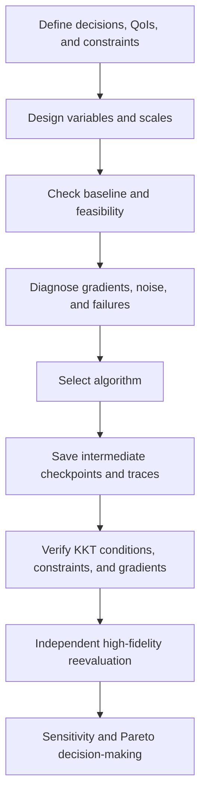



Optimization is not the act of pressing a solver button; it is **the process of defining a decision mathematically and verifying that the definition is computationally tractable**.
If the objective, constraints, variable ranges, noise, or computational failures are defined incorrectly, even an advanced algorithm will quickly find the wrong answer.

## 1. Standard formulation

A general constrained optimization problem is written as

$$
\min_{x\in\mathbb R^n} f(x)
$$

subject to

$$
g_i(x)\le0,\quad i=1,\ldots,m,
$$

$$
h_j(x)=0,\quad j=1,\ldots,p,
$$

$$
l\le x\le u
$$

If the variable (x) affects the simulation state (y), the PDE/ODE-constrained form is

$$
R(y,x)=0,
\qquad
f=f(y,x)
$$

## 2. Decisions to make before formulation

- Distinguish controllable decisions from uncertain inputs.
- Distinguish hard constraints from preferences.
- Decide whether to hide a failure region behind a penalty or handle it with a feasibility classifier.
- State the objective scale and units.
- Distinguish discrete, categorical, and continuous variables.
- Determine whether an individual evaluation is deterministic or stochastic.

The solution changes depending on whether the quantity being “minimized” is a mean, a worst case, or a risk measure.

## 3. Scaling is part of the algorithm

If variable scales differ greatly, the conditioning of the gradient and Hessian deteriorates.
Use the dimensionless variable

$$
z_i=\frac{x_i-x_i^{ref}}{s_i}
$$

and normalize the objective and constraints by representative scales as well.

$$
\tilde f=\frac{f-f_{ref}}{s_f},
\qquad
\tilde g_i=\frac{g_i}{s_{g_i}}.
$$

Normalization is not post-processing to make results look nicer; it changes the meaning of the step and stopping criterion.

## 4. Intuition behind the KKT conditions

The Lagrangian is

$$
\mathcal L(x,\lambda,\mu)
=f(x)+\sum_i\lambda_i g_i(x)+\sum_j\mu_jh_j(x)
$$

Under suitable regularity conditions, a local optimum satisfies the following KKT conditions.

$$
\nabla_x\mathcal L=0,
$$

$$
g_i(x)\le0,\quad h_j(x)=0,
$$

$$
\lambda_i\ge0,
$$

$$
\lambda_i g_i(x)=0.
$$

The last condition, complementary slackness, means that the multiplier of an inactive constraint is zero and that a positive multiplier appears only on an active boundary.

## 5. A multiplier is a shadow price

The multiplier can be interpreted as the rate of change in the optimal objective when a constraint's right-hand side is relaxed slightly.
However, the interpretation depends on scaling and sign conventions.

A large multiplier suggests that the corresponding constraint strongly limits the optimum.
The value may be unstable, however, under degeneracy, nonconvexity, or poor scaling.

## 6. Ways to obtain a gradient

### Finite difference

The forward difference is

$$
\frac{\partial f}{\partial x_i}
\approx
\frac{f(x+h e_i)-f(x)}{h}
$$

Too large an (h) increases truncation error, while too small an (h) increases cancellation and solver noise.

### Complex-step

For an analytic code path, one can use

$$
\frac{\partial f}{\partial x_i}
\approx
\frac{\operatorname{Im}f(x+i h e_i)}{h}
$$

This breaks in the presence of branches, absolute values, or libraries that are not complex-safe.

### Automatic differentiation

Automatic differentiation applies the chain rule to the operation graph.
It gives derivatives of the exact discrete program, but memory, mutation, iterative-solver differentiation, and nondifferentiable operations must be managed.

## 7. Why adjoints are needed

Differentiating the state equation (R(y,x)=0) gives

$$
R_y\frac{dy}{dx}+R_x=0.
$$

The total derivative is

$$
\frac{df}{dx}=f_x+f_y\frac{dy}{dx}.
$$

Direct sensitivity requires solving for state sensitivity for every variable.
Defining the adjoint variable (\psi) by

$$
R_y^T\psi=f_y^T
$$

gives

$$
\frac{df}{dx}=f_x-\psi^T R_x
$$

This is especially advantageous when there are few objectives and many design variables.

## 8. Continuous adjoints and discrete adjoints

- continuous adjoint: differentiate the continuous equations first, then discretize
- discrete adjoint: differentiate the discrete residual directly

A discrete adjoint more readily provides the exact gradient of the discrete objective seen by the actual optimization.
A continuous adjoint offers analytical insight and implementation flexibility, but it can be inconsistent with the primal discretization.

Whichever approach is used, boundary conditions, stabilization, turbulence closure, and mesh-deformation derivatives must be included.

## 9. Gradient verification

Compare directional derivatives along an arbitrary direction (d).

$$
D_fd=\nabla f(x)^Td
$$

and

$$
D_h=\frac{f(x+hd)-f(x)}{h}
$$

Plot their relative error for several values of (h).
In the truncation-dominated region, the error decreases at the expected order, and a noise floor appears for small (h).

Agreement at a single point is not enough.
Test at multiple states, active constraints, and near boundaries.

## 10. When derivative-free methods are needed

A gradient-free approach may be reasonable under the following conditions:

- evaluations are noisy or stochastic
- discrete/categorical variables are present
- simulation failures and discontinuities are frequent
- only a black-box executable is available
- the number of variables is relatively small and the evaluation budget is limited

Representative families include direct search, evolutionary methods, Bayesian optimization, and trust-region surrogates.
“Derivative-free” does not mean tuning-free.
The budget, initialization, constraint handling, and random seed strongly affect the result.

## 11. Penalties and feasibility

A penalty objective can be defined as

$$
F(x)=f(x)+\rho\sum_i\max(0,g_i(x))^p
$$

A small (\rho) favors infeasible solutions, while a large (\rho) makes the landscape ill-conditioned.

When possible, consider the optimizer's native constraint handling, a filter method, or an augmented Lagrangian.
Replacing a simulation crash with a single arbitrary, enormous penalty can distort a surrogate near the boundary.

## 12. Multi-objective optimization

When the objective is (F(x)=[f_1(x),\ldots,f_k(x)]), the usual goal is to find a Pareto set rather than a single optimum.

A solution (x_a) dominates (x_b) if it is no worse in every objective and better in at least one.

The weighted sum is

$$
\min_x\sum_{i=1}^kw_i\tilde f_i(x)
$$

but it can miss part of a non-convex Pareto front and is sensitive to scaling.

The (\epsilon)-constraint method treats one quantity as the objective and constrains the rest.

$$
\min f_1(x)
\quad\text{s.t.}\quad f_i(x)\le\epsilon_i.
$$

## 13. How to report a Pareto front

Do not show only a plot of the front; include the following:

- objective definitions, units, and normalization
- constraint feasibility tolerance
- rule for removing dominated points
- variability of the front across stochastic repetitions
- reference point for the hypervolume or coverage metric
- criteria for selecting representative compromises
- results of independent reevaluation after selection

A knee point is not automatically the best decision.
Stakeholders must choose based on their preferences and cost structure.

## 14. Optimization workflow

## 15. Verification checklist

- [ ] The units of objectives and constraints are clear.
- [ ] Variable ranges reflect the physically and manufacturably feasible region.
- [ ] The baseline is reproducible and feasible.
- [ ] Every variable and response is scaled appropriately.
- [ ] Gradients have been verified by directional finite differences.
- [ ] Active constraints and multipliers are reported.
- [ ] Sensitivity of local optima to multiple initial points has been examined.
- [ ] Stochastic methods have been repeated with multiple seeds.
- [ ] Simulation failures are recorded as a separate category.
- [ ] It is clear whether stopping was caused by budget exhaustion or convergence.
- [ ] The final solution has been recomputed with stricter solver tolerances.
- [ ] The ranking of optimal solutions is preserved under mesh/time-step refinement.

## 16. Common failure patterns and limitations

### Turning a soft preference into a hard constraint

A small threshold change can drastically alter the feasible set and pin the solution to the boundary.

### Only increasing the penalty coefficient

This can worsen conditioning and lose the direction that improves the objective.

### Using the optimizer's success flag as evidence of optimality

The flag means only that an internal stopping rule was satisfied.
KKT residuals, feasibility, restarts, and independent reevaluation are required.

### Treating a surrogate optimum as an optimum of the original model

The optimizer may be drawn to a region of high surrogate uncertainty.
A trust region and high-fidelity confirmation are required.

### Generating too many Pareto points

Provide decision-ready representative points, uncertainty, and trade-off slopes.

## 17. Official and primary references

- Karush, “Minima of Functions of Several Variables with Inequalities as Side Conditions,” 1939.
- Kuhn and Tucker, “Nonlinear Programming,” 1951.
- Nocedal and Wright, *Numerical Optimization*.
- NASA OpenMDAO, [Optimization and total derivatives documentation](https://openmdao.org/newdocs/versions/latest/main.html).
- SciPy, [Optimization reference](https://docs.scipy.org/doc/scipy/reference/optimize.html).
- COIN-OR, [IPOPT documentation](https://coin-or.github.io/Ipopt/).

The quality of an optimization result depends less on its final objective value than on **how transparently the formulation, derivatives, feasibility, and independent reevaluation have been verified**.
