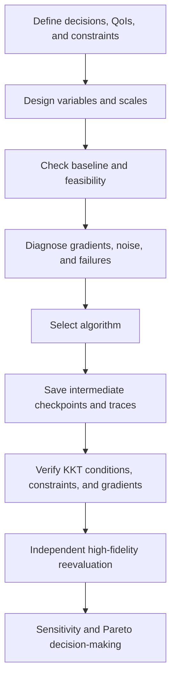



La optimización no es el acto de presionar un botón de resolución; es **el proceso de definir una decisión matemáticamente y verificar que la definición sea computacionalmente manejable**.
Si el objetivo, las restricciones, los rangos variables, el ruido o los fallos computacionales se definen incorrectamente, incluso un algoritmo avanzado encontrará rápidamente la respuesta incorrecta.

## 1. Formulación estándar

Un problema general de optimización restringida se escribe como

$$
\min_{x\in\mathbb R^n} f(x)
$$

sujeto a

$$
g_i(x)\le0,\quad i=1,\ldots,m,
$$

$$
h_j(x)=0,\quad j=1,\ldots,p,
$$

$$
l\le x\le u
$$

Si la variable (x) afecta el estado de simulación (y), la forma restringida PDE/ODE- es

$$
R(y,x)=0,
\qquad
f=f(y,x)
$$

## 2. Decisiones a tomar antes de la formulación

- Distinguir decisiones controlables de insumos inciertos.
- Distinguir restricciones estrictas de preferencias.
- Decidir si ocultar una región de falla detrás de una penalización o manejarla con un clasificador de factibilidad.
- Indique la escala y las unidades objetivas.
- Distinguir variables discretas, categóricas y continuas.
- Determinar si una evaluación individual es determinista o estocástica.

La solución cambia dependiendo de si la cantidad que se “minimiza” es una media, un peor caso o una medida de riesgo.

## 3. El escalado es parte del algoritmo

Si las escalas de las variables difieren mucho, el condicionamiento del gradiente y del hessiano se deteriora.
Utilice la variable adimensional

$$
z_i=\frac{x_i-x_i^{ref}}{s_i}
$$

y normalizar el objetivo y las restricciones mediante escalas representativas también.

$$
\tilde f=\frac{f-f_{ref}}{s_f},
\qquad
\tilde g_i=\frac{g_i}{s_{g_i}}.
$$

La normalización no es un posprocesamiento para que los resultados se vean mejor; cambia el significado del paso y criterio de parada.

## 4. Intuición detrás de las condiciones KKT

El lagrangiano es

$$
\mathcal L(x,\lambda,\mu)
=f(x)+\sum_i\lambda_i g_i(x)+\sum_j\mu_jh_j(x)
$$

En condiciones de regularidad adecuadas, un óptimo local satisface las siguientes condiciones KKT.

$$
\nabla_x\mathcal L=0,
$$

$$
g_i(x)\le0,\quad h_j(x)=0,
$$

$$
\lambda_i\ge0,
$$

$$
\lambda_i g_i(x)=0.
$$

La última condición, holgura complementaria, significa que el multiplicador de una restricción inactiva es cero y que un multiplicador positivo aparece sólo en un límite activo.

## 5. Un multiplicador es un precio sombra

El multiplicador puede interpretarse como la tasa de cambio en el objetivo óptimo cuando el lado derecho de una restricción se relaja ligeramente.
Sin embargo, la interpretación depende de las convenciones de escala y signos.

Un multiplicador grande sugiere que la restricción correspondiente limita fuertemente el óptimo.
Sin embargo, el valor puede ser inestable debido a degeneración, no convexidad o escala deficiente.

## 6. Formas de obtener un degradado.

### Diferencia finita

La diferencia hacia adelante es

$$
\frac{\partial f}{\partial x_i}
\approx
\frac{f(x+h e_i)-f(x)}{h}
$$

Una (h) demasiado grande aumenta el error de truncamiento, mientras que una (h) demasiado pequeña aumenta la cancelación y el ruido del solucionador.

### Paso complejo

Para una ruta de código analítico, se puede usar

$$
\frac{\partial f}{\partial x_i}
\approx
\frac{\operatorname{Im}f(x+i h e_i)}{h}
$$

Esto se interrumpe en presencia de ramas, valores absolutos o bibliotecas que no son complejas y seguras.

### Diferenciación automática

La diferenciación automática aplica la regla de la cadena al gráfico de operaciones.
Proporciona derivados del programa discreto exacto, pero se deben gestionar la memoria, la mutación, la diferenciación del solucionador iterativo y las operaciones no diferenciables.

## 7. Por qué se necesitan adjuntos

Diferenciar la ecuación de estado (R(y,x)=0) da

$$
R_y\frac{dy}{dx}+R_x=0.
$$

La derivada total es

$$
\frac{df}{dx}=f_x+f_y\frac{dy}{dx}.
$$

La sensibilidad directa requiere resolver la sensibilidad del estado para cada variable.
Definiendo la variable adjunta (\psi) por

$$
R_y^T\psi=f_y^T
$$

da

$$
\frac{df}{dx}=f_x-\psi^T R_x
$$

Esto es especialmente ventajoso cuando hay pocos objetivos y muchas variables de diseño.

## 8. Adjuntos continuos y adjuntos discretos

- adjunto continuo: diferenciar las ecuaciones continuas primero, luego discretizar
- adjunto discreto: diferenciar el residual discreto directamente

Un adjunto discreto proporciona más fácilmente el gradiente exacto del objetivo discreto visto por la optimización real.
Un adjunto continuo ofrece información analítica y flexibilidad de implementación, pero puede ser inconsistente con la discretización primaria.

Cualquiera que sea el enfoque utilizado, se deben incluir las condiciones de contorno, la estabilización, el cierre de la turbulencia y los derivados de la deformación de la malla.

## 9. Verificación de gradiente

Compare las derivadas direccionales a lo largo de una dirección arbitraria (d).

$$
D_fd=\nabla f(x)^Td
$$

y

$$
D_h=\frac{f(x+hd)-f(x)}{h}
$$

Trace su error relativo para varios valores de (h).
En la región dominada por el truncamiento, el error disminuye en el orden esperado y aparece un piso de ruido para valores pequeños (h).

El acuerdo en un solo punto no es suficiente.
Pruebe en múltiples estados, restricciones activas y límites cercanos.

## 10. Cuando se necesitan métodos sin derivados

Un enfoque sin gradientes puede ser razonable en las siguientes condiciones:

- las evaluaciones son ruidosas o estocásticas
- variables discretas/categóricas están presentes
- Los fallos y las discontinuidades de la simulación son frecuentes.
- sólo está disponible un ejecutable de caja negra
- el número de variables es relativamente pequeño y el presupuesto de evaluación es limitado

Las familias representativas incluyen búsqueda directa, métodos evolutivos, optimización bayesiana y sustitutos de regiones de confianza.
“Sin derivados” no significa sin ajustes.
El presupuesto, la inicialización, el manejo de restricciones y la semilla aleatoria afectan fuertemente el resultado.

## 11. Sanciones y viabilidad

Un objetivo de penalización se puede definir como

$$
F(x)=f(x)+\rho\sum_i\max(0,g_i(x))^p
$$

Un valor pequeño (\rho) favorece soluciones inviables, mientras que un valor grande (\rho) hace que el paisaje esté mal acondicionado.

Cuando sea posible, considere el manejo de restricciones nativo del optimizador, un método de filtro o un lagrangiano aumentado.
Reemplazar un accidente de simulación con una única penalización arbitraria y enorme puede distorsionar un sustituto cerca del límite.

## 12. Optimización multiobjetivo

Cuando el objetivo es (F(x)=[f_1(x),\ldots,f_k(x)]), el objetivo habitual es encontrar un conjunto de Pareto en lugar de un único óptimo.

Una solución (x_a) domina (x_b) si no es peor en todos los objetivos y mejor en al menos uno.

La suma ponderada es

$$
\min_x\sum_{i=1}^kw_i\tilde f_i(x)
$$

pero puede pasar por alto parte de un frente de Pareto no convexo y es sensible al escalamiento.

El método de restricción (\epsilon) trata una cantidad como objetivo y restringe el resto.

$$
\min f_1(x)
\quad\text{s.t.}\quad f_i(x)\le\epsilon_i.
$$

## 13. Cómo reportar un frente de Pareto

No muestres sólo una trama del frente; incluir lo siguiente:

- definiciones objetivas, unidades y normalización
- tolerancia a la viabilidad de restricciones
- regla para eliminar puntos dominados
- variabilidad del frente a través de repeticiones estocásticas
- punto de referencia para la métrica de hipervolumen o cobertura
- criterios para seleccionar compromisos representativos
- resultados de la reevaluación independiente después de la selección

Un punto de rodilla no es automáticamente la mejor decisión.
Las partes interesadas deben elegir en función de sus preferencias y estructura de costos.

## 14. Flujo de trabajo de optimización

## 15. Lista de verificación de verificación

- [ ] Las unidades de objetivos y restricciones son claras.
- [ ] Los rangos variables reflejan la región física y factible de fabricación.
- [ ] La línea de base es reproducible y factible.
- [ ] Cada variable y respuesta se escala adecuadamente.
- [ ] Los gradientes se han verificado mediante diferencias finitas direccionales.
- [ ] Se informan las restricciones y multiplicadores activos.
- [ ] Se ha examinado la sensibilidad de los óptimos locales a múltiples puntos iniciales.
- [ ] Se han repetido métodos estocásticos con múltiples semillas.
- [ ] Los fallos de simulación se registran como una categoría separada.
- [ ] Está claro si la paralización se debió al agotamiento presupuestario o a la convergencia.
- [ ] La solución final se ha recalculado con tolerancias de resolución más estrictas.
- [ ] La clasificación de soluciones óptimas se conserva en el refinamiento de malla/paso de tiempo.

## 16. Patrones de fallas y limitaciones comunes

### Convertir una preferencia suave en una restricción estricta

Un pequeño cambio en el umbral puede alterar drásticamente el conjunto factible y fijar la solución al límite.

### Solo aumentando el coeficiente de penalización.

Esto puede empeorar el condicionamiento y perder la dirección que mejora el objetivo.

### Uso del indicador de éxito del optimizador como prueba de optimización

La bandera sólo significa que se cumplió una regla de detención interna.
Se requieren residuos KKT, viabilidad, reinicios y reevaluación independiente.

### Tratar un óptimo sustituto como un óptimo del modelo original

El optimizador puede verse atraído por una región de alta incertidumbre sustituta.
Se requiere una región de confianza y una confirmación de alta fidelidad.

### Generando demasiados puntos de Pareto

Proporcione puntos representativos, incertidumbre y pendientes de compensación listos para tomar decisiones.

## 17. Referencias oficiales y primarias.

- Karush, “Mínimos de funciones de varias variables con desigualdades como condiciones secundarias”, 1939.
- Kuhn y Tucker, “Programación no lineal”, 1951.
- Nocedal y Wright, *Optimización numérica*.
- NASA OpenMDAO, [Documentación de optimización y derivados totales](https://openmdao.org/newdocs/versions/latest/main.html).
- SciPy, [Referencia de optimización](https://docs.scipy.org/doc/scipy/reference/optimize.html).
- COIN-OR, [documentación IPOPT](https://coin-or.github.io/Ipopt/).

La calidad de un resultado de optimización depende menos de su valor objetivo final que de **la transparencia con la que se hayan verificado la formulación, los derivados, la viabilidad y la reevaluación independiente**.
