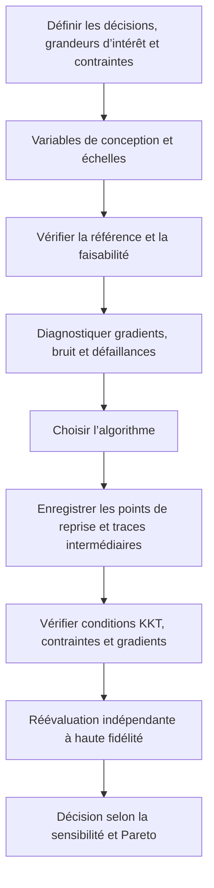



Optimiser ne consiste pas à appuyer sur le bouton d’un solveur : c’est **le processus qui définit mathématiquement une décision et vérifie que cette définition est calculable**.
Si l’objectif, les contraintes, les plages des variables, le bruit ou les défaillances de calcul sont mal définis, même un algorithme avancé trouvera rapidement la mauvaise réponse.

## 1. Formulation standard

Un problème général d’optimisation sous contraintes s’écrit

$$
\min_{x\in\mathbb R^n} f(x)
$$

sous les contraintes

$$
g_i(x)\le0,\quad i=1,\ldots,m,
$$

$$
h_j(x)=0,\quad j=1,\ldots,p,
$$

$$
l\le x\le u
$$

Si la variable (x) agit sur l’état de simulation (y), la formulation contrainte par une EDP ou une EDO est

$$
R(y,x)=0,
\qquad
f=f(y,x)
$$

## 2. Décisions à prendre avant la formulation

- Distinguer les décisions contrôlables des entrées incertaines.
- Distinguer les contraintes strictes des préférences.
- Décider s’il faut masquer une région de défaillance par une pénalité ou la traiter avec un classificateur de faisabilité.
- Indiquer l’échelle et les unités de l’objectif.
- Distinguer les variables discrètes, catégorielles et continues.
- Déterminer si chaque évaluation est déterministe ou stochastique.

La solution diffère selon que la grandeur « minimisée » est une moyenne, un pire cas ou une mesure de risque.

## 3. La mise à l’échelle fait partie de l’algorithme

Lorsque les échelles des variables diffèrent fortement, le conditionnement du gradient et de la hessienne se dégrade.
Utilisez la variable sans dimension

$$
z_i=\frac{x_i-x_i^{ref}}{s_i}
$$

et normalisez également l’objectif et les contraintes par des échelles représentatives.

$$
\tilde f=\frac{f-f_{ref}}{s_f},
\qquad
\tilde g_i=\frac{g_i}{s_{g_i}}.
$$

La normalisation n’est pas un post-traitement destiné à embellir les résultats : elle modifie le sens du pas et du critère d’arrêt.

## 4. Intuition des conditions KKT

Le lagrangien est

$$
\mathcal L(x,\lambda,\mu)
=f(x)+\sum_i\lambda_i g_i(x)+\sum_j\mu_jh_j(x)
$$

Sous des conditions de régularité appropriées, un optimum local satisfait les conditions KKT suivantes.

$$
\nabla_x\mathcal L=0,
$$

$$
g_i(x)\le0,\quad h_j(x)=0,
$$

$$
\lambda_i\ge0,
$$

$$
\lambda_i g_i(x)=0.
$$

La dernière condition, dite de complémentarité, signifie que le multiplicateur d’une contrainte inactive est nul et qu’un multiplicateur positif n’apparaît que sur une frontière active.

## 5. Un multiplicateur est un prix fictif

Le multiplicateur peut s’interpréter comme le taux de variation de l’objectif optimal lorsque le second membre d’une contrainte est légèrement relâché.
Cette interprétation dépend toutefois de la mise à l’échelle et des conventions de signe.

Un multiplicateur élevé suggère que la contrainte correspondante limite fortement l’optimum.
Sa valeur peut toutefois être instable en cas de dégénérescence, de non-convexité ou de mauvaise mise à l’échelle.

## 6. Méthodes d’obtention d’un gradient

### Différences finies

La différence progressive est

$$
\frac{\partial f}{\partial x_i}
\approx
\frac{f(x+h e_i)-f(x)}{h}
$$

Une valeur de (h) trop grande accroît l’erreur de troncature, tandis qu’une valeur trop faible accroît l’annulation numérique et le bruit du solveur.

### Pas complexe

Pour un chemin de code analytique, on peut utiliser

$$
\frac{\partial f}{\partial x_i}
\approx
\frac{\operatorname{Im}f(x+i h e_i)}{h}
$$

Cette méthode échoue en présence de branchements, de valeurs absolues ou de bibliothèques qui ne prennent pas correctement en charge les nombres complexes.

### Différentiation automatique

La différentiation automatique applique la règle de la chaîne au graphe des opérations.
Elle fournit les dérivées du programme discret exact, mais il faut gérer la mémoire, les mutations, la différentiation des solveurs itératifs et les opérations non différentiables.

## 7. Pourquoi les adjoints sont nécessaires

La différentiation de l’équation d’état (R(y,x)=0) donne

$$
R_y\frac{dy}{dx}+R_x=0.
$$

La dérivée totale est

$$
\frac{df}{dx}=f_x+f_y\frac{dy}{dx}.
$$

La sensibilité directe exige de résoudre la sensibilité de l’état pour chaque variable.
En définissant la variable adjointe (\psi) par

$$
R_y^T\psi=f_y^T
$$

on obtient

$$
\frac{df}{dx}=f_x-\psi^T R_x
$$

Cette approche est particulièrement avantageuse lorsqu’il y a peu d’objectifs et beaucoup de variables de conception.

## 8. Adjoints continus et adjoints discrets

- adjoint continu : différencier d’abord les équations continues, puis les discrétiser
- adjoint discret : différencier directement le résidu discret

Un adjoint discret fournit plus facilement le gradient exact de l’objectif discret vu par l’optimisation réelle.
Un adjoint continu apporte une compréhension analytique et une certaine souplesse de mise en œuvre, mais il peut être incohérent avec la discrétisation primale.

Quelle que soit l’approche, il faut inclure les dérivées des conditions aux limites, de la stabilisation, de la fermeture turbulente et de la déformation du maillage.

## 9. Vérification du gradient

Comparez les dérivées directionnelles le long d’une direction arbitraire (d).

$$
D_fd=\nabla f(x)^Td
$$

et

$$
D_h=\frac{f(x+hd)-f(x)}{h}
$$

Tracez leur erreur relative pour plusieurs valeurs de (h).
Dans la région dominée par la troncature, l’erreur diminue selon l’ordre attendu, puis un plancher de bruit apparaît pour les petites valeurs de (h).

Une concordance en un seul point ne suffit pas.
Effectuez le test pour plusieurs états, contraintes actives et voisinages de frontières.

## 10. Quand les méthodes sans dérivées sont nécessaires

Une approche sans gradient peut être pertinente dans les conditions suivantes :

- les évaluations sont bruitées ou stochastiques
- il existe des variables discrètes ou catégorielles
- les échecs de simulation et les discontinuités sont fréquents
- seul un exécutable boîte noire est disponible
- le nombre de variables est relativement faible et le budget d’évaluation limité

Les principales familles comprennent la recherche directe, les méthodes évolutionnaires, l’optimisation bayésienne et les substituts à région de confiance.
« Sans dérivées » ne signifie pas « sans réglage ».
Le budget, l’initialisation, le traitement des contraintes et la graine aléatoire influencent fortement le résultat.

## 11. Pénalités et faisabilité

Un objectif pénalisé peut être défini par

$$
F(x)=f(x)+\rho\sum_i\max(0,g_i(x))^p
$$

Une petite valeur de (\rho) favorise les solutions non réalisables, tandis qu’une valeur élevée rend le paysage mal conditionné.

Lorsque c’est possible, envisagez la gestion native des contraintes par l’optimiseur, une méthode de filtre ou un lagrangien augmenté.
Remplacer un plantage de simulation par une unique pénalité arbitraire et énorme peut déformer un modèle de substitution près de la frontière.

## 12. Optimisation multiobjectif

Lorsque l’objectif est (F(x)=[f_1(x),\ldots,f_k(x)]), le but habituel consiste à trouver un ensemble de Pareto plutôt qu’un optimum unique.

Une solution (x_a) domine (x_b) si elle n’est moins bonne pour aucun objectif et qu’elle est meilleure pour au moins l’un d’eux.

La somme pondérée est

$$
\min_x\sum_{i=1}^kw_i\tilde f_i(x)
$$

mais elle peut manquer une partie d’un front de Pareto non convexe et reste sensible à la mise à l’échelle.

La méthode des contraintes (\epsilon) traite une grandeur comme objectif et impose les autres comme contraintes.

$$
\min f_1(x)
\quad\text{s.t.}\quad f_i(x)\le\epsilon_i.
$$

## 13. Comment présenter un front de Pareto

Ne présentez pas seulement le tracé du front ; incluez également les éléments suivants :

- définitions, unités et normalisation des objectifs
- tolérance de faisabilité des contraintes
- règle d’élimination des points dominés
- variabilité du front entre répétitions stochastiques
- point de référence de l’hypervolume ou de la mesure de couverture
- critères de sélection de compromis représentatifs
- résultats d’une réévaluation indépendante après sélection

Un point de coude ne constitue pas automatiquement la meilleure décision.
Les parties prenantes doivent choisir en fonction de leurs préférences et de leur structure de coûts.

## 14. Flux de travail d’optimisation

## 15. Liste de contrôle de la vérification

- [ ] Les unités des objectifs et des contraintes sont-elles explicites ?
- [ ] Les plages des variables reflètent-elles la région réalisable sur les plans physique et manufacturier ?
- [ ] La référence est-elle reproductible et réalisable ?
- [ ] Chaque variable et chaque réponse sont-elles correctement mises à l’échelle ?
- [ ] Les gradients ont-ils été vérifiés par des différences finies directionnelles ?
- [ ] Les contraintes actives et les multiplicateurs sont-ils présentés ?
- [ ] La sensibilité des optima locaux à plusieurs points initiaux a-t-elle été examinée ?
- [ ] Les méthodes stochastiques ont-elles été répétées avec plusieurs graines ?
- [ ] Les échecs de simulation sont-ils enregistrés dans une catégorie distincte ?
- [ ] La cause de l’arrêt — épuisement du budget ou convergence — est-elle claire ?
- [ ] La solution finale a-t-elle été recalculée avec des tolérances de solveur plus strictes ?
- [ ] Le classement des solutions optimales est-il préservé lors du raffinement du maillage ou du pas de temps ?

## 16. Modes d’échec fréquents et limites

### Transformer une préférence souple en contrainte stricte

Une faible modification du seuil peut changer radicalement l’ensemble réalisable et plaquer la solution contre la frontière.

### Se contenter d’augmenter le coefficient de pénalité

Cela peut dégrader le conditionnement et faire perdre la direction qui améliore l’objectif.

### Utiliser l’indicateur de réussite de l’optimiseur comme preuve d’optimalité

Cet indicateur signifie uniquement qu’une règle d’arrêt interne a été satisfaite.
Il faut examiner les résidus KKT, la faisabilité, les redémarrages et une réévaluation indépendante.

### Traiter l’optimum d’un substitut comme celui du modèle d’origine

L’optimiseur peut être attiré vers une région où l’incertitude du substitut est élevée.
Une région de confiance et une confirmation à haute fidélité sont nécessaires.

### Générer trop de points de Pareto

Fournissez des points représentatifs directement exploitables pour la décision, accompagnés de l’incertitude et des pentes des compromis.

## 17. Références officielles et primaires

- Karush, « Minima of Functions of Several Variables with Inequalities as Side Conditions », 1939.
- Kuhn et Tucker, « Nonlinear Programming », 1951.
- Nocedal et Wright, *Numerical Optimization*.
- NASA OpenMDAO, [documentation sur l’optimisation et les dérivées totales](https://openmdao.org/newdocs/versions/latest/main.html).
- SciPy, [référence sur l’optimisation](https://docs.scipy.org/doc/scipy/reference/optimize.html).
- COIN-OR, [documentation d’IPOPT](https://coin-or.github.io/Ipopt/).

La qualité d’un résultat d’optimisation dépend moins de sa valeur finale d’objectif que de **la transparence avec laquelle la formulation, les dérivées, la faisabilité et la réévaluation indépendante ont été vérifiées**.
