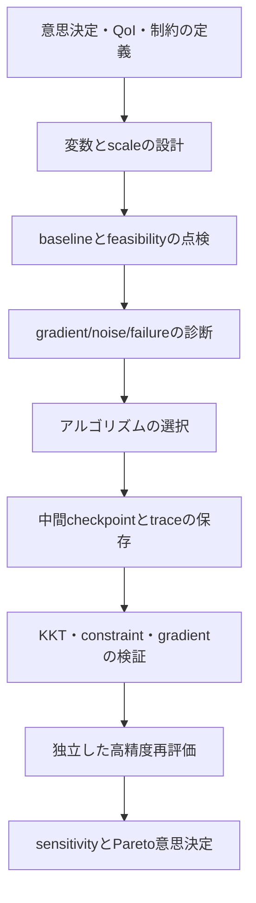



最適化はsolverのボタンを押す作業ではなく、**意思決定を数学的に定義し、その定義が計算可能かを検証する過程**である。
目的関数、制約、変数範囲、noise、計算失敗を誤って定義すれば、高度なアルゴリズムも見当違いの答えを素早く見つける。

## 1. 標準的な定式化

一般的な制約付き最適化問題は、

$$
\min_{x\in\mathbb R^n} f(x)
$$

subject to

$$
g_i(x)\le0,\quad i=1,\ldots,m,
$$

$$
h_j(x)=0,\quad j=1,\ldots,p,
$$

$$
l\le x\le u
$$

と書く。

変数 \(x\) がsimulation state \(y\) に影響する場合、PDE/ODE-constrained formは

$$
R(y,x)=0,
\qquad
f=f(y,x)
$$

である。

## 2. 定式化の前に決めるべきこと

- controllable decisionとuncertain inputを区別する。
- hard constraintとpreferenceを区別する。
- failure regionをpenaltyで隠すか、feasibility classifierで扱うかを決める。
- objectiveのscaleと単位を明示する。
- discrete、categorical、continuous variableを区別する。
- 一回の評価がdeterministicかstochasticかを確認する。

「最小化」の対象が平均か、worst caseか、risk measureかによって解は変わる。

## 3. scalingはアルゴリズムの一部である

変数のscaleが大きく異なると、gradientとHessianのconditioningが悪化する。
無次元変数

$$
z_i=\frac{x_i-x_i^{ref}}{s_i}
$$

を用い、objectiveとconstraintも代表scaleで正規化する。

$$
\tilde f=\frac{f-f_{ref}}{s_f},
\qquad
\tilde g_i=\frac{g_i}{s_{g_i}}.
$$

正規化は結果を見栄えよくする後処理ではなく、stepとstopping criterionの意味を変える。

## 4. KKT条件の直感

Lagrangianは

$$
\mathcal L(x,\lambda,\mu)
=f(x)+\sum_i\lambda_i g_i(x)+\sum_j\mu_jh_j(x)
$$

である。
適切なregularityの下で、局所optimumは次のKKT条件を満たす。

$$
\nabla_x\mathcal L=0,
$$

$$
g_i(x)\le0,\quad h_j(x)=0,
$$

$$
\lambda_i\ge0,
$$

$$
\lambda_i g_i(x)=0.
$$

最後のcomplementary slacknessは、非アクティブな制約のmultiplierが0であり、正のmultiplierはactive boundaryでのみ現れることを意味する。

## 5. multiplierはshadow priceである

制約の右辺を少し緩和したときの最適objectiveの変化率を、multiplierとして解釈できる。
ただし、scalingと符号規約によって解釈は変わる。

大きなmultiplierは、その制約がoptimumを強く制限していることを示唆する。
しかし、degeneracy、nonconvexity、poor scalingでは値が不安定になり得る。

## 6. gradientを得る方法

### finite difference

forward differenceは

$$
\frac{\partial f}{\partial x_i}
\approx
\frac{f(x+h e_i)-f(x)}{h}
$$

である。
\(h\) が大きすぎればtruncation errorが、\(h\) が小さすぎればcancellationとsolver noiseが増える。

### complex-step

analyticなcode pathなら、

$$
\frac{\partial f}{\partial x_i}
\approx
\frac{\operatorname{Im}f(x+i h e_i)}{h}
$$

を使用できる。
branch、absolute value、non-complex-safe libraryがあると破綻する。

### automatic differentiation

演算graphにchain ruleを適用する。
正確な離散プログラムのderivativeが得られるが、memory、mutation、iterative solver differentiation、nondifferentiable operationを管理する必要がある。

## 7. adjointが必要な理由

state equation \(R(y,x)=0\) を微分すると、

$$
R_y\frac{dy}{dx}+R_x=0.
$$

total derivativeは

$$
\frac{df}{dx}=f_x+f_y\frac{dy}{dx}.
$$

direct sensitivityでは、変数ごとにstate sensitivityを解く必要がある。
adjoint variable \(\psi\) を

$$
R_y^T\psi=f_y^T
$$

で定義すると、

$$
\frac{df}{dx}=f_x-\psi^T R_x
$$

となる。
目的関数の数が少なく、設計変数が多い場合に特に有利である。

## 8. continuous adjointとdiscrete adjoint

- continuous adjoint：連続方程式を先に微分してから離散化
- discrete adjoint：離散residualを直接微分

discrete adjointは、実際に最適化が見る離散objectiveの正確なgradientを提供しやすい。
continuous adjointは解析的な洞察と実装の柔軟性を持つが、primal discretizationとの不一致が生じ得る。

どちらを使っても、境界条件、stabilization、turbulence closure、mesh deformation derivativeを含める必要がある。

## 9. gradient verification

任意の方向 \(d\) についてdirectional derivativeを比較する。

$$
D_fd=\nabla f(x)^Td
$$

と

$$
D_h=\frac{f(x+hd)-f(x)}{h}
$$

の相対誤差を複数の \(h\) で描く。
truncation-dominated領域では予想次数で減少し、小さい \(h\) ではnoise floorが現れる。

一つの点で一致するだけでは不十分である。
複数の状態、active constraint、boundary近傍で試験する。

## 10. derivative-free手法が必要な場合

次の条件では、gradient-freeアプローチが合理的なことがある。

- evaluationがnoisyまたはstochastic
- discrete/categorical variableが存在
- simulation failureとdiscontinuityが頻発
- black-box executableだけを利用可能
- 変数数が比較的少なく、evaluation budgetが限られる

代表的な系列にはdirect search、evolutionary method、Bayesian optimization、trust-region surrogateがある。
「derivative-free」はtuning-freeではない。
budget、initialization、constraint handling、random seedが結果に大きく影響する。

## 11. penaltyとfeasibility

penalty objectiveは

$$
F(x)=f(x)+\rho\sum_i\max(0,g_i(x))^p
$$

と作れる。
小さい \(\rho\) はinfeasible solutionを選びやすくし、大きい \(\rho\) はlandscapeをill-conditionedにする。

可能なら、optimizerのnative constraint handling、filter method、augmented Lagrangianを検討する。
simulation crashを任意の巨大なpenalty一つに置き換えると、境界近傍のsurrogateを歪めることがある。

## 12. 多目的最適化

目的が \(F(x)=[f_1(x),\ldots,f_k(x)]\) なら、一般に単一のoptimumではなくPareto setを求める。

解 \(x_a\) が \(x_b\) を支配するには、すべての目的で劣らず、少なくとも一つで優れていなければならない。

加重和は

$$
\min_x\sum_{i=1}^kw_i\tilde f_i(x)
$$

だが、non-convex Pareto frontの一部を見落とす可能性があり、scalingにも敏感である。

\(\epsilon\)-constraint手法では、一つをobjectiveとし、残りを制限する。

$$
\min f_1(x)
\quad\text{s.t.}\quad f_i(x)\le\epsilon_i.
$$

## 13. Pareto frontの報告方法

frontの図だけを示さず、次を含める。

- objectiveの定義、単位、normalization
- constraint feasibility tolerance
- dominated pointの除去規則
- stochasticな反復によるfront variability
- hypervolumeまたはcoverage metricのreference point
- 代表的なcompromiseの選択基準
- 選択後の独立再評価結果

knee pointが自動的に最良の決定になるわけではない。
選好とコスト構造を反映してstakeholderが選ぶ必要がある。

## 14. 最適化workflow

## 15. 検証チェックリスト

- [ ] objectiveとconstraintの単位が明確である。
- [ ] 変数範囲が物理的・製造上の実行可能領域を反映している。
- [ ] baselineが再現可能でfeasibleである。
- [ ] すべての変数と応答が適切にscalingされている。
- [ ] gradientをdirectional finite differenceで検証した。
- [ ] active constraintとmultiplierを報告した。
- [ ] 複数のinitial pointからlocal optimumへの感度を確認した。
- [ ] stochastic methodを複数のseedで繰り返した。
- [ ] simulation failureを別のカテゴリとして記録した。
- [ ] stoppingの理由がbudget exhaustionかconvergenceかを区別した。
- [ ] 最終解を、より厳しいsolver toleranceで再計算した。
- [ ] mesh/time-step refinementでも最適解の順位が維持される。

## 16. よくある失敗パターンと限界

### soft preferenceをhard constraintにする

小さなthreshold変更によってfeasible setが急変し、解が境界に張り付くことがある。

### penalty coefficientを大きくするだけ

conditioningが悪化し、目的関数の改善方向を失うことがある。

### optimizerのsuccess flagを最適性の証拠として使う

flagは内部stopping ruleを満たしたことだけを意味する。
KKT residual、feasibility、restart、独立した再評価が必要である。

### surrogate optimumを元モデルのoptimumとみなす

optimizerがsurrogate uncertaintyの大きい場所へ集中することがある。
trust regionとhigh-fidelity confirmationが必要である。

### Pareto pointを作りすぎる

意思決定可能な代表点、不確実性、trade-off slopeを提示する必要がある。

## 17. 公式資料・原典

- Karush, “Minima of Functions of Several Variables with Inequalities as Side Conditions,” 1939.
- Kuhn and Tucker, “Nonlinear Programming,” 1951.
- Nocedal and Wright, *Numerical Optimization*.
- NASA OpenMDAO, [Optimization and total derivatives documentation](https://openmdao.org/newdocs/versions/latest/main.html).
- SciPy, [Optimization reference](https://docs.scipy.org/doc/scipy/reference/optimize.html).
- COIN-OR, [IPOPT documentation](https://coin-or.github.io/Ipopt/).

最適化結果の品質は、最後のobjective値よりも、**定式化、derivative、feasibility、独立再評価をどれだけ透明に検証したか**にかかっている。
