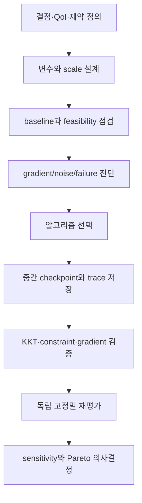



최적화는 solver 버튼을 누르는 작업이 아니라 **의사결정을 수학적으로 정의하고 그 정의가 계산 가능한지 검증하는 과정**이다.
목적함수, 제약, 변수 범위, noise, 계산 실패를 잘못 정의하면 고급 알고리즘도 엉뚱한 답을 빠르게 찾는다.

## 1. 표준 정식화

일반적인 제약 최적화 문제는

$$
\min_{x\in\mathbb R^n} f(x)
$$

subject to

$$
g_i(x)\le0,\quad i=1,\ldots,m,
$$

$$
h_j(x)=0,\quad j=1,\ldots,p,
$$

$$
l\le x\le u
$$

로 쓴다.

변수 (x)가 simulation state (y)에 영향을 주면 PDE/ODE-constrained form은

$$
R(y,x)=0,
\qquad
f=f(y,x)
$$

이다.

## 2. 정식화 전에 결정해야 할 것

- controllable decision과 uncertain input을 구분한다.
- hard constraint와 preference를 구분한다.
- failure region을 penalty로 숨길지 feasibility classifier로 다룰지 정한다.
- objective scale과 단위를 명시한다.
- discrete, categorical, continuous variable을 구분한다.
- 한 번의 평가가 deterministic인지 stochastic인지 확인한다.

“최소화”의 대상이 평균인지 worst case인지 risk measure인지에 따라 해가 달라진다.

## 3. scaling은 알고리즘의 일부다

변수 scale이 크게 다르면 gradient와 Hessian conditioning이 나빠진다.
무차원 변수

$$
z_i=\frac{x_i-x_i^{ref}}{s_i}
$$

를 사용하고 objective와 constraint도 대표 scale로 정규화한다.

$$
\tilde f=\frac{f-f_{ref}}{s_f},
\qquad
\tilde g_i=\frac{g_i}{s_{g_i}}.
$$

정규화는 결과를 예쁘게 만드는 후처리가 아니라 step과 stopping criterion의 의미를 바꾼다.

## 4. KKT 조건의 직관

Lagrangian은

$$
\mathcal L(x,\lambda,\mu)
=f(x)+\sum_i\lambda_i g_i(x)+\sum_j\mu_jh_j(x)
$$

이다.
적절한 regularity 아래 국소 optimum은 다음 KKT 조건을 만족한다.

$$
\nabla_x\mathcal L=0,
$$

$$
g_i(x)\le0,\quad h_j(x)=0,
$$

$$
\lambda_i\ge0,
$$

$$
\lambda_i g_i(x)=0.
$$

마지막 complementary slackness는 비활성 제약의 multiplier가 0이고, 양의 multiplier는 active boundary에서만 나타남을 뜻한다.

## 5. multiplier는 shadow price다

제약 우변을 조금 완화했을 때 최적 objective의 변화율을 multiplier로 해석할 수 있다.
단, scaling과 부호 규약에 따라 해석이 달라진다.

큰 multiplier는 해당 제약이 optimum을 강하게 제한함을 시사한다.
하지만 degeneracy, nonconvexity, poor scaling에서는 값이 불안정할 수 있다.

## 6. gradient를 얻는 방법

### finite difference

forward difference는

$$
\frac{\partial f}{\partial x_i}
\approx
\frac{f(x+h e_i)-f(x)}{h}
$$

이다.
너무 큰 (h)는 truncation error, 너무 작은 (h)는 cancellation과 solver noise를 키운다.

### complex-step

analytic code path라면

$$
\frac{\partial f}{\partial x_i}
\approx
\frac{\operatorname{Im}f(x+i h e_i)}{h}
$$

를 사용할 수 있다.
branch, absolute value, non-complex-safe library가 있으면 깨진다.

### automatic differentiation

연산 graph에 chain rule을 적용한다.
정확한 이산 프로그램의 derivative를 주지만 memory, mutation, iterative solver differentiation, nondifferentiable operation을 관리해야 한다.

## 7. adjoint가 필요한 이유

state equation (R(y,x)=0)를 미분하면

$$
R_y\frac{dy}{dx}+R_x=0.
$$

총 derivative는

$$
\frac{df}{dx}=f_x+f_y\frac{dy}{dx}.
$$

직접 sensitivity는 변수마다 state sensitivity를 풀어야 한다.
adjoint variable (psi)를

$$
R_y^T\psi=f_y^T
$$

로 정의하면

$$
\frac{df}{dx}=f_x-\psi^T R_x
$$

가 된다.
목적함수 수가 적고 설계변수가 많을 때 특히 유리하다.

## 8. continuous adjoint와 discrete adjoint

- continuous adjoint: 연속 방정식을 먼저 미분한 뒤 이산화
- discrete adjoint: 이산 residual을 직접 미분

discrete adjoint는 실제 최적화가 보는 이산 objective의 정확한 gradient를 제공하기 쉽다.
continuous adjoint는 해석적 통찰과 구현 유연성이 있지만 primal discretization과의 불일치가 생길 수 있다.

어느 방식을 사용해도 경계조건, stabilization, turbulence closure, mesh deformation derivative가 포함되어야 한다.

## 9. gradient verification

임의 방향 (d)에 대해 directional derivative를 비교한다.

$$
D_fd=\nabla f(x)^Td
$$

와

$$
D_h=\frac{f(x+hd)-f(x)}{h}
$$

의 상대오차를 여러 (h)에서 그린다.
truncation-dominated 구간에서는 예상 차수로 감소하고, 작은 (h)에서 noise floor가 나타난다.

한 점에서 일치하는 것만으로는 부족하다.
여러 상태, active constraint, boundary 근처에서 시험한다.

## 10. derivative-free 방법이 필요한 경우

다음 조건에서는 gradient-free 접근이 합리적일 수 있다.

- evaluation이 noisy하거나 stochastic
- discrete/categorical variable 존재
- simulation failure와 discontinuity가 빈번
- black-box executable만 사용 가능
- 변수 수가 상대적으로 작고 evaluation budget이 제한적

대표 계열은 direct search, evolutionary method, Bayesian optimization, trust-region surrogate다.
“derivative-free”는 tuning-free가 아니다.
budget, initialization, constraint handling, random seed가 결과에 큰 영향을 준다.

## 11. penalty와 feasibility

penalty objective는

$$
F(x)=f(x)+\rho\sum_i\max(0,g_i(x))^p
$$

로 만들 수 있다.
작은 (
ho)는 infeasible solution을 선호하고, 큰 (
ho)는 landscape를 ill-conditioned하게 만든다.

가능하면 optimizer의 native constraint handling, filter method, augmented Lagrangian을 고려한다.
simulation crash를 임의의 거대한 penalty 하나로 바꾸면 경계 근처 surrogate를 왜곡할 수 있다.

## 12. 다목적 최적화

목적이 (F(x)=[f_1(x),\ldots,f_k(x)])라면 일반적으로 단일 optimum이 아니라 Pareto set을 찾는다.

해 (x_a)가 (x_b)를 지배하려면 모든 목적에서 나쁘지 않고 적어도 하나에서 더 좋아야 한다.

가중합은

$$
\min_x\sum_{i=1}^kw_i\tilde f_i(x)
$$

이지만 non-convex Pareto front의 일부를 놓칠 수 있고 scaling에 민감하다.

(epsilon)-constraint 방법은 하나를 objective로 두고 나머지를 제한한다.

$$
\min f_1(x)
\quad\text{s.t.}\quad f_i(x)\le\epsilon_i.
$$

## 13. Pareto front를 보고하는 법

front 그림만 보여 주지 말고 다음을 포함한다.

- objective 정의, 단위, normalization
- constraint feasibility tolerance
- dominated point 제거 규칙
- stochastic 반복에 따른 front variability
- hypervolume 또는 coverage metric의 reference point
- 대표 compromise 선택 기준
- 선택 후 독립 재평가 결과

knee point는 자동으로 최선의 결정이 아니다.
선호와 비용 구조를 반영해 stakeholder가 선택해야 한다.

## 14. 최적화 워크플로

## 15. 검증 체크리스트

- [ ] objective와 constraint의 단위가 명확하다.
- [ ] 변수 범위가 물리적·제조적 가능영역을 반영한다.
- [ ] baseline이 재현 가능하고 feasible하다.
- [ ] 모든 변수와 응답이 적절히 scaling되었다.
- [ ] gradient를 directional finite difference로 검증했다.
- [ ] active constraint와 multiplier를 보고했다.
- [ ] 여러 initial point에서 local optimum 민감도를 봤다.
- [ ] stochastic method는 여러 seed로 반복했다.
- [ ] simulation failure를 별도 범주로 기록했다.
- [ ] stopping 이유가 budget exhaustion인지 convergence인지 구분했다.
- [ ] 최종 해를 더 엄격한 solver tolerance로 재계산했다.
- [ ] mesh/time-step refinement에서 최적해의 순위가 유지된다.

## 16. 자주 실패하는 패턴과 한계

### soft preference를 hard constraint로 만들기

작은 threshold 변화로 feasible set이 급변하고 해가 경계에 붙을 수 있다.

### penalty coefficient만 크게 하기

conditioning이 악화되고 목적함수 개선 방향을 잃을 수 있다.

### optimizer의 success flag를 최적성 증거로 사용

flag는 내부 stopping rule 충족만 뜻한다.
KKT residual, feasibility, restart, 독립 재평가가 필요하다.

### surrogate optimum을 원 모델 optimum으로 간주

surrogate uncertainty가 큰 곳으로 optimizer가 몰릴 수 있다.
trust region과 high-fidelity confirmation이 필요하다.

### Pareto point를 너무 많이 생성

의사결정 가능한 대표점, 불확실성, trade-off slope를 제공해야 한다.

## 17. 공식·원전 참고자료

- Karush, “Minima of Functions of Several Variables with Inequalities as Side Conditions,” 1939.
- Kuhn and Tucker, “Nonlinear Programming,” 1951.
- Nocedal and Wright, *Numerical Optimization*.
- NASA OpenMDAO, [Optimization and total derivatives documentation](https://openmdao.org/newdocs/versions/latest/main.html).
- SciPy, [Optimization reference](https://docs.scipy.org/doc/scipy/reference/optimize.html).
- COIN-OR, [IPOPT documentation](https://coin-or.github.io/Ipopt/).

최적화 결과의 품질은 마지막 objective 값보다 **정식화, derivative, feasibility, 독립 재평가를 얼마나 투명하게 검증했는가**에 달려 있다.
