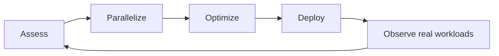



La optimización CUDA no es un truco para aumentar el número de subprocesos o agregar memoria compartida.
Es un proceso iterativo para encontrar cuellos de botella que valgan la pena en toda la aplicación y mejorar el movimiento de datos y la eficiencia de ejecución preservando al mismo tiempo la corrección.

## 1. El problema: un kernel rápido no garantiza una aplicación rápida

El código GPU consta de los siguientes costos.

- Preprocesamiento del host
- Transferencia de host a dispositivo
- Lanzamiento del núcleo
- Computación del dispositivo
- Sincronización de dispositivos
- Transferencia de dispositivo a host
- Postprocesamiento

Incluso si un núcleo se vuelve decenas de veces más rápido, el impacto es limitado cuando representa sólo una pequeña porción del tiempo total.
La ley de Amdahl es la siguiente.

$$
S=\frac{1}{(1-p)+p/s}
$$

- (p): proporción ocupada por el objetivo de mejora
- (s): aceleración de esa porción

Primero, mida (p) con un perfil.

## 2. Modelo Mental: El Ciclo APOD



El enfoque APOD de NVIDIA enfatiza el siguiente ciclo.

- Evaluar: Medir los puntos críticos y objetivos.
- Paralelizar: Seleccione las piezas que se pueden paralelizar de forma segura.
- Optimizar: Mejorar la memoria, la ejecución y las instrucciones.
- Despliegue: Validar regresiones y portabilidad en el entorno real.

Mantenga pruebas de corrección y evidencia de perfilador para cada optimización.

## 3. Referencia CPU y contrato numérico

Antes de implementar en GPU, mantenga una referencia para entradas pequeñas.

```cpp
for (int i = 0; i < n; ++i) {
    reference[i] = transform(input[i]);
}
```

Elementos de validación:

- Tolerancia absoluta y relativa
- NaN e Inf.
- Longitud cero y tamaños de límites.
- Tamaños que no sean múltiplos del tamaño del bloque.
- Valores extremadamente grandes o pequeños
- Requisitos de determinismo
- Diferencias en el orden de reducción.

La suma de punto flotante no satisface exactamente la asociatividad.
Una reducción paralela puede no ser idéntica bit a bit a una suma secuencial CPU.

Criterio de error de ejemplo:

$$
|y_{gpu}-y_{ref}| \le a_{tol}+r_{tol}|y_{ref}|
$$

Una tolerancia debe basarse en el tipo d, el número de condición y la cantidad de operaciones acumuladas, no establecerse en un valor arbitrariamente grande.

## 4. Mapeo de hilos, bloques y cuadrículas

Mapeo básico para una matriz unidimensional:

```cpp
__global__ void scale(float* y, const float* x, float a, int n) {
    int i = blockIdx.x * blockDim.x + threadIdx.x;
    if (i < n) {
        y[i] = a * x[i];
    }
}
```

Preguntas de diseño:

- ¿Qué salida posee cada hilo?
- ¿Existe superposición de escritura entre hilos?
- ¿Es necesaria la sincronización entre bloques?
- ¿El tamaño de entrada excede el límite de la cuadrícula?
- ¿Es necesario un bucle con zancadas?

Bucle de zancada en cuadrícula:

```cpp
for (int i = blockIdx.x * blockDim.x + threadIdx.x;
     i < n;
     i += blockDim.x * gridDim.x) {
    y[i] = a * x[i];
}
```

Esto maneja diferentes tamaños y facilita la experimentación con configuraciones de lanzamiento.

## 5. Jerarquía y fusión de la memoria

El rendimiento suele estar limitado por los bytes movidos y no por el número de operaciones.

- Registros: hilo local y rápido, pero limitado en número
- Memoria compartida: bloque local; Requiere gestión y sincronización explícitas.
- Caché L1/L2: gestionado por hardware
- Memoria global: grande, pero limitada por la latencia y el ancho de banda
- Memoria constante: ventajosa para ciertos patrones de transmisión

Diseñe el diseño de la matriz de modo que los subprocesos adyacentes en una deformación accedan a direcciones adyacentes.

Ejemplo de una mala zancada:

```cpp
float value = matrix[threadIdx.x * leading_dimension + column];
```

Considere si el índice se puede reorganizar para que los subprocesos lean columnas contiguas.

No adivine si los accesos están fusionados; confírmelo con métricas de rendimiento y transacciones de memoria.

## 6. Intensidad aritmética y razonamiento de la línea del techo

Intensidad aritmética:

$$
I=\frac{\text{operations}}{\text{bytes transferred}}
$$

Una intensidad baja sugiere una carga de trabajo vinculada a la memoria, mientras que una intensidad alta sugiere una carga de trabajo vinculada a la computación.
Un límite superior simple de la línea del techo es:

$$
P\le \min(P_{peak}, I\times B_{memory})
$$

Este es un modelo mental para elegir una dirección de optimización, no un predictor exacto del rendimiento.

- Dependencia de la memoria: reutilización de datos, fusión y transferencias reducidas
- Vinculado a la computación: combinación de instrucciones, rendimiento matemático e idoneidad para núcleos tensoriales
- Ligado a la latencia: análisis de paralelismo y dependencias.

## 7. Cuándo utilizar la memoria compartida

La memoria compartida es ventajosa cuando se reutilizan datos globales.

Un flujo de trabajo típico en mosaico:

1. Cada hilo lee parte de un mosaico de la memoria global.
2. Guárdelo en la memoria compartida.
3. Utilice `__syncthreads()` para sincronizar la finalización de la carga.
4. Reutilice la loseta en varias operaciones.
5. Pase al siguiente mosaico.

Precauciones:

- Cada hilo participante debe llegar a la barrera.
- Pueden producirse conflictos bancarios.
- Más memoria compartida por bloque reduce la cantidad de bloques residentes.
- Para datos leídos solo una vez, copiarlos puede costar más de lo que se guarda.

Compare las cargas globales y el tiempo del kernel antes y después de usar la memoria compartida.

## 8. Trate la ocupación como una restricción, no como un objetivo

La ocupación es la proporción de warps activos en un SM en relación con el máximo teórico.
Es importante para ocultar la latencia, pero el 100% no siempre es óptimo.

Factores que limitan la ocupación:

- Hilos por bloque
- Registrar uso
- Uso de memoria compartida
- Límites de la arquitectura

Forzar la reducción del uso de registros puede causar derrames y aumentar el tráfico de memoria local.
La baja ocupación aún puede ser rápida cuando el paralelismo a nivel de instrucciones y la reutilización de la caché son buenos.

Comience con tamaños de bloque que sean múltiplos de 32 y mida a varios candidatos.
Utilice la ocupación oficial API y un generador de perfiles, pero tome la decisión final utilizando el tiempo de un extremo a otro.

## 9. Divergencia, Atómica y Reducciones

Cuando los subprocesos en una deformación ejecutan diferentes ramas, sus rutas pueden estar serializadas.
Sin embargo, agregar cálculos complejos para eliminar una rama corta puede resultar más lento.

Los aspectos atómicos son útiles para la corrección, pero la discordia puede convertirse en un cuello de botella.

Jerarquía de reducción:

1. Resultado parcial local del subproceso
2. Reducción del nivel de deformación
3. Reducción a nivel de bloque
4. Un atómico global solo para resultados de bloque, o un segundo kernel

Pruebe cada reducción personalizada con una variedad de tamaños y políticas de NaN.
Utilice primero una primitiva de biblioteca cuando sea suficiente.

## 10. Asincronía y sincronización

El lanzamiento de un kernel puede ser asíncrono con respecto al host.
La medición inmediata con un reloj de pared general puede capturar sólo el tiempo de lanzamiento.

Utilice eventos CUDA.

```cpp
cudaEventRecord(start, stream);
kernel<<<grid, block, 0, stream>>>(...);
cudaEventRecord(stop, stream);
cudaEventSynchronize(stop);
cudaEventElapsedTime(&milliseconds, start, stop);
```

Principios de medición del desempeño:

- Realizar un calentamiento.
- Registrar variaciones de reloj e interferencias de otros procesos.
- Repetir varias veces e informar la distribución.
- Añade sólo la sincronización que sea necesaria.
- Distinguir horarios que incluyen y excluyen traslados.
- Declarar los costos de generación y validación de insumos.

## 11. Flujo de trabajo de creación de perfiles

### Cronología a nivel del sistema

Utilice Nsight Systems para inspeccionar la actividad, las transferencias, los núcleos, la sincronización y los espacios inactivos de CPU.

Preguntas:

- ¿Dónde está inactivo el GPU?
- ¿Hay demasiados lanzamientos de kernel pequeños?
- ¿Se superponen las transferencias y el cálculo?
- ¿Existe sincronización innecesaria?

### Métricas a nivel de kernel

Utilice Nsight Compute para obtener una vista detallada de los núcleos seleccionados.

- Ancho de banda de memoria alcanzado
- Eficiencia de transacción de memoria
- Razones de pérdida de deformación
- Ocupación y registros
- Eficiencia de la sucursal
- Rendimiento de instrucción

Recopilar todas las métricas a la vez aumenta la sobrecarga de elaboración de perfiles.
Seleccione solo las secciones necesarias para probar la hipótesis.

## 12. Orden de optimización práctica

1. Encuentre el punto de acceso con un perfil de extremo a extremo.
2. Congele la referencia CPU y las pruebas del kernel.
3. Elimine transferencias y sincronizaciones innecesarias.
4. Mejorar los patrones de acceso a la memoria.
5. Si existe reutilización, considere la memoria compartida o la fusión.
6. Explore las configuraciones de lanzamiento y bloqueo.
7. Considere en último lugar las optimizaciones de instrucción y precisión.
8. Ejecute pruebas de corrección y regresión de rendimiento después de cada cambio.

La fusión de kernel puede reducir el tráfico y los lanzamientos de memoria global intermedia.
Sin embargo, mida también la presión del registro, la complejidad del código y la reutilización reducida.

## 13. Lista de verificación de evaluación

- [ ] ¿Existe una referencia independiente CPU para entradas pequeñas?
- [ ] ¿La tolerancia se define con un fundamento numérico?
- [] ¿Se han verificado los errores de memoria con Compute Sanitizer o una herramienta equivalente?
- [] ¿Se identificaron primero los puntos de acceso de un extremo a otro?
- [] ¿Se distinguen la hora del núcleo y la hora, incluidas las transferencias?
- [ ] ¿Se aplicó el calentamiento y la sincronización de eventos?
- [ ] ¿Se confirmó la fusión de accesos globales con métricas?
- [] ¿Se reutilizan realmente los datos en la memoria compartida?
- [ ] ¿Se inspeccionan conjuntamente la ocupación y los derrames?
- [] ¿Se probaron límites y tamaños no múltiples?
- [] ¿Se comprobó el rendimiento y la corrección en varias arquitecturas?
- [] ¿Las pruebas del perfilador y las confirmaciones están vinculadas antes y después de la optimización?

## 14. Fallas y limitaciones comunes

### Mirando solo la utilización de GPU

La alta utilización no muestra si el trabajo es un cálculo útil o una pérdida de memoria.
Inspeccione el rendimiento de la aplicación y las métricas del kernel en conjunto.

### Suponiendo que la memoria compartida es siempre más rápida

Copiar sin reutilizar sólo añade instrucciones y barreras.
Decide entre perfiles antes y después del cambio.

### Forzando 100% de ocupación

El derrame de registros y la reutilización de caché degradada pueden hacerlo más lento.
La ocupación es una causa del desempeño, no la función objetivo.

### Habilitar matemáticas rápidas sin validar la corrección

Las operaciones aproximadas y la contracción pueden cambiar el resultado.
Evalúe las tolerancias comerciales y la estabilidad en todo el proceso.

La configuración óptima de CUDA cambia con la arquitectura y el kit de herramientas GPU.
No trate una configuración codificada como una regla permanente; mantener un punto de referencia reproducible.

## 15. Referencias oficiales

- [Guía de programación CUDA C++](https://docs.nvidia.com/cuda/cuda-c-programming-guide/)
- [CUDA Guía de mejores prácticas de C++](https://docs.nvidia.com/cuda/cuda-c-best-practices-guide/)
- [Documentación oficial de Nsight Systems](https://docs.nvidia.com/nsight-systems/)
- [Documentación oficial de Nsight Compute](https://docs.nvidia.com/nsight-compute/)
- [Documentación oficial de Compute Sanitizer](https://docs.nvidia.com/compute-sanitizer/)

## 16. Conclusión

El rendimiento de CUDA es el resultado del comportamiento de la memoria, la ejecución y la estructura de la aplicación.
Mantener el ciclo APOD junto con las pruebas de corrección evita ilusiones de microbenchmark y conserva solo mejoras que se reproducen en cargas de trabajo reales.
