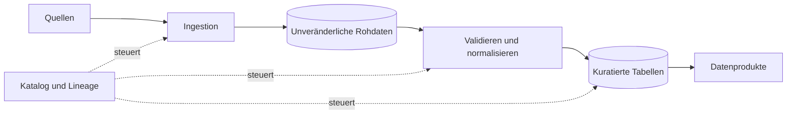



## Das Problem: Dateien anzusammeln ist noch kein Datenprodukt

Auch eine täglich erfolgreiche Pipeline kann falsche Daten liefern: Die Quelle ändert eine Feldbedeutung, Ereignis- und Aufnahmezeit werden verwechselt, feine Partitionen erzeugen Kleinstdateien, Überschreiben zerstört Reproduzierbarkeit, Schemainferenz variiert Typen, Wiederholungen erzeugen Duplikate oder Objektliste und Katalog widersprechen sich. Eine gute Pipeline definiert Datenverträge und Zustandsübergänge, nicht nur einen Transportweg.

## Mentales Modell: Daten- und Steuerungsebene

### Datenebene

Hier bewegen und verändern sich tatsächliche Datensätze und Dateien.

### Steuerungsebene

Sie verwaltet Schemas, Partitionsmetadaten, Laufzustand, Qualitätsergebnisse, Lineage und Zugriffsrichtlinien. Eine Vermischung lässt Abschluss fälschlich allein aus Dateien oder allein aus erfolgreichen Metadaten ableiten.

### Rohdaten bewahren Quellbytes und Aufnahmekontext

Die Rohzone dient Reproduzierbarkeit und Neuverarbeitung, nicht analytischem Komfort. Quellnutzlasten bleiben möglichst unveränderlich; mitgespeichert werden Quellenkennung, Aufnahme- und Ereigniszeit, Offset oder Cursor, Prüfsumme, Schema-ID, Pipelineversion und Zugriffsklasse.

### Kuratierte Daten sind ein Nutzungsvertrag

Eine kuratierte Tabelle legt Schlüssel, Typen, Nullbarkeit, Einheiten, Zeitzonen, Duplikatregeln und Aktualität offen. Verbraucher hängen vom Tabellen- oder Produktvertrag ab, nicht vom Speicherpfad.

## Arbeitsablauf: von der Aufnahme zur Veröffentlichung

### Schritt 1. Änderungsverhalten der Quelle klassifizieren

Zu klären sind Append-only, veränderlicher Snapshot oder CDC, Stabilität des API-Cursors, Löschereignisse, Backfills, späte Daten, Zeitzone und Uhrgenauigkeit. Ohne Quellcharakteristik ist inkrementelle Verarbeitung nicht sicher.

### Schritt 2. Ingestion-Checkpoint spezifizieren

Ein einziges `last processed time` reicht nicht. Wenn möglich werden monotone Offsets, Logsequenzen oder Quellcursor genutzt. Ein Checkpoint vor Rohspeicherung kann Daten verlieren; Speicherung davor kann Duplikate erzeugen und benötigt idempotente Schreibvorgänge.

### Schritt 3. Deterministische Objektschlüssel verwenden

Pfade enthalten etwa Batch-ID und Offsetbereich. Wiederholungen derselben Eingabe schreiben in dieselbe Stagingposition und vergleichen Prüfsummen. Manifest oder Katalogtransaktion emulieren atomare Veröffentlichung; Teildateien bleiben unsichtbar.

### Schritt 4. Schemas ausdrücklich verwalten

Produktionsläufe dürfen nicht jedes Mal vollständig inferieren. Registry oder versionierte Schemadatei klassifizieren optionale oder erforderliche neue Felder, Typverbreiterung und -verengung, Umbenennung, Einheits- oder Bedeutungswechsel, neue Enumwerte und verschachtelte Änderungen. Syntaktische und semantische Kompatibilität sind getrennt; eine neue Temperatureinheit ist trotz gleichem Typ ein Breaking Change.

### Schritt 5. Ereigniszeit und Verarbeitungszeit trennen

Eine Richtlinie definiert erlaubte Verspätung, Watermark, Korrektur von Aggregationen, Neuberechnung veröffentlichter Ergebnisse und Benachrichtigung. Zeiten werden nach UTC normalisiert, geschäftlich erforderliche Ursprungszeitzonen bleiben erhalten.

### Schritt 6. Partitionsschlüssel aus Abfragemustern wählen

Gute Partitionen ermöglichen Pruning und angemessene Dateigrößen. Ungeeignet sind eindeutige IDs, selten abgefragte Felder, stark schiefe Verteilungen und veränderliche Geschäftslabels. Auch Datumspartitionen erzeugen bei zu feiner Granularität Kleinstdateien.

### Schritt 7. Parquet-Layout auf die Last abstimmen

Parquet unterstützt Projektion und Predicate Pushdown, doch Leistung hängt von Row-Group-Größe, Kompression, Spaltenkardinalität, Sortierung, Statistiken, Dateigröße und verschachtelten Typen ab. Kleinstdateien erhöhen Metadaten- und Öffnungskosten; übergroße Dateien schaden Parallelität und Umschreibekosten. Repräsentative Abfragen entscheiden.

### Schritt 8. Kompaktierung als normale Lebenszyklusphase behandeln

Kompaktierung benötigt einen fixierten Eingabesnapshot, validierte Prüfsummen und Zeilenzahlen, atomaren Metadatenwechsel, Lesersicherheit, Aufbewahrung voriger Dateien sowie Rollback oder Neustart. Sie optimiert Speicher, ohne Datenbedeutung zu ändern.

### Schritt 9. Löschung und Aufbewahrung entwerfen

Reihenfolge von Objekt- und Kataloglöschung, logischer und physischer Löschung sowie Ausbreitung personenbezogener Löschpflichten durch Lineage und Backups sind festgelegt. Der Aufbewahrungsauftrag erzeugt Dry Run und Löschmanifest.

### Schritt 10. Veröffentlichung hinter ein Qualitätsgate stellen

Nur Snapshots mit bestandenem Schema-, Zeilenzahl-, Eindeutigkeits-, Referenzintegritäts-, Aktualitäts- und Verteilungstest werden veröffentlicht. Der Verbraucherzeiger wechselt atomar; fehlerhafte Snapshots werden isoliert, der gesunde Vorgänger bleibt aktiv.

## Praktisches Beispiel: täglicher API-Snapshot

### Ingestion

1. Lauf-ID und erwartetes Quellfenster anlegen.
2. API-Antwortbytes im Raw-Staging speichern.
3. Seitencursor und Prüfsummen im Manifest erfassen.
4. Rohmanifest nach Prüfung aller Seiten festschreiben.

### Normalisierung

Mit fester Schemaversion parsen, fehlerhafte Datensätze isolieren, nach Quellschlüssel und Version deduplizieren, Zeitzonen und Einheiten vereinheitlichen und Qualitätsmetriken berechnen.

### Veröffentlichung

Parquet in kuratiertes Staging schreiben, Prüfsummen und Schlüsselgrenzen erfassen, Qualitätsgate auswerten, Katalogsnapshot atomar wechseln, Lineage dokumentieren und Vorgänger nach Frist bereinigen.

### Wiederholung

Bei gleicher Lauf-ID oder gleichem Quellfenster werden Rohprüfsummen verglichen und deterministische Ergebnisse verlangt. Ändert die Quelle historische Antworten, bleibt jede Fassung als eigene Quellversion erhalten.

## Verifikationscheckliste

### Ingestion-Vertrag

- [ ] Quellenverantwortung und Änderungskanal existieren.
- [ ] Offset-, Cursor- und Ereigniszeitsemantik sind dokumentiert.
- [ ] Wiederholung und Pagination sind duplikatsicher.
- [ ] Rohbytes und Prüfsummen bleiben erhalten.
- [ ] Teilbatches sind im veröffentlichten Bereich unsichtbar.

### Schema und Semantik

- [ ] Schemaversion wird als Artefakt verwaltet.
- [ ] Einheiten und Enum-Bedeutungen werden neben Typen validiert.
- [ ] Breaking Changes besitzen einen Freigabeprozess.
- [ ] Unbekannte Felder und Enumwerte besitzen Richtlinien.
- [ ] Kompatibilitätstests für Produzenten und Verbraucher existieren.

### Speicher

- [ ] Repräsentative Abfragen nutzen Partitions-Pruning.
- [ ] Dateigrößenverteilung wird beobachtet.
- [ ] Kompaktierung erhält Snapshotkonsistenz.
- [ ] Drift zwischen Katalog und Objekten wird erkannt.
- [ ] Aufbewahrung und Löschung folgen der Lineage.
- [ ] Ein Wiederherstellungstest baut Kuratdaten aus Rohdaten neu auf.

### Betrieb

- [ ] Aktualität und Vollständigkeit werden getrennt gemessen.
- [ ] Richtlinien für späte Daten und Backfills existieren.
- [ ] Wechsel des Veröffentlichungszeigers ist atomar.
- [ ] Isolierte Daten besitzen Verantwortung und Lösungsfrist.
- [ ] Pipelineversionen sind mit Eingabesnapshots verknüpft.

## Häufige Fehler und Grenzen

### Partition nur als Verzeichnisname verstehen

Ohne Übereinstimmung mit Katalog, Pruningregeln und Typinterpretation werden Pfade zwar geteilt, die Leistung aber schlechter.

### Rohzone unbegrenzt aufbewahren

Aufbewahrung wägt Wiederherstellungswert gegen Sicherheit, Kosten und Löschpflichten ab.

### Schemaentwicklung nur als Feldaddition betrachten

Automatische Registryprüfungen erkennen Änderungen von Einheit und Geschäftssemantik womöglich nicht.

### Kleinstdateiproblem aufschieben

Bei hohen Dateizahlen werden Kompaktierung und Metadatenwiederherstellung riskant und teuer. Dateigrößenmetriken und Lebenszyklus gehören an den Anfang.

### Überschreiben mit Idempotenz verwechseln

Parallele Läufe und Teilausfälle können ganze Partitionen beschädigen. Erforderlich sind Staging, Snapshots und bedingte Veröffentlichung.

## Offizielle Referenzen

- [Apache Parquet Documentation](https://parquet.apache.org/docs/)
- [Apache Iceberg Evolution](https://iceberg.apache.org/docs/latest/evolution/)
- [Apache Kafka Design](https://kafka.apache.org/documentation/#design)
- [CloudEvents Specification](https://github.com/cloudevents/spec)
- [AWS Prescriptive Guidance: Data Lake Foundation](https://docs.aws.amazon.com/prescriptive-guidance/latest/defining-bucket-names-data-lakes/welcome.html)

## Fazit

Eine Datenpipeline ist kein Dateitransport, sondern ein langfristiger Vertrag zwischen Quelle und Verbrauchern. Erst wenn unveränderliche Rohdaten, ausdrückliche Schemas, Ereigniszeitrichtlinien, abfragegetriebene Partitionen, sichere Veröffentlichung, Neuverarbeitung und Änderung als ein Lebenszyklus entworfen sind, werden Daten zum vertrauenswürdigen Produkt.
