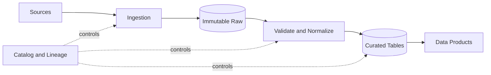



## The Problem: Accumulating Files Is Not the Same as Building a Data Product

Even when a pipeline succeeds every day, users may still receive incorrect data.

- The source changes a field's meaning, but the pipeline still parses it successfully.
- Aggregation uses ingestion time instead of event time, excluding late data.
- Date partitions are too granular, causing an explosion of small files.
- Overwrites eliminate the ability to reproduce the past.
- Schema inference produces a different type on each run.
- A retry appends the same batch and creates duplicates.
- Object listings and the catalog end up in different states.

A good pipeline defines data contracts and state transitions, not merely a route for moving data.

## Mental Model: Data Plane and Control Plane

### Data plane

This is the path along which actual records and files move and are transformed.

### Control plane

This manages schemas, partition metadata, run state, quality results, lineage, and access policies.

Mixing the two leads either to judging completion from data files alone or to assuming that files exist merely because metadata processing succeeded.

### Raw preserves source bytes and ingestion context

The purpose of the raw area is reproducibility and reprocessing, not analytical convenience.

Store the source payload immutably when possible.

Examples of metadata to preserve with it include the following.

- Source identifier
- Ingestion timestamp
- Event timestamp
- Source offset or cursor
- Content checksum
- Schema identifier
- Pipeline version
- Access classification

### Curated data is a consumption contract

A curated table is not simply cleaned-up raw data.

It exposes keys, types, nullability, units, time zones, duplicate policies, and freshness.

Have consumers depend on a table or product contract rather than a storage path.

## Workflow: From Ingestion to Publication

### Step 1. Classify how the source can change

- Is it an append-only event stream?
- Is it a mutable snapshot?
- Is it change data capture?
- Is the API cursor stable?
- Does it provide deletion events?
- Are backfills and late arrivals possible?
- What are the source time zone and clock accuracy?

Without knowing source characteristics, incremental logic cannot be made safe.

### Step 2. Specify the ingestion checkpoint

Do not track every source with a single `last processed time`.

When possible, use a monotonic offset, log sequence, or cursor supplied by the source.

Document the failure boundary between checkpoint updates and raw storage.

Updating the checkpoint first can lose data.

Storing first can create duplicates, so write idempotency is required.

### Step 3. Make object keys deterministic

For example, include the batch ID and source offset range in the path.

Write reruns of the same input to the same staging location and compare checksums.

For final publication, emulate an atomic transition with a manifest or catalog transaction.

Keep partial files invisible from normal partitions.

### Step 4. Manage schemas explicitly

Do not rely on full schema inference on every production pipeline run.

Use a schema registry or versioned schema file.

Classify changes.

- Add an optional field
- Add a required field
- Widen a type
- Narrow a type
- Rename a field
- Change a unit or meaning
- Add an enum value
- Change a nested structure

Distinguish syntactic compatibility from semantic compatibility.

A unit change for `temperature` is a breaking change even if its type remains the same.

### Step 5. Separate event time from processing time

Event time is when an event occurred at the source.

Processing time is when the pipeline processed it.

Define a late-event policy.

- Allowed lateness
- Watermark
- How aggregations are corrected
- Whether already published results are recomputed
- How consumers are notified

Normalize time zones to UTC, but preserve the original time-zone information when the business requires it.

### Step 6. Choose partition keys from query patterns

A good partition helps pruning while keeping file sizes appropriate.

Avoid the following choices.

- Extremely high-cardinality keys such as unique IDs
- Fields that most queries do not use
- Highly skewed fields
- Business labels whose meanings may change later

Even date partitions create a small-file problem if their time granularity is too fine.

Check engine behavior to decide whether to preserve partition columns inside files as well.

### Step 7. Tune the Parquet layout for the workload

Parquet is a columnar format well suited to projection and predicate pushdown.

But choosing the format alone does not guarantee performance.

- Row-group size
- Compression codec
- Column cardinality
- Sort order
- Statistics
- File size
- Use of nested types

Many small files increase metadata and open costs.

Files that are too large can hurt parallelism and increase rewrite costs.

Measure representative queries and adjust accordingly.

### Step 8. Make compaction a normal lifecycle stage

Streams and micro-batches readily produce small files.

A compaction job must guarantee the following.

- Fixed input snapshot
- Validation of output checksums and row counts
- Atomic metadata transition
- Safety when running concurrently with readers
- Retention of previous files
- Rollback or restart on failure

Compaction should be a storage optimization that does not change data meaning.

### Step 9. Design deletion and retention

Define the order of object deletion and catalog deletion.

If time travel or snapshots are available, understand the interval between logical and physical deletion.

Use lineage to trace personal-data deletion requirements through derived datasets and backups.

The retention job itself should produce a dry run and deletion manifest.

### Step 10. Put publication behind a quality gate

Transformation completion is not publication completion.

Publish only snapshots that pass schema, row-count, uniqueness, referential-integrity, freshness, and distribution tests.

Switch the pointer read by consumers to the new snapshot.

Quarantine failed snapshots and retain the existing healthy snapshot.

## Practical Example: Ingesting a Daily API Snapshot

### Ingestion

1. Create a run ID and expected source window.
2. Store the API response bytes in raw staging.
3. Record page cursors and checksums in the manifest.
4. Commit the raw manifest after every page has been verified.

### Normalization

1. Parse with a fixed schema version.
2. Quarantine records that fail parsing.
3. Remove duplicates by source key and update version.
4. Standardize time zones and units.
5. Compute quality metrics.

### Publication

1. Write Parquet to the curated staging partition.
2. Collect file checksums, row counts, and minimum and maximum keys.
3. Evaluate the quality gate.
4. Atomically transition the catalog snapshot.
5. Record lineage and run results.
6. Clean up the previous snapshot after the retention period.

### Rerun

When rerunning with the same run ID or source window, compare raw checksums.

For identical input, verify that the result is deterministic.

If the source changes historical responses, preserve each separately as a new source version.

## Verification Checklist

### Ingestion contract

- [ ] A source owner and change-notification channel exist.
- [ ] The meanings of offsets, cursors, and event time are documented.
- [ ] Retries and pagination are duplicate-safe.
- [ ] Raw bytes and checksums are preserved.
- [ ] Partial batches are invisible in the published area.

### Schema and semantics

- [ ] The schema version is managed as an artifact.
- [ ] Units and enum meanings, not only types, are validated.
- [ ] A breaking-change approval process exists.
- [ ] Policies exist for unknown fields and enum values.
- [ ] Producer and consumer compatibility tests exist.

### Storage

- [ ] Representative queries use partition pruning.
- [ ] The file-size distribution is observed.
- [ ] Compaction maintains snapshot consistency.
- [ ] Drift between the catalog and objects is detected.
- [ ] Retention and deletion follow lineage.
- [ ] A recovery test rebuilds curated data from raw data.

### Operations

- [ ] Freshness and completeness are measured separately.
- [ ] Policies exist for late data and backfills.
- [ ] The publication pointer transition is atomic.
- [ ] Quarantined data has an owner and resolution deadline.
- [ ] Pipeline versions are linked to input snapshots.

## Common Failures and Limitations

### Understanding a partition only as a directory name

If it does not match the query-engine catalog, pruning rules, and type interpretation, the paths are divided while performance gets worse.

### Retaining the raw area forever

Set retention by evaluating recovery value alongside security, cost, and deletion obligations.

### Treating schema evolution only as a field-addition problem

Automated registry checks may not catch changes to units and business meanings.

### Postponing the small-file problem

Once file counts become large, compaction and metadata recovery are risky and expensive.

Establish file-size metrics and a lifecycle from the beginning.

### Mistaking overwriting for idempotency

Concurrent runs and partial failures can corrupt an entire partition.

Staging, snapshots, and conditional publication are required.

## Official References

- [Apache Parquet Documentation](https://parquet.apache.org/docs/)
- [Apache Iceberg Evolution](https://iceberg.apache.org/docs/latest/evolution/)
- [Apache Kafka Design](https://kafka.apache.org/documentation/#design)
- [CloudEvents Specification](https://github.com/cloudevents/spec)
- [AWS Prescriptive Guidance: Data Lake Foundation](https://docs.aws.amazon.com/prescriptive-guidance/latest/defining-bucket-names-data-lakes/welcome.html)

## Conclusion

A data pipeline is not file-transfer automation but a long-term contract between a source and its consumers.

Design immutable raw data, explicit schemas, event-time policies, query-driven partitions, and safe publication as one lifecycle.

Only when reprocessing and change are treated as normal conditions does data become a trustworthy product.
