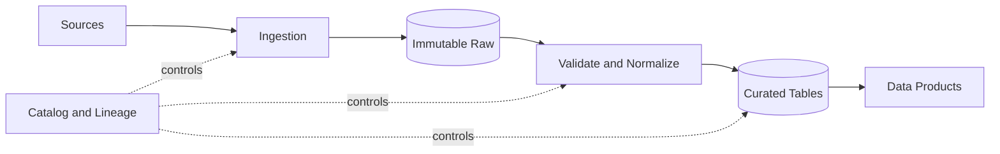



## El problema: acumular archivos no es lo mismo que crear un producto de datos

Incluso cuando una canalización tiene éxito todos los días, es posible que los usuarios sigan recibiendo datos incorrectos.

- La fuente cambia el significado de un campo, pero la canalización aún lo analiza correctamente.
- La agregación utiliza el tiempo de ingesta en lugar del tiempo del evento, excluyendo los datos tardíos.
- Las particiones de fecha son demasiado granulares, lo que provoca una explosión de archivos pequeños.
- Las sobrescrituras eliminan la capacidad de reproducir el pasado.
- La inferencia de esquema produce un tipo diferente en cada ejecución.
- Un reintento agrega el mismo lote y crea duplicados.
- Los listados de objetos y el catálogo acaban en estados diferentes.

Un buen canal define los contratos de datos y las transiciones de estado, no simplemente una ruta para mover datos.

## Modelo mental: plano de datos y plano de control

### Plano de datos

Éste es el camino por el que se mueven y transforman los registros y archivos reales.

### Plano de control

Esto gestiona esquemas, metadatos de partición, estado de ejecución, resultados de calidad, linaje y políticas de acceso.

Mezclar los dos conduce a juzgar la finalización únicamente a partir de los archivos de datos o a suponer que los archivos existen simplemente porque el procesamiento de metadatos tuvo éxito.

### Raw conserva los bytes de origen y el contexto de ingesta

El propósito del área sin procesar es la reproducibilidad y el reprocesamiento, no la conveniencia analítica.

Almacene la carga útil de origen de forma inmutable cuando sea posible.

Entre los ejemplos de metadatos que se deben conservar se incluyen los siguientes.

- Identificador de fuente
- Marca de tiempo de ingestión
- Marca de tiempo del evento
- Desplazamiento de origen o cursor
- Suma de comprobación de contenido
- Identificador de esquema
- Versión de tubería
- Clasificación de acceso

### Los datos seleccionados son un contrato de consumo.

Una tabla seleccionada no son simplemente datos sin procesar limpios.

Expone claves, tipos, nulidad, unidades, zonas horarias, políticas duplicadas y frescura.

Hacer que los consumidores dependan de una tabla o contrato de producto en lugar de una ruta de almacenamiento.

## Flujo de trabajo: de la ingesta a la publicación

### Paso 1. Clasificar cómo puede cambiar la fuente

- ¿Es una transmisión de eventos que solo se puede agregar?
- ¿Es una instantánea mutable?
- ¿Se trata de captura de datos modificados?
- ¿Está estable el cursor API?
- ¿Proporciona eventos de eliminación?
- ¿Son posibles reposiciones y llegadas tardías?
- ¿Cuáles son la zona horaria de origen y la precisión del reloj?

Sin conocer las características de la fuente, la lógica incremental no se puede hacer segura.

### Paso 2. Especificar el punto de control de ingesta

No realice un seguimiento de todas las fuentes con un solo `last processed time`.

Cuando sea posible, utilice un desplazamiento monótono, una secuencia de registro o un cursor proporcionado por la fuente.

Documente el límite de falla entre las actualizaciones de los puntos de control y el almacenamiento sin formato.

Actualizar el punto de control primero puede perder datos.

Almacenar primero puede crear duplicados, por lo que se requiere idempotencia de escritura.

### Paso 3. Hacer que las claves de los objetos sean deterministas

Por ejemplo, incluya el lote ID y el rango de desplazamiento de origen en la ruta.

Escriba repeticiones de la misma entrada en la misma ubicación de preparación y compare sumas de verificación.

Para la publicación final, emule una transición atómica con un manifiesto o una transacción de catálogo.

Mantenga los archivos parciales invisibles desde las particiones normales.

### Paso 4. Administrar esquemas explícitamente

No confíe en la inferencia completa del esquema en cada ejecución del canal de producción.

Utilice un registro de esquema o un archivo de esquema versionado.

Clasificar los cambios.

- Agregar un campo opcional
- Agregar un campo obligatorio
- Ampliar un tipo
- Limitar un tipo
- Cambiar el nombre de un campo
- Cambiar una unidad o significado
- Agregar un valor de enumeración
- Cambiar una estructura anidada

Distinguir la compatibilidad sintáctica de la compatibilidad semántica.

Un cambio de unidad para `temperature` es un cambio importante incluso si su tipo sigue siendo el mismo.

### Paso 5. Separe el tiempo del evento del tiempo de procesamiento

El tiempo del evento es cuando ocurrió un evento en la fuente.

El tiempo de procesamiento es cuando la tubería lo procesó.

Defina una política de eventos tardíos.

- Tardanzas permitidas
- Marca de agua
- Cómo se corrigen las agregaciones
- Si se recalculan los resultados ya publicados
- Cómo se notifica a los consumidores

Normalice las zonas horarias a UTC, pero conserve la información de zona horaria original cuando la empresa lo requiera.

### Paso 6. Elija las claves de partición de los patrones de consulta

Una buena partición ayuda a podar y al mismo tiempo mantiene los tamaños de archivo adecuados.

Evite las siguientes opciones.

- Claves de cardinalidad extremadamente alta, como identificaciones únicas
- Campos que la mayoría de las consultas no utilizan.
- Campos muy sesgados
- Etiquetas comerciales cuyos significados pueden cambiar más adelante.

Incluso las particiones de fecha crean un problema de archivos pequeños si su granularidad de tiempo es demasiado fina.

Verifique el comportamiento del motor para decidir si desea conservar también las columnas de partición dentro de los archivos.

### Paso 7. Ajuste el diseño Parquet para la carga de trabajo

Parquet es un formato de columnas muy adecuado para la proyección y la inserción de predicados.

Pero elegir el formato por sí solo no garantiza el rendimiento.

- Tamaño del grupo de filas
- Códec de compresión
- Cardinalidad de columna
- orden de clasificación
- Estadísticas
- Tamaño del archivo
- Uso de tipos anidados

Muchos archivos pequeños aumentan los metadatos y los costos de apertura.

Los archivos que son demasiado grandes pueden perjudicar el paralelismo y aumentar los costos de reescritura.

Mida las consultas representativas y ajústelas en consecuencia.

### Paso 8. Haga de la compactación una etapa normal del ciclo de vida

Las secuencias y los microlotes producen fácilmente archivos pequeños.

Un trabajo de compactación debe garantizar lo siguiente.

- Instantánea de entrada fija
- Validación de sumas de comprobación de salida y recuentos de filas.
- Transición de metadatos atómicos
- Seguridad cuando se ejecuta simultáneamente con lectores
- Conservación de archivos anteriores
- Revertir o reiniciar en caso de falla

La compactación debe ser una optimización del almacenamiento que no cambie el significado de los datos.

### Paso 9. Eliminación y retención del diseño

Defina el orden de eliminación de objetos y eliminación de catálogos.

Si hay viajes en el tiempo o instantáneas disponibles, comprenda el intervalo entre la eliminación lógica y física.

Utilice el linaje para rastrear los requisitos de eliminación de datos personales a través de conjuntos de datos derivados y copias de seguridad.

El trabajo de retención en sí debería producir un ensayo y un manifiesto de eliminación.

### Paso 10. Poner la publicación detrás de una puerta de calidad

La finalización de la transformación no es la finalización de la publicación.

Publique solo instantáneas que pasen pruebas de esquema, recuento de filas, unicidad, integridad referencial, actualidad y distribución.

Cambie el puntero leído por los consumidores a la nueva instantánea.

Ponga en cuarentena las instantáneas fallidas y conserve la instantánea saludable existente.

## Ejemplo práctico: ingesta de una instantánea diaria de API

### Ingestión

1. Cree una ventana de ejecución ID y fuente esperada.
2. Almacene los bytes de respuesta API en preparación sin formato.
3. Registre los cursores de página y las sumas de verificación en el manifiesto.
4. Confirme el manifiesto sin formato después de que se haya verificado cada página.

### Normalización

1. Analizar con una versión de esquema fija.
2. Poner en cuarentena los registros que no se pueden analizar.
3. Elimine duplicados por clave fuente y versión de actualización.
4. Estandarizar zonas y unidades horarias.
5. Calcular métricas de calidad.

### Publicación

1. Escriba Parquet en la partición provisional seleccionada.
2. Recopile sumas de verificación de archivos, recuentos de filas y claves mínimas y máximas.
3. Evaluar la puerta de calidad.
4. Realice una transición atómica de la instantánea del catálogo.
5. Registre el linaje y ejecute los resultados.
6. Limpia la instantánea anterior después del período de retención.

### Volver a ejecutar

Al volver a ejecutar con la misma ejecución ID o ventana de origen, compare las sumas de verificación sin procesar.

Para entradas idénticas, verifique que el resultado sea determinista.

Si la fuente cambia las respuestas históricas, conserve cada una por separado como una nueva versión fuente.

## Lista de verificación de verificación

### Contrato de ingestión

- [ ] Existe un propietario de fuente y un canal de notificación de cambios.
- [ ] Se documentan los significados de las compensaciones, los cursores y el tiempo del evento.
- [] Los reintentos y la paginación son seguros para duplicados.
- [] Se conservan los bytes sin procesar y las sumas de verificación.
- [ ] Los lotes parciales son invisibles en el área publicada.

### Esquema y semántica

- [] La versión del esquema se gestiona como un artefacto.
- [] Se validan las unidades y los significados de enumeración, no solo los tipos.
- [ ] Existe un proceso de aprobación de cambios importantes.
- [] Existen políticas para campos desconocidos y valores de enumeración.
- [ ] Existen pruebas de compatibilidad entre productores y consumidores.

### Almacenamiento

- [] Las consultas representativas utilizan la poda de particiones.
- [ ] Se observa la distribución del tamaño del archivo.
- [] La compactación mantiene la coherencia de las instantáneas.
- [ ] Se detecta deriva entre el catálogo y los objetos.
- [ ] La retención y la eliminación siguen el linaje.
- [] Una prueba de recuperación reconstruye datos seleccionados a partir de datos sin procesar.

### Operaciones

- [ ] La frescura y la integridad se miden por separado.
- [ ] Existen políticas para datos tardíos y reposiciones.
- [] La transición del puntero de publicación es atómica.
- [ ] Los datos en cuarentena tienen titular y plazo de resolución.
- [] Las versiones de canalización están vinculadas a instantáneas de entrada.

## Fallos y limitaciones comunes

### Entender una partición solo como un nombre de directorio

Si no coincide con el catálogo del motor de consultas, las reglas de poda y la interpretación de tipos, las rutas se dividen y el rendimiento empeora.

### Conservando el área cruda para siempre

Establezca la retención evaluando el valor de recuperación junto con las obligaciones de seguridad, costo y eliminación.

### Tratar la evolución del esquema solo como un problema de adición de campos

Es posible que las comprobaciones de registro automatizadas no detecten cambios en las unidades y significados comerciales.

### Posponer el problema del archivo pequeño

Una vez que el número de archivos aumenta, la compactación y la recuperación de metadatos son riesgosas y costosas.

Establezca métricas de tamaño de archivos y un ciclo de vida desde el principio.

### Confundir sobrescritura con idempotencia

Las ejecuciones simultáneas y los fallos parciales pueden dañar una partición entera.

Se requieren puesta en escena, instantáneas y publicación condicional.

## Referencias oficiales

- [Documentación de Apache Parquet](https://parquet.apache.org/docs/)
- [Evolución del iceberg de Apache](https://iceberg.apache.org/docs/latest/evolution/)
- [Diseño Apache Kafka](https://kafka.apache.org/documentation/#design)
- [Especificación de CloudEvents](https://github.com/cloudevents/spec)
- [AWS Guía prescriptiva: Data Lake Foundation](https://docs.aws.amazon.com/prescriptive-guidance/latest/defining-bucket-names-data-lakes/welcome.html)

## Conclusión

Un canal de datos no es una automatización de la transferencia de archivos sino un contrato a largo plazo entre una fuente y sus consumidores.

Diseñe datos sin procesar inmutables, esquemas explícitos, políticas de tiempo de eventos, particiones basadas en consultas y publicación segura como un solo ciclo de vida.

Sólo cuando el reprocesamiento y los cambios se tratan como condiciones normales los datos se convierten en un producto confiable.
