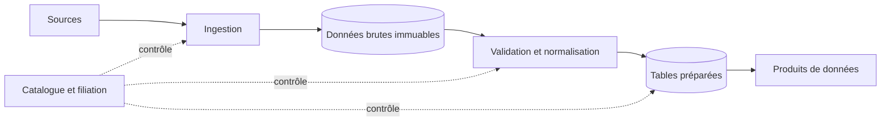



## Le problème : accumuler des fichiers ne revient pas à construire un produit de données

Même lorsqu’un pipeline réussit chaque jour, ses utilisateurs peuvent encore recevoir des données incorrectes.

- La source modifie la signification d’un champ, mais le pipeline continue de l’analyser sans erreur.
- L’agrégation utilise le moment de l’ingestion au lieu de celui de l’événement et exclut ainsi les données tardives.
- Les partitions par date sont trop fines, ce qui provoque une explosion du nombre de petits fichiers.
- Les écrasements empêchent de reproduire le passé.
- L’inférence de schéma produit un type différent à chaque exécution.
- Une nouvelle tentative ajoute deux fois le même lot et crée des doublons.
- Les listes d’objets et le catalogue finissent dans des états différents.

Un bon pipeline définit des contrats de données et des transitions d’état, pas seulement un itinéraire de déplacement des données.

## Modèle mental : plan des données et plan de contrôle

### Plan des données

Il s’agit du chemin sur lequel les enregistrements et les fichiers réels se déplacent et sont transformés.

### Plan de contrôle

Il gère les schémas, les métadonnées des partitions, l’état des exécutions, les résultats de qualité, la filiation et les politiques d’accès.

Mélanger les deux conduit soit à juger l’achèvement à partir des seuls fichiers de données, soit à supposer que les fichiers existent simplement parce que le traitement des métadonnées a réussi.

### La zone brute conserve les octets sources et le contexte d’ingestion

La zone brute vise la reproductibilité et le retraitement, pas la commodité des analyses.

Dans la mesure du possible, enregistrez la charge utile source de manière immuable.

Voici des exemples de métadonnées à conserver avec elle.

- Identifiant de la source
- Horodatage de l’ingestion
- Horodatage de l’événement
- Décalage ou curseur de la source
- Somme de contrôle du contenu
- Identifiant du schéma
- Version du pipeline
- Classification des accès

### Les données préparées constituent un contrat de consommation

Une table préparée n’est pas simplement une version nettoyée des données brutes.

Elle expose les clés, les types, les possibilités de valeur nulle, les unités, les fuseaux horaires, les politiques de gestion des doublons et la fraîcheur.

Faites dépendre les consommateurs d’un contrat de table ou de produit plutôt que d’un chemin de stockage.

## Méthode : de l’ingestion à la publication

### Étape 1. Classer les changements possibles de la source

- S’agit-il d’un flux d’événements auquel on ne fait qu’ajouter des éléments ?
- S’agit-il d’un instantané modifiable ?
- S’agit-il d’une capture des modifications de données ?
- Le curseur de l’API est-il stable ?
- Fournit-elle des événements de suppression ?
- Des rattrapages et des arrivées tardives sont-ils possibles ?
- Quels sont le fuseau horaire et la précision de l’horloge de la source ?

Sans connaître les caractéristiques de la source, il est impossible de sécuriser la logique incrémentale.

### Étape 2. Spécifier le point de reprise de l’ingestion

Ne suivez pas toutes les sources à l’aide d’un unique `dernier instant traité`.

Dans la mesure du possible, utilisez un décalage monotone, un numéro de séquence du journal ou un curseur fourni par la source.

Documentez la limite de défaillance entre la mise à jour du point de reprise et le stockage brut.

Mettre d’abord à jour le point de reprise peut entraîner une perte de données.

Stocker d’abord peut créer des doublons ; l’écriture doit donc être idempotente.

### Étape 3. Rendre les clés d’objet déterministes

Incluez par exemple dans le chemin l’identifiant du lot et la plage de décalages de la source.

Écrivez les réexécutions d’une même entrée dans le même emplacement intermédiaire et comparez les sommes de contrôle.

Pour la publication finale, reproduisez une transition atomique au moyen d’un manifeste ou d’une transaction du catalogue.

Empêchez les fichiers partiels d’apparaître dans les partitions normales.

### Étape 4. Gérer explicitement les schémas

Ne vous fiez pas à une inférence complète du schéma à chaque exécution d’un pipeline de production.

Utilisez un registre de schémas ou un fichier de schéma versionné.

Classez les modifications.

- Ajout d’un champ facultatif
- Ajout d’un champ obligatoire
- Élargissement d’un type
- Rétrécissement d’un type
- Renommage d’un champ
- Modification d’une unité ou d’une signification
- Ajout d’une valeur à une énumération
- Modification d’une structure imbriquée

Distinguez compatibilité syntaxique et compatibilité sémantique.

Une modification de l’unité de `temperature` est une rupture de compatibilité même si son type reste identique.

### Étape 5. Séparer le temps de l’événement du temps de traitement

Le temps de l’événement indique quand celui-ci s’est produit à la source.

Le temps de traitement indique quand le pipeline l’a traité.

Définissez une politique pour les événements tardifs.

- Retard autorisé
- Filigrane
- Méthode de correction des agrégations
- Nouveau calcul ou non des résultats déjà publiés
- Méthode de notification des consommateurs

Normalisez les fuseaux horaires en UTC, tout en conservant les informations d’origine lorsque les besoins métier l’exigent.

### Étape 6. Choisir les clés de partition d’après les profils de requêtes

Une bonne partition facilite l’élagage tout en maintenant une taille de fichier adaptée.

Évitez les choix suivants.

- Clés à cardinalité extrêmement élevée, comme les identifiants uniques
- Champs inutilisés par la plupart des requêtes
- Champs très déséquilibrés
- Libellés métier dont la signification peut évoluer

Même les partitions par date créent un problème de petits fichiers lorsque leur granularité temporelle est trop fine.

Examinez le comportement du moteur pour décider s’il faut aussi conserver les colonnes de partition à l’intérieur des fichiers.

### Étape 7. Adapter l’organisation Parquet à la charge de travail

Parquet est un format en colonnes bien adapté à la projection et à la propagation des prédicats.

Mais le seul choix du format ne garantit pas les performances.

- Taille des groupes de lignes
- Codec de compression
- Cardinalité des colonnes
- Ordre de tri
- Statistiques
- Taille des fichiers
- Utilisation de types imbriqués

De nombreux petits fichiers augmentent le coût des métadonnées et de l’ouverture.

Des fichiers trop volumineux peuvent nuire au parallélisme et accroître le coût des réécritures.

Mesurez des requêtes représentatives et adaptez les paramètres en conséquence.

### Étape 8. Faire du compactage une étape normale du cycle de vie

Les flux et les microlots produisent facilement de petits fichiers.

Une tâche de compactage doit garantir les propriétés suivantes.

- Instantané d’entrée figé
- Validation des sommes de contrôle et du nombre de lignes en sortie
- Transition atomique des métadonnées
- Sûreté de l’exécution simultanée avec les lecteurs
- Conservation des fichiers précédents
- Retour en arrière ou redémarrage après une défaillance

Le compactage doit être une optimisation du stockage qui ne modifie pas la signification des données.

### Étape 9. Concevoir la suppression et la conservation

Définissez l’ordre de suppression des objets et des entrées du catalogue.

Si les voyages dans le temps ou les instantanés sont disponibles, comprenez l’intervalle entre suppression logique et suppression physique.

Utilisez la filiation pour suivre les obligations de suppression des données personnelles dans les jeux dérivés et les sauvegardes.

La tâche de conservation doit elle-même produire une simulation et un manifeste de suppression.

### Étape 10. Placer la publication derrière un critère de qualité

La fin de la transformation n’est pas la fin de la publication.

Ne publiez que les instantanés qui satisfont les tests de schéma, de nombre de lignes, d’unicité, d’intégrité référentielle, de fraîcheur et de distribution.

Basculez le pointeur lu par les consommateurs vers le nouvel instantané.

Placez les instantanés défaillants en quarantaine et conservez l’instantané sain existant.

## Exemple pratique : ingestion d’un instantané quotidien d’API

### Ingestion

1. Créez un identifiant d’exécution et la fenêtre source attendue.
2. Enregistrez les octets de la réponse de l’API dans la zone brute intermédiaire.
3. Consignez les curseurs de page et les sommes de contrôle dans le manifeste.
4. Validez le manifeste brut une fois toutes les pages vérifiées.

### Normalisation

1. Analysez les données avec une version de schéma fixe.
2. Placez en quarantaine les enregistrements dont l’analyse échoue.
3. Supprimez les doublons d’après la clé source et mettez à jour la version.
4. Uniformisez les fuseaux horaires et les unités.
5. Calculez les mesures de qualité.

### Publication

1. Écrivez les fichiers Parquet dans la partition préparée intermédiaire.
2. Recueillez les sommes de contrôle, le nombre de lignes et les clés minimales et maximales des fichiers.
3. Évaluez le critère de qualité.
4. Effectuez atomiquement la transition de l’instantané dans le catalogue.
5. Consignez la filiation et les résultats de l’exécution.
6. Nettoyez l’instantané précédent après la période de conservation.

### Réexécution

Lors d’une réexécution avec le même identifiant ou la même fenêtre source, comparez les sommes de contrôle des données brutes.

Pour une entrée identique, vérifiez que le résultat est déterministe.

Si la source modifie ses réponses historiques, conservez chacune séparément comme une nouvelle version de la source.

## Liste de contrôle

### Contrat d’ingestion

- [ ] Un propriétaire de la source et un canal de notification des changements existent.
- [ ] La signification des décalages, des curseurs et du temps d’événement est documentée.
- [ ] Les nouvelles tentatives et la pagination résistent aux doublons.
- [ ] Les octets bruts et les sommes de contrôle sont conservés.
- [ ] Les lots partiels sont invisibles dans la zone publiée.

### Schéma et sémantique

- [ ] La version du schéma est gérée comme un artefact.
- [ ] Les unités et la signification des énumérations, et pas seulement les types, sont validées.
- [ ] Il existe un processus d’approbation des ruptures de compatibilité.
- [ ] Des politiques encadrent les champs et les valeurs d’énumération inconnus.
- [ ] Il existe des tests de compatibilité entre producteurs et consommateurs.

### Stockage

- [ ] Les requêtes représentatives utilisent l’élagage des partitions.
- [ ] La distribution des tailles de fichier est observée.
- [ ] Le compactage maintient la cohérence des instantanés.
- [ ] Les divergences entre le catalogue et les objets sont détectées.
- [ ] La conservation et la suppression suivent la filiation.
- [ ] Un test de reprise reconstruit les données préparées à partir des données brutes.

### Exploitation

- [ ] La fraîcheur et l’exhaustivité sont mesurées séparément.
- [ ] Il existe des politiques pour les données tardives et les rattrapages.
- [ ] La transition du pointeur de publication est atomique.
- [ ] Les données en quarantaine ont un propriétaire et une échéance de résolution.
- [ ] Les versions du pipeline sont reliées aux instantanés d’entrée.

## Échecs courants et limites

### Comprendre une partition uniquement comme un nom de répertoire

Si elle ne correspond pas au catalogue du moteur de requêtes, aux règles d’élagage et à l’interprétation des types, les chemins sont divisés alors que les performances se dégradent.

### Conserver indéfiniment la zone brute

Définissez la durée de conservation en évaluant la valeur de reprise en regard de la sécurité, du coût et des obligations de suppression.

### Réduire l’évolution du schéma à l’ajout de champs

Les contrôles automatisés du registre risquent de ne pas détecter les changements d’unités et de significations métier.

### Reporter le problème des petits fichiers

Une fois le nombre de fichiers devenu important, le compactage et la récupération des métadonnées sont risqués et coûteux.

Mettez en place dès le début des mesures de taille de fichier et un cycle de vie.

### Confondre écrasement et idempotence

Des exécutions concurrentes et des défaillances partielles peuvent corrompre une partition entière.

Une zone intermédiaire, des instantanés et une publication conditionnelle sont nécessaires.

## Références officielles

- [Documentation d’Apache Parquet](https://parquet.apache.org/docs/)
- [Évolution d’Apache Iceberg](https://iceberg.apache.org/docs/latest/evolution/)
- [Conception d’Apache Kafka](https://kafka.apache.org/documentation/#design)
- [Spécification CloudEvents](https://github.com/cloudevents/spec)
- [Guide normatif AWS : fondations d’un lac de données](https://docs.aws.amazon.com/prescriptive-guidance/latest/defining-bucket-names-data-lakes/welcome.html)

## Conclusion

Un pipeline de données n’est pas une automatisation du transfert de fichiers, mais un contrat à long terme entre une source et ses consommateurs.

Concevez les données brutes immuables, les schémas explicites, les politiques de temps d’événement, les partitions guidées par les requêtes et la publication sûre comme un seul cycle de vie.

Ce n’est qu’en traitant le retraitement et le changement comme des conditions normales que les données deviennent un produit digne de confiance.
