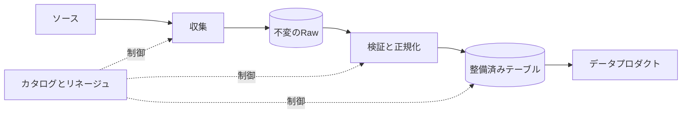



## 問題：ファイルが蓄積されることとデータプロダクトが作られることは異なる

pipelineが毎日成功しても、利用者が誤ったデータを受け取ることはある。

- sourceがfieldの意味を変えても、pipelineはparseに成功する。
- event timeではなくingestion timeで集計し、遅延データが欠落する。
- 日付partitionが細かすぎて、小さなファイルが急増する。
- overwriteによって過去の再現可能性が失われる。
- schema inferenceが実行のたびに異なるtypeを作る。
- retry時に同じbatchがappendされ、重複する。
- object一覧とcatalogが互いに異なる状態になる。

優れたpipelineは、移動経路ではなくデータ契約と状態遷移を定義する。

## Mental model：data planeとcontrol plane

### data plane

実際のrecordとfileが移動し、変換される経路である。

### control plane

schema、partition metadata、run state、quality result、lineage、access policyを管理する。

両者を混同すると、data fileだけを見て処理完了を判断したり、metadataの成功だけを見てfileの存在を仮定したりすることになる。

### rawは元のbytesと収集contextを保存する

raw領域の目的は分析の利便性ではなく、再現と再処理である。

可能であればsource payloadをimmutableに保存する。

併せて保存するmetadataの例は次のとおりである。

- source identifier
- ingestion timestamp
- event timestamp
- source offsetまたはcursor
- content checksum
- schema identifier
- pipeline version
- access classification

### curatedは消費契約である

curated tableは、単に整理されたrawではない。

key、type、nullability、unit、timezone、duplicate policy、freshnessを公開する。

consumerにはstorage pathではなく、tableまたはproduct contractへ依存させる。

## Workflow：収集から公開まで

### Step 1. sourceの変更可能性を分類する

- append-only eventか？
- mutable snapshotか？
- change data captureか？
- API cursorは安定しているか？
- 削除eventを提供するか？
- backfillとlate arrivalは可能か？
- source timezoneとclockの精度はどの程度か？

sourceの特性が分からなければ、incremental logicを安全に作ることはできない。

### Step 2. ingestion checkpointを明示する

`最終処理時刻`一つですべてのsourceを追跡しない。

可能であればsourceが提供するmonotonic offset、log sequence、cursorを使用する。

checkpointの更新とraw保存の失敗境界を文書化する。

checkpointを先に更新するとデータが欠落する可能性がある。

保存を先に行うと重複する可能性があるため、write idempotencyが必要である。

### Step 3. object keyを決定的にする

たとえばbatch IDとsource offset rangeをパスに含める。

同じinputの再実行では同じstaging位置に書き込み、checksumを比較する。

最終publishはmanifestまたはcatalog transactionによって、原子的な切り替えを模倣する。

partial fileが正常なpartitionから見えないようにする。

### Step 4. schemaを明示的に管理する

production pipelineで毎回、schema全体のinferenceに依存しない。

schema registryまたはversioned schema fileを使用する。

変更を分類する。

- optional fieldの追加
- required fieldの追加
- type widening
- type narrowing
- field rename
- unitまたは意味の変更
- enum値の追加
- nested structureの変更

構文上の互換性と意味上の互換性を区別する。

`temperature`の単位変更は、typeが同じでもbreaking changeである。

### Step 5. event timeとprocessing timeを分離する

event timeは、出来事がsourceで発生した時刻である。

processing timeは、pipelineが処理した時刻である。

late eventのポリシーを定める。

- 許容するlateness
- watermark
- 集計の修正方法
- すでに公開された結果を再計算するか
- consumerへの通知方法

timezoneはUTCに正規化するが、元のtimezone情報が業務上必要であれば保存する。

### Step 6. partition keyをquery patternに基づいて決める

適切なpartitionはpruningを助け、fileサイズを適切に保つ。

避けるべき選択は次のとおりである。

- 一意なIDのような超高cardinality key
- 大部分のqueryが使用しないfield
- skewが激しいfield
- 後に意味が変わる業務label

日付partitionも時間単位が細かすぎるとsmall file問題が生じる。

partition columnをfile内部にも保存するかどうか、engineの動作を確認する。

### Step 7. Parquet layoutをworkloadに合わせて調整する

Parquetはcolumnar formatであり、projectionとpredicate pushdownに有利である。

しかし、formatを選ぶだけで性能が保証されるわけではない。

- row groupサイズ
- compression codec
- column cardinality
- sort order
- statistics
- file size
- nested typeの使用

小さなfileが多いとmetadataとopenのコストが増える。

大きすぎるfileは並列性とrewriteコストを悪化させる可能性がある。

代表的なqueryで測定して調整する。

### Step 8. compactionを通常のlifecycleに組み込む

streamまたはmicro-batchは小さなfileを作りやすい。

compaction jobは次を保証しなければならない。

- input snapshotの固定
- output checksumとrow countの検証
- 原子的なmetadata切り替え
- readerとの同時実行における安全性
- 以前のfileのretention
- 失敗時のrollbackまたは再起動

compactionはデータの意味を変えないstorage最適化でなければならない。

### Step 9. deleteとretentionを設計する

object削除とcatalog削除の順序を決める。

time travelやsnapshot機能がある場合は、論理削除と物理削除の間の期間を理解する。

個人情報の削除要求は、derived datasetとbackupまでlineageで追跡する。

retention job自体もdry runを行い、削除manifestを残す。

### Step 10. publishを品質gateの後に置く

transformの完了はpublishの完了ではない。

schema、row count、uniqueness、referential integrity、freshness、distribution testを通過したsnapshotだけを公開する。

consumerが読み取るpointerを新しいsnapshotへ切り替える。

失敗したsnapshotは隔離し、既存の正常なsnapshotを維持する。

## 実践例：日次API snapshotの収集

### 収集

1. run IDとexpected source windowを作る。
2. API response bytesをraw stagingに保存する。
3. page cursorとchecksumをmanifestに記録する。
4. すべてのpageを確認したらraw manifestをcommitする。

### 正規化

1. 固定したschema versionでparseする。
2. parseに失敗したrecordをquarantineする。
3. source keyとupdate versionで重複を除去する。
4. timezoneとunitを標準化する。
5. quality metricを計算する。

### publish

1. curated staging partitionにParquetを書き込む。
2. file checksum、row count、min/max keyを収集する。
3. 品質gateを評価する。
4. catalog snapshotを原子的に切り替える。
5. lineageとrunの結果を記録する。
6. 以前のsnapshotはretention期間後に整理する。

### 再実行

同じrun IDまたはsource windowで再実行する場合は、raw checksumを比較する。

同一inputなら結果が決定的であるか確認する。

sourceが過去の応答を変更する場合は、新しいsource versionとして別途保存する。

## 検証Checklist

### 収集契約

- [ ] source ownerと変更通知経路がある。
- [ ] offset、cursor、event timeの意味が文書化されている。
- [ ] retryとpaginationが重複に対して安全である。
- [ ] raw bytesとchecksumを保存している。
- [ ] partial batchが公開領域から見えない。

### schemaと意味

- [ ] schema versionがartifactとして管理されている。
- [ ] typeだけでなくunitとenumの意味も検証している。
- [ ] breaking changeの承認手順がある。
- [ ] unknown fieldとunknown enumのポリシーがある。
- [ ] producerとconsumerの互換性testがある。

### storage

- [ ] 代表的なqueryがpartition pruningを使用している。
- [ ] fileサイズの分布を観測している。
- [ ] compactionがsnapshotの一貫性を維持している。
- [ ] catalogとobjectのdriftを検出している。
- [ ] retentionと削除がlineageに従っている。
- [ ] 復元試験でrawからcuratedを再生成している。

### 運用

- [ ] freshnessとcompletenessを別々に測定している。
- [ ] late dataとbackfillのポリシーがある。
- [ ] publish pointerの切り替えが原子的である。
- [ ] quarantine dataの所有者と処理期限が定められている。
- [ ] pipeline versionとinput snapshotが関連付けられている。

## よくある失敗と限界

### partitionをdirectory名としてしか理解しない

query engineのcatalog、pruning規則、type解釈と一致しなければ、パスが分かれるだけで性能は悪化する。

### raw領域を永久に保存する

復旧価値とセキュリティ・コスト・削除義務を併せて評価し、retentionを定めなければならない。

### schema evolutionをfield追加の問題としてしか捉えない

単位と業務上の意味の変更は、自動registry checkでは検出できない場合がある。

### small fileを後回しにする

file数が増えてからのcompactionとmetadata復旧は危険で高コストである。

初期段階からfile size metricとlifecycleを設ける。

### overwriteをidempotencyだと誤解する

同時runとpartial failureがあると、partition全体を損傷する可能性がある。

staging、snapshot、conditional publishが必要である。

## 公式参考資料

- [Apache Parquetドキュメント](https://parquet.apache.org/docs/)
- [Apache Iceberg Evolution](https://iceberg.apache.org/docs/latest/evolution/)
- [Apache Kafka Design](https://kafka.apache.org/documentation/#design)
- [CloudEvents仕様](https://github.com/cloudevents/spec)
- [AWS Prescriptive Guidance：データレイク基盤](https://docs.aws.amazon.com/prescriptive-guidance/latest/defining-bucket-names-data-lakes/welcome.html)

## まとめ

データpipelineはfile移動の自動化ではなく、sourceとconsumerの間の長期的な契約である。

immutable raw、明示的なschema、event-timeポリシー、queryに基づくpartition、安全なpublishを一つのlifecycleとして設計しよう。

再処理と変更を通常の状況として扱ってこそ、データは初めて信頼できるプロダクトになる。
