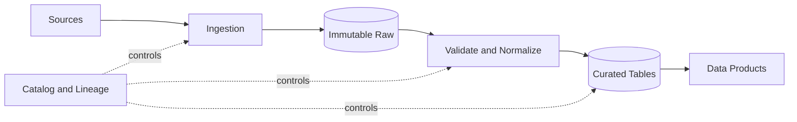



## 문제: 파일이 쌓이는 것과 데이터 제품이 만들어지는 것은 다르다

pipeline이 매일 성공해도 사용자는 잘못된 데이터를 받을 수 있다.

- source가 field 의미를 바꿨지만 pipeline은 parse에 성공한다.
- event time 대신 ingestion time으로 집계해 늦은 데이터가 빠진다.
- 날짜 partition이 너무 세분화되어 작은 파일이 폭증한다.
- overwrite가 과거 재현 가능성을 없앤다.
- schema inference가 실행마다 다른 type을 만든다.
- retry 때 같은 batch가 append되어 중복된다.
- object 목록과 catalog가 서로 다른 상태가 된다.

좋은 pipeline은 이동 경로가 아니라 데이터 계약과 상태 전이를 정의한다.

## Mental model: data plane과 control plane

### data plane

실제 record와 file이 이동하고 변환되는 경로다.

### control plane

schema, partition metadata, run state, quality result, lineage, access policy를 관리한다.

둘을 섞으면 data file만 보고 처리 완료 여부를 판단하거나 metadata 성공만 보고 file 존재를 가정하게 된다.

### raw는 원본 bytes와 수집 context를 보존한다

raw 영역의 목적은 분석 편의가 아니라 재현과 재처리다.

가능하면 source payload를 immutable하게 저장한다.

함께 보존할 metadata 예시는 다음과 같다.

- source identifier
- ingestion timestamp
- event timestamp
- source offset 또는 cursor
- content checksum
- schema identifier
- pipeline version
- access classification

### curated는 소비 계약이다

curated table은 단순히 정리된 raw가 아니다.

key, type, nullability, unit, timezone, duplicate policy, freshness를 공개한다.

consumer는 storage path보다 table 또는 product contract에 의존하게 한다.

## Workflow: 수집에서 공개까지

### Step 1. source의 변경 가능성을 분류한다

- append-only event인가?
- mutable snapshot인가?
- change data capture인가?
- API cursor가 안정적인가?
- 삭제 event를 제공하는가?
- backfill과 late arrival이 가능한가?
- source timezone과 clock 정확도는 어떤가?

source 특성을 모르면 incremental logic을 안전하게 만들 수 없다.

### Step 2. ingestion checkpoint를 명시한다

`마지막 처리 시간` 하나로 모든 source를 추적하지 않는다.

가능하면 source가 제공하는 monotonic offset, log sequence, cursor를 사용한다.

checkpoint 업데이트와 raw 저장의 실패 경계를 문서화한다.

checkpoint를 먼저 갱신하면 데이터가 빠질 수 있다.

저장을 먼저 하면 중복될 수 있으므로 write idempotency가 필요하다.

### Step 3. object key를 결정적으로 만든다

예를 들어 batch ID와 source offset range를 경로에 포함한다.

같은 input 재실행은 같은 staging 위치에 쓰고 checksum을 비교한다.

최종 publish는 manifest 또는 catalog transaction으로 원자적 전환을 모사한다.

partial file을 정상 partition에서 보이지 않게 한다.

### Step 4. schema를 명시적으로 관리한다

production pipeline에서 매번 전체 schema inference에 의존하지 않는다.

schema registry 또는 versioned schema file을 사용한다.

변경을 분류한다.

- optional field 추가
- required field 추가
- type widening
- type narrowing
- field rename
- unit 또는 의미 변경
- enum 값 추가
- nested structure 변경

문법 호환과 의미 호환을 구분한다.

`temperature`의 단위 변경은 type이 같아도 breaking change다.

### Step 5. event time과 processing time을 분리한다

event time은 사건이 source에서 발생한 시간이다.

processing time은 pipeline이 처리한 시간이다.

late event 정책을 정한다.

- 허용 lateness
- watermark
- 집계 수정 방식
- 이미 공개된 결과 재계산 여부
- consumer notification 방식

timezone은 UTC로 정규화하되 원본 timezone 정보가 업무상 필요하면 보존한다.

### Step 6. partition key를 query pattern으로 정한다

좋은 partition은 pruning을 돕고 file 크기를 적절하게 유지한다.

피해야 할 선택은 다음과 같다.

- 고유 ID 같은 초고 cardinality key
- 대부분 query가 사용하지 않는 field
- skew가 심한 field
- 나중에 의미가 바뀌는 업무 label

날짜 partition도 시간 단위가 너무 작으면 small file 문제가 생긴다.

partition column을 file 내부에도 보존할지 engine 동작을 확인한다.

### Step 7. Parquet layout을 workload로 튜닝한다

Parquet은 columnar format으로 projection과 predicate pushdown에 유리하다.

하지만 format 선택만으로 성능이 보장되지는 않는다.

- row group 크기
- compression codec
- column cardinality
- sort order
- statistics
- file size
- nested type 사용

작은 file이 많으면 metadata와 open 비용이 커진다.

너무 큰 file은 병렬성과 rewrite 비용을 악화시킬 수 있다.

대표 query로 측정해 조정한다.

### Step 8. compaction을 정상 lifecycle로 둔다

stream 또는 micro-batch는 작은 file을 만들기 쉽다.

compaction job은 다음을 보장해야 한다.

- input snapshot 고정
- output checksum과 row count 검증
- 원자적 metadata 전환
- reader와 동시 실행 안전성
- 이전 file의 retention
- 실패 시 rollback 또는 재시작

compaction은 데이터 의미를 바꾸지 않는 storage 최적화여야 한다.

### Step 9. delete와 retention을 설계한다

object 삭제와 catalog 삭제의 순서를 정한다.

time travel이나 snapshot 기능이 있으면 논리 삭제와 물리 삭제 사이의 기간을 이해한다.

개인정보 삭제 요구는 derived dataset과 backup까지 lineage로 추적한다.

retention job 자체도 dry run과 삭제 manifest를 남긴다.

### Step 10. publish를 품질 gate 뒤에 둔다

transform 완료가 publish 완료는 아니다.

schema, row count, uniqueness, referential integrity, freshness, distribution test를 통과한 snapshot만 공개한다.

consumer가 읽는 pointer를 새 snapshot으로 전환한다.

실패 snapshot은 격리하고 기존 정상 snapshot을 유지한다.

## 실전 예제: 일간 API snapshot 수집

### 수집

1. run ID와 expected source window를 만든다.
2. API response bytes를 raw staging에 저장한다.
3. page cursor와 checksum을 manifest에 기록한다.
4. 모든 page가 확인되면 raw manifest를 commit한다.

### 정규화

1. 고정 schema version으로 parse한다.
2. parse 실패 record를 quarantine한다.
3. source key와 update version으로 중복을 제거한다.
4. timezone과 unit을 표준화한다.
5. quality metric을 계산한다.

### publish

1. curated staging partition에 Parquet을 쓴다.
2. file checksum, row count, min/max key를 수집한다.
3. 품질 gate를 평가한다.
4. catalog snapshot을 원자적으로 전환한다.
5. lineage와 run 결과를 기록한다.
6. 이전 snapshot은 retention 기간 뒤 정리한다.

### 재실행

같은 run ID 또는 source window로 재실행하면 raw checksum을 비교한다.

동일 input이면 결과가 결정적인지 확인한다.

source가 과거 응답을 변경한다면 새로운 source version으로 별도 보존한다.

## 검증 Checklist

### 수집 계약

- [ ] source owner와 변경 통지 경로가 있다.
- [ ] offset, cursor, event time의 의미가 문서화되어 있다.
- [ ] retry와 pagination이 중복에 안전하다.
- [ ] raw bytes와 checksum을 보존한다.
- [ ] partial batch가 공개 영역에 보이지 않는다.

### schema와 의미

- [ ] schema version이 artifact로 관리된다.
- [ ] type뿐 아니라 unit과 enum 의미를 검증한다.
- [ ] breaking change 승인 절차가 있다.
- [ ] unknown field와 unknown enum 정책이 있다.
- [ ] producer와 consumer 호환성 test가 있다.

### storage

- [ ] 대표 query가 partition pruning을 사용한다.
- [ ] file 크기 분포를 관찰한다.
- [ ] compaction이 snapshot 일관성을 유지한다.
- [ ] catalog와 object drift를 탐지한다.
- [ ] retention과 삭제가 lineage를 따른다.
- [ ] 복원 시험으로 raw에서 curated를 재생성한다.

### 운영

- [ ] freshness와 completeness를 별도로 측정한다.
- [ ] late data와 backfill 정책이 있다.
- [ ] publish pointer 전환이 원자적이다.
- [ ] quarantine data의 소유자와 처리 기한이 있다.
- [ ] pipeline version과 input snapshot이 연결된다.

## 자주 겪는 실패와 한계

### partition을 directory 이름으로만 이해한다

query engine catalog, pruning 규칙, type 해석과 일치하지 않으면 경로만 나뉘고 성능은 나빠진다.

### raw 영역을 영원히 보존한다

복구 가치와 보안·비용·삭제 의무를 함께 평가해 retention을 정해야 한다.

### schema evolution을 field 추가 문제로만 본다

단위와 업무 의미 변화는 자동 registry check가 잡지 못할 수 있다.

### small file을 나중 문제로 미룬다

file 수가 커진 뒤 compaction과 metadata 복구는 위험하고 비싸다.

초기부터 file size metric과 lifecycle을 둔다.

### overwrite를 idempotency로 착각한다

동시 run과 partial failure가 있으면 partition 전체를 손상시킬 수 있다.

staging, snapshot, conditional publish가 필요하다.

## 공식 참고자료

- [Apache Parquet Documentation](https://parquet.apache.org/docs/)
- [Apache Iceberg Evolution](https://iceberg.apache.org/docs/latest/evolution/)
- [Apache Kafka Design](https://kafka.apache.org/documentation/#design)
- [CloudEvents Specification](https://github.com/cloudevents/spec)
- [AWS Prescriptive Guidance: Data Lake Foundation](https://docs.aws.amazon.com/prescriptive-guidance/latest/defining-bucket-names-data-lakes/welcome.html)

## 마무리

데이터 pipeline은 file 이동 자동화가 아니라 source와 consumer 사이의 장기 계약이다.

immutable raw, 명시적 schema, event-time 정책, query 기반 partition, 안전한 publish를 하나의 lifecycle로 설계하자.

재처리와 변경을 정상 상황으로 취급할 때 데이터는 비로소 신뢰할 수 있는 제품이 된다.
