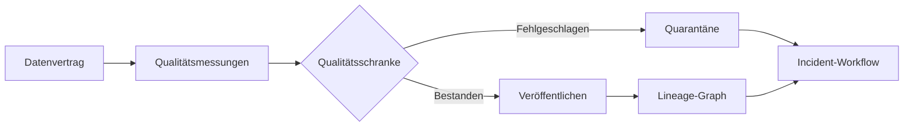



## Das Problem: Ein erfolgreicher Pipeline-Lauf beweist noch keine gesunden Daten

Eine fehlerhafte Tabelle kann veröffentlicht werden, obwohl ein Job mit Exitcode 0 endet.

- Eine Quelle verspätet sich, doch eine leere Partition gilt als normal.
- Die Zahl doppelter Schlüssel steigt, während die Zeilenanzahl nahezu gleich bleibt.
- Eine Einheit ändert sich und verschiebt die Werteverteilung.
- Wegen fehlender Join-Schlüssel geht der Großteil der Zeilen verloren.
- Nur ein Segment fehlt, sodass der Gesamtdurchschnitt unauffällig aussieht.
- Ein veralteter Snapshot wird weiterhin ausgeliefert.
- Ein Fehler wird erkannt, aber niemand weiß, welche Dashboards und Modelle betroffen sind.

Datenqualität ist eher eine Frage von Verantwortung und Reaktionsverträgen als von der Einführung einer Testbibliothek.

## Denkmodell: Vertrag, Messung, Auswirkung und Reaktion

### Datenvertrag

Ein zwischen Produzent und Verbraucher vereinbartes Schema samt Servicelevel.

Er sollte Folgendes enthalten:

- Zweck und verantwortliche Person des Datasets
- Schlüssel und Granularität
- Feldtypen und NULL-Zulässigkeit
- Semantik von Einheit, Zeitzone und Enum-Werten
- Aktualisierungsrhythmus
- Ziele für Aktualität und Vollständigkeit
- Verfahren für Breaking Changes
- Aufbewahrungs- und Zugriffsklassifizierung

### Qualitätsmessung

Berechnete Nachweise dafür, ob ein tatsächlicher Snapshot den Vertrag erfüllt.

### Lineage

Zeigt, wie Eingaben, Code und Konfiguration zu Ausgaben und Verbrauchern führen.

### Reaktion

Dazu gehören die Quarantäne eines fehlgeschlagenen Snapshots, die Beibehaltung des vorherigen Snapshots, Auswirkungsanalyse, Benachrichtigung der verantwortlichen Person, Wiederherstellung und Nachbesprechung des Vorfalls.

## Qualitätsdimensionen unterscheiden

### Aktualität

Sind die Daten so aktuell wie zum erwarteten Zeitpunkt?

Wer nur `MAX(event_time)` betrachtet, kann Zeitstempel in der Zukunft oder Verzögerungen einzelner Quellen übersehen.

Prüfen Sie sowohl die Watermarks jeder Quelle als auch den Veröffentlichungszeitpunkt.

### Vollständigkeit

Sind genügend erwartete Datensätze und Felder eingetroffen?

Verwenden Sie statt einer absoluten Zeilenanzahl Quellenmanifeste, die Abdeckung der Partitionen und Kennzahlen pro Segment.

### Eindeutigkeit

Sind die vertraglich festgelegten Schlüssel eindeutig?

Beziehen Sie zusammengesetzte Schlüssel und Gültigkeitszeiträume in die Definition der Granularität ein.

### Gültigkeit

Erfüllen die Werte Typen, Bereiche, Enums, Formate und Geschäftsregeln?

Unterscheiden Sie physikalisch mögliche von statistisch üblichen Bereichen.

### Konsistenz

Ist das Dataset in sich und gegenüber anderen Quellen konsistent?

Prüfen Sie Bilanzabgleiche, referenzielle Integrität und Zustandsübergänge.

### Genauigkeit

Wie genau stimmen die Daten mit der Realität überein?

Fehlt eine Ground Truth, sind Ersatzindikatoren und Stichprobenprüfungen nötig; einfache Constraint-Tests können Genauigkeit nicht vollständig beweisen.

## Workflow: Qualität zur Deployment-Schranke machen

### Schritt 1. Die Granularität des Datasets in einem Satz formulieren

Beispiel: `Jede Zeile stellt genau ein endgültiges Aggregat für ein UTC-Datum und eine Geräte-ID dar.`

Ohne Granularität werden die Definitionen von Duplikaten und Auslassungen instabil.

### Schritt 2. Kritische Datenelemente auswählen

Wenden Sie nicht auf jede Spalte dieselbe Prüftiefe an.

Kennzeichnen Sie Felder, die für Geschäftsentscheidungen, Regulierung, Modellmerkmale und Abrechnung verwendet werden.

Wenden Sie auf kritische Felder strengere SLOs und Änderungsfreigaben an.

### Schritt 3. Harte Constraints von weichen Erwartungen trennen

Ein Verstoß gegen ein hartes Constraint blockiert die Veröffentlichung.

- Duplikate des Primärschlüssels
- NULL-Werte in Pflichtfeldern
- Unmögliche Enum-Werte
- Verletzungen der referenziellen Integrität
- Fehler beim Parsen des Schemas

Weiche Erwartungen warnen vor Drift und Anomalien.

- Änderungsrate der Zeilenanzahl
- Veränderungen von Mittelwert und Perzentilen
- Verschiebungen der Kategorieanteile
- Allmählicher Anstieg des NULL-Anteils
- Trends bei Quellenverzögerungen

Wird ein weicher Schwellenwert sofort als harte Schranke verwendet, wird auch normale Saisonalität zum Incident.

### Schritt 4. Erwartungen mit einer Baseline vergleichen

Unterscheiden Sie feste Schwellenwerte, rollierende Baselines und saisonale Baselines.

Berücksichtigen Sie, dass das Baseline-Fenster bereits Anomalien enthalten kann.

Prüfen Sie auch Verteilungen pro Segment.

Änderungen an Schwellenwerten sollten ebenfalls ein Code-Review durchlaufen und historisiert werden.

### Schritt 5. Das Ergebnis der Schranke an den Snapshot binden

Ein Qualitätsbericht erfasst:

- Dataset- und Snapshot-ID
- ID des Eingabe-Snapshots
- Regelversion
- Messwerte und Schwellenwerte
- Sichere Verweise auf fehlgeschlagene Beispieldatensätze
- Ausführungszeit und Engine-Version
- Status „bestanden“, „Warnung“ oder „fehlgeschlagen“
- Freigebende oder die Regel übersteuernde Person

Kopieren Sie die sensiblen Datensätze selbst nicht in Logs.

### Schritt 6. Bei einem Fehler die vorherige gute Version beibehalten

Prüfen Sie den neuen Snapshot in der Staging-Umgebung.

Ändern Sie bei einem Fehlschlag nicht den Zeiger der Verbraucher.

Bewahren Sie den Snapshot in Quarantäne auf und beschränken Sie den Zugriff.

Legen Sie für jeden Anwendungsfall fest, ob eine eingeschränkte Aktualität oder die Veröffentlichung falscher Daten das geringere Risiko darstellt.

### Schritt 7. Lineage aus Ausführungsnachweisen aufbauen

Lineage, die ausschließlich manuell in der Dokumentation gezeichnet wird, driftet ab.

Erfassen Sie Eingabe- und Ausgabe-Datasets, Versionen sowie Spaltenzuordnungen aus den Jobausführungen.

Ergänzen Sie komplexe Source-to-Target-Zuordnungen durch manuelle Erläuterungen.

Nutzen Sie den Lineage-Graphen, um bei einem Incident nachgelagerte Verbraucher zu finden.

### Schritt 8. Feedback der Verbraucher in den Vertrag aufnehmen

Selbst wenn ein Produzent ein Schema für gültig hält, kann die Semantik auf Verbraucherseite brechen.

Erstellen Sie verbrauchergesteuerte Vertragstests.

Prüfen Sie vor einem Breaking Change, welche Felder und Abfragen verwendet werden.

Stellen Sie einen Deprecation-Zeitraum und einen Migrationsleitfaden bereit.

### Schritt 9. Qualitäts-Incidents betreiben

Beispiele für Schweregradkriterien sind:

- Falsche Ergebnisse wurden bereits für externe Entscheidungen verwendet
- Die Veröffentlichung eines kritischen Datasets ist gestoppt
- Ein unkritisches Feld ist abgedriftet
- Lineage-Metadaten fehlen

Der Incident-Prozess besteht aus Erkennung, Isolation, Auswirkungsanalyse, Wiederherstellung und Vermeidung einer Wiederholung.

Verfolgen Sie Datenkorrekturen und ob Berechnungen der Verbraucher erneut ausgeführt werden.

### Schritt 10. Übersteuerungen als kontrolliertes Feature behandeln, nicht als Ausnahme

Eine Warnung kann aus geschäftlichen Gründen akzeptabel sein.

Erfassen Sie für jede Übersteuerung Begründung, Umfang, Ablaufzeitpunkt, freigebende Person und Folgearbeiten.

Eine dauerhafte Einstellung `ignore` setzt den Vertrag außer Kraft.

## Praxisbeispiel: Eine tägliche Aggregattabelle

### Vertrag

- Granularität: eine Zeile pro Datum und Entitäts-ID
- Schlüssel: `date`, `entity_id`
- Aktualität: Aktualisierung innerhalb des festgelegten Veröffentlichungsfensters
- Vollständigkeit: enthält jede Partition des Quellenmanifests
- Gültigkeit: Zähler sind nicht negativ
- Konsistenz: Summen liegen innerhalb der Toleranz des Quellenabgleichs

### Stufen der Qualitätsschranke

1. Schema-Fingerprint vergleichen.
2. Eindeutigkeit der Schlüssel prüfen.
3. NULL-Anteil der Pflichtfelder prüfen.
4. Abdeckung der Quellenpartitionen vergleichen.
5. Zeilenanzahlen pro Segment mit der Baseline vergleichen.
6. Summen abgleichen.
7. Aktualität der Ereigniszeit berechnen.
8. Ergebnisbericht mit der Snapshot-ID verknüpfen.
9. Alias nur bei bestandener Prüfung auf den neuen Snapshot umstellen.

### Reaktion auf Fehler

Weist ein Segment eine geringe Vollständigkeit auf, darf dies nicht durch den Gesamtdurchschnitt verdeckt werden.

Suchen Sie in der Lineage nach der betreffenden Quelle und den nachgelagerten Verbrauchern.

Behalten Sie den vorherigen guten Snapshot bei, während Sie einen Aktualitäts-Incident bekannt geben.

Verarbeiten Sie nach der Erholung der Quelle dasselbe Eingabefenster erneut.

Dokumentieren Sie den Umfang für die Neuberechnung von Verbraucher-Caches und abgeleiteten Tabellen.

## Observability-Metriken

### Pipeline-Zustand

- Erfolgsquote der Läufe
- Laufzeitperzentile
- Anzahl der Wiederholungsversuche
- Ressourcenauslastung

### Datenzustand

- Quellenverzögerung
- Aktualität der Veröffentlichung
- Zeilen- und Byte-Volumen
- Duplikatanteil
- NULL-Anteil
- Anteil ungültiger Werte
- Verteilungsdistanz
- Abgleichsfehler

### Governance-Zustand

- Anzahl der Datasets ohne verantwortliche Person
- Anzahl der Datasets ohne Vertragsversion
- Anteil fehlender Lineage
- Anzahl abgelaufener Übersteuerungen
- Einhaltung der Benachrichtigungspflicht bei Breaking Changes
- Wiederherstellungszeit bei Qualitäts-Incidents

Trennen Sie die drei Arten auf einem gemeinsamen Dashboard.

Es muss möglich sein, dass die Pipeline grün ist, während die Daten rot sind.

## Checkliste zur Verifikation

### Vertrag

- [ ] Sind die verantwortliche Person und die Verbraucher des Datasets benannt?
- [ ] Sind Granularität, Schlüssel, Einheiten und Zeitzone eindeutig?
- [ ] Sind kritische Datenelemente gekennzeichnet?
- [ ] Gibt es SLOs für Aktualität und Vollständigkeit?
- [ ] Sind Prozesse für Breaking Changes und Deprecation definiert?

### Prüfungen

- [ ] Werden harte Schranken von Warnungen unterschieden?
- [ ] Werden Anomalien pro Segment geprüft?
- [ ] Werden Versionen von Schwellenwerten und Baselines nachverfolgt?
- [ ] Wird ein Testfehler von einem Datenfehler unterschieden?
- [ ] Vermeiden Fehlerbeispiele die Offenlegung sensibler Informationen?

### Veröffentlichung und Wiederherstellung

- [ ] Bleibt ein Snapshot bis nach der Prüfung vor Verbrauchern verborgen?
- [ ] Kann bei einem Fehler der vorherige gute Snapshot beibehalten werden?
- [ ] Gibt es Zugriffs- und Aufbewahrungsrichtlinien für die Quarantäne?
- [ ] Laufen Übersteuerungen ab und sind sie auditierbar?
- [ ] Wird nach einer Korrektur der Umfang nachgelagerter Neuberechnungen nachverfolgt?

### Lineage und Betrieb

- [ ] Sind Versionen von Eingaben, Code und Ausgaben miteinander verbunden?
- [ ] Werden semantische Transformationen auf Spaltenebene bei Bedarf erfasst?
- [ ] Lassen sich bei einem Incident betroffene Verbraucher im Graphen finden?
- [ ] Sind Qualitätswarnungen mit einer verantwortlichen Person und einem Runbook verknüpft?
- [ ] Werden Qualitäts-SLOs regelmäßig überprüft?

## Häufige Fehler und Grenzen

### Hunderte Regeln für jede Spalte erstellen

Warnungsmüdigkeit und Wartungskosten steigen.

Beginnen Sie mit kritischen Feldern und tatsächlichen Fehlermodi.

### Anomalieerkennung als Antwort auf Qualitätsprobleme betrachten

Anomalieerkennung signalisiert eine Veränderung; sie stellt nicht fest, dass ein Fehler aufgetreten ist.

Saisonalität, Produktänderungen und neue Segmente können normale Veränderungen hervorrufen.

### Glauben, ein Lineage-Graph zeige alle Auswirkungen

Einige Nutzungsformen wie Dateidownloads, temporäre Abfragen und externe Exporte werden nicht erfasst.

Nutzen Sie zusätzlich Zugriffsprotokolle und Bestätigungen der verantwortlichen Personen.

### Annehmen, Aktualität allein bedeute, dass die Daten aktuell sind

Selbst bei einem einzelnen neuen Zeitstempel kann der Großteil der Datensätze alt sein.

Prüfen Sie Verteilungen und Watermarks pro Quelle.

### Übersteuerungen wiederholt verwenden

Wiederholte Übersteuerungen deuten entweder auf einen schlechten Schwellenwert oder einen gebrochenen Quellenvertrag hin.

## Offizielle Referenzen

- [OpenLineage-Dokumentation](https://openlineage.io/docs/)
- [OpenTelemetry-Signale](https://opentelemetry.io/docs/concepts/signals/)
- [Great-Expectations-Dokumentation](https://docs.greatexpectations.io/)
- [dbt-Datentests](https://docs.getdbt.com/docs/build/data-tests)
- [Apache-Atlas-Dokumentation](https://atlas.apache.org/)

## Fazit

Datenqualität bedeutet nicht, „Prüfungen zu bestehen“, sondern die betriebliche Fähigkeit, die Verbrauchern zugesagte Semantik und die zugesagten Servicelevel einzuhalten.

Verbinden Sie Verträge, Messungen pro Snapshot, Lineage, Veröffentlichungsschranken und Incident-Reaktion in einem durchgängigen Ablauf.

Das Vertrauen in eine Datenplattform wächst, wenn Fehler nicht verborgen und ihre Auswirkungen sowie ihre Behebung nachverfolgt werden.
