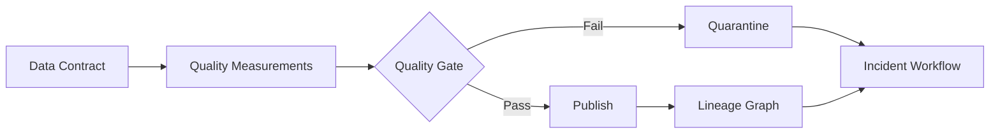



## The Problem: Pipeline Success Is Not Sufficient Evidence of Healthy Data

An incorrect table can be published even when a job finishes with exit code 0.

- A source is late, but an empty partition is treated as normal.
- Key duplicates increase while the row count remains similar.
- A unit changes and shifts the value distribution.
- Most rows are lost because join keys are missing.
- Only one segment is missing, making the overall average look normal.
- A stale snapshot continues to be served.
- An error is detected, but no one knows which dashboards and models are affected.

Data quality is more a problem of ownership and response contracts than of adopting a test library.

## Mental Model: Contract, Measurement, Impact, and Response

### Data contract

A schema and service level agreed upon by producer and consumer.

It should include:

- Dataset purpose and owner
- Keys and grain
- Field types and nullability
- Unit, timezone, and enum semantics
- Update cadence
- Freshness and completeness objectives
- Breaking-change process
- Retention and access classification

### Quality measurement

Evidence calculated to determine whether an actual snapshot satisfies the contract.

### Lineage

Shows how inputs, code, and configuration lead to outputs and consumers.

### Response

Includes quarantining a failed snapshot, retaining the previous snapshot, impact analysis, owner notification, recovery, and post-incident review.

## Distinguish Quality Dimensions

### Freshness

Is the data as recent as the expected time?

Looking only at `MAX(event_time)` can miss future timestamps or delays in some sources.

Inspect both per-source watermarks and publication time.

### Completeness

Have enough expected records and fields arrived?

Use source manifests, partition coverage, and per-segment ratios rather than an absolute row count.

### Uniqueness

Are contractual keys unique?

Include composite keys and validity periods in the definition of grain.

### Validity

Do values satisfy types, ranges, enums, formats, and business rules?

Distinguish physically possible ranges from statistically common ranges.

### Consistency

Is the dataset internally consistent and consistent with other sources?

Check balance reconciliation, referential integrity, and state transitions.

### Accuracy

How closely does the data match the real-world truth?

When no ground truth exists, proxies and sample audits are necessary; simple constraint tests cannot prove accuracy completely.

## Workflow: Make Quality a Deployment Gate

### Step 1. Write the dataset grain in one sentence

Example: `Each row represents one final aggregate for a UTC date and device ID.`

Without a grain, the definitions of duplicates and omissions become unstable.

### Step 2. Select critical data elements

Do not apply the same level of testing to every column.

Mark fields used for business decisions, regulation, model features, and settlement.

Apply stricter SLOs and change approval to critical fields.

### Step 3. Separate hard constraints from soft expectations

A hard-constraint failure blocks publication.

- Primary-key duplicates
- Null required fields
- Impossible enum values
- Referential-integrity violations
- Schema-parsing failures

Soft expectations warn about drift and anomalies.

- Row-count rate of change
- Changes in mean and percentiles
- Shifts in category proportions
- Gradual increases in the null ratio
- Source-delay trends

If a soft threshold is used immediately as a hard gate, normal seasonality also becomes an incident.

### Step 4. Compare expectations with a baseline

Distinguish fixed thresholds, rolling baselines, and seasonal baselines.

Account for the possibility that the baseline window already contains anomalies.

Inspect per-segment distributions as well.

Threshold changes should also undergo code review and retain history.

### Step 5. Bind the gate result to the snapshot

A quality report records:

- Dataset and snapshot ID
- Input snapshot ID
- Rule version
- Measurements and thresholds
- Safe references to sample failed records
- Execution time and engine version
- Pass, warn, or fail status
- Approver or override actor

Do not copy sensitive records themselves into logs.

### Step 6. Retain the previous good version on failure

Check the new snapshot in staging.

If it fails, do not change the consumer pointer.

Preserve it in quarantine and restrict access.

For each use case, define whether degraded freshness or publication of incorrect data is the lesser risk.

### Step 7. Build lineage from execution evidence

Lineage drawn manually in documentation alone will drift.

Collect input and output datasets, versions, and column mappings from job executions.

Supplement complex source-to-target mappings with manual explanations.

Use the lineage graph to find downstream consumers during an incident.

### Step 8. Put consumer feedback into the contract

Even when a producer considers a schema valid, consumer semantics can break.

Create consumer-driven contract tests.

Before a breaking change, check which fields and queries are in use.

Provide a deprecation period and migration guide.

### Step 9. Operate quality incidents

Example severity criteria include:

- Incorrect results have already been used for external decisions
- Publication of a critical dataset has stopped
- A noncritical field has drifted
- Lineage metadata is missing

The incident process consists of detection, isolation, impact analysis, recovery, and prevention of recurrence.

Track data corrections and whether consumers are recomputed.

### Step 10. Make overrides a controlled feature, not an exception

A warning may be acceptable for business reasons.

Record the reason, scope, expiration time, approver, and follow-up work for each override.

A permanent `ignore` setting neutralizes the contract.

## Practical Example: A Daily Aggregate Table

### Contract

- Grain: one row per date and entity ID
- Key: `date`, `entity_id`
- Freshness: updated within the defined publication window
- Completeness: includes every partition in the source manifest
- Validity: counts are nonnegative
- Consistency: totals fall within the source-reconciliation tolerance

### Gate stages

1. Compare the schema fingerprint.
2. Check key uniqueness.
3. Check the null ratio of required fields.
4. Compare source partition coverage.
5. Compare per-segment row counts with the baseline.
6. Reconcile totals.
7. Calculate event-time freshness.
8. Link the result report to the snapshot ID.
9. Switch the alias to the new snapshot only on pass.

### Failure response

If one segment has low completeness, do not hide it with the overall average.

Find the relevant source and downstream consumers in lineage.

Keep the previous good snapshot while announcing a freshness incident.

Reprocess the same input window after the source recovers.

Record the scope for recomputing consumer caches and derived tables.

## Observability Metrics

### Pipeline health

- Run success rate
- Duration percentiles
- Retry count
- Resource saturation

### Data health

- Source delay
- Publication freshness
- Row and byte volume
- Duplicate ratio
- Null ratio
- Invalid ratio
- Distribution distance
- Reconciliation error

### Governance health

- Number of datasets without owners
- Number of datasets without contract versions
- Missing-lineage ratio
- Number of expired overrides
- Breaking-change notification compliance
- Quality-incident recovery time

Separate the three kinds on a single dashboard.

It must be possible for the pipeline to be green while the data is red.

## Verification Checklist

### Contract

- [ ] Are the dataset owner and consumers identified?
- [ ] Are grain, keys, units, and timezone clear?
- [ ] Are critical data elements marked?
- [ ] Are there freshness and completeness SLOs?
- [ ] Are breaking-change and deprecation processes defined?

### Checks

- [ ] Are hard gates distinguished from warnings?
- [ ] Are anomalies checked per segment?
- [ ] Are threshold and baseline versions tracked?
- [ ] Is a test failure distinguished from a data failure?
- [ ] Do sample errors avoid exposing sensitive information?

### Publication and recovery

- [ ] Is a snapshot hidden from consumers until after inspection?
- [ ] Can the previous good snapshot be retained on failure?
- [ ] Are there quarantine access and retention policies?
- [ ] Do overrides expire, and are they auditable?
- [ ] Is the scope of downstream recomputation tracked after a correction?

### Lineage and operations

- [ ] Are input, code, and output versions connected?
- [ ] Are column-level semantic transformations recorded where needed?
- [ ] Can affected consumers be found in the graph during an incident?
- [ ] Are quality alerts linked to an owner and runbook?
- [ ] Are quality SLOs reviewed regularly?

## Common Failures and Limitations

### Creating hundreds of rules for every column

Alert fatigue and maintenance costs grow.

Start with critical fields and actual failure modes.

### Treating anomaly detection as the answer to quality

Anomaly detection signals change; it does not determine that an error occurred.

Seasonality, product changes, and new segments can cause normal changes.

### Believing a lineage graph shows all impact

Some consumption, including file downloads, temporary queries, and external exports, is not collected.

Use access logs and owner confirmation as well.

### Assuming freshness alone means the data is current

Even with one recent timestamp, most records may be old.

Inspect distributions and per-source watermarks.

### Repeatedly using overrides

Repeated overrides signal either a bad threshold or a broken source contract.

## Official References

- [OpenLineage Documentation](https://openlineage.io/docs/)
- [OpenTelemetry Signals](https://opentelemetry.io/docs/concepts/signals/)
- [Great Expectations Documentation](https://docs.greatexpectations.io/)
- [dbt Data Tests](https://docs.getdbt.com/docs/build/data-tests)
- [Apache Atlas Documentation](https://atlas.apache.org/)

## Conclusion

Data quality is not “passing checks,” but the operational ability to uphold the semantics and service levels promised to consumers.

Connect contracts, per-snapshot measurements, lineage, publication gates, and incident response into one flow.

Trust in a data platform grows when failures are not hidden and their impact and recovery are tracked.
