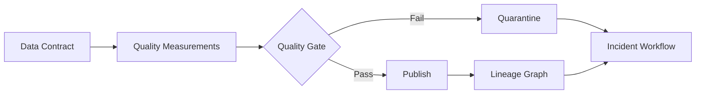



## El problema: el éxito de la canalización no es evidencia suficiente de datos saludables

Se puede publicar una tabla incorrecta incluso cuando un trabajo finaliza con el código de salida 0.

- Una fuente llega tarde, pero una partición vacía se trata con normalidad.
- Los duplicados de claves aumentan mientras el número de filas sigue siendo similar.
- Una unidad cambia y desplaza la distribución del valor.
- La mayoría de las filas se pierden porque faltan claves de unión.
- Sólo falta un segmento, lo que hace que el promedio general parezca normal.
- Se sigue publicando una instantánea obsoleta.
- Se detecta un error, pero nadie sabe qué cuadros de mando y modelos están afectados.

La calidad de los datos es más un problema de propiedad y contratos de respuesta que de adoptar una biblioteca de pruebas.

## Modelo mental: contrato, medición, impacto y respuesta

### Contrato de datos

Un esquema y nivel de servicio acordado entre productor y consumidor.

Debe incluir:

- Propósito y propietario del conjunto de datos.
- Claves y vetas.
- Tipos de campos y anulabilidad.
- Semántica de unidad, zona horaria y enumeración.
- Actualizar cadencia
- Objetivos de frescura y plenitud.
- Proceso de cambio radical
- Clasificación de retención y acceso.

### Medición de calidad

Evidencia calculada para determinar si una instantánea real cumple el contrato.

### Linaje

Muestra cómo las entradas, el código y la configuración conducen a resultados y consumidores.

### Respuesta

Incluye poner en cuarentena una instantánea fallida, conservar la instantánea anterior, análisis de impacto, notificación al propietario, recuperación y revisión posterior al incidente.

## Distinguir dimensiones de calidad

### Frescura

¿Los datos son tan recientes como el tiempo esperado?

Mirar solo `MAX(event_time)` puede perder marcas de tiempo futuras o retrasos en algunas fuentes.

Inspeccione tanto las marcas de agua por fuente como el tiempo de publicación.

### Integridad

¿Han llegado suficientes registros y campos esperados?

Utilice manifiestos de origen, cobertura de particiones y proporciones por segmento en lugar de un recuento absoluto de filas.

### Unicidad

¿Las claves contractuales son únicas?

Incluir claves compuestas y períodos de validez en la definición de grano.

### Validez

¿Los valores satisfacen tipos, rangos, enumeraciones, formatos y reglas comerciales?

Distinguir rangos físicamente posibles de rangos estadísticamente comunes.

### Consistencia

¿El conjunto de datos es internamente consistente y consistente con otras fuentes?

Consulta de conciliación de saldos, integridad referencial y transiciones de estado.

### Precisión

¿En qué medida coinciden los datos con la verdad del mundo real?

Cuando no existe una verdad sobre el terreno, son necesarios indicadores y auditorías de muestra; Las pruebas de restricciones simples no pueden demostrar la exactitud por completo.

## Flujo de trabajo: hacer de la calidad una puerta de implementación

### Paso 1. Escriba el grano del conjunto de datos en una oración

Ejemplo: `Each row represents one final aggregate for a UTC date and device ID.`

Sin un grano, las definiciones de duplicados y omisiones se vuelven inestables.

### Paso 2. Seleccionar elementos de datos críticos

No aplique el mismo nivel de prueba a todas las columnas.

Marque los campos utilizados para decisiones comerciales, regulación, características del modelo y liquidación.

Aplique SLO más estrictos y cambie la aprobación a campos críticos.

### Paso 3. Separar las restricciones duras de las expectativas blandas

Un error de restricción estricta bloquea la publicación.

- Duplicados de clave primaria
- Campos obligatorios nulos
- Valores de enumeración imposibles
- Violaciones de integridad referencial
- Fallos en el análisis de esquemas.

Las expectativas suaves advierten sobre derivas y anomalías.

- Tasa de cambio del recuento de filas
- Cambios en media y percentiles.
- Cambios en las proporciones de las categorías.
- Aumentos paulatinos del ratio nulo
- Tendencias de retraso en la fuente

Si se utiliza inmediatamente un umbral suave como puerta dura, la estacionalidad normal también se convierte en un incidente.

### Paso 4. Comparar las expectativas con una línea de base

Distinga umbrales fijos, líneas de base móviles y líneas de base estacionales.

Tenga en cuenta la posibilidad de que la ventana de referencia ya contenga anomalías.

Inspeccione también las distribuciones por segmento.

Los cambios de umbral también deben someterse a una revisión del código y conservar el historial.

### Paso 5. Vincular el resultado de la puerta a la instantánea

Un informe de calidad registra:

- Conjunto de datos e instantánea ID
- Instantánea de entrada ID
- Versión de regla
- Medidas y umbrales
- Referencias seguras a registros fallidos de muestra.
- Tiempo de ejecución y versión del motor.
- Estado de aprobación, advertencia o falla
- Aprobador o anulador actor

No copie registros confidenciales en registros.

### Paso 6. Conserve la versión buena anterior en caso de falla

Consulta la nueva instantánea en la puesta en escena.

Si falla, no cambie el puntero del consumidor.

Consérvelo en cuarentena y restrinja el acceso.

Para cada caso de uso, defina si la frescura degradada o la publicación de datos incorrectos es el riesgo menor.

### Paso 7. Construir un linaje a partir de evidencia de ejecución

Sólo el linaje dibujado manualmente en la documentación variará.

Recopile conjuntos de datos de entrada y salida, versiones y asignaciones de columnas de ejecuciones de trabajos.

Complemente las asignaciones complejas de origen a destino con explicaciones manuales.

Utilice el gráfico de linaje para encontrar consumidores intermedios durante un incidente.

### Paso 8. Incluya los comentarios de los consumidores en el contrato

Incluso cuando un productor considera válido un esquema, la semántica del consumidor puede fallar.

Cree pruebas de contrato impulsadas por el consumidor.

Antes de un cambio importante, verifique qué campos y consultas están en uso.

Proporcione un período de desuso y una guía de migración.

### Paso 9. Operar incidentes de calidad

Los criterios de gravedad de ejemplo incluyen:

- Ya se han utilizado resultados incorrectos para decisiones externas.
- Se ha detenido la publicación de un conjunto de datos críticos.
- Un campo no crítico se ha desviado
- Faltan metadatos de linaje

El proceso de incidente consta de detección, aislamiento, análisis de impacto, recuperación y prevención de recurrencia.

Realice un seguimiento de las correcciones de datos y de si se vuelven a calcular los consumidores.

### Paso 10. Haga de las anulaciones una característica controlada, no una excepción

Una advertencia puede ser aceptable por motivos comerciales.

Registre el motivo, el alcance, el tiempo de vencimiento, el aprobador y el trabajo de seguimiento de cada anulación.

Una configuración permanente `ignore` neutraliza el contrato.

## Ejemplo práctico: una tabla agregada diaria

### Contrato

- Grano: una fila por fecha y entidad ID
- Clave: `date`, `entity_id`
- Frescura: actualizada dentro de la ventana de publicación definida
- Integridad: incluye todas las particiones en el manifiesto de origen.
- Validez: los recuentos no son negativos
- Coherencia: los totales caen dentro de la tolerancia de conciliación de fuentes

### Etapas de puerta

1. Compare la huella digital del esquema.
2. Verifique la unicidad de la clave.
3. Verifique la proporción nula de campos obligatorios.
4. Compare la cobertura de la partición de origen.
5. Compare los recuentos de filas por segmento con la línea base.
6. Conciliar los totales.
7. Calcule la frescura en el momento del evento.
8. Vincule el informe de resultados a la instantánea ID.
9. Cambie el alias a la nueva instantánea solo al pasar.

### Respuesta fallida

Si un segmento tiene una integridad baja, no lo oculte con el promedio general.

Encuentre la fuente relevante y los consumidores intermedios en el linaje.

Mantenga la buena instantánea anterior al anunciar un incidente de frescura.

Vuelva a procesar la misma ventana de entrada después de que se recupere la fuente.

Registre el alcance para volver a calcular las cachés de los consumidores y las tablas derivadas.

## Métricas de observabilidad

### Estado de la tubería

- Ejecutar tasa de éxito
- Percentiles de duración
- Recuento de reintentos
- Saturación de recursos

### Estado de los datos

- Retraso de fuente
- Frescura de la publicación.
- Volumen de filas y bytes
- Relación duplicada
- Relación nula
- Relación no válida
- Distancia de distribución
- Error de conciliación

### Salud de la gobernanza

- Número de conjuntos de datos sin propietarios
- Número de conjuntos de datos sin versiones de contrato.
- Proporción de linaje faltante
- Número de anulaciones vencidas
- Cumplimiento de notificaciones de cambios importantes
- Tiempo de recuperación de incidentes de calidad

Separe los tres tipos en un solo tablero.

Debe ser posible que la tubería esté en verde mientras los datos estén en rojo.

## Lista de verificación de verificación

### Contrato

- [ ] ¿Están identificados el propietario y los consumidores del conjunto de datos?
- [] ¿Están claros el grano, las claves, las unidades y la zona horaria?
- [ ] ¿Están marcados los elementos de datos críticos?
- [] ¿Existen SLO de frescura e integridad?
- [ ] ¿Están definidos procesos de cambios importantes y de desaprobación?

### Cheques

- [ ] ¿Se distinguen las puertas duras de las advertencias?
- [ ] ¿Se verifican anomalías por segmento?
- [ ] ¿Se realiza un seguimiento de las versiones de umbral y de referencia?
- [ ] ¿Se distingue un error de prueba de un error de datos?
- [ ] ¿Los errores de muestra evitan exponer información confidencial?

### Publicación y recuperación

- [] ¿Se oculta una instantánea a los consumidores hasta después de la inspección?
- [] ¿Se puede conservar la instantánea buena anterior en caso de error?
- [ ] ¿Existen políticas de retención y acceso a cuarentena?
- [] ¿Las anulaciones caducan y son auditables?
- [ ] ¿Se realiza un seguimiento del alcance del nuevo cálculo posterior después de una corrección?

### Linaje y operaciones

- [ ] ¿Están conectadas las versiones de entrada, código y salida?
- [] ¿Se registran las transformaciones semánticas a nivel de columna cuando es necesario?
- [ ] ¿Se pueden encontrar en el gráfico a los consumidores afectados durante un incidente?
- [] ¿Las alertas de calidad están vinculadas a un propietario y un runbook?
- [ ] ¿Se revisan periódicamente los SLO de calidad?

## Fallos y limitaciones comunes

### Creando cientos de reglas para cada columna

La fatiga de alertas y los costos de mantenimiento aumentan.

Comience con campos críticos y modos de falla reales.

### Tratar la detección de anomalías como la respuesta a la calidad

Las señales de detección de anomalías cambian; no determina que ocurrió un error.

La estacionalidad, los cambios de productos y los nuevos segmentos pueden provocar cambios normales.

### Creer que un gráfico de linaje muestra todo el impacto

Parte del consumo, incluidas las descargas de archivos, las consultas temporales y las exportaciones externas, no se recopila.

Utilice también los registros de acceso y la confirmación del propietario.

### Asumir únicamente la actualización significa que los datos están actualizados

Incluso con una marca de tiempo reciente, la mayoría de los registros pueden ser antiguos.

Inspeccione distribuciones y marcas de agua por fuente.

### Usar anulaciones repetidamente

Las anulaciones repetidas indican un umbral incorrecto o un contrato de fuente roto.

## Referencias oficiales

- [Documentación de OpenLineage](https://openlineage.io/docs/)
- [Señales de telemetría abierta](https://opentelemetry.io/docs/concepts/signals/)
- [Documentación de Grandes Expectativas](https://docs.greatexpectations.io/)
- [Pruebas de datos dbt](https://docs.getdbt.com/docs/build/data-tests)
- [Documentación del Atlas de Apache](https://atlas.apache.org/)

## Conclusión

La calidad de los datos no es “pasar controles”, sino la capacidad operativa para mantener la semántica y los niveles de servicio prometidos a los consumidores.

Conecte contratos, mediciones por instantánea, linaje, puertas de publicación y respuesta a incidentes en un solo flujo.

La confianza en una plataforma de datos crece cuando las fallas no se ocultan y se realiza un seguimiento de su impacto y recuperación.
