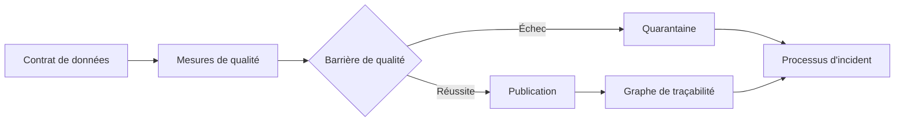



## Le problème : la réussite du pipeline ne suffit pas à prouver la bonne santé des données

Une table erronée peut être publiée même lorsqu'une tâche se termine avec le code de sortie 0.

- Une source est en retard, mais une partition vide est considérée comme normale.
- Les doublons de clés augmentent alors que le nombre de lignes reste similaire.
- Une unité change et déplace la distribution des valeurs.
- La plupart des lignes sont perdues faute de clés de jointure.
- Un seul segment manque, si bien que la moyenne globale semble normale.
- Un instantané périmé continue d'être servi.
- Une erreur est détectée, mais personne ne sait quels tableaux de bord et modèles sont touchés.

La qualité des données est davantage un problème de responsabilité et de contrats de réponse que d'adoption d'une bibliothèque de tests.

## Modèle mental : contrat, mesure, impact et réponse

### Contrat de données

Un schéma et un niveau de service convenus entre le producteur et le consommateur.

Il doit inclure :

- Finalité et responsable du jeu de données
- Clés et granularité
- Types des champs et possibilité de valeur nulle
- Unité, fuseau horaire et sémantique des énumérations
- Fréquence de mise à jour
- Objectifs de fraîcheur et d'exhaustivité
- Processus de changement incompatible
- Conservation et classification des accès

### Mesure de la qualité

Preuve calculée pour déterminer si un instantané réel respecte le contrat.

### Traçabilité

Elle montre comment les entrées, le code et la configuration produisent les sorties et alimentent les consommateurs.

### Réponse

Elle comprend la mise en quarantaine d'un instantané défaillant, la conservation de l'instantané précédent, l'analyse d'impact, la notification du responsable, la reprise et le bilan après incident.

## Distinguer les dimensions de la qualité

### Fraîcheur

Les données sont-elles aussi récentes que prévu ?

Consulter uniquement `MAX(event_time)` peut masquer des horodatages futurs ou des retards dans certaines sources.

Examinez à la fois les repères temporels de chaque source et l'heure de publication.

### Exhaustivité

Une quantité suffisante d'enregistrements et de champs attendus est-elle arrivée ?

Utilisez les manifestes des sources, la couverture des partitions et les ratios par segment plutôt qu'un nombre absolu de lignes.

### Unicité

Les clés contractuelles sont-elles uniques ?

Incluez les clés composites et les périodes de validité dans la définition de la granularité.

### Validité

Les valeurs respectent-elles les types, plages, énumérations, formats et règles métier ?

Distinguez les plages physiquement possibles des plages statistiquement courantes.

### Cohérence

Le jeu de données est-il cohérent en lui-même et avec les autres sources ?

Vérifiez le rapprochement des soldes, l'intégrité référentielle et les transitions d'état.

### Exactitude

Dans quelle mesure les données correspondent-elles à la réalité ?

Lorsqu'il n'existe pas de vérité de référence, des indicateurs indirects et des audits par échantillonnage sont nécessaires ; de simples tests de contraintes ne peuvent pas prouver entièrement l'exactitude.

## Processus : faire de la qualité une barrière de déploiement

### Étape 1. Décrire la granularité du jeu de données en une phrase

Exemple : `Chaque ligne représente un agrégat final pour une date UTC et un identifiant d'appareil.`

Sans granularité, les définitions des doublons et des omissions deviennent instables.

### Étape 2. Choisir les éléments de données critiques

N'appliquez pas le même niveau de contrôle à chaque colonne.

Identifiez les champs utilisés pour les décisions métier, la réglementation, les variables de modèles et le règlement.

Appliquez des SLO plus stricts et une approbation des changements aux champs critiques.

### Étape 3. Séparer les contraintes strictes des attentes souples

L'échec d'une contrainte stricte bloque la publication.

- Doublons de clé primaire
- Valeurs nulles dans les champs obligatoires
- Valeurs d'énumération impossibles
- Violations de l'intégrité référentielle
- Échecs d'analyse du schéma

Les attentes souples signalent les dérives et anomalies.

- Taux de variation du nombre de lignes
- Changements de moyenne et de centiles
- Déplacement des proportions de catégories
- Augmentation progressive du taux de valeurs nulles
- Tendances du retard des sources

Si un seuil souple est immédiatement employé comme barrière stricte, la saisonnalité normale devient elle aussi un incident.

### Étape 4. Comparer les attentes à une référence

Distinguez les seuils fixes, les références glissantes et les références saisonnières.

Tenez compte du fait que la fenêtre de référence peut déjà contenir des anomalies.

Examinez aussi les distributions par segment.

Les changements de seuil doivent également passer par une revue de code et conserver leur historique.

### Étape 5. Lier le résultat de la barrière à l'instantané

Un rapport de qualité consigne :

- L'identifiant du jeu de données et de l'instantané
- L'identifiant de l'instantané d'entrée
- La version des règles
- Les mesures et les seuils
- Des références sûres vers des exemples d'enregistrements défaillants
- La durée d'exécution et la version du moteur
- Le statut réussite, avertissement ou échec
- La personne ayant approuvé ou dérogé

Ne recopiez pas les enregistrements sensibles eux-mêmes dans les journaux.

### Étape 6. Conserver la dernière bonne version en cas d'échec

Contrôlez le nouvel instantané dans un environnement de préproduction.

S'il échoue, ne modifiez pas le pointeur utilisé par les consommateurs.

Conservez-le en quarantaine et limitez-en l'accès.

Pour chaque cas d'utilisation, déterminez quel risque est le moindre : une fraîcheur dégradée ou la publication de données erronées.

### Étape 7. Construire la traçabilité à partir des preuves d'exécution

Une traçabilité uniquement dessinée à la main dans la documentation finira par diverger de la réalité.

Collectez les jeux de données d'entrée et de sortie, leurs versions et les correspondances de colonnes lors de l'exécution des tâches.

Complétez les correspondances complexes entre sources et cibles par des explications manuelles.

Utilisez le graphe de traçabilité pour trouver les consommateurs en aval lors d'un incident.

### Étape 8. Intégrer les retours des consommateurs au contrat

Même lorsqu'un producteur juge le schéma valide, la sémantique des consommateurs peut être rompue.

Créez des tests de contrat pilotés par les consommateurs.

Avant un changement incompatible, vérifiez quels champs et quelles requêtes sont utilisés.

Prévoyez une période d'abandon progressif et un guide de migration.

### Étape 9. Gérer les incidents de qualité

Exemples de critères de gravité :

- Des résultats erronés ont déjà servi à des décisions externes
- La publication d'un jeu de données critique s'est arrêtée
- Un champ non critique a dérivé
- Les métadonnées de traçabilité sont absentes

Le processus d'incident comprend la détection, l'isolement, l'analyse d'impact, la reprise et la prévention de la récurrence.

Suivez les corrections apportées aux données et le recalcul éventuel chez les consommateurs.

### Étape 10. Faire des dérogations une fonctionnalité contrôlée, pas une exception

Un avertissement peut être acceptable pour des raisons métier.

Consignez le motif, la portée, l'heure d'expiration, la personne ayant approuvé et le travail de suivi pour chaque dérogation.

Un réglage permanent `ignore` neutralise le contrat.

## Exemple pratique : une table d'agrégats quotidiens

### Contrat

- Granularité : une ligne par date et par identifiant d'entité
- Clé : `date`, `entity_id`
- Fraîcheur : mise à jour dans la fenêtre de publication définie
- Exhaustivité : contient toutes les partitions du manifeste source
- Validité : les décomptes sont positifs ou nuls
- Cohérence : les totaux respectent la tolérance de rapprochement avec la source

### Étapes de la barrière

1. Comparer l'empreinte du schéma.
2. Vérifier l'unicité des clés.
3. Vérifier le taux de valeurs nulles dans les champs obligatoires.
4. Comparer la couverture des partitions sources.
5. Comparer à la référence le nombre de lignes par segment.
6. Rapprocher les totaux.
7. Calculer la fraîcheur de l'heure des événements.
8. Relier le rapport de résultats à l'identifiant de l'instantané.
9. Ne faire pointer l'alias vers le nouvel instantané qu'en cas de réussite.

### Réponse à l'échec

Si un segment présente une faible exhaustivité, ne la masquez pas dans la moyenne globale.

Retrouvez la source concernée et les consommateurs en aval dans la traçabilité.

Conservez le dernier bon instantané tout en signalant un incident de fraîcheur.

Retraitez la même fenêtre d'entrée une fois la source rétablie.

Consignez la portée du recalcul des caches des consommateurs et des tables dérivées.

## Métriques d'observabilité

### Santé du pipeline

- Taux de réussite des exécutions
- Centiles de durée
- Nombre de nouvelles tentatives
- Saturation des ressources

### Santé des données

- Retard des sources
- Fraîcheur de publication
- Volume en lignes et en octets
- Taux de doublons
- Taux de valeurs nulles
- Taux de valeurs invalides
- Distance entre distributions
- Erreur de rapprochement

### Santé de la gouvernance

- Nombre de jeux de données sans responsable
- Nombre de jeux de données sans version de contrat
- Taux de traçabilité manquante
- Nombre de dérogations expirées
- Respect des notifications de changement incompatible
- Durée de reprise après un incident de qualité

Séparez ces trois catégories sur un même tableau de bord.

Le pipeline doit pouvoir être au vert alors que les données sont au rouge.

## Liste de vérification

### Contrat

- [ ] Le responsable et les consommateurs du jeu de données sont-ils identifiés ?
- [ ] La granularité, les clés, les unités et le fuseau horaire sont-ils clairs ?
- [ ] Les éléments de données critiques sont-ils signalés ?
- [ ] Des SLO de fraîcheur et d'exhaustivité existent-ils ?
- [ ] Les processus de changement incompatible et d'abandon progressif sont-ils définis ?

### Contrôles

- [ ] Les barrières strictes sont-elles distinguées des avertissements ?
- [ ] Les anomalies sont-elles vérifiées par segment ?
- [ ] Les versions des seuils et des références sont-elles suivies ?
- [ ] Un échec du test est-il distingué d'un échec des données ?
- [ ] Les exemples d'erreurs évitent-ils d'exposer des informations sensibles ?

### Publication et reprise

- [ ] Un instantané reste-t-il caché aux consommateurs jusqu'à la fin des contrôles ?
- [ ] Le dernier bon instantané peut-il être conservé en cas d'échec ?
- [ ] Existe-t-il des politiques d'accès et de conservation pour la quarantaine ?
- [ ] Les dérogations expirent-elles et sont-elles auditables ?
- [ ] La portée du recalcul en aval est-elle suivie après une correction ?

### Traçabilité et exploitation

- [ ] Les versions des entrées, du code et des sorties sont-elles reliées ?
- [ ] Les transformations sémantiques au niveau des colonnes sont-elles consignées lorsque nécessaire ?
- [ ] Les consommateurs touchés peuvent-ils être trouvés dans le graphe lors d'un incident ?
- [ ] Les alertes de qualité sont-elles reliées à un responsable et à un guide d'exploitation ?
- [ ] Les SLO de qualité sont-ils réexaminés régulièrement ?

## Échecs fréquents et limites

### Créer des centaines de règles pour chaque colonne

La lassitude face aux alertes et les coûts de maintenance augmentent.

Commencez par les champs critiques et les modes de défaillance réels.

### Considérer la détection d'anomalies comme la solution à la qualité

La détection d'anomalies signale un changement ; elle ne détermine pas qu'une erreur s'est produite.

La saisonnalité, les changements de produit et les nouveaux segments peuvent provoquer des évolutions normales.

### Croire qu'un graphe de traçabilité montre tous les impacts

Certaines consommations, comme les téléchargements de fichiers, les requêtes temporaires et les exportations externes, ne sont pas collectées.

Utilisez également les journaux d'accès et la confirmation des responsables.

### Supposer que la seule fraîcheur signifie que les données sont à jour

Même avec un horodatage récent, la plupart des enregistrements peuvent être anciens.

Examinez les distributions et les repères temporels de chaque source.

### Recourir sans cesse aux dérogations

Des dérogations répétées signalent soit un mauvais seuil, soit un contrat de source rompu.

## Références officielles

- [OpenLineage Documentation](https://openlineage.io/docs/)
- [OpenTelemetry Signals](https://opentelemetry.io/docs/concepts/signals/)
- [Great Expectations Documentation](https://docs.greatexpectations.io/)
- [dbt Data Tests](https://docs.getdbt.com/docs/build/data-tests)
- [Apache Atlas Documentation](https://atlas.apache.org/)

## Conclusion

La qualité des données ne consiste pas à « réussir des contrôles », mais à disposer de la capacité opérationnelle de respecter la sémantique et les niveaux de service promis aux consommateurs.

Reliez les contrats, les mesures par instantané, la traçabilité, les barrières de publication et la réponse aux incidents dans un même flux.

La confiance dans une plateforme de données grandit lorsque les échecs ne sont pas cachés et que leur impact comme leur résolution sont suivis.
