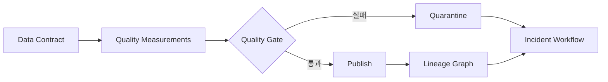



## 問題：pipelineの成功はデータ正常性の十分条件ではない

jobがexit code 0で終わっても、誤ったtableが公開されることがある。

- sourceが遅れたのに空partitionを正常として処理する。
- key重複が増えてもrow countは似ている。
- unit変更により値分布が移動する。
- join key欠損で大半のrowが脱落する。
- 特定segmentだけ欠落し全体平均は正常に見える。
- stale snapshotが提供され続ける。
- エラーを検知しても、影響するdashboardとmodelが分からない。

データ品質はtest library導入より、所有権と対応契約の問題である。

## Mental model：契約、測定、影響、対応

### データ契約

producerとconsumerが合意したschemaとservice levelである。

含める項目は次のとおり。

- datasetの目的とowner
- keyとgrain
- field typeとnullability
- unit、timezone、enumの意味
- update cadence
- freshnessとcompleteness目標
- breaking change手順
- retentionとaccess classification

### 品質測定

実際のsnapshotが契約を満たすか計算した証拠である。

### lineage

どのinput、code、configが、どのoutputとconsumerにつながったかを示す。

### 対応

失敗snapshotの隔離、既存snapshot維持、影響分析、owner通知、復旧、事後検討を含む。

## 品質次元を区別する

### Freshness

データは期待時刻と比べて十分新しいか。

`MAX(event_time)` だけでは未来timestampや一部sourceの遅延を見落とす。

source別watermarkとpublish timeを合わせて見る。

### Completeness

期待するrecordやfieldが十分到着したか。

絶対row countよりsource manifest、partition coverage、segment別比率を用いる。

### Uniqueness

契約上のkeyが一意か。

複合keyと有効期間もgrain定義へ含める。

### Validity

値がtype、range、enum、format、業務規則を満たすか。

物理的に可能な範囲と統計的に一般的な範囲を分ける。

### Consistency

dataset内または別sourceと矛盾しないか。

balance reconciliation、referential integrity、state transitionを検査する。

### Accuracy

現実世界の真値とどれだけ一致するか。

真値がなければproxyと標本監査が必要で、単純なconstraint testだけでは完全に証明できない。

## Workflow：品質をデプロイgateにする

### Step 1. dataset grainを一文で書く

例：`一rowはUTC日付とdevice IDごとの最終集計一件を表す。`

grainがなければ重複と欠落の定義が揺らぐ。

### Step 2. critical data elementを選ぶ

すべてのcolumnへ同じ水準のtestを適用しない。

業務意思決定、規制、model feature、精算に使うfieldを表示する。

critical fieldには厳格なSLOと変更承認を適用する。

### Step 3. hard constraintとsoft expectationを分ける

hard constraintの失敗はpublishを阻止する。

- primary key重複
- 必須field null
- 不可能なenum
- referential integrity違反
- schema parse失敗

soft expectationはdriftと異常を警告する。

- row count変化率
- 平均とpercentileの変化
- category比率の移動
- null比率の漸増
- source遅延傾向

soft thresholdを直ちにhard gateにすれば、正常な季節性も障害になる。

### Step 4. 期待値をbaselineと比較する

固定threshold、rolling baseline、季節baselineを区別する。

baseline windowへ既に異常が混入し得ることを考慮する。

segment別分布も同時に見る。

threshold変更にもcode reviewと履歴を残す。

### Step 5. gate結果をsnapshotへ結び付ける

quality reportには次を記録する。

- datasetとsnapshot ID
- input snapshot ID
- rule version
- 測定値とthreshold
- 標本失敗recordへの安全な参照
- 実行時刻とengine version
- pass、warn、fail状態
- 承認またはoverride主体

機密record自体をlogへコピーしない。

### Step 6. 失敗時は既存正常版を維持する

新snapshotをstagingで検査する。

failならconsumer pointerを変更しない。

quarantine位置へ保存しアクセスを制限する。

freshness低下と誤データ公開のどちらが低リスクか、use case別policyを置く。

### Step 7. lineageを実行証拠から作る

文書へ手描きしたlineageだけではdriftが生じる。

job実行からinput/output dataset、version、column mappingを収集する。

source-to-target mappingが複雑なら手動説明を補う。

lineage graphはincident時にdownstream consumerを探すために使う。

### Step 8. consumer feedbackを契約へ入れる

producerがschema validと判断してもconsumerの意味は壊れ得る。

consumer-driven contract testを置く。

breaking change前に使用中fieldとqueryを確認する。

deprecation期間とmigration guideを提供する。

### Step 9. 品質incidentを運用する

severity基準の例：

- 誤った結果がすでに外部意思決定へ使われた
- critical datasetのpublish停止
- noncritical field drift
- lineage metadata欠落

incident手順は検知、隔離、影響分析、復旧、再発防止で構成する。

data correctionとconsumer再計算の要否を追跡する。

### Step 10. overrideを例外でなく統制機能にする

業務上、警告を受容できる場合がある。

overrideには理由、scope、有効期限、承認者、後続作業を残す。

恒久的な `ignore` 設定は契約を無力化する。

## 実践例：日次集計table

### 契約

- grain：日付とentity ID当たり一row
- key：`date`、`entity_id`
- freshness：定めたpublish window内で更新
- completeness：source manifestの全partitionを反映
- validity：countは負ではない
- consistency：合計がsource reconciliation範囲内

### gate段階

1. schema fingerprintを比較する。
2. key uniquenessを検査する。
3. 必須fieldのnull比率を検査する。
4. source partition coverageを照合する。
5. segment別row countをbaselineと比較する。
6. 総量reconciliationを行う。
7. event-time freshnessを計算する。
8. 結果reportをsnapshot IDへ結ぶ。
9. pass時のみaliasを新snapshotへ切り替える。

### 失敗対応

特定segmentのcompletenessが低ければ、全体平均で覆い隠さない。

該当sourceとdownstream consumerをlineageで探す。

既存正常snapshotを維持しつつfreshness incidentを通知する。

source復旧後、同じinput windowを再処理する。

consumer cacheとderived tableの再計算範囲を記録する。

## 可観測性指標

### pipeline health

- run success rate
- duration percentile
- retry count
- resource saturation

### data health

- source delay
- publish freshness
- row and byte volume
- duplicate ratio
- null ratio
- invalid ratio
- distribution distance
- reconciliation error

### governance health

- ownerなしdataset数
- 契約versionなしdataset数
- lineage欠落率
- 期限切れoverride数
- breaking change通知遵守率
- quality incident復旧時間

三種類を同じdashboard内で区別する。

pipeline greenとdata redが同時に存在できなければならない。

## 検証Checklist

### 契約

- [ ] dataset ownerとconsumerが識別されている。
- [ ] grain、key、unit、timezoneが明確である。
- [ ] critical data elementが表示されている。
- [ ] freshnessとcompleteness SLOがある。
- [ ] breaking changeとdeprecation手順がある。

### 検査

- [ ] hard gateとwarningが区別されている。
- [ ] segment別異常を検査する。
- [ ] thresholdとbaseline versionを追跡する。
- [ ] test自体の失敗とdata失敗を区別する。
- [ ] sample errorが機密情報を露出しない。

### publishと復旧

- [ ] 検査前snapshotがconsumerに見えない。
- [ ] 失敗時に以前の正常snapshotを維持できる。
- [ ] quarantineのaccessとretention policyがある。
- [ ] overrideは期限付きで監査可能である。
- [ ] correction後のdownstream再計算範囲を追跡する。

### lineageと運用

- [ ] input、code、output versionがつながる。
- [ ] column-levelの意味変換を必要箇所へ記録する。
- [ ] incident影響consumerをgraphで探せる。
- [ ] 品質alertにownerとrunbookが接続される。
- [ ] 品質SLOを定期的に再検討する。

## よくある失敗と限界

### 全columnへ数百のruleを作る

alert fatigueと保守コストが大きくなる。

critical fieldと実際のfailure modeから始める。

### anomaly detectionを品質の正解と見なす

異常検知は変化の信号であり、誤りの判定ではない。

季節性、製品変更、新規segmentにより正常な変化も起こる。

### lineage graphがあれば影響を完全に把握できると信じる

file download、一時query、外部exportなど収集されない消費がある。

access logとowner確認を併用する。

### freshnessだけ守れば最新データだと考える

最近のtimestampが一件あっても大半のrecordは古い可能性がある。

分布とsource別watermarkを見る。

### overrideを繰り返す

反復overrideはthresholdが誤っている、またはsource契約が壊れた信号である。

## 公式参考資料

- [OpenLineage Documentation](https://openlineage.io/docs/)
- [OpenTelemetry Signals](https://opentelemetry.io/docs/concepts/signals/)
- [Great Expectations Documentation](https://docs.greatexpectations.io/)
- [dbt Data Tests](https://docs.getdbt.com/docs/build/data-tests)
- [Apache Atlas Documentation](https://atlas.apache.org/)

## まとめ

データ品質とは `検査通過` ではなく、consumerへ約束した意味とservice levelを守る運用能力である。

contract、snapshot別測定、lineage、publish gate、incident対応を一つのflowへつなげよう。

失敗を隠さず影響と復旧を追跡するとき、データプラットフォームの信頼が蓄積される。
