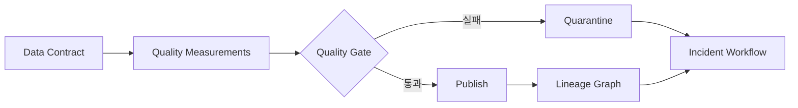



## 문제: pipeline 성공은 데이터 정상의 충분조건이 아니다

작업이 exit code 0으로 끝나도 잘못된 table이 공개될 수 있다.

- source가 늦어졌는데 빈 partition을 정상으로 처리한다.
- key 중복이 늘었지만 row count는 비슷하다.
- unit이 바뀌어 값 분포가 이동한다.
- join key 결측으로 대부분의 row가 탈락한다.
- 특정 segment만 누락되어 전체 평균은 정상처럼 보인다.
- stale snapshot이 계속 제공된다.
- 오류를 탐지했지만 어떤 dashboard와 model이 영향받는지 모른다.

데이터 품질은 test library 도입보다 소유권과 대응 계약의 문제다.

## Mental model: 계약, 측정, 영향, 대응

### 데이터 계약

producer와 consumer가 합의한 schema와 service level이다.

포함할 항목은 다음과 같다.

- dataset 목적과 owner
- key와 grain
- field type과 nullability
- unit, timezone, enum 의미
- update cadence
- freshness와 completeness 목표
- breaking change 절차
- retention과 access classification

### 품질 측정

실제 snapshot이 계약을 만족하는지 계산한 증거다.

### lineage

어떤 input, code, config가 어떤 output과 consumer로 이어졌는지 보여준다.

### 대응

실패 snapshot의 격리, 기존 snapshot 유지, 영향 분석, owner 통지, 복구와 사후 검토를 포함한다.

## 품질 차원을 구분한다

### Freshness

데이터가 기대 시각만큼 최근인가?

`MAX(event_time)` 하나만 보면 미래 timestamp나 일부 source 지연을 놓칠 수 있다.

source별 watermark와 publish time을 함께 본다.

### Completeness

예상한 record나 field가 충분히 도착했는가?

절대 row count보다 source manifest, partition coverage, segment별 비율을 활용한다.

### Uniqueness

계약상 key가 유일한가?

복합 key와 유효 기간까지 grain 정의에 포함한다.

### Validity

값이 type, range, enum, format, 업무 규칙을 만족하는가?

물리적으로 가능한 범위와 통계적으로 흔한 범위를 구분한다.

### Consistency

dataset 내부 또는 다른 source와 모순되지 않는가?

balance reconciliation, referential integrity, state transition을 검사한다.

### Accuracy

실제 세계의 참값과 얼마나 일치하는가?

참값이 없으면 proxy와 표본 감사가 필요하며 단순 constraint test로 완전히 증명할 수 없다.

## Workflow: 품질을 배포 gate로 만들기

### Step 1. dataset grain을 한 문장으로 쓴다

예: `한 row는 UTC 일자와 장치 ID별 최종 집계 하나를 나타낸다.`

grain이 없으면 중복과 누락의 정의가 흔들린다.

### Step 2. critical data element를 선별한다

모든 column에 같은 수준의 test를 적용하지 않는다.

업무 의사결정, 규제, model feature, 정산에 쓰이는 field를 표시한다.

critical field에는 더 엄격한 SLO와 변경 승인을 적용한다.

### Step 3. hard constraint와 soft expectation을 나눈다

hard constraint 실패는 publish를 차단한다.

- primary key 중복
- 필수 field null
- 불가능한 enum
- referential integrity 위반
- schema parse 실패

soft expectation은 drift와 이상을 경고한다.

- row count 변화율
- 평균과 percentile 변화
- category 비율 이동
- null 비율의 점진적 증가
- source 지연 추세

soft threshold를 곧바로 hard gate로 사용하면 정상 계절성도 장애가 된다.

### Step 4. 기대값을 baseline과 비교한다

고정 임계값, rolling baseline, 계절 baseline을 구분한다.

baseline window에 이미 이상이 섞일 수 있음을 고려한다.

segment별 분포를 같이 본다.

threshold 변경도 code review와 이력을 남긴다.

### Step 5. gate 결과를 snapshot과 묶는다

quality report에는 다음을 기록한다.

- dataset과 snapshot ID
- input snapshot ID
- rule version
- 측정값과 threshold
- 표본 실패 record의 안전한 참조
- 실행 시각과 engine version
- pass, warn, fail 상태
- 승인 또는 override 주체

민감 record 자체를 log에 복사하지 않는다.

### Step 6. 실패 시 기존 정상본을 유지한다

새 snapshot을 staging에서 검사한다.

fail이면 consumer pointer를 바꾸지 않는다.

quarantine 위치에 보존하고 접근을 제한한다.

freshness 저하와 잘못된 data 공개 중 어느 쪽이 덜 위험한지 use case별 정책을 둔다.

### Step 7. lineage를 실행 증거에서 만든다

문서에 손으로 그린 lineage만으로는 drift가 생긴다.

job 실행에서 input/output dataset, version, column mapping을 수집한다.

source-to-target mapping이 복잡하면 수동 설명을 보강한다.

lineage graph는 incident 시 downstream consumer를 찾는 데 사용한다.

### Step 8. consumer feedback을 계약에 넣는다

producer가 schema valid라고 판단해도 consumer 의미가 깨질 수 있다.

consumer-driven contract test를 둔다.

breaking change 전 사용 중인 field와 query를 확인한다.

deprecation 기간과 migration guide를 제공한다.

### Step 9. 품질 incident를 운영한다

severity 기준 예시는 다음과 같다.

- 잘못된 결과가 이미 외부 의사결정에 사용됨
- critical dataset publish 중단
- 비critical field drift
- lineage metadata 누락

incident 절차는 탐지, 격리, 영향 분석, 복구, 재발 방지로 구성한다.

data correction과 consumer 재계산 여부를 추적한다.

### Step 10. override를 예외가 아닌 통제된 기능으로 만든다

업무상 경고를 수용할 수 있다.

override에는 이유, 범위, 만료 시각, 승인자, 후속 작업을 남긴다.

영구적인 `ignore` 설정은 계약을 무력화한다.

## 실전 예제: 일간 집계 table

### 계약

- grain: 날짜와 entity ID당 한 row
- key: `date`, `entity_id`
- freshness: 정해진 publish window 안에 갱신
- completeness: source manifest의 모든 partition 반영
- validity: count는 음수가 아님
- consistency: 합계가 source reconciliation 범위 안

### gate 단계

1. schema fingerprint를 비교한다.
2. key uniqueness를 검사한다.
3. 필수 field null 비율을 검사한다.
4. source partition coverage를 대조한다.
5. segment별 row count를 baseline과 비교한다.
6. 총량 reconciliation을 수행한다.
7. event-time freshness를 계산한다.
8. 결과 report를 snapshot ID에 연결한다.
9. pass일 때만 alias를 새 snapshot으로 전환한다.

### 실패 대응

특정 segment의 completeness가 낮으면 전체 평균으로 덮지 않는다.

해당 source와 downstream consumer를 lineage에서 찾는다.

기존 정상 snapshot을 유지하되 freshness incident를 알린다.

source 복구 뒤 동일 input window를 재처리한다.

consumer cache와 derived table 재계산 범위를 기록한다.

## 관찰성 지표

### pipeline health

- run success rate
- duration percentile
- retry count
- resource saturation

### data health

- source delay
- publish freshness
- row and byte volume
- duplicate ratio
- null ratio
- invalid ratio
- distribution distance
- reconciliation error

### governance health

- owner 없는 dataset 수
- 계약 version 없는 dataset 수
- lineage 누락률
- 만료된 override 수
- breaking change 통지 준수율
- quality incident 복구 시간

세 종류를 한 dashboard에서 구분한다.

pipeline green과 data red가 동시에 가능해야 한다.

## 검증 Checklist

### 계약

- [ ] dataset owner와 consumer가 식별되어 있다.
- [ ] grain, key, unit, timezone이 명확하다.
- [ ] critical data element가 표시되어 있다.
- [ ] freshness와 completeness SLO가 있다.
- [ ] breaking change와 deprecation 절차가 있다.

### 검사

- [ ] hard gate와 warning이 구분되어 있다.
- [ ] segment별 이상을 검사한다.
- [ ] threshold와 baseline version을 추적한다.
- [ ] test 자체의 실패와 data 실패를 구분한다.
- [ ] sample error가 민감정보를 노출하지 않는다.

### publish와 복구

- [ ] 검사 전 snapshot이 consumer에 보이지 않는다.
- [ ] 실패 때 이전 정상 snapshot을 유지할 수 있다.
- [ ] quarantine 접근과 retention 정책이 있다.
- [ ] override는 만료되고 감사 가능하다.
- [ ] correction 뒤 downstream 재계산 범위를 추적한다.

### lineage와 운영

- [ ] input, code, output version이 연결된다.
- [ ] column-level 의미 변환을 필요한 곳에 기록한다.
- [ ] incident 영향 consumer를 graph로 찾을 수 있다.
- [ ] 품질 경보에 owner와 runbook이 연결된다.
- [ ] 품질 SLO를 정기적으로 재검토한다.

## 자주 겪는 실패와 한계

### 모든 column에 수백 개 rule을 만든다

경보 피로와 유지보수 비용이 커진다.

critical field와 실제 failure mode에서 시작한다.

### anomaly detection을 품질의 정답으로 본다

이상 탐지는 변화 신호이며 오류 판정이 아니다.

계절성, 제품 변경, 신규 segment로 정상 변화가 발생할 수 있다.

### lineage graph가 있으면 영향이 완전히 보인다고 믿는다

file download, 임시 query, 외부 export처럼 수집되지 않는 소비가 존재한다.

access log와 owner 확인을 함께 사용한다.

### freshness만 지키면 최신 데이터라고 생각한다

최근 timestamp 하나가 있어도 대부분 record가 오래되었을 수 있다.

분포와 source별 watermark를 본다.

### override를 반복 사용한다

반복 override는 threshold가 잘못되었거나 source 계약이 깨졌다는 신호다.

## 공식 참고자료

- [OpenLineage Documentation](https://openlineage.io/docs/)
- [OpenTelemetry Signals](https://opentelemetry.io/docs/concepts/signals/)
- [Great Expectations Documentation](https://docs.greatexpectations.io/)
- [dbt Data Tests](https://docs.getdbt.com/docs/build/data-tests)
- [Apache Atlas Documentation](https://atlas.apache.org/)

## 마무리

데이터 품질은 `검사 통과`가 아니라 소비자에게 약속한 의미와 서비스 수준을 지키는 운영 능력이다.

contract, snapshot별 측정, lineage, publish gate, incident 대응을 한 흐름으로 연결하자.

실패를 감추지 않고 영향과 복구를 추적할 때 데이터 플랫폼의 신뢰가 쌓인다.
