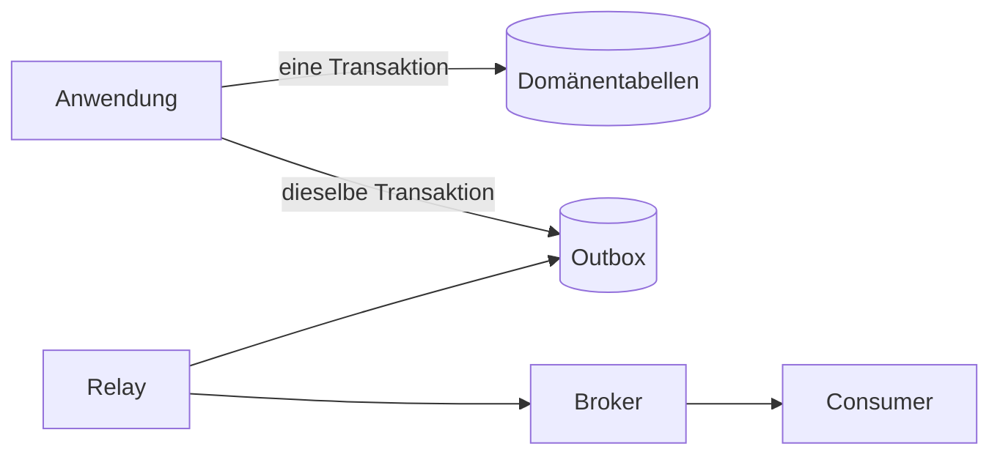



Die Zuverlässigkeit einer Datenbank sollte nicht danach beurteilt werden, ob „die Abfrage läuft“, sondern danach, **ob Invarianten unter Races, Wiederholungen und Teilausfällen erhalten bleiben**. Statt sich allein auf Vorprüfungen der Anwendung zu verlassen, werden Datenbankbedingungen und Transaktionen als letzte Verteidigungslinie eingesetzt.

## ACID anhand von Verhalten verstehen

- Atomarität: Mehrere Änderungen werden entweder sämtlich angewandt oder sämtlich zurückgerollt.
- Konsistenz: Ein committeter Zustand erfüllt Bedingungen und Invarianten.
- Isolation: Beeinflussung parallel ausgeführter Transaktionen bleibt innerhalb einer definierten Stufe.
- Dauerhaftigkeit: Ergebnisse bleiben erhalten, selbst wenn nach erfolgreichem Commit ein Fehler eintritt.

ACID garantiert nicht automatisch jede Geschäftsregel. Falsche Transaktionsgrenzen und fehlende Bedingungen können weiterhin einen ungültigen Zustand committen.

## Invarianten auch in der Datenbank ausdrücken

```sql
CREATE TABLE job (
    job_id          uuid PRIMARY KEY,
    owner_id        uuid NOT NULL,
    status          text NOT NULL,
    idempotency_key text NOT NULL,
    created_at      timestamptz NOT NULL,
    CONSTRAINT job_status_check
        CHECK (status IN ('queued', 'running', 'succeeded', 'failed')),
    CONSTRAINT job_owner_idempotency_unique
        UNIQUE (owner_id, idempotency_key)
);
```

`NOT NULL`, `UNIQUE`, `FOREIGN KEY` und `CHECK` gelten auch bei parallelen Anfragen. Werden Duplikate nur durch „zuerst SELECT, dann bei fehlender Zeile INSERT“ verhindert, können zwei Transaktionen die Prüfung gleichzeitig bestehen.

## Eine Isolationsstufe ist keine Leistungsoption, sondern eine Richtlinie für erlaubte Anomalien

Häufige Parallelitätsprobleme:

- Dirty Read: Lesen eines nicht committeten Wertes
- Non-repeatable Read: dieselbe Zeile in derselben Transaktion erneut lesen und einen geänderten Wert finden
- Phantom: dieselbe Abfragebedingung wiederholen und eine geänderte Zeilenmenge finden
- Lost Update: letzter Schreibvorgang überschreibt die Änderung einer anderen Transaktion, weil beide nichts voneinander wussten
- Write Skew: Transaktionen ändern verschiedene Zeilen und verletzen gemeinsam eine globale Invariante

Tatsächliche Implementierung und Garantien von Isolationsstufen unterscheiden sich je DBMS. Verhalten darf nicht allein aus dem Namen der Stufe abgeleitet werden; die Dokumentation der verwendeten Engine und Parallelitätstests sind erforderlich.

### Beispiel optimistischer Parallelitätskontrolle

```sql
UPDATE job
SET status = :new_status,
    version = version + 1
WHERE job_id = :job_id
  AND version = :expected_version;
```

Sind null Zeilen betroffen, hat entweder jemand das Ziel zuerst verändert oder es existiert nicht. Dies wird als normaler Konfliktzustand behandelt.

## Transaktionen kurz halten und von externer I/O trennen

Ein schlechter Ablauf hält eine Datenbanktransaktion offen, während er auf die Antwort einer externen API wartet. Dadurch bleibt die Sperre länger bestehen und ein externer Timeout kann zum Datenbankengpass werden.

```text
1. 입력 검증
2. 짧은 DB transaction에서 상태 변경
3. commit
4. 외부 작업 또는 비동기 발행
```

Tritt jedoch zwischen der Zustandsänderung in Schritt 2 und der Nachrichtenveröffentlichung in Schritt 4 ein Fehler auf, kann das Ereignis verloren gehen. Die transaktionale Outbox ist ein Standardverfahren zur Lösung dieses Problems.

## Transaktionale Outbox

Domänenzustand und zu veröffentlichendes Ereignis werden in derselben lokalen Transaktion gespeichert.



```sql
BEGIN;

UPDATE job
SET status = 'succeeded'
WHERE job_id = :job_id;

INSERT INTO outbox_event (
    event_id, aggregate_id, event_type, payload, created_at
) VALUES (
    :event_id, :job_id, 'job.succeeded', :payload, CURRENT_TIMESTAMP
);

COMMIT;
```

Das Relay liest noch nicht veröffentlichte Ereignisse, sendet sie an den Broker und erfasst ihren Status. Da dasselbe Ereignis nach einem Fehler erneut zugestellt werden kann, muss auch der Consumer es anhand von `event_id` idempotent verarbeiten. Die Outbox ist keine Exactly-once-Magie, sondern eine Kombination aus **atomarer Erfassung + erneuter Zustellung + duplikattoleranter Verarbeitung**.

## Indizes beschleunigen Lesevorgänge, sind aber nicht kostenlos

Reihenfolge des Indexentwurfs:

1. Tatsächlich langsame Abfragen und Ausführungspläne sammeln.
2. Filter-, Join- und Sortierbedingungen sowie Datenverteilung untersuchen.
3. Hochselektive führende Spalten und Sortieranforderungen erwägen.
4. Nach Hinzufügen eines Index Leselatenz, Schreibkosten und Größe gemeinsam messen.
5. Ungenutzte oder doppelte Indizes regelmäßig prüfen.

```sql
CREATE INDEX job_owner_created_idx
    ON job (owner_id, created_at DESC);
```

Dieser Index kann für Abfragen geeignet sein, die nach `owner_id` einschränken und Ergebnisse anschließend in absteigender Aktualität abrufen. Die Spaltenreihenfolge hängt jedoch vom Workload ab. Ein Index auf jeder Spalte erhöht Insert-/Update- und Speicherkosten.

## Abfrageleistung strukturell analysieren

- Zeilenanzahl und Selektivität
- warum Sequential Scan oder Index Scan gewählt wurde
- Join-Reihenfolge und -verfahren
- Unterschied zwischen geschätzten und tatsächlichen Zeilenzahlen
- Speicherverbrauch und Spills bei Sortierungen und Hashes
- Wartezeiten auf Sperren und Connection Pool
- N+1-Abfragen in der Anwendung

Nicht bei `EXPLAIN` stehen bleiben, sondern tatsächliche Ausführungsstatistiken und eine repräsentative Datenverteilung verwenden. Schnelle Ergebnisse in einer kleinen Entwicklungsdatenbank repräsentieren nicht den Produktionsmaßstab.

## Migrationen gemeinsam mit Code-Releases entwerfen

Änderungen ohne Ausfallzeit folgen gewöhnlich der Sequenz Expand–Migrate–Contract.

1. Neues Schema kompatibel mit dem vorigen Code ergänzen.
2. Neuen Code deployen, der beide Schemata sicher behandelt.
3. Bestehende Daten auffüllen und verifizieren.
4. Lesepfad umschalten und beobachten.
5. Nicht mehr verwendete Spalten und Code entfernen.

Mögliche Sperren und Rewrites großer Tabellen sind zu prüfen; Änderungen, die statt Rollback einen Forward Fix benötigen, werden gekennzeichnet.

## Prüfliste zur Verifikation

- [ ] Kerninvarianten sind auch als Datenbankbedingungen ausgedrückt.
- [ ] Transaktionsisolationsstufen und erlaubte Anomalien sind dokumentiert.
- [ ] Parallele Anfragen, Wiederholungen und Lost Updates werden getestet.
- [ ] Transaktionen warten nicht auf langsame externe I/O.
- [ ] Teilausfälle zwischen Zustandsänderung und Ereignisveröffentlichung werden behandelt.
- [ ] Consumer sind gegenüber doppelten Ereignissen idempotent.
- [ ] Indizes werden anhand tatsächlicher Abfragepläne und Produktionsmaßstab verifiziert.
- [ ] Migrationen sind mit voriger und neuer Anwendungsversion kompatibel.
- [ ] Wiederherstellungsverfahren, nicht nur Backups, werden regelmäßig geprüft.

## Häufige Fehler

- Auf Anwendungsvalidierung ohne Datenbankbedingungen vertrauen.
- Verhalten allein aus dem Namen einer Isolationsstufe ableiten.
- HTTP-Aufrufe oder lange Berechnungen bei offener Transaktion durchführen.
- Annehmen, eine einmal nach Datenbank-Commit gesendete Nachricht werde garantiert zugestellt.
- Glauben, mehr Indizes machten ein System stets schneller.
- Auswirkungen von Offset-Paginierung und Bulk-Updates auf Sperren und Konsistenz übersehen.

Die Entwurfsqualität einer zuverlässigen Datenschicht zeigt sich nicht im Normalablauf, sondern in Abläufen, die **parallel ausgeführt werden, auf halbem Weg stoppen und erneut zugestellt werden**.

## Referenzen

- [PostgreSQL — Transaktionen](https://www.postgresql.org/docs/current/tutorial-transactions.html)
- [PostgreSQL — Transaktionsisolation](https://www.postgresql.org/docs/current/transaction-iso.html)
- [Muster der transaktionalen Outbox](https://learn.microsoft.com/en-us/azure/architecture/databases/guide/transactional-out-box-cosmos)
