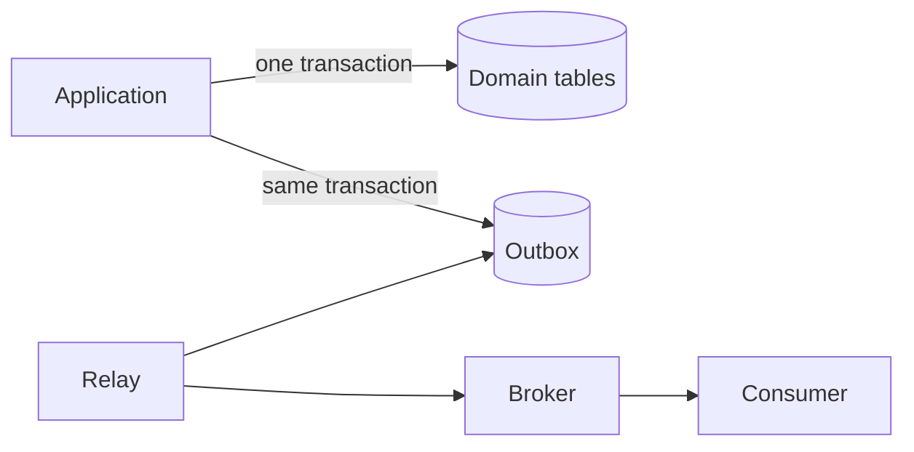



Database reliability should be judged not by whether “the query runs,” but by **whether invariants are preserved amid races, retries, and partial failures**. Do not rely solely on application-level prechecks; use database constraints and transactions as the final line of defense.

## Understanding ACID in Terms of Behavior

- Atomicity: Multiple changes are either all applied or all rolled back.
- Consistency: A committed state satisfies constraints and invariants.
- Isolation: Interference between concurrently executing transactions remains within a defined level.
- Durability: Results are preserved even if a failure occurs after a successful commit.

ACID does not automatically guarantee every business rule. Incorrect transaction boundaries and missing constraints can still commit an invalid state.

## Express Invariants in the Database as Well

```sql
CREATE TABLE job (
    job_id          uuid PRIMARY KEY,
    owner_id        uuid NOT NULL,
    status          text NOT NULL,
    idempotency_key text NOT NULL,
    created_at      timestamptz NOT NULL,
    CONSTRAINT job_status_check
        CHECK (status IN ('queued', 'running', 'succeeded', 'failed')),
    CONSTRAINT job_owner_idempotency_unique
        UNIQUE (owner_id, idempotency_key)
);
```

`NOT NULL`, `UNIQUE`, `FOREIGN KEY`, and `CHECK` apply even to concurrent requests. If duplicates are prevented only by “SELECT first, then INSERT if no row exists,” two transactions can pass the check at the same time.

## An Isolation Level Is Not a Performance Option but a Policy for Permitted Anomalies

Common concurrency problems include the following:

- dirty read: reading an uncommitted value
- non-repeatable read: reading the same row again within the same transaction and finding that its value has changed
- phantom: running the same query condition again and finding that the set of rows has changed
- lost update: the last write overwrites another transaction's modification because neither transaction was aware of the other
- write skew: transactions modify different rows and collectively violate a global invariant

The actual implementation and guarantees of isolation levels vary by DBMS. Do not infer behavior from the level's name alone; consult the documentation for the engine you use and write concurrency tests.

### Optimistic Concurrency Example

```sql
UPDATE job
SET status = :new_status,
    version = version + 1
WHERE job_id = :job_id
  AND version = :expected_version;
```

If zero rows are affected, either someone modified the target first or the target does not exist. Treat this as a normal conflict condition.

## Keep Transactions Short and Separate Them from External I/O

A bad flow keeps a database transaction open while waiting for an external API response. This prolongs lock-holding time and allows an external timeout to propagate into a database bottleneck.

```text
1. 입력 검증
2. 짧은 DB transaction에서 상태 변경
3. commit
4. 외부 작업 또는 비동기 발행
```

However, if a failure occurs between the state change in step 2 and the message publication in step 4, the event may be lost. The transactional outbox is a standard way to address this problem.

## Transactional Outbox

Store the domain state and the event to publish in the same local transaction.



```sql
BEGIN;

UPDATE job
SET status = 'succeeded'
WHERE job_id = :job_id;

INSERT INTO outbox_event (
    event_id, aggregate_id, event_type, payload, created_at
) VALUES (
    :event_id, :job_id, 'job.succeeded', :payload, CURRENT_TIMESTAMP
);

COMMIT;
```

The relay reads events that have not yet been published, sends them to the broker, and records their status. Because the same event may be delivered again after a failure, the consumer must also process it idempotently based on `event_id`. The Outbox is not exactly-once magic; it is a combination of **atomic recording + redelivery + duplicate-tolerant processing**.

## Indexes Accelerate Reads, but They Are Not Free

Index design sequence:

1. Collect actual slow queries and execution plans.
2. Examine filter, join, and ordering conditions and the data distribution.
3. Consider highly selective leading columns and ordering requirements.
4. After adding an index, measure read latency, write cost, and size together.
5. Regularly review unused or duplicate indexes.

```sql
CREATE INDEX job_owner_created_idx
    ON job (owner_id, created_at DESC);
```

This index may be suitable for queries that restrict by `owner_id` and then retrieve results in newest-first order. The column order, however, depends on the workload. Adding an index to every column increases insert/update and storage costs.

## Analyze Query Performance Structurally

- Row count and selectivity
- Why a sequential scan or index scan was chosen
- Join order and join method
- Difference between estimated and actual row counts
- Memory usage and spills for sorts and hashes
- Lock waits and connection pool waits
- N+1 queries in the application

Do not stop at `EXPLAIN`; use actual execution statistics and a representative data distribution. Fast results on a small development database do not represent production scale.

## Design Migrations Together with Code Releases

Zero-downtime changes generally follow the expand–migrate–contract sequence.

1. Add the new schema in a way that is compatible with the previous code.
2. Deploy new code that safely handles both schemas.
3. Backfill and verify existing data.
4. Switch the read path and observe it.
5. Remove columns and code that are no longer used.

Check the possibility of locking and rewrites on large tables, and identify changes that require a forward fix rather than a rollback.

## Verification Checklist

- [ ] Core invariants are also expressed as database constraints.
- [ ] Transaction isolation levels and permitted anomalies are documented.
- [ ] Concurrent requests, retries, and lost updates are tested.
- [ ] Transactions do not wait for slow external I/O.
- [ ] Partial failures between state changes and event publication are handled.
- [ ] Consumers are idempotent with respect to duplicate events.
- [ ] Indexes are verified against actual query plans and production scale.
- [ ] Migrations are compatible with both previous and new application versions.
- [ ] Restore procedures, not just backups, are verified regularly.

## Common Failures

- Relying on application validation without database constraints.
- Assuming behavior solely from the name of an isolation level.
- Making HTTP calls or performing long computations while holding a transaction open.
- Assuming that sending a message once after a database commit guarantees delivery.
- Believing that more indexes always make a system faster.
- Overlooking the effects of offset pagination and bulk updates on locks and consistency.

The design quality of a reliable data layer reveals itself not in the normal flow, but in flows that **execute concurrently, stop midway, and are delivered again**.

## References

- [PostgreSQL — Transactions](https://www.postgresql.org/docs/current/tutorial-transactions.html)
- [PostgreSQL — Transaction Isolation](https://www.postgresql.org/docs/current/transaction-iso.html)
- [Transactional Outbox pattern](https://learn.microsoft.com/en-us/azure/architecture/databases/guide/transactional-out-box-cosmos)
