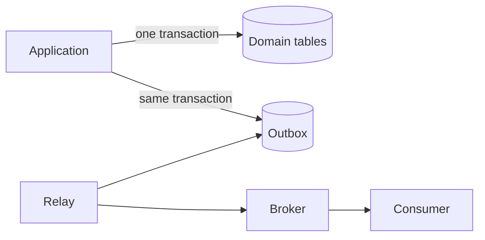



La confiabilidad de la base de datos no debe juzgarse por si "la consulta se ejecuta", sino por **si los invariantes se conservan en medio de carreras, reintentos y fallas parciales**. No confíe únicamente en las comprobaciones previas a nivel de aplicación; Utilice las restricciones y transacciones de la base de datos como última línea de defensa.

## Comprender ACID en términos de comportamiento

- Atomicidad: se aplican múltiples cambios o se revierten todos.
- Consistencia: Un estado comprometido satisface restricciones e invariantes.
- Aislamiento: la interferencia entre transacciones que se ejecutan simultáneamente permanece dentro de un nivel definido.
- Durabilidad: los resultados se conservan incluso si se produce un error después de una confirmación exitosa.

ACID no garantiza automáticamente todas las reglas comerciales. Los límites de transacción incorrectos y las restricciones faltantes aún pueden generar un estado no válido.

## Expresar invariantes también en la base de datos

```sql
CREATE TABLE job (
    job_id          uuid PRIMARY KEY,
    owner_id        uuid NOT NULL,
    status          text NOT NULL,
    idempotency_key text NOT NULL,
    created_at      timestamptz NOT NULL,
    CONSTRAINT job_status_check
        CHECK (status IN ('queued', 'running', 'succeeded', 'failed')),
    CONSTRAINT job_owner_idempotency_unique
        UNIQUE (owner_id, idempotency_key)
);
```

`NOT NULL`, `UNIQUE`, `FOREIGN KEY` y `CHECK` se aplican incluso a solicitudes simultáneas. Si solo se evitan duplicados con “SELECT primero, luego INSERT si no existe ninguna fila”, dos transacciones pueden pasar la verificación al mismo tiempo.

## Un nivel de aislamiento no es una opción de rendimiento sino una política para anomalías permitidas

Los problemas de concurrencia comunes incluyen los siguientes:

- lectura sucia: lectura de un valor no confirmado
- lectura no repetible: leer la misma fila nuevamente dentro de la misma transacción y encontrar que su valor ha cambiado
- fantasma: ejecutar la misma condición de consulta nuevamente y encontrar que el conjunto de filas ha cambiado
- actualización perdida: la última escritura sobrescribe la modificación de otra transacción porque ninguna transacción conocía a la otra
- escritura sesgada: las transacciones modifican diferentes filas y colectivamente violan un invariante global

La implementación real y las garantías de los niveles de aislamiento varían según DBMS. No infieras el comportamiento únicamente a partir del nombre del nivel; consulte la documentación del motor que utiliza y escriba pruebas de concurrencia.

### Ejemplo de simultaneidad optimista

```sql
UPDATE job
SET status = :new_status,
    version = version + 1
WHERE job_id = :job_id
  AND version = :expected_version;
```

Si no hay filas afectadas, alguien modificó el objetivo primero o el objetivo no existe. Trate esto como una condición de conflicto normal.

## Mantenga las transacciones breves y sepárelas de las externas I/O

Un flujo incorrecto mantiene abierta una transacción de base de datos mientras se espera una respuesta externa API. Esto prolonga el tiempo de retención del bloqueo y permite que un tiempo de espera externo se propague a un cuello de botella de la base de datos.

```text
1. 입력 검증
2. 짧은 DB transaction에서 상태 변경
3. commit
4. 외부 작업 또는 비동기 발행
```

Sin embargo, si se produce un error entre el cambio de estado en el paso 2 y la publicación del mensaje en el paso 4, es posible que se pierda el evento. La bandeja de salida transaccional es una forma estándar de abordar este problema.

## Bandeja de salida transaccional

Almacene el estado del dominio y el evento a publicar en la misma transacción local.



```sql
BEGIN;

UPDATE job
SET status = 'succeeded'
WHERE job_id = :job_id;

INSERT INTO outbox_event (
    event_id, aggregate_id, event_type, payload, created_at
) VALUES (
    :event_id, :job_id, 'job.succeeded', :payload, CURRENT_TIMESTAMP
);

COMMIT;
```

El relé lee eventos que aún no se han publicado, los envía al corredor y registra su estado. Debido a que el mismo evento puede entregarse nuevamente después de una falla, el consumidor también debe procesarlo de manera idempotente según `event_id`. La Bandeja de salida no es mágica exactamente una vez; es una combinación de **grabación atómica + reenvío + procesamiento tolerante a duplicados**.

## Los índices aceleran las lecturas, pero no son gratuitos

Secuencia de diseño del índice:

1. Recopile consultas lentas reales y planes de ejecución.
2. Examine las condiciones de filtrado, unión y ordenación y la distribución de datos.
3. Considere columnas iniciales y requisitos de pedido altamente selectivos.
4. Después de agregar un índice, mida la latencia de lectura, el costo de escritura y el tamaño juntos.
5. Revise periódicamente los índices no utilizados o duplicados.

```sql
CREATE INDEX job_owner_created_idx
    ON job (owner_id, created_at DESC);
```

Este índice puede ser adecuado para consultas que restringen `owner_id` y luego recuperan los resultados en el orden más reciente. Sin embargo, el orden de las columnas depende de la carga de trabajo. Agregar un índice a cada columna aumenta los costos de inserción/actualización y almacenamiento.

## Analizar el rendimiento de las consultas estructuralmente

- Recuento de filas y selectividad.
- Por qué se eligió un escaneo secuencial o un escaneo índice
- Orden de unión y método de unión.
- Diferencia entre el recuento de filas estimado y real
- Uso de memoria y derrames para tipos y hashes.
- Esperas de bloqueo y esperas de grupo de conexiones.
- Consultas N+1 en la aplicación.

No te detengas en `EXPLAIN`; Utilice estadísticas de ejecución reales y una distribución de datos representativa. Los resultados rápidos en una base de datos de desarrollo pequeña no representan una escala de producción.

## Diseñar migraciones junto con lanzamientos de código

Los cambios sin tiempo de inactividad generalmente siguen la secuencia expandir-migrar-contraer.

1. Agregue el nuevo esquema de manera que sea compatible con el código anterior.
2. Implemente código nuevo que maneje ambos esquemas de forma segura.
3. Rellene y verifique los datos existentes.
4. Cambie la ruta de lectura y obsérvela.
5. Elimine las columnas y el código que ya no se utilizan.

Verifique la posibilidad de bloquear y reescribir tablas grandes e identificar cambios que requieran una corrección directa en lugar de una reversión.

## Lista de verificación de verificación

- [] Las invariantes principales también se expresan como restricciones de la base de datos.
- [ ] Se documentan los niveles de aislamiento de transacciones y las anomalías permitidas.
- [] Se prueban solicitudes simultáneas, reintentos y actualizaciones perdidas.
- [ ] Las transacciones no esperan por I/O externo lento.
- [ ] Se manejan fallas parciales entre cambios de estado y publicación de eventos.
- [ ] Los consumidores son idempotentes respecto a eventos duplicados.
- [] Los índices se verifican con los planes de consulta reales y la escala de producción.
- [ ] Las migraciones son compatibles tanto con versiones anteriores como nuevas de la aplicación.
- [] Los procedimientos de restauración, no solo las copias de seguridad, se verifican periódicamente.

## Fallos comunes

- Confiar en la validación de la aplicación sin restricciones de base de datos.
- Asumir comportamiento únicamente a partir del nombre de un nivel de aislamiento.
- Realizar llamadas HTTP o realizar cálculos largos mientras se mantiene abierta una transacción.
- Suponiendo que enviar un mensaje una vez después de la confirmación de la base de datos garantiza la entrega.
- Creer que más índices siempre hacen que un sistema sea más rápido.
- Pasar por alto los efectos de la paginación desplazada y las actualizaciones masivas sobre los bloqueos y la coherencia.

La calidad del diseño de una capa de datos confiable se revela no en el flujo normal, sino en flujos que **se ejecutan simultáneamente, se detienen a mitad de camino y se entregan nuevamente**.

## Referencias

- [PostgreSQL — Transacciones](https://www.postgresql.org/docs/current/tutorial-transactions.html)
- [PostgreSQL — Aislamiento de transacciones](https://www.postgresql.org/docs/current/transaction-iso.html)
- [Patrón de bandeja de salida transaccional](https://learn.microsoft.com/en-us/azure/architecture/databases/guide/transactional-out-box-cosmos)
