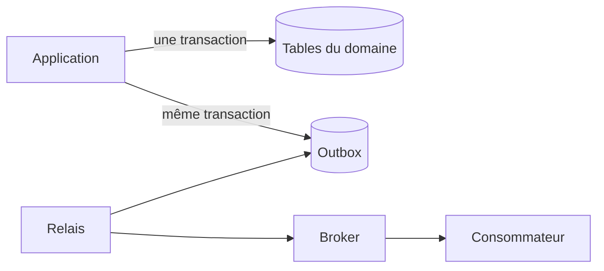



La fiabilité d’une base de données ne se juge pas au simple fait qu’« une requête s’exécute », mais à cette question : **les invariants sont-ils préservés malgré la concurrence, les nouvelles tentatives et les défaillances partielles ?** Il ne faut pas se fier uniquement aux contrôles préalables de l’application ; les contraintes de la base de données et les transactions doivent constituer la dernière ligne de défense.

## Comprendre ACID par ses effets

- Atomicity : plusieurs modifications sont soit toutes appliquées, soit toutes annulées.
- Consistency : l’état validé par un commit respecte les contraintes et les invariants.
- Isolation : les interférences entre transactions simultanées restent dans les limites définies.
- Durability : après un commit réussi, le résultat subsiste même en cas de panne.

ACID ne garantit pas automatiquement toutes les règles métier. Une mauvaise délimitation des transactions et l’absence d’une constraint peuvent toujours conduire à commit un état incorrect.

## Exprimer aussi les invariants dans la base de données

```sql
CREATE TABLE job (
    job_id          uuid PRIMARY KEY,
    owner_id        uuid NOT NULL,
    status          text NOT NULL,
    idempotency_key text NOT NULL,
    created_at      timestamptz NOT NULL,
    CONSTRAINT job_status_check
        CHECK (status IN ('queued', 'running', 'succeeded', 'failed')),
    CONSTRAINT job_owner_idempotency_unique
        UNIQUE (owner_id, idempotency_key)
);
```

`NOT NULL`, `UNIQUE`, `FOREIGN KEY` et `CHECK` s’appliquent aussi aux requêtes concurrentes. Si l’on tente d’éviter les doublons en faisant seulement « un SELECT préalable, puis un INSERT si rien n’existe », deux transactions peuvent franchir le contrôle en même temps.

## Le niveau d’isolation est une politique sur les anomalies admises, pas une simple option de performance

Les problèmes de concurrence courants sont les suivants.

- dirty read : lecture d’une valeur non commit
- non-repeatable read : dans une même transaction, une seconde lecture de la même ligne renvoie une valeur différente
- phantom : une seconde requête avec le même critère renvoie un ensemble de lignes différent
- lost update : le dernier write écrase le précédent parce que les transactions ignorent leurs modifications réciproques
- write skew : chaque transaction modifie une ligne différente et rompt ainsi un invariant global

L’implémentation et les garanties effectives des niveaux d’isolation varient selon les DBMS. Il ne faut pas les déduire de leur seul nom : consultez la documentation du moteur utilisé et écrivez des concurrency tests.

### Exemple d’optimistic concurrency

```sql
UPDATE job
SET status = :new_status,
    version = version + 1
WHERE job_id = :job_id
  AND version = :expected_version;
```

Si aucune ligne n’est affectée, quelqu’un a effectué la modification auparavant ou la cible n’existe pas. Ce résultat doit être traité comme un état de conflit normal.

## Garder les transactions courtes et les séparer des I/O externes

Un mauvais enchaînement consiste à attendre la réponse d’une API externe tout en maintenant une transaction DB ouverte. La durée de détention des locks augmente et le timeout externe se propage jusqu’à créer un goulot d’étranglement dans la DB.

```text
1. 입력 검증
2. 짧은 DB transaction에서 상태 변경
3. commit
4. 외부 작업 또는 비동기 발행
```

Une panne entre la modification d’état de l’étape 2 et la publication du message de l’étape 4 peut toutefois faire disparaître l’événement. Le transactional outbox est un moyen classique de traiter ce cas.

## Transactional Outbox

L’état du domaine et l’événement à publier sont enregistrés dans la même transaction locale.



```sql
BEGIN;

UPDATE job
SET status = 'succeeded'
WHERE job_id = :job_id;

INSERT INTO outbox_event (
    event_id, aggregate_id, event_type, payload, created_at
) VALUES (
    :event_id, :job_id, 'job.succeeded', :payload, CURRENT_TIMESTAMP
);

COMMIT;
```

Le relay lit les events non encore publiés, les envoie au broker, puis enregistre leur état. Une panne peut entraîner une nouvelle livraison du même event ; le consumer doit donc lui aussi assurer un traitement idempotent fondé sur `event_id`. L’Outbox n’est pas une garantie magique d’exactly-once, mais la combinaison d’un **enregistrement atomique, d’une nouvelle livraison et d’un traitement tolérant les doublons**.

## Un index accélère les lectures, mais il n’est pas gratuit

Ordre de conception des index :

1. Recueillir les query réellement lentes et leurs plans d’exécution.
2. Examiner les critères de filter, de join et d’order, ainsi que la distribution des données.
3. Tenir compte de la sélectivité de la leading column et des besoins de tri.
4. Après l’ajout, mesurer simultanément la read latency, le coût des writes et la taille.
5. Réexaminer régulièrement les index inutilisés ou redondants.

```sql
CREATE INDEX job_owner_created_idx
    ON job (owner_id, created_at DESC);
```

Cet index peut convenir à une query qui filtre sur `owner_id`, puis classe les résultats du plus récent au plus ancien. L’ordre des columns dépend toutefois du workload. Indexer toutes les columns renchérit les insert/update et le storage.

## Analyser structurellement les performances des query

- Nombre de rows et sélectivité
- Raisons du choix entre sequential scan et index scan
- Ordre et méthode des joins
- Écart entre le nombre de rows estimé et réel
- Utilisation de la memory et spill des sort/hash
- Attente des locks et du connection pool
- Query N+1 de l’application

Ne vous arrêtez pas à `EXPLAIN` : utilisez les statistiques d’exécution réelles et une distribution représentative des données. De bonnes performances sur une petite DB de développement ne sont pas représentatives de l’échelle de production.

## Concevoir la migration avec la release du code

Une modification sans interruption suit généralement la séquence expand–migrate–contract.

1. Ajouter le nouveau schema d’une manière compatible avec l’ancien code.
2. Déployer le nouveau code afin qu’il gère les deux versions en toute sécurité.
3. Effectuer le backfill des données existantes et les valider.
4. Basculer le read path et l’observer.
5. Supprimer les columns et le code qui ne sont plus utilisés.

Pour les grandes tables, vérifiez le risque de lock et de rewrite ; distinguez également les modifications qui exigent un forward-fix plutôt qu’un rollback.

## Checklist de vérification

- [ ] Les invariants essentiels sont aussi exprimés sous forme de DB constraints.
- [ ] Le niveau d’isolation des transactions et les anomalies admises sont documentés.
- [ ] Les requêtes concurrentes, les nouvelles tentatives et les lost updates sont testés.
- [ ] Aucun I/O externe lent n’est attendu au sein d’une transaction.
- [ ] Les défaillances partielles entre la modification de l’état et la publication d’un event sont traitées.
- [ ] Le consumer est idempotent face aux events en double.
- [ ] Les index sont validés avec les query plans réels et à l’échelle de production.
- [ ] La migration est compatible avec l’ancienne comme avec la nouvelle version de l’application.
- [ ] La procédure de restore, et pas seulement le backup, est vérifiée périodiquement.

## Échecs fréquents

- L’application comporte une validation, mais la DB n’impose aucune constraint.
- Le comportement est déduit du seul nom de l’isolation level.
- Un appel HTTP ou un long calcul est exécuté alors qu’une transaction reste ouverte.
- On suppose qu’un message envoyé une seule fois après le DB commit sera forcément livré.
- On croit que l’ajout d’index améliore toujours les performances.
- On néglige les effets de l’offset pagination et des update massifs sur les locks et la cohérence.

La qualité de conception d’une couche de données fiable se révèle moins dans le chemin nominal que dans les **flux qui s’exécutent simultanément, s’interrompent à mi-parcours et sont livrés à nouveau**.

## Références

- [PostgreSQL — Transactions](https://www.postgresql.org/docs/current/tutorial-transactions.html)
- [PostgreSQL — Transaction Isolation](https://www.postgresql.org/docs/current/transaction-iso.html)
- [Transactional Outbox pattern](https://learn.microsoft.com/en-us/azure/architecture/databases/guide/transactional-out-box-cosmos)
