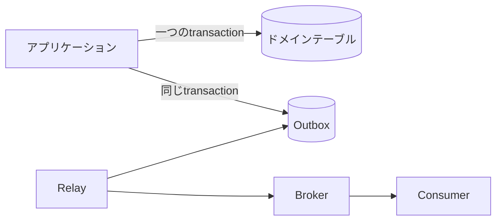



データベースの信頼性は「クエリが実行できるか」よりも、**競合、再試行、部分障害があっても不変条件が保たれるか**で判断する。アプリケーション側の事前検査だけに頼らず、データベースの制約とトランザクションを最後の防衛線として使う必要がある。

## ACIDを動作として理解する

- Atomicity：複数の変更がすべて反映されるか、すべて取り消される。
- Consistency：commitされた状態が制約と不変条件を満たす。
- Isolation：同時に実行されるtransaction同士の干渉が、定めた水準内に収まる。
- Durability：commit成功後に障害が発生しても結果が保持される。

ACIDがすべてのビジネスルールを自動的に保証するわけではない。誤ったtransaction境界や欠落したconstraintがあれば、不正な状態もそのままcommitされ得る。

## 不変条件をデータベースにも表現する

```sql
CREATE TABLE job (
    job_id          uuid PRIMARY KEY,
    owner_id        uuid NOT NULL,
    status          text NOT NULL,
    idempotency_key text NOT NULL,
    created_at      timestamptz NOT NULL,
    CONSTRAINT job_status_check
        CHECK (status IN ('queued', 'running', 'succeeded', 'failed')),
    CONSTRAINT job_owner_idempotency_unique
        UNIQUE (owner_id, idempotency_key)
);
```

`NOT NULL`、`UNIQUE`、`FOREIGN KEY`、`CHECK`は、同時リクエストに対しても適用される。「先にSELECTし、存在しなければINSERTする」という処理だけで重複を防ごうとすると、二つのtransactionが同時に検査を通過する可能性がある。

## 分離レベルは性能オプションではなく、許容する異常現象の方針である

並行処理でよく遭遇する問題には、次のものがある。

- dirty read：commitされていない値を読み取る
- non-repeatable read：同じtransaction内で同じ行を再び読んだとき、値が変わっている
- phantom：同じ条件で再検索したとき、行の集合が変わっている
- lost update：互いの変更を知らないまま、最後のwriteが先の変更を上書きする
- write skew：各transactionが別々の行を変更し、全体の不変条件を破る

分離レベルの実装と保証内容はDBMSごとに異なる。名称だけから挙動を推測せず、利用するエンジンの文書を確認し、concurrency testを書く。

### optimistic concurrencyの例

```sql
UPDATE job
SET status = :new_status,
    version = version + 1
WHERE job_id = :job_id
  AND version = :expected_version;
```

影響を受けた行が0件なら、誰かが先に変更したか、対象が存在しない。これを通常の競合状態として扱う。

## transactionは短くし、外部I/Oから分離する

悪い流れは、DB transactionを開いたまま外部APIの応答を待つことである。lockの保持時間が延び、外部のtimeoutがDBのボトルネックへ波及する。

```text
1. 입력 검증
2. 짧은 DB transaction에서 상태 변경
3. commit
4. 외부 작업 또는 비동기 발행
```

しかし、手順2の状態変更と手順4のメッセージ発行の間で障害が起きると、イベントが失われる可能性がある。これを扱う代表的な方法がtransactional outboxである。

## Transactional Outbox

ドメインの状態と発行予定のイベントを、同じローカルtransactionに保存する。



```sql
BEGIN;

UPDATE job
SET status = 'succeeded'
WHERE job_id = :job_id;

INSERT INTO outbox_event (
    event_id, aggregate_id, event_type, payload, created_at
) VALUES (
    :event_id, :job_id, 'job.succeeded', :payload, CURRENT_TIMESTAMP
);

COMMIT;
```

relayは未発行のeventを読み取り、brokerへ送ったうえで状態を記録する。障害時には同じeventが再配信される可能性があるため、consumer側も`event_id`を基準にidempotentに処理しなければならない。Outboxはexactly-onceを実現する魔法ではなく、**原子的な記録＋再配信＋重複を許容する処理**の組み合わせである。

## インデックスは読み取りを高速化するが、無料ではない

インデックス設計の手順：

1. 実際に遅いqueryと実行計画を収集する。
2. filter、join、order条件とデータ分布を見る。
3. 選択性の高い先頭columnと並べ替え要件を考慮する。
4. 追加後にread latency、writeコスト、サイズをまとめて測定する。
5. 使われていない、または重複するindexを定期的に見直す。

```sql
CREATE INDEX job_owner_created_idx
    ON job (owner_id, created_at DESC);
```

このindexは、`owner_id`で絞り込んでから新しい順に取得するqueryに適している可能性がある。ただし、columnの順序はworkloadによって変わる。すべてのcolumnにindexを付ければ、insert/updateとstorageのコストが増える。

## query性能を構造的に見る

- row数と選択性
- sequential scanとindex scanが選ばれた理由
- joinの順序と方式
- 推定row数と実際のrow数の差
- sort/hashのmemory使用量とspill
- lock waitとconnection pool wait
- アプリケーションのN+1 query

`EXPLAIN`を見るだけで終わらせず、実際の実行統計と代表的なデータ分布を使う。開発用の小さなDBで速いという結果は、本番規模を代表しない。

## migrationはコードリリースと一緒に設計する

無停止での変更は、通常expand–migrate–contractの順序に従う。

1. 新しいschemaを旧コードと互換性がある形で追加する。
2. 新しいコードをデプロイし、両方を安全に扱えるようにする。
3. 既存データをbackfillして検証する。
4. read pathを切り替えて観測する。
5. 使われなくなったcolumnとコードを削除する。

大きなtableでlockやrewriteが発生する可能性を確認し、rollbackではなくforward-fixが必要な変更も区別する。

## 検証チェックリスト

- [ ] 主要な不変条件がDB constraintとしても表現されている。
- [ ] transactionの分離レベルと許容する異常現象が文書化されている。
- [ ] 同時リクエスト、再試行、lost updateをテストする。
- [ ] transaction内で遅い外部I/Oを待たない。
- [ ] 状態変更とevent発行の間に起きる部分障害を扱う。
- [ ] consumerが重複eventに対してidempotentである。
- [ ] indexを実際のquery planと本番規模で検証する。
- [ ] migrationが旧・新両方のアプリケーション版と互換性を持つ。
- [ ] backupだけでなくrestore手順も定期的に検証する。

## よくある失敗

- application validationだけがあり、DB constraintがない。
- isolation levelの名称だけから挙動を断定する。
- transactionを開いたままHTTP呼び出しや長時間の計算を実行する。
- DB commit後にメッセージを一度送れば、必ず配信されると考える。
- indexは多いほど常に速いと考える。
- offset paginationや大量updateがlockと整合性へ及ぼす影響を見落とす。

信頼できるデータ層は、正常な流れよりも、**処理が同時に走り、途中で途切れ、再び配信される流れ**において設計品質が明らかになる。

## 参考資料

- [PostgreSQL — Transactions](https://www.postgresql.org/docs/current/tutorial-transactions.html)
- [PostgreSQL — Transaction Isolation](https://www.postgresql.org/docs/current/transaction-iso.html)
- [Transactional Outbox pattern](https://learn.microsoft.com/en-us/azure/architecture/databases/guide/transactional-out-box-cosmos)
