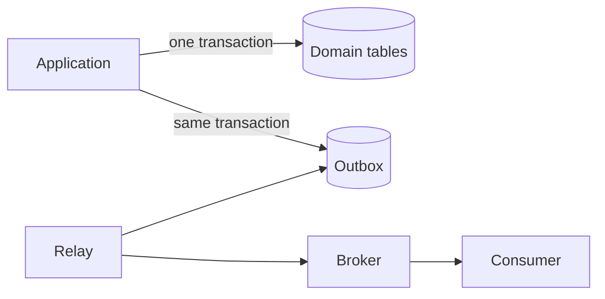

데이터베이스 신뢰성은 “쿼리가 실행된다”보다 **경쟁, 재시도, 부분 실패 속에서도 불변조건이 보존되는가**로 판단한다. 애플리케이션의 사전 검사만 믿지 말고 데이터베이스 제약과 트랜잭션을 최종 방어선으로 사용해야 한다.

## ACID를 동작으로 이해한다

- Atomicity: 여러 변경이 모두 반영되거나 모두 취소된다.
- Consistency: commit된 상태가 제약과 불변조건을 만족한다.
- Isolation: 동시에 실행되는 transaction의 간섭이 정한 수준 안에 있다.
- Durability: commit 성공 후 장애가 나도 결과가 보존된다.

ACID는 모든 비즈니스 규칙을 자동으로 보장하지 않는다. 잘못된 transaction 경계와 빠진 constraint는 그대로 잘못된 상태를 commit할 수 있다.

## 불변조건은 데이터베이스에도 표현한다

```sql
CREATE TABLE job (
    job_id          uuid PRIMARY KEY,
    owner_id        uuid NOT NULL,
    status          text NOT NULL,
    idempotency_key text NOT NULL,
    created_at      timestamptz NOT NULL,
    CONSTRAINT job_status_check
        CHECK (status IN ('queued', 'running', 'succeeded', 'failed')),
    CONSTRAINT job_owner_idempotency_unique
        UNIQUE (owner_id, idempotency_key)
);
```

`NOT NULL`, `UNIQUE`, `FOREIGN KEY`, `CHECK`는 동시 요청에서도 적용된다. “먼저 SELECT해서 없으면 INSERT”만으로 중복을 막으면 두 transaction이 동시에 통과할 수 있다.

## 격리 수준은 성능 옵션이 아니라 허용 이상 현상 정책이다

동시성에서 자주 만나는 문제는 다음과 같다.

- dirty read: commit되지 않은 값을 읽음
- non-repeatable read: 같은 transaction에서 같은 행을 다시 읽었더니 값이 달라짐
- phantom: 같은 조건을 다시 조회했더니 행 집합이 달라짐
- lost update: 서로의 수정을 모른 채 마지막 write가 덮어씀
- write skew: 각 transaction이 서로 다른 행을 바꿔 전체 불변조건을 깸

DBMS마다 격리 수준의 실제 구현과 보장이 다르다. 이름만 보고 추정하지 말고 사용하는 엔진의 문서를 확인하고 concurrency test를 작성한다.

### optimistic concurrency 예시

```sql
UPDATE job
SET status = :new_status,
    version = version + 1
WHERE job_id = :job_id
  AND version = :expected_version;
```

영향받은 행이 0개라면 누군가 먼저 수정했거나 대상이 없다. 이를 정상적인 충돌 상태로 처리한다.

## transaction은 짧고 외부 I/O와 분리한다

나쁜 흐름은 DB transaction을 연 채 외부 API 응답을 기다리는 것이다. lock 보유 시간이 길어지고 외부 timeout이 DB 병목으로 전파된다.

```text
1. 입력 검증
2. 짧은 DB transaction에서 상태 변경
3. commit
4. 외부 작업 또는 비동기 발행
```

하지만 2번의 상태 변경과 4번의 메시지 발행 사이에 장애가 나면 이벤트가 사라질 수 있다. 이를 다루는 대표 방법이 transactional outbox다.

## Transactional Outbox

도메인 상태와 발행할 이벤트를 같은 로컬 transaction에 저장한다.



```sql
BEGIN;

UPDATE job
SET status = 'succeeded'
WHERE job_id = :job_id;

INSERT INTO outbox_event (
    event_id, aggregate_id, event_type, payload, created_at
) VALUES (
    :event_id, :job_id, 'job.succeeded', :payload, CURRENT_TIMESTAMP
);

COMMIT;
```

relay는 아직 발행되지 않은 event를 읽어 broker에 보내고 상태를 기록한다. 장애 시 같은 event가 다시 전달될 수 있으므로 consumer도 `event_id`를 기준으로 idempotent하게 처리해야 한다. Outbox는 exactly-once 마법이 아니라 **원자적 기록 + 재전달 + 중복 허용 처리**의 조합이다.

## 인덱스는 읽기를 빠르게 하지만 공짜가 아니다

인덱스 설계 순서:

1. 실제 느린 query와 실행 계획을 수집한다.
2. filter, join, order 조건과 데이터 분포를 본다.
3. 선택도가 높은 선두 column과 정렬 요구를 고려한다.
4. 추가 후 read latency와 write 비용, 크기를 함께 측정한다.
5. 사용되지 않거나 중복된 index를 정기적으로 검토한다.

```sql
CREATE INDEX job_owner_created_idx
    ON job (owner_id, created_at DESC);
```

이 index는 `owner_id`로 제한한 뒤 최신순 조회하는 query에 적합할 수 있다. 그러나 column 순서는 workload에 따라 달라진다. 모든 column에 index를 붙이면 insert/update와 storage 비용이 커진다.

## query 성능을 구조적으로 본다

- row 수와 선택도
- sequential scan과 index scan 선택 이유
- join 순서와 join 방식
- 예상 row와 실제 row 차이
- sort/hash의 memory 사용과 spill
- lock wait와 connection pool wait
- 애플리케이션의 N+1 query

`EXPLAIN`만 보고 끝내지 말고 실제 실행 통계와 대표 데이터 분포를 사용한다. 개발용 작은 DB에서 빠르다는 결과는 운영 규모를 대표하지 않는다.

## migration은 코드 릴리스와 함께 설계한다

무중단 변화는 보통 expand–migrate–contract 순서를 따른다.

1. 새 schema를 이전 코드와 호환되게 추가한다.
2. 새 코드를 배포해 양쪽을 안전하게 다룬다.
3. 기존 데이터를 backfill하고 검증한다.
4. read path를 전환하고 관측한다.
5. 더 이상 사용하지 않는 column과 코드를 제거한다.

큰 table의 lock과 rewrite 가능성을 확인하고 rollback보다 forward-fix가 필요한 변화도 구분한다.

## 검증 체크리스트

- [ ] 핵심 불변조건이 DB constraint로도 표현되어 있다.
- [ ] transaction 격리 수준과 허용 이상 현상이 문서화되어 있다.
- [ ] 동시 요청·재시도·lost update를 테스트한다.
- [ ] transaction 안에서 느린 외부 I/O를 기다리지 않는다.
- [ ] 상태 변경과 event 발행 사이의 부분 실패를 다룬다.
- [ ] consumer는 중복 event에 idempotent하다.
- [ ] index는 실제 query plan과 운영 규모로 검증한다.
- [ ] migration이 이전·새 애플리케이션 버전과 호환된다.
- [ ] backup뿐 아니라 restore 절차를 주기적으로 검증한다.

## 흔한 실패

- application validation만 있고 DB constraint가 없다.
- isolation level 이름만 보고 동작을 단정한다.
- transaction을 연 채 HTTP 호출이나 긴 계산을 수행한다.
- DB commit 후 메시지를 한 번 보내면 반드시 전달된다고 가정한다.
- index를 많이 만들수록 항상 빠르다고 생각한다.
- offset pagination과 대량 update가 lock·일관성에 미치는 영향을 놓친다.

신뢰할 수 있는 데이터 계층은 정상 흐름보다 **동시에 실행되고 중간에 끊기며 다시 전달되는 흐름**에서 설계 품질이 드러난다.

## 참고 자료

- [PostgreSQL — Transactions](https://www.postgresql.org/docs/current/tutorial-transactions.html)
- [PostgreSQL — Transaction Isolation](https://www.postgresql.org/docs/current/transaction-iso.html)
- [Transactional Outbox pattern](https://learn.microsoft.com/en-us/azure/architecture/databases/guide/transactional-out-box-cosmos)
