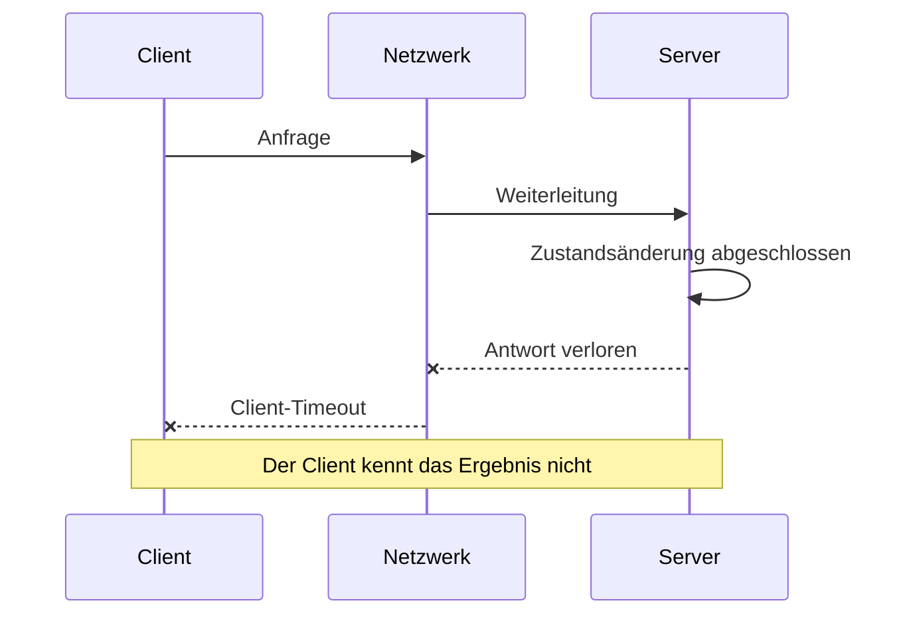



## Das Problem: Ein entfernter Aufruf hat mehr als zwei Ergebnisse

Ein Funktionsaufruf innerhalb eines Prozesses kehrt zurück oder löst eine Ausnahme aus. Über ein Netzwerk ist das Ergebnis uneindeutiger: Bei einem Client-Timeout hat der Server die Anfrage vielleicht nie empfangen, verarbeitet sie gerade oder bereits abgeschlossen, während nur die Antwort verloren ging.

Ein entfernter Aufruf kann deshalb `success`, `failure` oder `unknown outcome` ergeben. Wer diesen dritten Zustand ignoriert, erzeugt typische Fehler:

- Zahlungen oder Erstellungsanfragen werden durch Wiederholungen dupliziert.
- Eine langsame Abhängigkeit belegt sämtliche Threads und Verbindungen.
- Wiederholungen auf mehreren Ebenen verstärken das Verkehrsaufkommen exponentiell.
- Zeitabweichungen lassen ältere Ereignisse neuere überschreiben.
- Während einer Partition halten sich beide Seiten für den Leader.
- Das Verbergen von Fehlern verletzt Datenkonsistenz.

## Mentales Modell: Teilausfall und Nichtbeobachtbarkeit

### Fehler sehen für jede Komponente anders aus



Das Serverprotokoll kann Erfolg melden, während die Clientmetrik einen Timeout zeigt. Keine Beobachtung ist falsch; beide stammen lediglich von unterschiedlichen Orten im System.

### Es gibt mehr als eine Art von Zeit

- Eine Wanduhr liefert menschenlesbare Zeit und kann bei Korrekturen vor- oder zurückspringen.
- Eine monotone Uhr eignet sich zur Messung verstrichener Dauer.
- Eine logische Uhr repräsentiert die kausale Reihenfolge von Ereignissen.
- Eine Versionsnummer kann die Änderungsreihenfolge eines Aggregats darstellen.

Timeouts und Latenzen werden mit einer monotonen Uhr gemessen. Aus Wanduhr-Zeitstempeln verschiedener Knoten darf keine Kausalität abgeleitet werden.

### Konsistenz ist kein einzelner Schalter für das ganze System

Für jeden Lese- und Schreibvorgang gelten eigene Anforderungen.

- Ist Read-your-writes-Konsistenz erforderlich?
- Sind monotone Lesevorgänge nötig?
- Wie lange sind veraltete Daten tolerierbar?
- Müssen verlorene Aktualisierungen verhindert werden?
- Können doppelte Ereignisse ignoriert werden?
- Können Ereignisse außerhalb der Reihenfolge verarbeitet werden?

Zuerst werden fachliche Invarianten notiert, danach die passenden Konsistenzoptionen des Speichers gewählt.

### CAP ist keine vollständige Entwurfsaussage

Bei einer Netzwerkpartition wird die Wahl zwischen Verfügbarkeit und starker Konsistenz sichtbar. Ein realer Entwurf umfasst jedoch auch Latenz, Wiederherstellungszeit, Toleranz veralteter Daten, Clientsitzungen und Konfliktauflösung. Die Kürzel `AP` oder `CP` beschreiben das Verhalten einer API nicht ausreichend.

## Arbeitsablauf: Unsicherheit in einen Vertrag überführen

### Schritt 1. Fachliche Invarianten festlegen

Für eine Bestandsreservierung können etwa folgende Regeln gelten.

- Der verfügbare Bestand wird nie negativ.
- Eine Reservierung für dieselbe Bestellung wird nur einmal angewandt.
- Eine abgelaufene Reservierung wird wieder verfügbar.
- Ein altes Ereignis kann eine abgeschlossene Bestellung nicht auf „storniert“ zurücksetzen.

Invarianten überdauern die Wahl der Technologie.

### Schritt 2. Anfragen nach Operation klassifizieren

- Reiner Lesezugriff
- Von Natur aus idempotente Aktualisierung
- Bedingte Aktualisierung
- Erzeugung einer neuen Ressource
- Aufruf mit externer Nebenwirkung
- Start eines lang laufenden Ablaufs

Aus dieser Klassifikation wird abgeleitet, ob eine Wiederholung zulässig ist.

### Schritt 3. Deadline-Budget weitergeben

Beträgt die gesamte Client-Deadline 800 ms, darf nicht jeder nachgelagerte Aufruf unabhängig 800 ms erhalten. Warteschlange, Serialisierung, Netzwerk, Berechnung und Wiederholung müssen in das Budget passen; weitergegeben wird die verbleibende Deadline. Außerdem ist zu entscheiden, ob der Server Arbeit fortsetzt, die der Client bereits aufgegeben hat.

### Schritt 4. Wiederholungsrichtlinie in einer Ebene bündeln

Vor einer Wiederholung werden folgende Fragen geprüft.

- Ist der Fehler vorübergehend?
- Ist die Operation idempotent?
- Bleibt genug Zeit bis zur Deadline?
- Ist Wiederholungsbudget vorhanden?
- Erholt sich die Abhängigkeit?

Exponentielles Backoff und Jitter verteilen gleichzeitige Wiederholungen. Fehler werden in wiederholbar und dauerhaft klassifiziert.

### Schritt 5. Idempotenz als gespeicherten Vertrag behandeln

Der Client sendet einen Idempotenzschlüssel. Der Server speichert Schlüssel, Operationshash, Zustand und Ergebnisverweis atomar. Eine andere Nutzlast mit demselben Schlüssel wird abgelehnt. Läuft dieselbe Anfrage noch, wird ein abfragbarer Zustand zurückgegeben; nach Abschluss das frühere Ergebnis. Die Aufbewahrungszeit des Schlüssels muss länger als das mögliche Wiederholungsfenster sein.

### Schritt 6. Optimistische Nebenläufigkeitskontrolle verwenden

Die Ressource erhält eine Version; der Client macht seine Aktualisierung von der gelesenen Version abhängig.

```sql
UPDATE inventory
SET available = available - :qty,
    version = version + 1
WHERE item_id = :item_id
  AND version = :expected_version
  AND available >= :qty;
```

Werden null Zeilen geändert, liegt ein Konflikt oder unzureichende Verfügbarkeit vor. Statt bedingungslos zu wiederholen, wird der neueste Zustand gelesen und die fachliche Entscheidung erneut getroffen.

### Schritt 7. Ereignisse über synchrone Transaktionsgrenzen sicher ausgeben

Werden Datenbankänderung und Nachrichtenveröffentlichung getrennt ausgeführt, kann nur eine davon gelingen. Bei einem Transactional Outbox werden Geschäfts- und Outboxzeile in derselben lokalen Transaktion geschrieben. Der Publisher liest die Outbox, sendet die Nachricht und protokolliert den Zustellstatus. Idempotenz beim Consumer behandelt mögliche Mehrfachveröffentlichung.

### Schritt 8. Überlast als Fehlermodus behandeln

Eine unbegrenzte Warteschlange verschiebt den Ausfall nur. Nebenläufigkeitsgrenzen, begrenzte Warteschlangen, Zulassungssteuerung und Load Shedding schützen das System. Kritischer und Best-effort-Verkehr werden getrennt; Wiederholungen zählen zum Gesamtlastbudget.

### Schritt 9. Fehlerisolation verifizieren

Bulkheads trennen Threadpools, Verbindungspools, Warteschlangen und Mandantenressourcen. Ein Circuit Breaker löst nicht jedes Problem; seine Zustandsübergänge und die Last halboffener Prüfaufrufe müssen entworfen werden. Lasttests zeigen, ob die Latenz einer Abhängigkeit auf die gesamte API übergreift.

## Praktisches Beispiel: API zur duplikatsicheren Auftragserstellung

### Anfragevertrag

```http
POST /jobs HTTP/1.1
Idempotency-Key: 018f-example-key
Content-Type: application/json

{"input_ref":"object://example/input"}
```

### Serververarbeitung

1. Schlüssel an den authentifizierten Aufrufer binden.
2. Kanonischen Nutzlasthash berechnen.
3. Schlüsselzeile mit Unique Constraint einfügen.
4. Auftrag und Outbox in derselben Transaktion erzeugen.
5. Bei vorhandenem Schlüssel Nutzlasthashes vergleichen.
6. Bei Übereinstimmung gespeicherten Zustand und Ressourcen-URI zurückgeben.
7. Bei Abweichung Fehler zur Schlüsselwiederverwendung liefern.
8. Publisher sendet das Outboxereignis an die Warteschlange.
9. Consumer prüft den Verarbeitungsnachweis der Ereignis-ID.

### Zustandsautomat

- `accepted -> running`
- `running -> succeeded`
- `running -> failed`
- `accepted -> cancelled`
- Alte Ereignisse in einem Endzustand ablehnen

Zustandsänderungen sind vom erwarteten aktuellen Zustand oder der Version abhängig. So können ungeordnet eintreffende Ereignisse den Zustand nicht leicht zurücksetzen.

## Fehlertestszenarien

### Antwortverlust

Die Antwort unmittelbar nach dem Server-Commit blockieren und prüfen, dass eine Clientwiederholung dieselbe Ressource erhält.

### Abhängigkeitslatenz

Die Latenz eines nachgelagerten Dienstes schrittweise erhöhen und Deadline-Weitergabe sowie Load Shedding prüfen.

### Doppelte Nachrichten

Dasselbe Ereignis mehrfach zustellen und sicherstellen, dass weder Endzustand noch Zahl der Nebenwirkungen variieren.

### Umgekehrte Nachrichtenreihenfolge

Ein Startereignis nach dem Abschlussereignis zustellen und prüfen, dass Version oder Übergangsvalidierung die Umkehr verhindert.

### Zeitabweichung

Ereignisse mit abweichenden Zeitstempeln einspeisen und sicherstellen, dass Versionen und Geschäftsregeln statt Wanduhren entscheiden.

## Verifikationscheckliste

### Vertrag

- [ ] Der Zustand `unknown outcome` eines entfernten Aufrufs ist dokumentiert.
- [ ] Idempotenz und Wiederholbarkeit sind je Operation definiert.
- [ ] Timeouts werden aus der Gesamt-Deadline abgeleitet.
- [ ] Fehlercodes unterscheiden vorübergehende, dauerhafte und Konfliktfehler.
- [ ] Toleranz veralteter Leseergebnisse ist je Anwendungsfall festgelegt.

### Daten

- [ ] Fachliche Invarianten sind als automatisierte Tests formuliert.
- [ ] Ein Mechanismus verhindert verlorene Aktualisierungen.
- [ ] Ereignis-IDs und Aggregatversionen existieren.
- [ ] Duplikate und umgekehrte Reihenfolge werden behandelt.
- [ ] Outbox oder gleichwertiges Konsistenzmuster wurde erwogen.

### Zuverlässigkeit

- [ ] Wiederholungen besitzen Backoff, Jitter sowie Anzahl- und Zeitlimits.
- [ ] Wiederholungsstürme wurden unter Last getestet.
- [ ] Begrenzte Warteschlangen und eine Überlastrichtlinie existieren.
- [ ] Nebenläufigkeit ist nach Abhängigkeit isoliert.
- [ ] Fehlertests umfassen Partitionen und Latenz.
- [ ] Client- und serverseitige Telemetrie sind korreliert.

## Häufige Fehler und Grenzen

### Timeout mit Abbruch verwechseln

Ein Client-Timeout garantiert nicht, dass die serverseitige Arbeit beendet wurde. Abbruchprotokoll und serverseitige Deadline-Behandlung sind gesondert nötig.

### `exactly once` als fachliche Einmaligkeit interpretieren

Brokerinterne Garantien stellen nicht sicher, dass Nebenwirkungen in externen Datenbanken und APIs nur einmal auftreten. Ende-zu-Ende-Invarianten und Duplikatunterdrückung bleiben erforderlich.

### Jedes Problem mit einer globalen Sperre lösen

Damit entstehen eigene Verfügbarkeits-, Fencing-Token-, Lease-Ablauf- und Zeitprobleme des Sperrdienstes. Wenn möglich sind ressourcenspezifische Versionen und bedingte Schreibvorgänge vorzuziehen.

### Konsistenz bedingungslos maximieren

Starke Konsistenz kostet Latenz und Verfügbarkeit. Maßgeblich ist der von den fachlichen Invarianten benötigte Geltungsbereich.

### Glauben, Chaostests ersetzten die Entwurfsprüfung

Zufällige Fehler ohne bekannte Hypothese und Sicherheitsgrenzen werden zu Rauschen oder echten Vorfällen.

## Offizielle Referenzen

- [AWS Builders' Library: Timeouts, Retries, and Backoff with Jitter](https://aws.amazon.com/builders-library/timeouts-retries-and-backoff-with-jitter/)
- [Google SRE Book: Addressing Cascading Failures](https://sre.google/sre-book/addressing-cascading-failures/)
- [gRPC Deadlines](https://grpc.io/docs/guides/deadlines/)
- [HTTP Semantics: Idempotent Methods](https://www.rfc-editor.org/rfc/rfc9110.html#name-idempotent-methods)
- [Kubernetes Lease API](https://kubernetes.io/docs/concepts/architecture/leases/)

## Fazit

Das Kernproblem verteilter Systeme ist nicht die entfernte Maschine, sondern ein Ergebnis, das sich nicht immer sofort bestimmen lässt. Unsicherheit wird nicht verborgen, sondern durch Deadlines, Idempotenz, Versionen, Invarianten und Überlastrichtlinien ausgedrückt. Ein gutes System beseitigt Fehler nicht; es verhindert, dass Teilausfälle zu systemweiten Fehlern und Datenkorruption werden.
