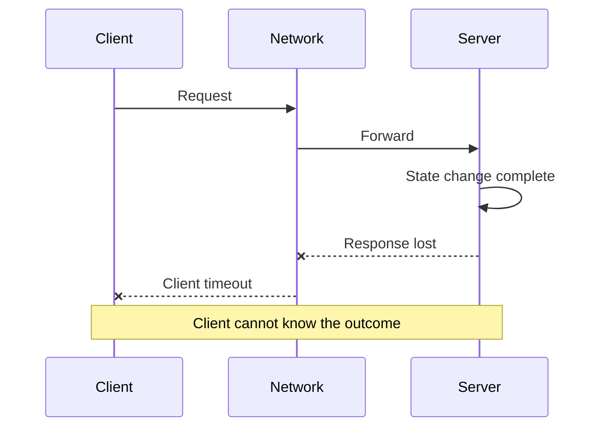



## The Problem: A Remote Call Has More Than Two Outcomes

A function call within one process either returns or throws an exception.

A call across a network is more ambiguous.

Even if the client sees a timeout, the server may not have received the request.

The server may be processing it.

Processing may have finished while only the response was lost.

Therefore, a remote call can result in `success`, `failure`, or `unknown outcome`.

Ignoring this third state causes the following problems.

- Payment or creation requests are duplicated by retries.
- A slow dependency occupies every thread and connection.
- Retries at multiple layers amplify traffic exponentially.
- Clock differences cause a newer event to be overwritten by an older one.
- During a partition, both sides consider themselves the leader.
- Attempts to conceal failures create data-consistency violations.

## Mental Model: Partial Failure and Unobservability

### Failure looks different to each component



The server log may record success while the client metric records a timeout.

Neither is false.

They observe the system from different locations.

### There is more than one kind of time

- A wall clock represents human-readable time and can move forward or backward during correction.
- A monotonic clock is suitable for measuring elapsed time.
- A logical clock represents the causal ordering of events.
- A version number can represent the order of changes to a specific aggregate.

Use a monotonic clock for timeout and latency measurements.

Do not infer causality solely from wall-clock timestamps on different nodes.

### Consistency is not a single switch for the entire system

Each read and write has different requirements.

- Is read-your-writes consistency required?
- Are monotonic reads required?
- How long can stale reads be tolerated?
- Must lost updates be prevented?
- Can duplicate events be ignored?
- Can out-of-order events be processed?

Write down business invariants first, then select the storage system's consistency options.

### CAP is not a complete design statement

When a network partition occurs, the choice between availability and strong consistency becomes visible.

But an actual design also includes latency, recovery time, stale-data tolerance, client sessions, and conflict merging.

The two letters `AP` or `CP` cannot describe an API's behavior.

## Workflow: Turn Uncertainty into a Contract

### Step 1. Declare business invariants

For an inventory reservation, for example, write the following.

- Available quantity never becomes negative.
- A reservation for the same order is applied only once.
- An expired reservation returns to the reusable quantity.
- An old event cannot return a completed order to the canceled state.

Invariants outlive technology choices.

### Step 2. Classify requests by operation

- Pure read
- Naturally idempotent update
- Conditional update
- New resource creation
- External side-effecting call
- Long-running workflow initiation

Determine whether retries are possible based on this classification.

### Step 3. Propagate the deadline budget

If the client's overall deadline is 800 ms, each downstream call cannot independently receive 800 ms.

Include queueing, serialization, network, compute, and retry time in the budget.

Pass the remaining deadline to downstream calls.

Also decide whether the server should keep performing work that the client has already abandoned.

### Step 4. Concentrate the retry policy in one layer

Review all of the following conditions for a retry.

- Is the error transient?
- Is the operation idempotent?
- Is enough time left before the deadline?
- Is retry budget left?
- Is the dependency recovering?

Spread simultaneous retries with exponential backoff and jitter.

Classify retryable and permanent errors.

### Step 5. Make idempotency a stored contract

The client sends an idempotency key.

The server atomically stores the key, operation hash, state, and result reference.

Reject a different payload that arrives with the same key.

If the identical request is still being processed, return a pollable state.

If it has completed, return the previous result.

The key retention period must be longer than the possible retry window.

### Step 6. Use optimistic concurrency

Give the resource a version.

The client makes the update conditional on the version it read.

```sql
UPDATE inventory
SET available = available - :qty,
    version = version + 1
WHERE item_id = :item_id
  AND version = :expected_version
  AND available >= :qty;
```

If zero rows are affected, the result is a conflict or insufficient availability.

Do not retry unconditionally; read the latest state and make the business decision again.

### Step 7. Safely emit events that cross a synchronous transaction boundary

If a database change and message publication are performed separately, only one of them may succeed.

With a transactional outbox, the business row and outbox row are written in the same local transaction.

The publisher reads the outbox, sends the message, and records delivery state.

Consumer idempotency handles possible duplicate publication.

### Step 8. Treat overload as a failure mode

An unbounded queue only delays failure.

Use concurrency limits, bounded queues, admission control, and load shedding.

Separate critical traffic from best-effort traffic.

Include retry traffic in the total load budget.

### Step 9. Verify fault isolation

Use bulkheads to divide thread pools, connection pools, queues, and tenant resources.

A circuit breaker is not the answer to every problem; its state transitions and half-open probe load must be designed.

Load-test whether latency in one dependency spreads to the entire API.

## Practical Example: A Duplicate-Safe Job Creation API

### Request contract

```http
POST /jobs HTTP/1.1
Idempotency-Key: 018f-example-key
Content-Type: application/json

{"input_ref":"object://example/input"}
```

### Server processing

1. Bind the key to the authenticated caller.
2. Compute a canonical payload hash.
3. Insert the key row with a unique constraint.
4. Create the job and outbox in the same transaction.
5. If the key already exists, compare payload hashes.
6. If they match, return the stored state and resource URI.
7. If they differ, return a key-reuse error.
8. The publisher sends the outbox event to the queue.
9. The consumer checks the event ID processing record.

### State machine

- `accepted -> running`
- `running -> succeeded`
- `running -> failed`
- `accepted -> cancelled`
- Reject old events in a terminal state

Make state changes conditional on the expected current state or version.

This reduces the chance that out-of-order events move state backward.

## Failure-Test Scenarios

### Response loss

Block the response immediately after the server commit.

Verify that a client retry returns the same resource.

### Dependency latency

Gradually increase the latency of a downstream service.

Verify that deadline propagation and load shedding work.

### Duplicate messages

Deliver the same event multiple times.

Verify that neither the final state nor the number of side effects changes.

### Reversed message order

Deliver a start event after the completion event.

Verify that version or state-transition validation prevents the reversal.

### Clock skew

Input events with misaligned timestamps.

Verify that decisions use versions and business rules rather than wall clocks.

## Verification Checklist

### Contract

- [ ] The `unknown outcome` state of a remote call is documented.
- [ ] Idempotency and retryability are defined for each operation.
- [ ] Timeouts are derived from the overall deadline.
- [ ] Error codes distinguish transient, permanent, and conflict errors.
- [ ] Stale-read tolerance is defined for each use case.

### Data

- [ ] Business invariants are expressed as automated tests.
- [ ] A mechanism prevents lost updates.
- [ ] Event IDs and aggregate versions exist.
- [ ] Duplicates and reversed ordering are handled.
- [ ] An outbox or an equivalent consistency pattern has been considered.

### Reliability

- [ ] Retries have backoff, jitter, and count and time limits.
- [ ] Retry storms have been load-tested.
- [ ] Bounded queues and an overload policy exist.
- [ ] Concurrency is isolated by dependency.
- [ ] Failure tests include partitions and latency.
- [ ] Client-side and server-side telemetry are correlated.

## Common Failures and Limitations

### Mistaking a timeout for cancellation

A client timeout does not guarantee that server-side work has stopped.

A cancellation protocol and server-side deadline handling are separately required.

### Interpreting `exactly once` as business-level exactly-once behavior

Broker-internal guarantees alone do not ensure that external database and API side effects occur only once.

End-to-end invariants and duplicate suppression are required.

### Solving every problem with a global lock

This introduces the lock service's own availability, fencing-token, lease-expiration, and clock problems.

Prefer per-resource versions and conditional writes when possible.

### Maximizing consistency unconditionally

Strong consistency has latency and availability costs.

Focus on the scope required by business invariants.

### Believing chaos tests replace design review

Random failures executed without known hypotheses and safety boundaries become noise or real incidents.

## Official References

- [AWS Builders' Library: Timeouts, Retries, and Backoff with Jitter](https://aws.amazon.com/builders-library/timeouts-retries-and-backoff-with-jitter/)
- [Google SRE Book: Addressing Cascading Failures](https://sre.google/sre-book/addressing-cascading-failures/)
- [gRPC Deadlines](https://grpc.io/docs/guides/deadlines/)
- [HTTP Semantics: Idempotent Methods](https://www.rfc-editor.org/rfc/rfc9110.html#name-idempotent-methods)
- [Kubernetes Lease API](https://kubernetes.io/docs/concepts/architecture/leases/)

## Conclusion

The central problem in distributed systems is not that a remote machine exists, but that an outcome cannot always be determined immediately.

Do not hide uncertainty; express it through deadlines, idempotency, versions, invariants, and overload policies.

A good system does not eliminate failure. It prevents partial failure from spreading into system-wide errors and data corruption.
