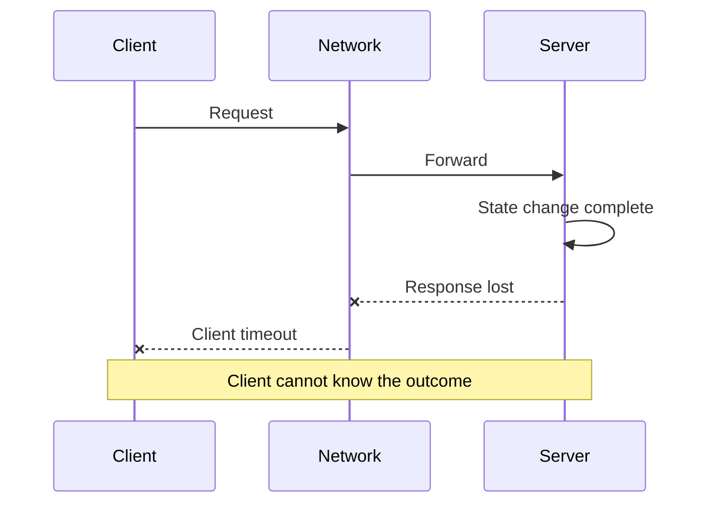



## El problema: una llamada remota tiene más de dos resultados

Una llamada a función dentro de un proceso devuelve o genera una excepción.

Una llamada a través de una red es más ambigua.

Incluso si el cliente ve un tiempo de espera, es posible que el servidor no haya recibido la solicitud.

Es posible que el servidor lo esté procesando.

Es posible que el procesamiento haya finalizado y solo se haya perdido la respuesta.

Por lo tanto, una llamada remota puede resultar en `success`, `failure` o `unknown outcome`.

Ignorar este tercer estado provoca los siguientes problemas.

- Las solicitudes de pago o creación se duplican mediante reintentos.
- Una dependencia lenta ocupa cada hilo y conexión.
- Los reintentos en múltiples capas amplifican el tráfico exponencialmente.
- Las diferencias de reloj hacen que un evento más nuevo se sobrescriba con uno más antiguo.
- Durante una partición, ambas partes se consideran líderes.
- Los intentos de ocultar fallas crean violaciones de la coherencia de los datos.

## Modelo mental: fracaso parcial e inobservabilidad

### La falla se ve diferente para cada componente



El registro del servidor puede registrar el éxito mientras que la métrica del cliente registra un tiempo de espera.

Ninguno de los dos es falso.

Observan el sistema desde diferentes lugares.

### Hay más de un tipo de tiempo.

- Un reloj de pared representa la hora legible por humanos y puede avanzar o retroceder durante la corrección.
- Un reloj monótono es adecuado para medir el tiempo transcurrido.
- Un reloj lógico representa el orden causal de los acontecimientos.
- Un número de versión puede representar el orden de los cambios en un agregado específico.

Utilice un reloj monótono para medir el tiempo de espera y la latencia.

No infiera la causalidad únicamente a partir de las marcas de tiempo del reloj de pared en diferentes nodos.

### La coherencia no es un único cambio para todo el sistema

Cada lectura y escritura tiene diferentes requisitos.

- ¿Se requiere coherencia en la lectura y escritura?
- ¿Se requieren lecturas monótonas?
- ¿Durante cuánto tiempo se pueden tolerar lecturas obsoletas?
- ¿Se deben evitar las actualizaciones perdidas?
- ¿Se pueden ignorar los eventos duplicados?
- ¿Se pueden procesar eventos fuera de orden?

Primero escriba las invariantes comerciales y luego seleccione las opciones de coherencia del sistema de almacenamiento.

### CAP no es una declaración de diseño completa

Cuando se produce una partición de red, se hace visible la elección entre disponibilidad y coherencia sólida.

Pero un diseño real también incluye latencia, tiempo de recuperación, tolerancia a datos obsoletos, sesiones de clientes y fusión de conflictos.

Las dos letras `AP` o `CP` no pueden describir el comportamiento de un API.

## Flujo de trabajo: convertir la incertidumbre en un contrato

### Paso 1. Declarar invariantes comerciales

Para una reserva de inventario, por ejemplo, escriba lo siguiente.

- La cantidad disponible nunca pasa a ser negativa.
- Una reserva para el mismo pedido se aplica una sola vez.
- Una reserva caducada vuelve a la cantidad reutilizable.
- Un evento antiguo no puede devolver un pedido completado al estado cancelado.

Las invariantes sobreviven a las elecciones tecnológicas.

### Paso 2. Clasificar solicitudes por operación

- lectura pura
- Actualización naturalmente idempotente
- Actualización condicional
- Creación de nuevos recursos.
- Llamada de efectos secundarios externos
- Inicio del flujo de trabajo de larga duración

Determine si es posible realizar reintentos según esta clasificación.

### Paso 3. Propagar el presupuesto de fecha límite

Si la fecha límite general del cliente es de 800 ms, cada llamada descendente no puede recibir 800 ms de forma independiente.

Incluya el tiempo de cola, serialización, red, computación y reintento en el presupuesto.

Pasar el plazo restante a las llamadas posteriores.

Decida también si el servidor debe seguir realizando el trabajo que el cliente ya abandonó.

### Paso 4. Concentrar la política de reintento en una capa

Revise todas las siguientes condiciones para volver a intentarlo.

- ¿El error es transitorio?
- ¿La operación es idempotente?
- ¿Queda suficiente tiempo antes de la fecha límite?
- ¿Queda presupuesto para reintentos?
- ¿Se está recuperando la dependencia?

Distribuya los reintentos simultáneos con jitter y retroceso exponencial.

Clasificar errores reintentables y permanentes.

### Paso 5. Hacer de la idempotencia un contrato almacenado

El cliente envía una clave de idempotencia.

El servidor almacena atómicamente la clave, el hash de operación, el estado y la referencia de resultados.

Rechace una carga útil diferente que llegue con la misma clave.

Si todavía se está procesando la solicitud idéntica, devuelva un estado sondeable.

Si se ha completado, devuelve el resultado anterior.

El período de retención de claves debe ser más largo que la posible ventana de reintento.

### Paso 6. Utilice concurrencia optimista

Dale al recurso una versión.

El cliente condiciona la actualización a la versión que lee.

```sql
UPDATE inventory
SET available = available - :qty,
    version = version + 1
WHERE item_id = :item_id
  AND version = :expected_version
  AND available >= :qty;
```

Si no hay filas afectadas, el resultado es un conflicto o disponibilidad insuficiente.

No lo vuelva a intentar incondicionalmente; lea el estado más reciente y tome la decisión comercial nuevamente.

### Paso 7. Emitir de forma segura eventos que crucen un límite de transacción sincrónica

Si un cambio de base de datos y una publicación de mensajes se realizan por separado, sólo uno de ellos puede tener éxito.

Con una bandeja de salida transaccional, la fila comercial y la fila de la bandeja de salida se escriben en la misma transacción local.

El editor lee la bandeja de salida, envía el mensaje y registra el estado de entrega.

La idempotencia del consumidor se ocupa de posibles publicaciones duplicadas.

### Paso 8. Trate la sobrecarga como un modo de falla

Una cola ilimitada sólo retrasa el fracaso.

Utilice límites de concurrencia, colas acotadas, control de admisión y deslastre de carga.

Separe el tráfico crítico del tráfico de mejor esfuerzo.

Incluya el tráfico de reintento en el presupuesto de carga total.

### Paso 9. Verificar el aislamiento de fallas

Utilice mamparos para dividir grupos de subprocesos, grupos de conexiones, colas y recursos de inquilinos.

Un disyuntor no es la respuesta a todos los problemas; Se deben diseñar sus transiciones de estado y la carga de la sonda semiabierta.

Pruebe con carga si la latencia en una dependencia se extiende a todo el API.

## Ejemplo práctico: creación de trabajos segura para duplicados API

### Solicitar contrato

```http
POST /jobs HTTP/1.1
Idempotency-Key: 018f-example-key
Content-Type: application/json

{"input_ref":"object://example/input"}
```

### Procesamiento del servidor

1. Vincule la clave a la persona que llama autenticada.
2. Calcule un hash de carga útil canónico.
3. Inserte la fila de claves con una restricción única.
4. Cree el trabajo y la bandeja de salida en la misma transacción.
5. Si la clave ya existe, compare los hash de carga útil.
6. Si coinciden, devuelve el estado almacenado y el recurso URI.
7. Si difieren, devolverá un error de reutilización de clave.
8. El editor envía el evento de la bandeja de salida a la cola.
9. El consumidor verifica el registro de procesamiento del evento ID.

### Máquina de estados

- `accepted -> running`
- `running -> succeeded`
- `running -> failed`
- `accepted -> cancelled`
- Rechazar eventos antiguos en estado terminal.

Haga que los cambios de estado estén condicionados al estado o versión actual esperado.

Esto reduce la posibilidad de que eventos desordenados hagan retroceder el estado.

## Escenarios de prueba de fallas

### Pérdida de respuesta

Bloquee la respuesta inmediatamente después de la confirmación del servidor.

Verifique que un reintento del cliente devuelva el mismo recurso.

### Latencia de dependencia

Aumente gradualmente la latencia de un servicio descendente.

Verifique que la propagación de la fecha límite y el deslastre de carga funcionen.

### Mensajes duplicados

Realiza el mismo evento varias veces.

Verificar que no cambie ni el estado final ni el número de efectos secundarios.

### Orden de mensajes invertido

Entregar un evento de inicio después del evento de finalización.

Verifique que la validación de versión o transición de estado impida la reversión.

### Desviación del reloj

Eventos de entrada con marcas de tiempo desalineadas.

Verifique que las decisiones utilicen versiones y reglas comerciales en lugar de relojes de pared.

## Lista de verificación de verificación

### Contrato

- [ ] Se documenta el estado `unknown outcome` de una llamada remota.
- [ ] Se definen idempotencia y reintento para cada operación.
- [ ] Los tiempos de espera se derivan del plazo general.
- [] Los códigos de error distinguen errores transitorios, permanentes y de conflicto.
- [] La tolerancia de lectura obsoleta se define para cada caso de uso.

### Datos

- [ ] Las invariantes comerciales se expresan como pruebas automatizadas.
- [ ] Un mecanismo evita la pérdida de actualizaciones.
- [ ] Existen ID de eventos y versiones agregadas.
- [ ] Se manejan duplicados y pedidos invertidos.
- [ ] Se ha considerado una bandeja de salida o un patrón de consistencia equivalente.

### Fiabilidad

- [] Los reintentos tienen límites de retroceso, fluctuación y conteo y tiempo.
- [] Se han probado las cargas de las tormentas de reintento.
- [ ] Existen colas limitadas y una política de sobrecarga.
- [] La concurrencia está aislada por dependencia.
- [] Las pruebas de falla incluyen particiones y latencia.
- [] La telemetría del lado del cliente y del lado del servidor están correlacionadas.

## Fallos y limitaciones comunes

### Confundir un tiempo de espera con cancelación

Un tiempo de espera de cliente no garantiza que el trabajo del lado del servidor se haya detenido.

Se requieren por separado un protocolo de cancelación y un manejo de la fecha límite del lado del servidor.

### Interpretación de `exactly once` como comportamiento exactamente una vez a nivel empresarial

Las garantías internas del corredor por sí solas no garantizan que los efectos secundarios de la base de datos externa y API ocurran solo una vez.

Se requieren invariantes de un extremo a otro y supresión de duplicados.

### Resolviendo todos los problemas con un bloqueo global

Esto introduce la propia disponibilidad del servicio de bloqueo, el token de cercado, el vencimiento del arrendamiento y los problemas de reloj.

Prefiera versiones por recurso y escrituras condicionales cuando sea posible.

### Maximizar la coherencia incondicionalmente

Una coherencia fuerte tiene costos de latencia y disponibilidad.

Centrarse en el alcance requerido por las invariantes comerciales.

### Creer que las pruebas del caos reemplazan la revisión del diseño

Los fallos aleatorios ejecutados sin hipótesis conocidas ni límites de seguridad se convierten en ruido o incidentes reales.

## Referencias oficiales

- [Biblioteca de constructores AWS: tiempos de espera, reintentos y retrocesos con fluctuación](https://aws.amazon.com/builders-library/timeouts-retries-and-backoff-with-jitter/)
- [Libro de Google SRE: Cómo abordar fallas en cascada](https://sre.google/sre-book/addressing-cascading-failures/)
- [Plazos límite de gRPC](https://grpc.io/docs/guides/deadlines/)
- [Semántica HTTP: Métodos idempotentes](https://www.rfc-editor.org/rfc/rfc9110.html#name-idempotent-methods)
- [Kubernetes Arrendamiento API](https://kubernetes.io/docs/concepts/architecture/leases/)

## Conclusión

El problema central de los sistemas distribuidos no es que exista una máquina remota, sino que no siempre se puede determinar inmediatamente un resultado.

No ocultes la incertidumbre; expresarlo a través de plazos, idempotencia, versiones, invariantes y políticas de sobrecarga.

Un buen sistema no elimina el fracaso. Evita que las fallas parciales se propaguen a errores en todo el sistema y corrupción de datos.
