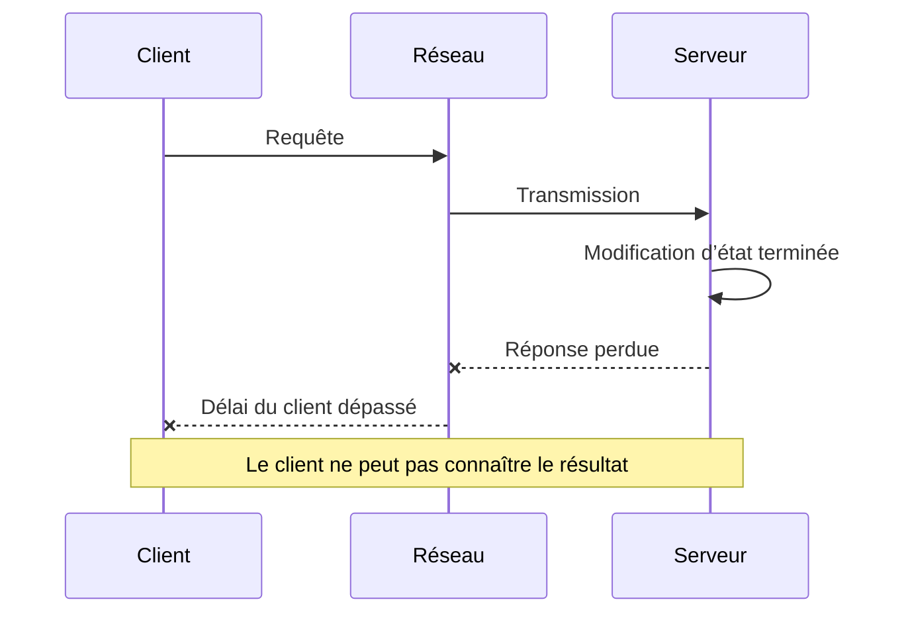



## Le problème : un appel distant ne se résume pas à la réussite ou à l’échec

Un appel de fonction au sein d’un même processus renvoie une valeur ou lève une exception.

Un appel qui traverse le réseau est plus ambigu.

Même si le client constate un dépassement de délai, il est possible que le serveur n’ait pas reçu la requête.

Il est aussi possible que le serveur soit en train de la traiter.

Le traitement peut être terminé alors que seule la réponse s’est perdue.

Un appel distant peut donc aboutir à une `réussite`, un `échec` ou un `résultat inconnu`.

Ignorer ce troisième état provoque les problèmes suivants.

- Les nouvelles tentatives dupliquent des demandes de paiement ou de création.
- Une dépendance lente monopolise tous les fils d’exécution et toutes les connexions.
- Les nouvelles tentatives effectuées à plusieurs couches amplifient le trafic de manière exponentielle.
- Les écarts entre horloges font qu’un événement récent est écrasé par un événement plus ancien.
- Pendant une partition, chaque côté se considère comme le dirigeant.
- Vouloir masquer les défaillances entraîne des violations de cohérence des données.

## Modèle mental : défaillance partielle et impossibilité d’observer

### Chaque composant perçoit la défaillance différemment



Le journal du serveur peut indiquer une réussite tandis que la métrique du client indique un dépassement de délai.

Ni l’un ni l’autre ne ment.

Ils observent le système depuis des emplacements différents.

### Il existe plusieurs sortes de temps

- L’horloge murale représente un temps lisible par les humains et peut avancer ou reculer lors d’une correction.
- Une horloge monotone convient à la mesure du temps écoulé.
- Une horloge logique représente l’ordre causal des événements.
- Un numéro de version peut représenter l’ordre des modifications d’un agrégat donné.

Utilisez une horloge monotone pour mesurer les délais d’attente et la latence.

Ne déduisez pas de relation causale à partir des seuls horodatages d’horloges murales de nœuds différents.

### La cohérence n’est pas un interrupteur unique pour tout le système

Chaque lecture et chaque écriture ont des exigences différentes.

- Faut-il pouvoir relire ses propres écritures ?
- Les lectures doivent-elles être monotones ?
- Pendant combien de temps une lecture obsolète est-elle acceptable ?
- Faut-il empêcher les mises à jour perdues ?
- Peut-on ignorer les événements dupliqués ?
- Peut-on traiter des événements arrivés dans le désordre ?

Commencez par consigner les invariants métier, puis choisissez les options de cohérence du système de stockage.

### Le théorème CAP n’est pas une spécification complète

Lorsqu’une partition réseau se produit, le choix entre disponibilité et cohérence forte devient manifeste.

Mais une conception réelle englobe aussi la latence, le temps de reprise, la tolérance aux données obsolètes, les sessions client et la fusion des conflits.

Les deux lettres `AP` ou `CP` ne suffisent pas à décrire le comportement d’une API.

## Méthode : transformer l’incertitude en contrat

### Étape 1. Déclarer les invariants métier

Pour une réservation de stock, on peut par exemple écrire ceci.

- La quantité disponible ne devient jamais négative.
- La réservation d’une même commande n’est appliquée qu’une fois.
- Une réservation expirée réintègre la quantité réutilisable.
- Un événement ancien ne peut pas ramener une commande terminée à l’état annulé.

Les invariants survivent aux choix technologiques.

### Étape 2. Classer les requêtes par opération

- Lecture pure
- Mise à jour naturellement idempotente
- Mise à jour conditionnelle
- Création d’une nouvelle ressource
- Appel externe produisant des effets de bord
- Démarrage d’un processus de longue durée

Déterminez à partir de cette classification si une nouvelle tentative est possible.

### Étape 3. Propager le budget de l’échéance

Si l’échéance globale du client est de 800 ms, chaque appel en aval ne peut pas disposer indépendamment de 800 ms.

Intégrez au budget l’attente en file, la sérialisation, le réseau, le calcul et les nouvelles tentatives.

Transmettez aux appels en aval l’échéance restante.

Décidez aussi si le serveur doit poursuivre un travail que le client a déjà abandonné.

### Étape 4. Concentrer la politique de nouvelle tentative dans une seule couche

Pour chaque nouvelle tentative, examinez toutes les conditions suivantes.

- L’erreur est-elle transitoire ?
- L’opération est-elle idempotente ?
- Reste-t-il assez de temps avant l’échéance ?
- Reste-t-il du budget pour une nouvelle tentative ?
- La dépendance est-elle en cours de rétablissement ?

Répartissez les tentatives simultanées grâce à un recul exponentiel et à une gigue aléatoire.

Classez les erreurs en erreurs temporaires et permanentes.

### Étape 5. Faire de l’idempotence un contrat enregistré

Le client envoie une clé d’idempotence.

Le serveur enregistre atomiquement la clé, l’empreinte de l’opération, l’état et la référence du résultat.

Rejetez toute charge utile différente reçue avec la même clé.

Si la requête identique est encore en cours de traitement, renvoyez un état qui peut être interrogé.

Si elle est terminée, renvoyez le résultat précédent.

La durée de conservation de la clé doit dépasser la fenêtre de nouvelles tentatives possible.

### Étape 6. Utiliser la concurrence optimiste

Attribuez une version à la ressource.

Le client conditionne la mise à jour à la version qu’il a lue.

```sql
UPDATE inventory
SET available = available - :qty,
    version = version + 1
WHERE item_id = :item_id
  AND version = :expected_version
  AND available >= :qty;
```

Si aucune ligne n’est affectée, il s’agit d’un conflit ou d’une quantité disponible insuffisante.

Ne relancez pas aveuglément l’opération : lisez l’état le plus récent et reprenez la décision métier.

### Étape 7. Émettre sûrement les événements qui franchissent la limite d’une transaction synchrone

Si une modification de base de données et la publication d’un message sont réalisées séparément, une seule des deux peut réussir.

Avec une boîte d’envoi transactionnelle, la ligne métier et celle de la boîte d’envoi sont écrites dans la même transaction locale.

Le producteur lit la boîte d’envoi, envoie le message et consigne l’état de livraison.

L’idempotence du consommateur prend en charge une éventuelle publication en double.

### Étape 8. Traiter la surcharge comme un mode de défaillance

Une file sans limite ne fait que retarder l’échec.

Mettez en place des limites de concurrence, des files bornées, un contrôle d’admission et un délestage de charge.

Séparez le trafic critique du trafic traité au mieux.

Incluez le trafic des nouvelles tentatives dans le budget de charge total.

### Étape 9. Vérifier l’isolation des défaillances

Utilisez des cloisons pour séparer les groupes de fils d’exécution, les groupes de connexions, les files et les ressources des locataires.

Un disjoncteur n’est pas la réponse à tous les problèmes : il faut concevoir ses transitions d’état et la charge de test en état semi-ouvert.

Vérifiez par un test de charge si la latence d’une dépendance se propage à toute l’API.

## Exemple pratique : une API de création de tâches résistante aux doublons

### Contrat de requête

```http
POST /jobs HTTP/1.1
Idempotency-Key: 018f-example-key
Content-Type: application/json

{"input_ref":"object://example/input"}
```

### Traitement côté serveur

1. Associez la clé à l’appelant authentifié.
2. Calculez une empreinte canonique de la charge utile.
3. Insérez la ligne de la clé avec une contrainte d’unicité.
4. Créez la tâche et la boîte d’envoi au sein de la même transaction.
5. Si la clé existe déjà, comparez les empreintes des charges utiles.
6. Si elles correspondent, renvoyez l’état enregistré et l’URI de la ressource.
7. Si elles diffèrent, renvoyez une erreur de réutilisation de clé.
8. Le producteur envoie l’événement de la boîte d’envoi dans la file.
9. Le consommateur vérifie l’enregistrement de traitement de l’identifiant d’événement.

### Automate d’états

- `accepted -> running`
- `running -> succeeded`
- `running -> failed`
- `accepted -> cancelled`
- Rejetez les événements anciens dans un état terminal

Conditionnez les changements d’état à l’état courant attendu ou à la version attendue.

Cela réduit le risque que des événements arrivés dans le désordre fassent régresser l’état.

## Scénarios de test des défaillances

### Perte de la réponse

Bloquez la réponse immédiatement après la validation côté serveur.

Vérifiez qu’une nouvelle tentative du client renvoie la même ressource.

### Latence d’une dépendance

Augmentez progressivement la latence d’un service en aval.

Vérifiez que la propagation de l’échéance et le délestage fonctionnent.

### Messages dupliqués

Livrez le même événement plusieurs fois.

Vérifiez que ni l’état final ni le nombre d’effets de bord ne changent.

### Ordre inversé des messages

Livrez un événement de démarrage après l’événement d’achèvement.

Vérifiez que la validation de la version ou de la transition d’état empêche cette inversion.

### Décalage des horloges

Fournissez des événements aux horodatages désalignés.

Vérifiez que les décisions reposent sur les versions et les règles métier plutôt que sur les horloges murales.

## Liste de contrôle

### Contrat

- [ ] L’état `résultat inconnu` d’un appel distant est documenté.
- [ ] L’idempotence et la possibilité de relance sont définies pour chaque opération.
- [ ] Les délais d’attente sont dérivés de l’échéance globale.
- [ ] Les codes d’erreur distinguent les erreurs transitoires, permanentes et les conflits.
- [ ] La tolérance aux lectures obsolètes est définie pour chaque cas d’usage.

### Données

- [ ] Les invariants métier sont exprimés sous forme de tests automatisés.
- [ ] Un mécanisme empêche les mises à jour perdues.
- [ ] Les identifiants d’événement et les versions d’agrégat existent.
- [ ] Les doublons et les inversions d’ordre sont pris en charge.
- [ ] Une boîte d’envoi ou un mécanisme de cohérence équivalent a été envisagé.

### Fiabilité

- [ ] Les nouvelles tentatives sont assorties d’un recul, d’une gigue et de limites de nombre et de durée.
- [ ] Les tempêtes de nouvelles tentatives ont fait l’objet de tests de charge.
- [ ] Des files bornées et une politique de surcharge existent.
- [ ] La concurrence est isolée par dépendance.
- [ ] Les tests de défaillance incluent les partitions et la latence.
- [ ] La télémétrie côté client et côté serveur est corrélée.

## Échecs courants et limites

### Confondre dépassement de délai et annulation

Un dépassement de délai côté client ne garantit pas que le travail côté serveur s’est arrêté.

Un protocole d’annulation et la gestion des échéances côté serveur sont nécessaires séparément.

### Interpréter `exactly once` comme une exécution métier exactement une fois

Les seules garanties internes du courtier ne suffisent pas à garantir que les effets de bord sur une base de données externe et une API ne se produisent qu’une fois.

Des invariants de bout en bout et une suppression des doublons sont nécessaires.

### Résoudre tous les problèmes avec un verrou global

Cela introduit les propres problèmes de disponibilité, de jeton d’exclusion, d’expiration de bail et d’horloge du service de verrouillage.

Préférez, lorsque c’est possible, des versions par ressource et des écritures conditionnelles.

### Maximiser systématiquement la cohérence

La cohérence forte a un coût en latence et en disponibilité.

Concentrez-vous sur le périmètre imposé par les invariants métier.

### Croire que les tests de chaos remplacent la revue de conception

Des défaillances aléatoires déclenchées sans hypothèses connues ni limites de sécurité deviennent du bruit, voire de véritables incidents.

## Références officielles

- [Bibliothèque AWS Builders : délais d’attente, nouvelles tentatives et recul avec gigue](https://aws.amazon.com/builders-library/timeouts-retries-and-backoff-with-jitter/)
- [Livre Google SRE : traiter les défaillances en cascade](https://sre.google/sre-book/addressing-cascading-failures/)
- [Échéances gRPC](https://grpc.io/docs/guides/deadlines/)
- [Sémantique HTTP : méthodes idempotentes](https://www.rfc-editor.org/rfc/rfc9110.html#name-idempotent-methods)
- [API de bail de Kubernetes](https://kubernetes.io/docs/concepts/architecture/leases/)

## Conclusion

Le problème central des systèmes distribués n’est pas l’existence d’une machine distante, mais l’impossibilité de toujours déterminer immédiatement un résultat.

Ne masquez pas l’incertitude : exprimez-la au moyen d’échéances, de l’idempotence, de versions, d’invariants et de politiques de surcharge.

Un bon système n’élimine pas les défaillances. Il empêche qu’une défaillance partielle se propage jusqu’à provoquer des erreurs dans tout le système et une corruption des données.
