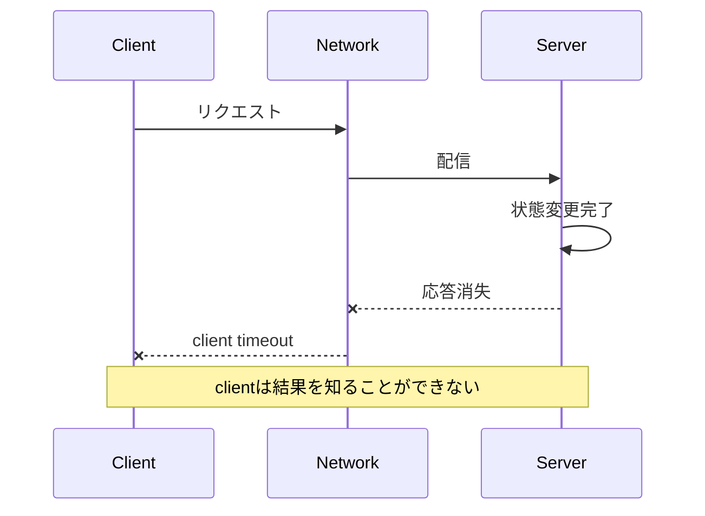



## 問題：リモート呼び出しの結果は成功と失敗の二つではない

一つのprocess内の関数呼び出しは、値を返すかexceptionを投げる。

networkを越える呼び出しは、さらに曖昧である。

clientがtimeoutを観測しても、serverは要求を受け取っていない可能性がある。

serverが処理中かもしれない。

処理は終わっているが、応答だけが失われた可能性もある。

したがってリモート呼び出しの結果には、`成功`、`失敗`、`結果が不明`がある。

この3番目の状態を無視すると、次の問題が生じる。

- 決済や作成要求が再試行によって重複する。
- 遅いdependencyがthreadとconnectionをすべて占有する。
- 複数階層のretryがトラフィックを幾何級数的に増幅する。
- clockのずれにより、最新eventを古いeventで上書きする。
- partition中に双方が自分をleaderと見なす。
- 障害を隠そうとしてデータ一貫性違反を引き起こす。

## Mental model：部分障害と観測不可能性

### 障害はcomponentごとに異なって見える



server logには成功が残り、client metricにはtimeoutが残る場合がある。

どちらかが誤りなのではない。

観測位置が異なるためである。

### 時間は一つではない

- wall clockは人間が読む時刻であり、補正によって前後に動くことがある。
- monotonic clockは経過時間の測定に適している。
- logical clockはeventの因果順序を表現する。
- version numberは特定のaggregateの変更順序を表現できる。

timeoutとlatencyの測定にはmonotonic clockを使う。

異なるnodeのwall clock timestampだけで因果関係を断定しない。

### 一貫性はシステム全体の単一スイッチではない

読み取りと書き込みでは要件が異なる。

- read-your-writesが必要か？
- monotonic readが必要か？
- stale readをどの程度の時間まで許容するか？
- lost updateを防ぐ必要があるか？
- 重複eventを無視できるか？
- 順序が変わったeventを処理できるか？

まず業務invariantを書き、その後で保存先のconsistency optionを選ぶ。

### CAPは設計を完結させる文ではない

network partitionが発生したとき、availabilityと強いconsistencyのどちらを選ぶかが顕在化する。

しかし実際の設計にはlatency、復旧時間、staleの許容範囲、client session、競合のmergeも含まれる。

`AP`または`CP`という2文字だけではAPIの動作を説明できない。

## Workflow：不確実性を契約に変える

### Step 1. 業務invariantを宣言する

たとえば在庫予約なら、次のように記述する。

- 利用可能数量は負にならない。
- 同じ注文の予約は一度だけ反映される。
- 期限切れの予約は再利用可能数量へ戻る。
- 完了済み注文を古いeventがキャンセル状態へ戻さない。

invariantは技術選択より長く存続する。

### Step 2. 要求をoperation単位で分類する

- 純粋な読み取り
- 自然にidempotentな更新
- 条件付き更新
- 新しいresourceの作成
- 外部副作用の呼び出し
- 長時間workflowの開始

分類に応じてretryの可否を決める。

### Step 3. deadline budgetを伝播する

client全体のdeadlineが800 msなら、下位の呼び出しごとに独立した800 msを与えることはできない。

queue待機、serialization、network、compute、retryの時間をすべてbudgetに含める。

下位の呼び出しには残りのdeadlineを渡す。

clientがすでに断念した処理をserverが継続する必要があるかも決める。

### Step 4. retry policyを一つの階層に集中させる

retryでは次の条件をすべて検討する。

- 一時的なエラーか？
- operationがidempotentか？
- 残りのdeadlineは十分か？
- retry budgetが残っているか？
- dependencyが復旧中か？

exponential backoffとjitterで同時再試行を分散させる。

再試行可能なエラーと永続的なエラーを分類する。

### Step 5. idempotencyを保存された契約にする

clientがidempotency keyを送る。

serverはkey、operation hash、状態、結果への参照を原子的に保存する。

同じkeyで異なるpayloadが届いた場合は拒否する。

同一要求が処理中なら、polling可能な状態を返す。

完了済みなら以前の結果を返す。

keyの保持期間は、想定されるretry windowより長くする必要がある。

### Step 6. optimistic concurrencyを使う

resourceにversionを持たせる。

clientは読み取ったversionを条件として更新する。

```sql
UPDATE inventory
SET available = available - :qty,
    version = version + 1
WHERE item_id = :item_id
  AND version = :expected_version
  AND available >= :qty;
```

影響を受けたrowが0なら、conflictまたは不足状態である。

無条件に再試行せず、最新状態を読み取って業務判断をやり直す。

### Step 7. 同期transactionの境界を越えるeventを安全に発行する

database変更とmessage publishを別々に実行すると、片方だけが成功する可能性がある。

transactional outboxを使えば、業務rowとoutbox rowを同じlocal transactionに書き込める。

publisherはoutboxを読み、messageを送って配信状態を記録する。

重複publishの可能性はconsumer idempotencyで処理する。

### Step 8. overloadを障害種別として扱う

無限queueは障害を遅らせるだけである。

同時実行制限、bounded queue、admission control、load sheddingを設ける。

critical trafficとbest-effort trafficを分離する。

retry trafficも総負荷budgetに含める。

### Step 9. 障害隔離を検証する

bulkheadによってthread pool、connection pool、queue、tenantのリソースを分ける。

circuit breakerはあらゆる問題への答えではなく、状態遷移とhalf-openでの試験負荷を設計する必要がある。

一つのdependencyの遅延がAPI全体へ波及するか、負荷試験する。

## 実践例：重複に強いジョブ作成API

### 要求契約

```http
POST /jobs HTTP/1.1
Idempotency-Key: 018f-example-key
Content-Type: application/json

{"input_ref":"object://example/input"}
```

### serverの処理

1. 認証済みcallerとkeyを紐付ける。
2. canonical payload hashを計算する。
3. key rowをunique constraintで挿入する。
4. 同じtransaction内でjobとoutboxを作る。
5. すでに存在する場合はpayload hashを比較する。
6. 同一なら保存された状態とresource URIを返す。
7. 異なる場合はkey再利用エラーを返す。
8. publisherがoutbox eventをqueueへ送る。
9. consumerはevent IDの処理記録を確認する。

### 状態machine

- `accepted -> running`
- `running -> succeeded`
- `running -> failed`
- `accepted -> cancelled`
- terminal stateでは古いeventを拒否

状態変更にはexpected current stateまたはversion条件を付ける。

これにより、順序が変わったeventが状態を逆行させる事態を減らせる。

## 障害試験シナリオ

### 応答消失

serverのcommit直後に応答を遮断する。

clientの再試行時に同じresourceが返されるか確認する。

### dependencyの遅延

下位サービスのlatencyを徐々に増やす。

deadlineの伝播とload sheddingが機能するか確認する。

### messageの重複

同じeventを複数回配信する。

最終状態と副作用の回数が変わらないか確認する。

### messageの順序逆転

完了eventの後に開始eventを配信する。

versionまたは状態遷移の検証が逆行を防ぐか確認する。

### clock skew

timestampがずれたeventを入力する。

wall clockではなくversionと業務規則で決定するか確認する。

## 検証Checklist

### 契約

- [ ] リモート呼び出しの`結果が不明`という状態が文書化されている。
- [ ] operationごとのidempotencyとretry可否が定義されている。
- [ ] timeoutは全体のdeadlineから導出される。
- [ ] エラーcodeが一時的・永続的・conflictに区分されている。
- [ ] stale readの許容範囲がuse caseごとに定められている。

### データ

- [ ] 業務invariantが自動testで表現されている。
- [ ] lost updateの防止策がある。
- [ ] event IDとaggregate versionがある。
- [ ] 重複と順序逆転を処理する。
- [ ] outboxまたは同等の一貫性パターンを検討した。

### 信頼性

- [ ] retryにbackoff、jitter、回数・時間の上限がある。
- [ ] retry stormを負荷試験した。
- [ ] bounded queueとoverloadポリシーがある。
- [ ] dependencyごとのconcurrencyが隔離されている。
- [ ] partitionと遅延を含む障害試験を行う。
- [ ] clientとserver双方のtelemetryを関連付ける。

## よくある失敗と限界

### timeoutをキャンセルと誤解する

client timeoutはserver処理の中断を保証しない。

キャンセルprotocolとserver-side deadlineの処理が別途必要である。

### `exactly once`という表現を業務上のexactly-onceと解釈する

broker内部の保証だけでは、外部databaseとAPIの副作用が一度だけ発生することにはならない。

end-to-end invariantと重複抑止が必要である。

### global lockですべての問題を解決する

lock service自体の可用性、fencing token、leaseの失効、clockの問題が生じる。

可能ならresourceごとのversionと条件付き書き込みを優先する。

### consistencyを無条件に最大化する

強いconsistencyにはlatencyとavailabilityのコストがある。

業務invariantが必要とする範囲に集中する。

### chaos testが設計レビューに代わると信じる

無作為な障害は、既知のhypothesisと安全境界なしに実行するとノイズや実際の事故になる。

## 公式参考資料

- [AWS Builders' Library: Timeouts, Retries, and Backoff with Jitter](https://aws.amazon.com/builders-library/timeouts-retries-and-backoff-with-jitter/)
- [Google SRE Book: Addressing Cascading Failures](https://sre.google/sre-book/addressing-cascading-failures/)
- [gRPC Deadlines](https://grpc.io/docs/guides/deadlines/)
- [HTTP Semantics: Idempotent Methods](https://www.rfc-editor.org/rfc/rfc9110.html#name-idempotent-methods)
- [Kubernetes Lease API](https://kubernetes.io/docs/concepts/architecture/leases/)

## まとめ

分散システムの中心的な問題はremote machineが存在することよりも、結果を即座に確定できないことにある。

不確実性を隠さず、deadline、idempotency、version、invariant、overloadポリシーとして明示しよう。

優れたシステムとは障害をなくすシステムではなく、部分障害が全体障害やデータ破損へ波及しないようにするシステムである。
