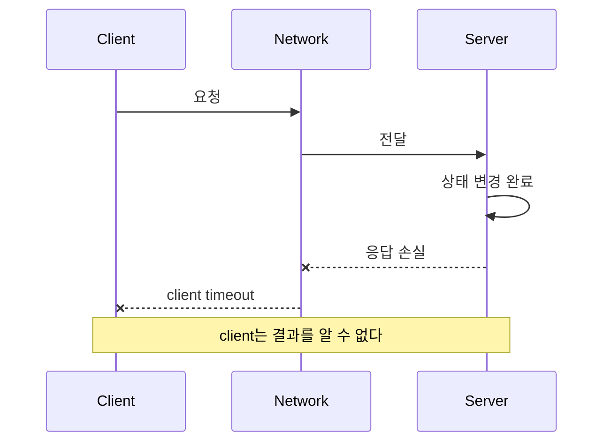



## 문제: 원격 호출의 결과는 성공과 실패 두 가지가 아니다

한 process 안의 함수 호출은 반환하거나 exception을 던진다.

network를 건넌 호출은 더 모호하다.

client가 timeout을 봤어도 server는 요청을 받지 않았을 수 있다.

server가 처리 중일 수 있다.

처리는 끝났지만 응답만 사라졌을 수 있다.

따라서 원격 호출의 결과에는 `성공`, `실패`, `결과를 모름`이 있다.

이 세 번째 상태를 무시하면 다음 문제가 생긴다.

- 결제나 생성 요청이 재시도로 중복된다.
- 느린 dependency가 thread와 connection을 모두 점유한다.
- 여러 계층의 retry가 트래픽을 기하급수적으로 증폭한다.
- clock 차이로 최신 event를 오래된 event로 덮어쓴다.
- partition 중 양쪽이 자신을 leader로 간주한다.
- 장애를 숨기려다 데이터 일관성 위반을 만든다.

## Mental model: 부분 실패와 관측 불가능성

### 실패는 component마다 다르게 보인다



server log에는 성공이 남고 client metric에는 timeout이 남을 수 있다.

둘 중 하나가 거짓인 것이 아니다.

관찰 위치가 다르기 때문이다.

### 시간은 하나가 아니다

- wall clock은 사람이 읽는 시간이며 보정으로 앞뒤로 움직일 수 있다.
- monotonic clock은 경과 시간을 측정하는 데 적합하다.
- logical clock은 event의 인과 순서를 표현한다.
- version number는 특정 aggregate의 변경 순서를 표현할 수 있다.

timeout과 latency 측정에는 monotonic clock을 사용한다.

서로 다른 node의 wall clock timestamp만으로 인과관계를 단정하지 않는다.

### 일관성은 시스템 전체의 단일 스위치가 아니다

읽기와 쓰기마다 요구가 다르다.

- read-your-writes가 필요한가?
- monotonic read가 필요한가?
- stale read를 어느 시간까지 허용하는가?
- lost update를 막아야 하는가?
- 중복 event를 무시할 수 있는가?
- 순서가 바뀐 event를 처리할 수 있는가?

업무 invariant를 먼저 쓰고 저장소의 consistency option을 그 뒤 선택한다.

### CAP은 설계 완성 문장이 아니다

network partition이 발생했을 때 availability와 강한 consistency 사이의 선택이 드러난다.

하지만 실제 설계에는 latency, 복구 시간, stale 허용 범위, client session, 충돌 병합도 포함된다.

`AP` 또는 `CP`라는 두 글자로 API의 동작을 설명할 수 없다.

## Workflow: 불확실성을 계약으로 바꾸기

### Step 1. 업무 invariant를 선언한다

예를 들어 재고 예약이라면 다음과 같이 쓴다.

- 가용 수량은 음수가 되지 않는다.
- 같은 주문의 예약은 한 번만 반영된다.
- 만료된 예약은 재사용 가능 수량으로 돌아간다.
- 완료된 주문을 오래된 event가 취소 상태로 되돌리지 않는다.

invariant는 기술 선택보다 오래 살아남는다.

### Step 2. 요청을 operation 단위로 분류한다

- 순수 읽기
- 자연적으로 idempotent한 갱신
- 조건부 갱신
- 새 resource 생성
- 외부 부작용 호출
- 장시간 workflow 시작

분류에 따라 retry 가능성을 결정한다.

### Step 3. deadline budget을 전파한다

client의 전체 deadline이 800 ms라면 하위 호출마다 800 ms를 독립적으로 줄 수 없다.

queue 대기, serialization, network, compute, retry 시간을 모두 budget에 넣는다.

하위 호출에는 남은 deadline을 전달한다.

이미 client가 포기한 작업을 server가 계속 수행할 필요가 있는지도 결정한다.

### Step 4. retry policy를 한 계층에 집중한다

retry는 다음 조건을 모두 검토한다.

- 일시적 오류인가?
- operation이 idempotent한가?
- 남은 deadline이 충분한가?
- retry budget이 남았는가?
- dependency가 회복 중인가?

exponential backoff와 jitter로 동시 재시도를 흩뜨린다.

재시도 가능 오류와 영구 오류를 분류한다.

### Step 5. idempotency를 저장된 계약으로 만든다

client가 idempotency key를 보낸다.

server는 key, operation hash, 상태, 결과 참조를 원자적으로 저장한다.

같은 key와 다른 payload가 오면 거부한다.

동일 요청이 처리 중이면 polling 가능한 상태를 돌려준다.

완료됐다면 이전 결과를 반환한다.

key 보존 기간은 가능한 retry window보다 길어야 한다.

### Step 6. optimistic concurrency를 사용한다

resource에 version을 둔다.

client는 읽은 version을 조건으로 갱신한다.

```sql
UPDATE inventory
SET available = available - :qty,
    version = version + 1
WHERE item_id = :item_id
  AND version = :expected_version
  AND available >= :qty;
```

영향받은 row가 0이면 conflict 또는 부족 상태다.

무조건 재시도하지 말고 최신 상태를 읽어 업무 결정을 다시 한다.

### Step 7. 동기 transaction 경계를 넘는 event를 안전하게 낸다

database 변경과 message publish를 별도 수행하면 둘 중 하나만 성공할 수 있다.

transactional outbox를 사용하면 업무 row와 outbox row를 같은 local transaction에 쓴다.

publisher는 outbox를 읽어 message를 보내고 전달 상태를 기록한다.

중복 publish 가능성은 consumer idempotency로 처리한다.

### Step 8. overload를 실패 유형으로 다룬다

무한 queue는 실패를 지연시킬 뿐이다.

동시성 제한, bounded queue, admission control, load shedding을 둔다.

critical traffic과 best-effort traffic을 분리한다.

retry traffic도 전체 부하 예산에 포함한다.

### Step 9. 장애 격리를 검증한다

bulkhead로 thread pool, connection pool, queue, tenant 자원을 나눈다.

circuit breaker는 모든 문제의 해답이 아니며 상태 전이와 half-open 시험 부하를 설계해야 한다.

dependency 하나의 지연이 전체 API로 번지는지 부하 시험한다.

## 실전 예제: 중복에 안전한 작업 생성 API

### 요청 계약

```http
POST /jobs HTTP/1.1
Idempotency-Key: 018f-example-key
Content-Type: application/json

{"input_ref":"object://example/input"}
```

### server 처리

1. 인증된 caller와 key를 묶는다.
2. canonical payload hash를 계산한다.
3. key row를 unique constraint로 삽입한다.
4. 같은 transaction에서 job과 outbox를 만든다.
5. 이미 존재하면 payload hash를 비교한다.
6. 동일하면 저장된 상태와 resource URI를 반환한다.
7. 다르면 key 재사용 오류를 반환한다.
8. publisher가 outbox event를 queue로 보낸다.
9. consumer는 event ID 처리 기록을 확인한다.

### 상태 machine

- `accepted -> running`
- `running -> succeeded`
- `running -> failed`
- `accepted -> cancelled`
- terminal state에서는 오래된 event를 거부

상태 변경에는 expected current state 또는 version 조건을 둔다.

이렇게 하면 순서가 바뀐 event가 상태를 역행시키는 일을 줄일 수 있다.

## 장애 시험 시나리오

### 응답 손실

server commit 직후 응답을 차단한다.

client 재시도 때 같은 resource가 반환되는지 확인한다.

### dependency 지연

하위 서비스 latency를 점진적으로 늘린다.

deadline 전파와 load shedding이 작동하는지 확인한다.

### message 중복

같은 event를 여러 번 전달한다.

최종 상태와 부작용 횟수가 변하지 않는지 확인한다.

### message 순서 역전

완료 event 뒤 시작 event를 전달한다.

version 또는 상태 전이 검증이 역행을 막는지 확인한다.

### clock skew

timestamp가 어긋난 event를 입력한다.

wall clock이 아닌 version과 업무 규칙으로 결정하는지 확인한다.

## 검증 Checklist

### 계약

- [ ] 원격 호출의 `결과를 모름` 상태가 문서화되어 있다.
- [ ] operation별 idempotency와 retry 가능성이 정의되어 있다.
- [ ] timeout은 전체 deadline에서 파생된다.
- [ ] 오류 code가 일시적·영구적·conflict로 구분된다.
- [ ] stale read 허용 범위가 use case별로 정해져 있다.

### 데이터

- [ ] 업무 invariant가 자동 test로 표현되어 있다.
- [ ] lost update 방지 장치가 있다.
- [ ] event ID와 aggregate version이 있다.
- [ ] 중복과 순서 역전을 처리한다.
- [ ] outbox 또는 동등한 일관성 패턴을 검토했다.

### 신뢰성

- [ ] retry에 backoff, jitter, 횟수·시간 한도가 있다.
- [ ] retry storm을 부하 시험했다.
- [ ] bounded queue와 overload 정책이 있다.
- [ ] dependency별 concurrency가 격리된다.
- [ ] partition과 지연을 포함한 장애 시험을 한다.
- [ ] client와 server 양쪽 telemetry를 연결한다.

## 자주 겪는 실패와 한계

### timeout을 취소로 오해한다

client timeout은 server 작업 중단을 보장하지 않는다.

취소 protocol과 server-side deadline 처리가 별도로 필요하다.

### `exactly once` 문구를 업무 exactly-once로 해석한다

broker 내부 보장만으로 외부 database와 API 부작용이 한 번만 발생하지는 않는다.

end-to-end invariant와 중복 억제가 필요하다.

### global lock으로 모든 문제를 해결한다

lock service 자체의 가용성과 fencing token, lease 만료, clock 문제가 생긴다.

가능하면 resource별 version과 조건부 쓰기를 선호한다.

### consistency를 무조건 최대화한다

강한 consistency에는 latency와 availability 비용이 있다.

업무 invariant가 필요로 하는 범위에 집중한다.

### chaos test가 설계 검토를 대신한다고 믿는다

무작위 장애는 알려진 hypothesis와 안전 경계 없이 실행하면 잡음이나 실제 사고가 된다.

## 공식 참고자료

- [AWS Builders' Library: Timeouts, Retries, and Backoff with Jitter](https://aws.amazon.com/builders-library/timeouts-retries-and-backoff-with-jitter/)
- [Google SRE Book: Addressing Cascading Failures](https://sre.google/sre-book/addressing-cascading-failures/)
- [gRPC Deadlines](https://grpc.io/docs/guides/deadlines/)
- [HTTP Semantics: Idempotent Methods](https://www.rfc-editor.org/rfc/rfc9110.html#name-idempotent-methods)
- [Kubernetes Lease API](https://kubernetes.io/docs/concepts/architecture/leases/)

## 마무리

분산 시스템의 핵심 문제는 remote machine이 있다는 사실보다 결과를 즉시 확정할 수 없다는 데 있다.

불확실성을 숨기지 말고 deadline, idempotency, version, invariant, overload 정책으로 명시하자.

좋은 시스템은 실패를 없애는 시스템이 아니라 부분 실패가 전체 오류와 데이터 손상으로 번지지 않게 하는 시스템이다.
