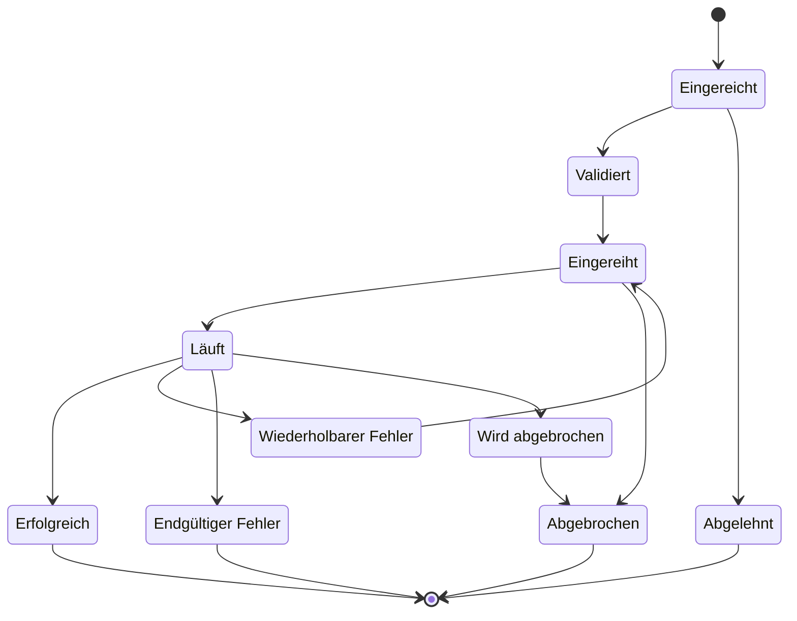
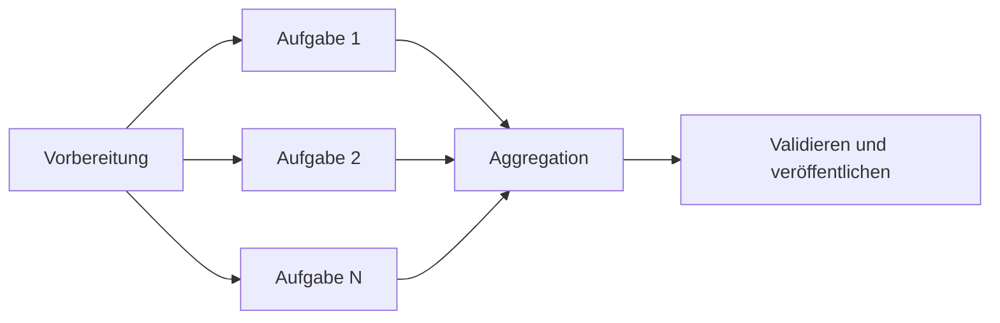
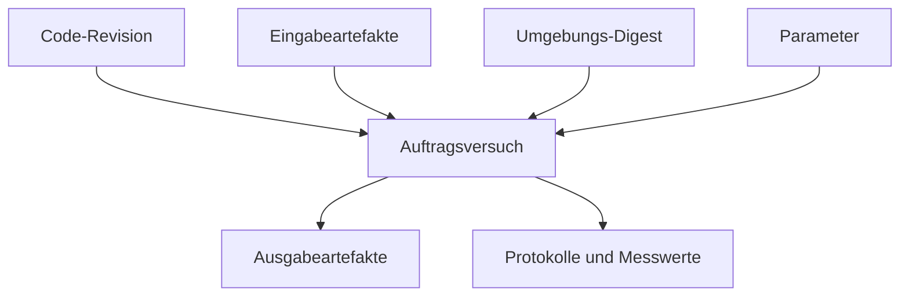



Wissenschaftliche und technische Software scheitert häufiger an der Ausführungssteuerung als an ihren Gleichungen. Eine Plattform ist nicht vertrauenswürdig, wenn eine Berechnung nach dem Abbruch einer Benutzeranfrage verschwindet, Wiederholungen doppelte Ausführungen erzeugen oder Ergebnisdateien nicht mehr ihren Eingabeversionen zugeordnet werden können.

Entscheidend ist, die Berechnung nicht unmittelbar in einer HTTP-Anfrage auszuführen, sondern sie zu einem **dauerhaften Auftrag (Job) mit unveränderlichen Artefakten** zu machen.

## 1. Den Auftrag als eigenständiges Objekt behandeln

Ein Auftragseintrag enthält mindestens folgende Felder.

- `job_id`: stabile interne Kennung
- `job_type`: Typ zur Auswahl des Executors
- `state`: aktueller Zustand im Zustandsautomaten
- `input_manifest`: Verweise auf Eingabeartefakte und Parameter
- `execution_spec`: Image, Befehl, Ressourcen und Umgebung
- `attempt`: Nummer des Ausführungsversuchs
- `idempotency_key`: verhindert doppelte Einreichungen
- `created_at`, `started_at`, `finished_at`
- `result_manifest`: Verweise auf Ausgabeartefakte
- `provenance`: Identität von Code und Laufzeit
- `error_class`: klassifizierte Fehlerursache

Dieser Eintrag muss die maßgebliche Wahrheit sein, nicht der Fortschrittsbalken der Benutzeroberfläche.

## 2. Den Zustandsautomaten festlegen

Die folgenden Zustände bilden eine empfehlenswerte Ausgangsbasis.



Zustandsübergänge müssen als bedingte atomare Operationen erfolgen. Eine Versionsnummer oder Compare-and-Swap verhindert, dass zwei Worker denselben Auftrag gleichzeitig als `running` beanspruchen.

## 3. Einreichungs-API und Idempotenz

Nach einem Netzwerk-Timeout kann ein Client dieselbe Anfrage erneut senden. Der Server speichert dazu einen Idempotenzschlüssel und einen kanonischen Hash der Anfrage.

- Gleicher Schlüssel und gleiche Nutzlast: vorhandenen Auftrag zurückgeben
- Gleicher Schlüssel und andere Nutzlast: als Konflikt ablehnen
- Neuer Schlüssel: neuen Auftrag anlegen

Aufbewahrungszeitraum und Mandantengeltung des Idempotenzschlüssels sind ausdrücklich festzulegen. Soweit möglich, sollte auch die Auftragsausführung Ausgabepfade und Nebenwirkungen nach Ausführungsversuch isolieren.

## 4. Was die Warteschlange garantiert – und was nicht

Die meisten praktisch eingesetzten Warteschlangen verhalten sich annähernd wie eine Zustellung mindestens einmal. Da eine Nachricht mehrfach zugestellt werden kann, muss der Verbraucher idempotent sein.

Große Eingaben gehören nicht in die Warteschlangennachricht. Sie sollte nur die Auftrags-ID und kleine Routing-Metadaten enthalten; den maßgeblichen Zustand und das Manifest liest der Worker aus dem transaktionalen Speicher.

Für die Zustellbestätigung bietet sich diese Reihenfolge an.

1. Lease des Auftrags übernehmen
2. Ausführung vorbereiten und Versuch anlegen
3. Ergebnisse und Zustand festschreiben
4. Warteschlangennachricht bestätigen

Stirbt der Worker vor der Bestätigung, wird die Nachricht erneut zugestellt; Zustand und Lease verhindern dann eine doppelte Ausführung.

## 5. Leases und Heartbeats

Lease-Ablauf und Heartbeats zeigen an, ob ein laufender Worker ausgefallen ist.

- `lease_owner`
- `lease_expires_at`
- `heartbeat_at`
- Scheduler-/Worker-Epoche

Allein wegen eines verspäteten Heartbeats sofort einen zweiten Worker zu starten, kann bei einer langen Garbage-Collection-Pause oder Netzwerkpartition zu Split Brain führen. Ein Fencing-Token lässt sich an externe Nebenwirkungen übergeben, damit diese Schreibzugriffe eines veralteten Besitzers ablehnen.

## 6. Taxonomie für Wiederholungen

Jeden Fehler erneut zu versuchen verursacht unkontrollierte Kosten und wiederholte Schäden.

### Wiederholbar

- Vorübergehender Netzwerkfehler
- Temporäre Ablehnung durch den Scheduler
- Präemption
- Vorübergehender Fehler des Artefaktspeichers
- Ratenbegrenzung eines externen Dienstes

### Endgültig

- Ungültiges Eingabeschema
- Fehlendes Artefakt
- Verweigerte Lizenz oder Berechtigung
- Deterministischer Solverfehler
- Nicht unterstützte Laufzeitkombination

### Unbekannt

Lässt sich die Ursache nicht klassifizieren, wird der Auftrag nach einer begrenzten Zahl von Wiederholungen isoliert.

Exponentielles Backoff mit Jitter, eine maximale Versuchszahl und ein gesamtes Wiederholungsbudget begrenzen die Belastung.

## 7. Das Eingabemanifest muss unveränderlich sein

Liest ein Auftrag nach seinem Start die „neueste Datei“, hängt sein Ergebnis vom Ausführungszeitpunkt ab. Eingaben müssen über einen inhaltsadressierten Digest oder eine unveränderliche Versions-ID fixiert werden.

Konzeptionell enthält ein Manifest folgende Angaben.

```yaml
schema_version: v1
inputs:
  - role: mesh
    artifact: sha256:<digest>
  - role: parameters
    artifact: sha256:<digest>
runtime:
  image: registry.example/solver@sha256:<digest>
entrypoint: ["solver", "--manifest", "input.yml"]
```

Die Platzhalter in diesem Beispiel sind keine echten Geheimnisse oder privaten Adressen.

## 8. Artefakt- und Metadatenspeicher trennen

Große Binärdateien und Protokolle gehören in einen Objektspeicher, durchsuchbare Zustände und Beziehungen in eine Datenbank.

Zu den Artefaktmetadaten gehören:

- Digest und Größe
- Medientyp und Schemaversion
- erzeugender Auftrag und Versuch
- logische Rolle
- Erstellungszeitpunkt
- Aufbewahrungsklasse
- Verweis auf Verschlüsselungs- und Schlüsselrichtlinie
- Validierungsstatus

Übertragungsfehler werden erkannt, indem die vom Client gelieferte Prüfsumme mit der serverseitig berechneten verglichen wird.

## 9. Atomare Veröffentlichung

Liest ein anderer Dienst ein Ausgabeverzeichnis, während der Worker noch schreibt, kann er ein unvollständiges Ergebnis sehen.

1. Ausgabe in ein temporäres, versuchsspezifisches Präfix schreiben
2. Prüfsummen und Manifest für alle Dateien erzeugen
3. Validierung ausführen
4. An einem unveränderlichen endgültigen Ort veröffentlichen
5. Ergebnismanifest in einer Datenbanktransaktion verknüpfen
6. Auftrag auf `succeeded` setzen

Der Erfolgszustand darf erst gesetzt werden, wenn die Artefakte tatsächlich lesbar und validiert sind.

## 10. Protokolle und Fortschritt

Die gesamte Standardausgabe sollte nicht fortlaufend an eine Datenbankzeile angehängt werden. Segmentierte Protokollartefakte und durchsuchbarer Ereignisindex sind zu trennen.

Fortschritt wird durch monotone Phasen und vom Solver definierte Messwerte ausgedrückt.

- Phase: Vorverarbeitung, Lösung, Nachverarbeitung
- abgeschlossene Einheit / Gesamtzahl der Einheiten
- aktuelle Iteration und Residuum
- letzter Heartbeat
- geschätzte Dauer optional und mit Unsicherheitsangabe

Benutzermeldungen und Betriebsdiagnosen sind zu trennen, damit interne Pfade, Befehle und Geheimnisse nicht offengelegt werden.

## 11. Grenze zum HPC-Scheduler

Plattformwarteschlange und HPC-Schedulerwarteschlange erfüllen verschiedene Aufgaben.

- Plattform: Benutzerautorisierung, Validierung, Provenienz, Artefakte und Produktzustand
- Scheduler: Zuweisung von Rechenressourcen, Priorität, Knotenplatzierung und Abrechnung

Ein Adapter übersetzt die Auftragsspezifikation in eine Scheduler-Einreichung und speichert die externe Auftrags-ID. Geht die Antwort nach erfolgreicher Einreichung verloren, ermöglicht eine clientseitig erzeugte Markierung oder ein Kommentar die spätere Abstimmung.

## 12. Grundlagen der Slurm-Integration

In Slurm reicht `sbatch` ein Batch-Skript ein und liefert eine Scheduler-Auftrags-ID. Ein Job-Array repräsentiert gleichartige Aufgaben, Abhängigkeiten drücken Vorrangbeziehungen aus und `sacct` dient der Abfrage abgeschlossener Aufträge.

Eine sichere Argumentübergabe und eine Vorlagen-Positivliste verhindern, dass die Plattform Shell-Befehle direkt zusammensetzt. Benutzereingaben in Scheduler-Direktiven oder Shell-Befehle einzusetzen eröffnet eine Injektionslücke.

## 13. Job-Arrays und Workflow-DAGs

Einen Parametersweep in untergeordnete Aufgaben zu zerlegen verbessert Wiederholbarkeit und Beobachtbarkeit gegenüber einem einzigen riesigen Auftrag.



Quoten und Rückdruck begrenzen die Auffächerung. Der Aggregationsschritt liest abgeschlossene Kindmanifeste in deterministischer Reihenfolge.

## 14. Ressourcenanforderungen und Scheduling

Eine Auftragsspezifikation nennt CPU, Arbeitsspeicher, Beschleuniger, Laufzeitlimit, lokalen Scratch-Speicher und Lizenz-Token.

Zu knappe Anforderungen führen zu OOM-Fehlern und Timeouts, zu großzügige zu längeren Wartezeiten und höheren Kosten. Gemessene Spitzen früherer Läufe können Empfehlungen begründen; eine automatische Reduktion sollte jedoch Sicherheitsreserve und Benutzerfreigabe berücksichtigen.

Ressourcenquoten werden nach Mandant und Projekt angewandt, Masseneinreichungen unterliegen einer Zulassungssteuerung.

## 15. Container und Erfassung der Umgebung

Ein Container-Image fixiert nur einen Teil der Ausführungsumgebung und garantiert keine vollständige Reproduzierbarkeit.

- Image-Digest
- Kompatibilität von Host-Kernel und Treiber
- Beschleuniger-Laufzeit
- CPU-Befehlssatz
- Locale und Zeitzone
- Threadzahl und Mathematikbibliothek
- externe Lizenz oder externer Dienst
- Zufallsseed und nichtdeterministischer Algorithmus

Gespeichert wird ein unveränderlicher Digest, kein veränderliches Tag.

## 16. Provenienzgraph

Provenienz beantwortet, welche Eingaben, welcher Code, welche Umgebung und welche Vorgängerergebnisse ein Resultat hervorgebracht haben.



Sinnvoll sind sowohl ein reproduzierbares `run manifest` als auch ein menschenlesbares `report manifest`.

## 17. Abbruch und Zeitlimits

Die Abbruch-API zeichnet die Anforderung auf, storniert danach den Scheduler-Auftrag und signalisiert den Worker. Abbruch ist ein Protokoll, kein augenblicklicher Zustand.

- Abbruch angefordert
- Bestätigung des externen Schedulers
- Prozessbeendigung bestätigt
- Richtlinie für Teil-Artefakte angewandt
- abschließender Übergang zu `cancelled`

Nach einem geordneten Signal darf der Prozess nach Ablauf der Frist zwangsweise beendet werden. Eine `incomplete`-Markierung verhindert, dass Teilausgaben als Ergebnis gelten.

## 18. Abstimmungsschleife

Da Ereignisse verloren gehen können, werden interner Zustand, externer Scheduler und Artefaktspeicher regelmäßig verglichen.

- Interner Zustand ist „laufend“, aber es existiert kein externer Auftrag
- Externer Auftrag ist beendet, interner Zustand weiterhin „laufend“
- Zustand ist „erfolgreich“, aber das Ergebnismanifest fehlt
- Lease ist abgelaufen, der Prozess läuft jedoch noch
- Verwaistes Artefakt oder verwaister Scheduler-Auftrag

Der Reconciler muss idempotent sein und vor einer Korrektur Belege sowie ein Aktionsprotokoll hinterlassen.

## 19. Sicherheitsgrenzen

- Benutzereingaben niemals unmittelbar über eine Shell ausführen.
- Eine Worker-Identität erhält nur Zugriff auf das erforderliche Artefaktpräfix.
- Namespace und Autorisierung werden je Mandant erzwungen.
- Geheimnisse und interne Pfade werden aus Protokollen und Fehlern entfernt.
- Signierte Images und die Herkunft von Abhängigkeiten werden geprüft.
- Der Ausgabeparser behandelt seine Eingabe als nicht vertrauenswürdig.
- Administrator- und Benutzeraktionen werden im Audit-Protokoll erfasst.

## 20. Checkliste zur Betriebsvalidierung

- [ ] Die Zustandsübergänge eines Auftrags sind in Code und Dokumentation einheitlich definiert.
- [ ] Eine erneute Einreichung desselben Idempotenzschlüssels erzeugt keinen doppelten Auftrag.
- [ ] Vor oder nach einem Worker-Absturz entstehen keine doppelten Nebenwirkungen.
- [ ] Lease-Ablauf und Fencing wurden getestet.
- [ ] Die Klassifikation in wiederholbare und endgültige Fehler ist ausdrücklich festgelegt.
- [ ] Eingaben und Images sind mit unveränderlichen Digests fixiert.
- [ ] Teil-Artefakte werden nicht veröffentlicht.
- [ ] Ergebnisprüfsummen werden vor dem Erfolgszustand geprüft.
- [ ] Die Abstimmung behebt eine verlorene Scheduler-Antwort.
- [ ] Wettläufe zwischen Abbruch und Timeout wurden getestet.
- [ ] Warteschlangenrückstand und Einreichungsrate unterliegen Rückdruck.
- [ ] Die Provenienz führt ein Ergebnis auf seine Eingaben zurück.
- [ ] Datenbank- und Objektspeicherkonsistenz wurde bei der Notfallwiederherstellung geprüft.
- [ ] Kosten, Wartezeit, Laufzeit und Fehlerrate werden beobachtet.

## 21. Häufige Fehlmuster und Grenzen

### Lang laufende Berechnung innerhalb einer Webanfrage

Client-Abbruch und Gateway-Timeout werden dadurch an den Lebenszyklus der Berechnung gekoppelt.

### Die Behauptung, die Warteschlange verarbeite genau einmal

In einem verteilten System ist es praktikabler, doppelte Zustellung anzunehmen und Zustandsübergänge sowie Nebenwirkungen idempotent zu gestalten.

### Erfolg allein anhand des Prozess-Exitcodes bestimmen

Auch erforderliche Ausgaben, Schemas, Prüfsummen und fachliche Validierungen müssen geprüft werden.

### Sämtliche Protokolle unbegrenzt aufbewahren

Dies erhöht Kosten und Angriffsfläche für vertrauliche Informationen. Aufbewahrungs-, Redaktions- und Speicherklassenrichtlinien müssen entworfen werden.

### Scheduler-Zustand unmittelbar als Produktzustand darstellen

Scheduler unterscheiden sich in ihrer Zustandssemantik; zudem fehlen benutzerseitige Validierungs- und Veröffentlichungsphasen.

## 22. Offizielle und primäre Referenzen

- Slurm, [offizielle Dokumentation zu sbatch](https://slurm.schedmd.com/sbatch.html).
- Slurm, [Dokumentation zu Job-Arrays](https://slurm.schedmd.com/job_array.html).
- Slurm, [Dokumentation zur sacct-Abrechnung](https://slurm.schedmd.com/sacct.html).
- W3C, [PROV-DM: Das PROV-Datenmodell](https://www.w3.org/TR/prov-dm/).
- OCI, [Image- und Distribution-Spezifikationen](https://opencontainers.org/).
- Kubernetes, [Dokumentation zu Jobs](https://kubernetes.io/docs/concepts/workloads/controllers/job/).

Eine vertrauenswürdige Rechenplattform ist nicht lediglich ein System, das Aufträge ausführt. Sie ist **ein System, das trotz Duplikaten, Fehlern, Abbrüchen und Wiederholungen die kausalen Beziehungen zwischen Eingaben, Ausführung und Ergebnissen bewahrt**.
