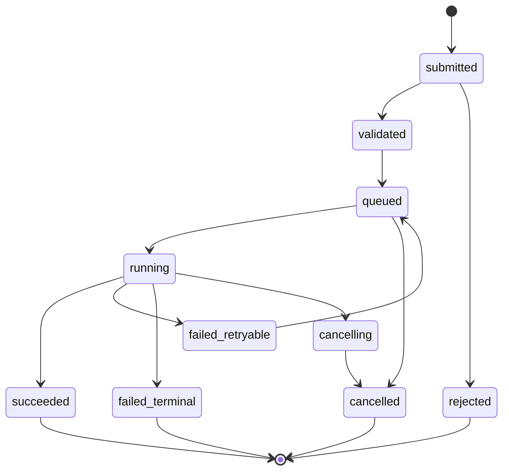
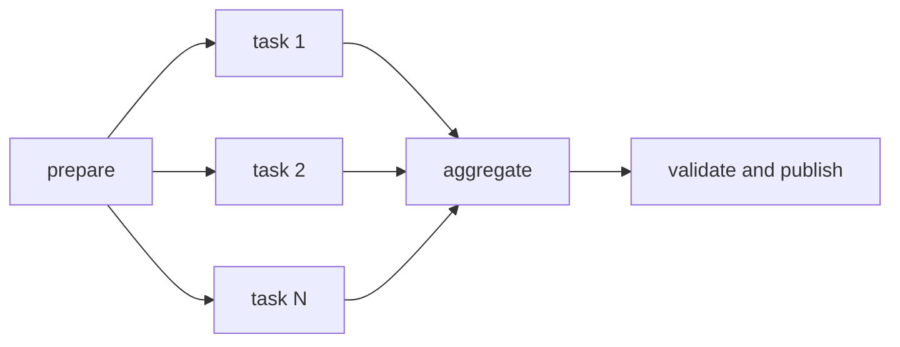
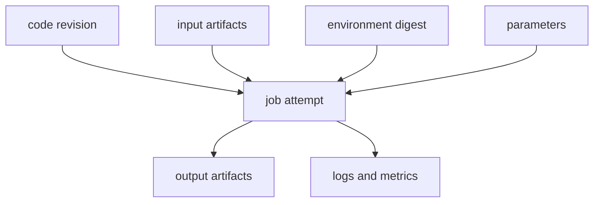



Scientific and engineering software fails more often in execution management than in its equations.
A platform is not trustworthy if a computation disappears when a user request is disconnected, retries create duplicate executions, or result files cannot be linked to their input versions.

The key is to avoid performing the computation directly inside an HTTP request and instead **promote it to a durable Job and immutable Artifacts**.

## 1. Make the Job a First-Class Object

A Job record has at least the following fields.

- `job_id`: stable internal identifier
- `job_type`: type used to select an executor
- `state`: current state in the state machine
- `input_manifest`: references to input artifacts and parameters
- `execution_spec`: image, command, resources, and environment
- `attempt`: retry count
- `idempotency_key`: prevents duplicate submissions
- `created_at`, `started_at`, `finished_at`
- `result_manifest`: references to output artifacts
- `provenance`: code and runtime identity
- `error_class`: classified cause of failure

This record, rather than the UI's progress bar, must be the source of truth.

## 2. Specify the State Machine

The following states are a recommended baseline.



Perform transitions as conditional atomic operations.
Use a version or compare-and-swap so that two workers cannot simultaneously claim the same Job as `running`.

## 3. Submit API and Idempotency

After a network timeout, a client may send the same request again.
The server stores an idempotency key and a canonical request hash.

- Same key and same payload: return the existing Job
- Same key and different payload: reject it as a conflict
- New key: create a new Job

Define the idempotency retention period and tenant scope.
As far as possible, Job execution itself should also isolate output paths and side effects by attempt.

## 4. What the Queue Does and Does Not Guarantee

Most practical queues behave approximately like at-least-once delivery.
Because a message may be delivered more than once, the consumer must be idempotent.

Do not place huge inputs in a queue message; include only the job ID and small routing metadata.
Read the authoritative state and manifest from the transactional store.

Consider this order for delivery acknowledgment.

1. Acquire the Job lease
2. Prepare execution and create an attempt
3. Commit results and state
4. Acknowledge the queue message

If the worker dies before acknowledgment, the message is redelivered and the state and lease prevent duplicate execution.

## 5. Leases and Heartbeats

Use lease expiry and heartbeats to determine whether a running worker has died.

- `lease_owner`
- `lease_expires_at`
- `heartbeat_at`
- scheduler/worker epoch

Starting a second worker immediately based only on a delayed heartbeat can create split-brain during a long garbage collection pause or network partition.
A fencing token can be passed to external side effects so they reject writes from a stale owner.

## 6. Retry Taxonomy

Retrying every failure causes runaway cost and repeated damage.

### Retryable

- Transient network error
- Temporary scheduler rejection
- Preemption
- Transient artifact store error
- External service rate limit

### Terminal

- Invalid input schema
- Missing artifact
- License or permission denial
- Deterministic solver error
- Unsupported runtime combination

### Unknown

If the cause cannot be classified, quarantine the Job after a limited number of retries.

Use exponential backoff and jitter, and set a maximum attempt count and total retry budget.

## 7. The Input Manifest Must Be Immutable

If a Job reads the “latest file” after it starts, the result changes depending on when it runs.
Pin inputs with a content-addressed digest or immutable version ID.

Conceptually, a manifest contains the following information.

```yaml
schema_version: v1
inputs:
  - role: mesh
    artifact: sha256:<digest>
  - role: parameters
    artifact: sha256:<digest>
runtime:
  image: registry.example/solver@sha256:<digest>
entrypoint: ["solver", "--manifest", "input.yml"]
```

The placeholders in this example are not real secrets or private addresses.

## 8. Separate the Artifact Store from the Metadata Store

Keep large binaries and logs in object storage, and searchable state and relationships in a database.

Artifact metadata includes the following.

- Digest and size
- Media type and schema version
- Producer Job/attempt
- Logical role
- Creation timestamp
- Retention class
- Encryption/key policy reference
- Validation status

Detect corruption in transit by comparing the checksum supplied by the client with the checksum computed by the server.

## 9. Atomic Publication

If another service reads an output directory while a worker is writing to it, that service may see a partial result.

1. Write output to a temporary prefix dedicated to the attempt
2. Generate each file's checksum and a manifest
3. Perform validation
4. Publish to an immutable final location
5. Link the result manifest in a DB transaction
6. Transition the Job to `succeeded`

Set the success state only after the artifacts can actually be read and have been validated.

## 10. Logs and Progress

Do not continually append all of stdout to a DB row.
Separate chunked log artifacts from the searchable event index.

Express progress in monotonic stages and metrics defined by the solver.

- stage: preprocessing, solving, postprocessing
- completed unit / total unit
- current iteration and residual
- last heartbeat
- estimated time is optional and should indicate uncertainty

Separate user-facing messages from operator diagnostics so that internal paths, commands, and secrets are not exposed.

## 11. Boundary with the HPC Scheduler

The platform queue and the HPC scheduler queue serve different roles.

- Platform: user authorization, validation, provenance, artifacts, and product state
- Scheduler: compute resource allocation, priority, node placement, and accounting

An adapter translates the Job spec into a scheduler submission and stores the external job ID.
To handle a lost response after successful submission, use a client-generated marker or comment for reconciliation.

## 12. Fundamentals of Slurm Integration

In Slurm, `sbatch` submits a batch script and returns a scheduler job ID.
A job array represents a set of homogeneous tasks, dependencies express precedence relationships, and `sacct` is used to inspect accounting for completed Jobs.

Use a safe argument model and a template allowlist so the platform does not directly concatenate shell command strings.
Inserting user input directly into a scheduler directive or shell introduces an injection risk.

## 13. Job Arrays and Workflow DAGs

Decomposing a parameter sweep into child tasks, rather than creating one enormous Job, improves retry behavior and observability.



Apply quotas and backpressure to the fan-out count.
The aggregate step reads completed child manifests in deterministic order.

## 14. Resource Requests and Scheduling

A Job spec states resources such as CPU, memory, accelerator, wall time, local scratch space, and license tokens.

Requests that are too small cause OOM errors and timeouts; requests that are too large increase queue wait and cost.
Observe peak usage from past runs to make recommendations, but consider a safety margin and user approval before automatically reducing requests.

Apply resource quotas by tenant and project, and use admission control for bulk submissions.

## 15. Containers and Environment Capture

A container image pins part of the execution environment but does not guarantee complete reproducibility.

- Image digest
- Host kernel and driver compatibility
- Accelerator runtime
- CPU instruction set
- Locale and time zone
- Thread count and math library
- External license/service
- Random seed and nondeterministic algorithm

Store an immutable digest rather than a tag.

## 16. Provenance Graph

Provenance shows “which inputs, code, environment, and parent results produced a result.”



It is useful to provide both a reproducible `run manifest` and a human-readable `report manifest`.

## 17. Cancellation and Timeouts

The cancel API records the request, then cancels the scheduler job and signals the worker.
Cancellation is a protocol, not an instantaneous state.

- Cancel requested
- External scheduler acknowledgment
- Process termination confirmed
- Partial-artifact policy applied
- Final transition to cancelled

After a graceful signal, the process may be forcibly terminated once the time limit passes.
Use an `incomplete` marker so that partial output is not mistaken for a result.

## 18. Reconciliation Loop

Because event delivery can be lost, periodically compare internal state with the external scheduler and artifact store.

- Internal state is running but no external Job exists
- External Job is complete but internal state is running
- State is succeeded but the result manifest is missing
- Lease has expired but the process is alive
- Orphaned artifact or scheduler Job

The reconciler must be idempotent and leave evidence and an action log before making corrections.

## 19. Security Boundaries

- Do not execute user input directly through a shell.
- A worker identity can access only the artifact prefix it needs.
- Enforce a namespace and authorization for each tenant.
- Redact secrets and internal paths from logs and errors.
- Verify signed images and dependency provenance.
- Treat the output parser as if it were processing untrusted input.
- Record administrator and user actions in the audit log.

## 20. Operational Validation Checklist

- [ ] Job state transitions have one definition in code and documentation.
- [ ] Resending the same idempotency key does not create a duplicate Job.
- [ ] There are no duplicate side effects before or after a worker crash.
- [ ] Lease expiry and fencing have been tested.
- [ ] The retryable/terminal error classification is explicit.
- [ ] Inputs and images are pinned with immutable digests.
- [ ] Partial artifacts are not published.
- [ ] Result checksums are verified before success.
- [ ] Reconciliation recovers from a lost scheduler response.
- [ ] Races between cancellation and timeout have been tested.
- [ ] Queue backlog and submission rate are subject to backpressure.
- [ ] Provenance can trace a result back to its inputs.
- [ ] DB and object-store consistency has been verified during disaster recovery.
- [ ] Cost, queue time, run time, and failure rate are observed.

## 21. Common Failure Patterns and Limitations

### Long-Running Computation Inside a Web Request

Client disconnects and gateway timeouts become coupled to the computation lifecycle.

### Claiming the Queue Provides Exactly-Once Processing

In a distributed system, it is more practical to assume duplicate delivery and make state transitions and side effects idempotent.

### Determining Success Solely from the Process Exit Code

Required outputs, schemas, checksums, and domain validation must also be checked.

### Retaining Every Log Forever

This increases both cost and the exposure surface for sensitive information.
Design retention, redaction, and tiering policies.

### Exposing Scheduler State Directly as Product State

State semantics differ among schedulers, and user-facing validation and publication stages are omitted.

## 22. Official and Primary References

- Slurm, [sbatch official documentation](https://slurm.schedmd.com/sbatch.html).
- Slurm, [Job array documentation](https://slurm.schedmd.com/job_array.html).
- Slurm, [sacct accounting documentation](https://slurm.schedmd.com/sacct.html).
- W3C, [PROV-DM: The PROV Data Model](https://www.w3.org/TR/prov-dm/).
- OCI, [Image and Distribution Specifications](https://opencontainers.org/).
- Kubernetes, [Jobs documentation](https://kubernetes.io/docs/concepts/workloads/controllers/job/).

A trustworthy compute platform is not merely a system that runs Jobs.
It is **a system that preserves causal relationships among inputs, execution, and results despite duplicates, failures, cancellations, and retries**.
