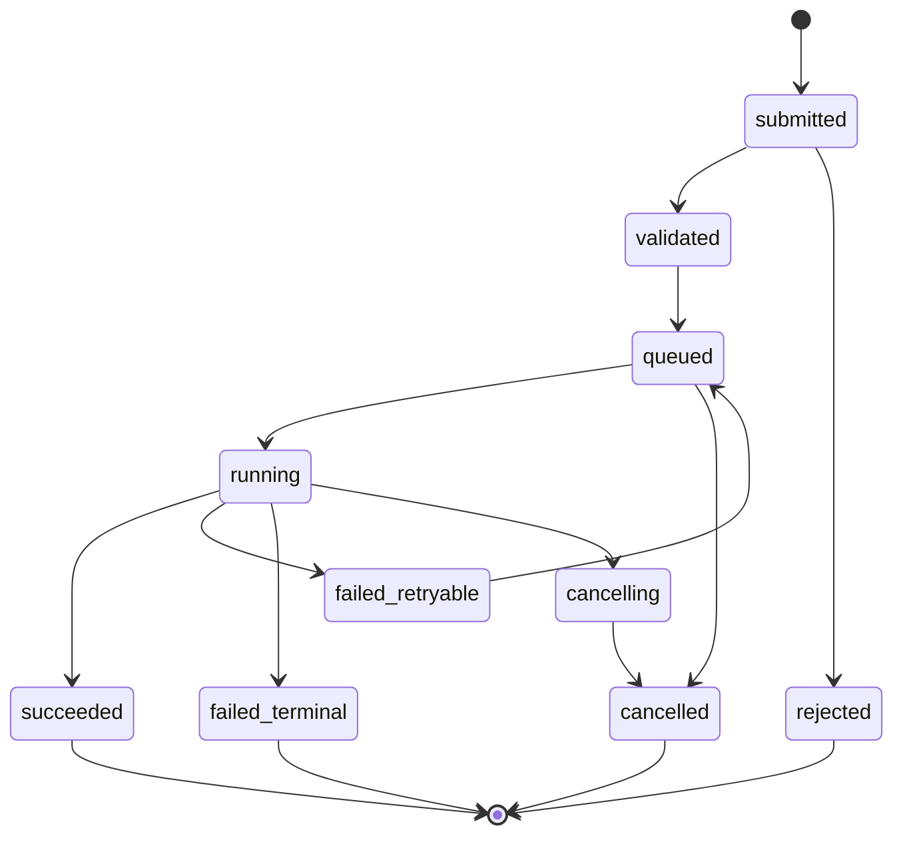
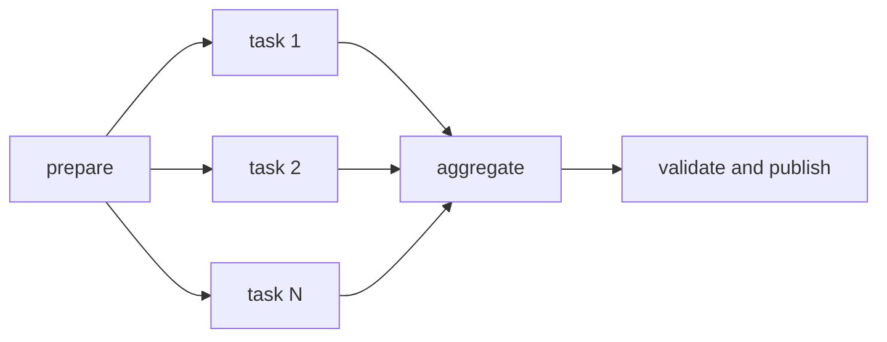
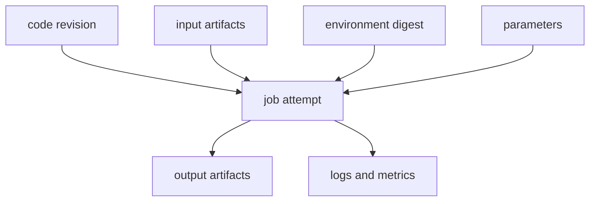



El software científico y de ingeniería falla más a menudo en la gestión de la ejecución que en sus ecuaciones.
Una plataforma no es confiable si un cálculo desaparece cuando se desconecta una solicitud de usuario, los reintentos crean ejecuciones duplicadas o los archivos de resultados no se pueden vincular a sus versiones de entrada.

La clave es evitar realizar el cálculo directamente dentro de una solicitud HTTP y, en su lugar, **promocionarlo a un trabajo duradero y artefactos inmutables**.

## 1. Haga del trabajo un objeto de primera clase

Un registro de trabajo tiene al menos los siguientes campos.

- `job_id`: identificador interno estable
- `job_type`: tipo utilizado para seleccionar un ejecutor
- `state`: estado actual en la máquina de estados
- `input_manifest`: referencias a artefactos y parámetros de entrada.
- `execution_spec`: imagen, comando, recursos y entorno
- `attempt`: recuento de reintentos
- `idempotency_key`: evita envíos duplicados
- `created_at`, `started_at`, `finished_at`
- `result_manifest`: referencias a artefactos de salida.
- `provenance`: código e identidad de tiempo de ejecución
- `error_class`: causa clasificada de fallo

Este registro, en lugar de la barra de progreso del UI, debe ser la fuente de la verdad.

## 2. Especificar la máquina de estados

Los siguientes estados son una base recomendada.



Realizar transiciones como operaciones atómicas condicionales.
Utilice una versión o compare e intercambie para que dos trabajadores no puedan reclamar simultáneamente el mismo trabajo que `running`.

## 3. Enviar API e Idempotencia

Después de un tiempo de espera de la red, un cliente puede volver a enviar la misma solicitud.
El servidor almacena una clave de idempotencia y un hash de solicitud canónico.

- Misma clave y misma carga útil: devolver el trabajo existente
- Misma clave y diferente carga útil: rechazarla como un conflicto
- Nueva clave: crear un nuevo trabajo

Defina el período de retención de idempotencia y el alcance del inquilino.
En la medida de lo posible, la ejecución del trabajo en sí también debe aislar las rutas de salida y los efectos secundarios del intento.

## 4. Lo que garantiza y lo que no garantiza la cola

La mayoría de las colas prácticas se comportan aproximadamente como una entrega de al menos una vez.
Como un mensaje puede entregarse más de una vez, el consumidor debe ser idempotente.

No coloque entradas enormes en un mensaje en cola; incluya solo el trabajo ID y pequeños metadatos de enrutamiento.
Lea el estado autorizado y el manifiesto de la tienda transaccional.

Considere este pedido para acuse de recibo.

1. Adquirir el contrato de arrendamiento de empleo
2. Preparar la ejecución y crear un intento.
3. Confirmar resultados y estado
4. Confirme el mensaje de la cola

Si el trabajador muere antes del reconocimiento, el mensaje se vuelve a entregar y el estado y el contrato de arrendamiento evitan la ejecución duplicada.

## 5. Arrendamientos y latidos

Utilice el vencimiento del arrendamiento y los latidos del corazón para determinar si un trabajador en ejecución ha muerto.

- `lease_owner`
- `lease_expires_at`
- `heartbeat_at`
- época del planificador/trabajador

Iniciar un segundo trabajador inmediatamente basándose únicamente en un latido retrasado puede crear un cerebro dividido durante una pausa prolongada en la recolección de basura o una partición de la red.
Se puede pasar una ficha de vallado a efectos secundarios externos para que rechacen las escrituras de un propietario obsoleto.

## 6. Reintentar taxonomía

Reintentar cada falla genera costos desbocados y daños repetidos.

### Reintentable

- Error de red transitorio
- Rechazo del programador temporal
- preferencia
- Error transitorio en el almacén de artefactos.
- Límite de tarifa de servicio externo

### terminal

- Esquema de entrada no válido
- Artefacto faltante
- Denegación de licencia o permiso
- Error determinista del solucionador
- Combinación de tiempo de ejecución no compatible

### Desconocido

Si no se puede clasificar la causa, ponga el trabajo en cuarentena después de un número limitado de reintentos.

Utilice retroceso y fluctuación exponenciales y establezca un recuento máximo de intentos y un presupuesto total de reintentos.

## 7. El manifiesto de entrada debe ser inmutable

Si un trabajo lee el "archivo más reciente" después de iniciarse, el resultado cambia dependiendo de cuándo se ejecuta.
Anclar entradas con un resumen dirigido al contenido o una versión inmutable ID.

Conceptualmente, un manifiesto contiene la siguiente información.

```yaml
schema_version: v1
inputs:
  - role: mesh
    artifact: sha256:<digest>
  - role: parameters
    artifact: sha256:<digest>
runtime:
  image: registry.example/solver@sha256:<digest>
entrypoint: ["solver", "--manifest", "input.yml"]
```

Los marcadores de posición en este ejemplo no son secretos reales ni direcciones privadas.

## 8. Separe el almacén de artefactos del almacén de metadatos

Mantenga archivos binarios y registros de gran tamaño en el almacenamiento de objetos, y estados y relaciones con capacidad de búsqueda en una base de datos.

Los metadatos de artefactos incluyen lo siguiente.

- Resumen y tamaño
- Tipo de medio y versión del esquema.
- Trabajo/intento de productor
- Rol lógico
- Marca de tiempo de creación
- Clase de retención
- Referencia de política de cifrado/claves
- Estado de validación

Detecte daños en tránsito comparando la suma de verificación proporcionada por el cliente con la suma de verificación calculada por el servidor.

## 9. Publicación atómica

Si otro servicio lee un directorio de salida mientras un trabajador escribe en él, ese servicio puede ver un resultado parcial.

1. Escriba la salida en un prefijo temporal dedicado al intento.
2. Genere la suma de comprobación de cada archivo y un manifiesto.
3. Realizar validación
4. Publicar en una ubicación final inmutable
5. Vincular el manifiesto de resultados en una transacción DB
6. Transición del trabajo a `succeeded`

Establezca el estado de éxito solo después de que los artefactos se puedan leer y validar.

## 10. Registros y progreso

No agregue continuamente toda la salida estándar a una fila DB.
Separe los artefactos de registro fragmentados del índice de eventos con capacidad de búsqueda.

Expresar el progreso en etapas monótonas y métricas definidas por el solucionador.

- etapa: preprocesamiento, resolución, posprocesamiento
- unidad completada / unidad total
- iteración actual y residual
- último latido
- el tiempo estimado es opcional y debe indicar incertidumbre

Separe los mensajes de cara al usuario de los diagnósticos del operador para que las rutas internas, los comandos y los secretos no queden expuestos.

## 11. Límite con el Programador HPC

La cola de la plataforma y la cola del programador HPC cumplen funciones diferentes.

- Plataforma: autorización de usuario, validación, procedencia, artefactos y estado del producto.
- Programador: asignación de recursos informáticos, prioridad, ubicación de nodos y contabilidad

Un adaptador traduce la especificación del trabajo en un envío del programador y almacena el trabajo externo ID.
Para manejar una respuesta perdida después de un envío exitoso, use un marcador o comentario generado por el cliente para la conciliación.

## 12. Fundamentos de la integración de barrios marginales

En Slurm, `sbatch` envía un script por lotes y devuelve un trabajo del programador ID.
Una matriz de trabajos representa un conjunto de tareas homogéneas, las dependencias expresan relaciones de precedencia y `sacct` se utiliza para inspeccionar la contabilidad de los trabajos completados.

Utilice un modelo de argumento seguro y una lista de plantillas permitidas para que la plataforma no concatene directamente cadenas de comandos de shell.
Insertar la entrada del usuario directamente en una directiva del programador o en un shell introduce un riesgo de inyección.

## 13. Matrices de trabajos y DAG de flujo de trabajo

Descomponer un barrido de parámetros en tareas secundarias, en lugar de crear un trabajo enorme, mejora el comportamiento de reintento y la observabilidad.



Aplique cuotas y contrapresión al conteo de distribución.
El paso agregado lee los manifiestos secundarios completos en orden determinista.

## 14. Solicitudes y programación de recursos

Una especificación de trabajo indica recursos como CPU, memoria, acelerador, tiempo de pared, espacio temporal local y tokens de licencia.

Las solicitudes que son demasiado pequeñas provocan errores y tiempos de espera OOM; las solicitudes que son demasiado grandes aumentan la espera en la cola y el costo.
Observe el uso máximo de ejecuciones anteriores para hacer recomendaciones, pero considere un margen de seguridad y la aprobación del usuario antes de reducir automáticamente las solicitudes.

Aplique cuotas de recursos por inquilino y proyecto, y utilice el control de admisión para envíos masivos.

## 15. Captura de contenedores y entornos

Una imagen de contenedor fija parte del entorno de ejecución pero no garantiza una reproducibilidad completa.

- Resumen de imágenes
- Compatibilidad del kernel y del controlador del host
- Tiempo de ejecución del acelerador
- Conjunto de instrucciones CPU
- Localidad y zona horaria
- Biblioteca de recuento de hilos y matemáticas.
- Licencia/servicio externo
- Semilla aleatoria y algoritmo no determinista.

Almacene un resumen inmutable en lugar de una etiqueta.

## 16. Gráfico de procedencia

La procedencia muestra "qué entradas, código, entorno y resultados principales produjeron un resultado".



Es útil proporcionar un `run manifest` reproducible y un `report manifest` legible por humanos.

## 17. Cancelaciones y tiempos de espera

La cancelación API registra la solicitud, luego cancela el trabajo del programador y le indica al trabajador.
La cancelación es un protocolo, no un estado instantáneo.

- Cancelar solicitado
- Reconocimiento del programador externo
- Terminación del proceso confirmada
- Se aplicó la política de artefactos parciales.
- Transición final a cancelada.

Después de una señal elegante, el proceso puede finalizarse por la fuerza una vez que pase el límite de tiempo.
Utilice un marcador `incomplete` para que la salida parcial no se confunda con un resultado.

## 18. Bucle de reconciliación

Dado que se puede perder la entrega de eventos, compare periódicamente el estado interno con el planificador externo y el almacén de artefactos.

- El estado interno se está ejecutando pero no existe ningún trabajo externo.
- El trabajo externo está completo pero el estado interno se está ejecutando
- El estado se logró pero falta el manifiesto de resultados.
- El contrato de arrendamiento ha expirado pero el proceso está vivo.
- Trabajo de artefacto o programador huérfano

El conciliador debe ser idempotente y dejar pruebas y un registro de acciones antes de realizar correcciones.

## 19. Límites de seguridad

- No ejecute la entrada del usuario directamente a través de un shell.
- Una identidad de trabajador puede acceder solo al prefijo de artefacto que necesita.
- Aplicar un espacio de nombres y una autorización para cada inquilino.
- Redactar secretos y rutas internas de registros y errores.
- Verificar imágenes firmadas y procedencia de dependencia.
- Trate el analizador de salida como si estuviera procesando entradas que no son de confianza.
- Registrar las acciones del administrador y del usuario en el registro de auditoría.

## 20. Lista de verificación de validación operativa

- [] Las transiciones de estado del trabajo tienen una definición en el código y la documentación.
- [] Reenviar la misma clave de idempotencia no crea un trabajo duplicado.
- [ ] No hay efectos secundarios duplicados antes o después de un accidente laboral.
- [ ] Se han probado la caducidad del contrato de arrendamiento y el vallado.
- [ ] La clasificación de error reintentable/terminal es explícita.
- [] Las entradas y las imágenes se fijan con resúmenes inmutables.
- [ ] No se publican artefactos parciales.
- [] Las sumas de verificación de los resultados se verifican antes del éxito.
- [] La conciliación se recupera de una respuesta perdida del programador.
- [ ] Se han probado carreras entre cancelación y tiempo muerto.
- [] La acumulación de colas y la tasa de envío están sujetas a contrapresión.
- [] La procedencia puede rastrear un resultado hasta sus entradas.
- [ ] DB y la coherencia del almacén de objetos se verificaron durante la recuperación ante desastres.
- [ ] Se observan el costo, el tiempo de cola, el tiempo de ejecución y la tasa de fallas.

## 21. Limitaciones y patrones de falla comunes

### Computación de larga duración dentro de una solicitud web

Las desconexiones de clientes y los tiempos de espera de la puerta de enlace se acoplan al ciclo de vida de cálculo.

### Reclamar la cola proporciona un procesamiento exactamente una vez

En un sistema distribuido, es más práctico asumir una entrega duplicada y hacer que las transiciones de estado y los efectos secundarios sean idempotentes.

### Determinar el éxito únicamente a partir del código de salida del proceso

También se deben verificar los resultados, esquemas, sumas de verificación y validación de dominio requeridos.

### Conservar cada registro para siempre

Esto aumenta tanto el costo como la superficie de exposición de información confidencial.
Diseñar políticas de retención, redacción y niveles.

### Exponer el estado del programador directamente como estado del producto

La semántica de estado difiere entre los programadores y se omiten las etapas de publicación y validación de cara al usuario.

## 22. Referencias oficiales y primarias

- Slurm, [documentación oficial del lote](https://slurm.schedmd.com/sbatch.html).
- Slurm, [Documentación de matriz de trabajos](https://slurm.schedmd.com/job_array.html).
- Slurm, [documentación contable sacct](https://slurm.schedmd.com/sacct.html).
- W3C, [PROV-DM: El modelo de datos PROV](https://www.w3.org/TR/prov-dm/).
- OCI, [Especificaciones de imagen y distribución](https://opencontainers.org/).
- Kubernetes, [Documentación de trabajos](https://kubernetes.io/docs/concepts/workloads/controllers/job/).

Una plataforma informática confiable no es simplemente un sistema que ejecuta Jobs.
Es **un sistema que preserva las relaciones causales entre entradas, ejecución y resultados a pesar de duplicados, fallas, cancelaciones y reintentos**.
