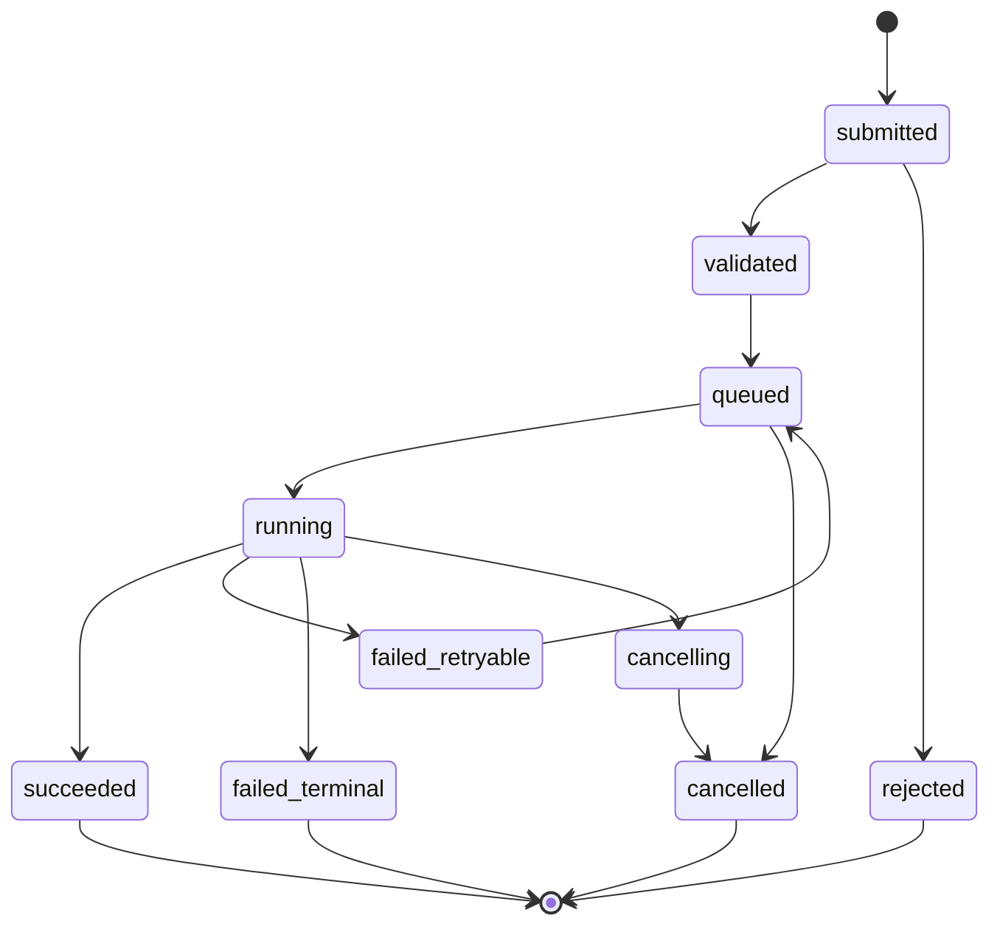
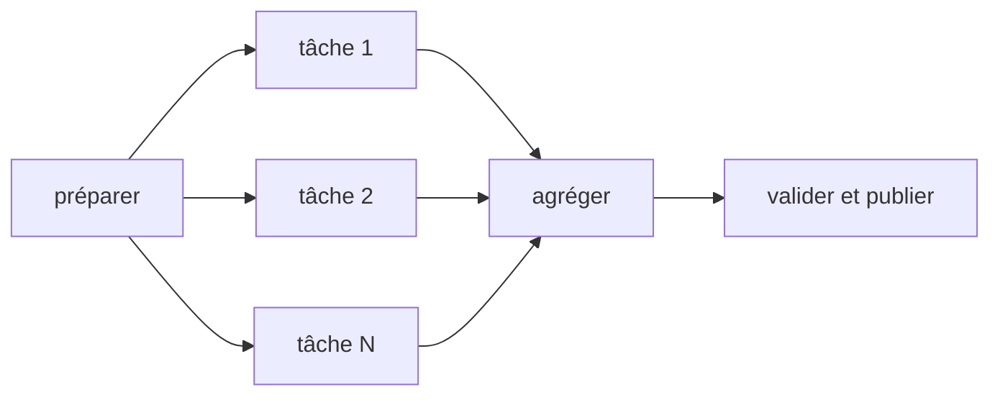
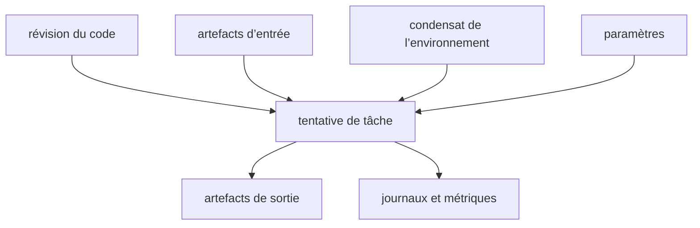



Les logiciels scientifiques et d’ingénierie échouent plus souvent dans la gestion de l’exécution que dans leurs équations.
Une plateforme n’est pas digne de confiance si un calcul disparaît lorsque la requête d’un utilisateur est interrompue, si les relances créent des exécutions en double ou si les fichiers de résultats ne peuvent pas être reliés aux versions de leurs entrées.

La clé consiste à ne pas effectuer le calcul directement dans une requête HTTP, mais à **le promouvoir en tâche durable et en artefacts immuables**.

## 1. Faire de la tâche un objet de premier ordre

Un enregistrement de tâche comporte au minimum les champs suivants.

- `job_id` : identifiant interne stable
- `job_type` : type servant à sélectionner un exécuteur
- `state` : état courant dans la machine à états
- `input_manifest` : références aux artefacts d’entrée et aux paramètres
- `execution_spec` : image, commande, ressources et environnement
- `attempt` : nombre de tentatives
- `idempotency_key` : empêche les soumissions en double
- `created_at`, `started_at`, `finished_at`
- `result_manifest` : références aux artefacts de sortie
- `provenance` : identité du code et de l’environnement d’exécution
- `error_class` : cause d’échec classifiée

Cet enregistrement, et non la barre de progression de l’interface, doit constituer la source de vérité.

## 2. Spécifier la machine à états

Les états suivants constituent une base recommandée.



Effectuez les transitions sous forme d’opérations atomiques conditionnelles.
Utilisez une version ou une opération de comparaison et échange afin que deux workers ne puissent pas revendiquer simultanément la même tâche comme `running`.

## 3. API de soumission et idempotence

Après un délai d’attente réseau dépassé, un client peut renvoyer la même requête.
Le serveur stocke une clé d’idempotence et une empreinte canonique de la requête.

- Même clé et même charge utile : renvoyer la tâche existante
- Même clé et charge utile différente : rejeter la requête comme un conflit
- Nouvelle clé : créer une nouvelle tâche

Définissez la durée de conservation de l’idempotence et sa portée par locataire.
Dans la mesure du possible, l’exécution même de la tâche doit aussi isoler les chemins de sortie et les effets de bord par tentative.

## 4. Ce que la file garantit et ne garantit pas

La plupart des files utilisées en pratique se comportent approximativement selon une livraison au moins une fois.
Comme un message peut être livré plusieurs fois, le consommateur doit être idempotent.

Ne placez pas de très grandes entrées dans un message de file ; n’y incluez que l’identifiant de la tâche et quelques métadonnées de routage.
Lisez l’état faisant autorité et le manifeste depuis le magasin transactionnel.

Pour l’accusé de réception, envisagez l’ordre suivant.

1. Acquérir le bail de la tâche
2. Préparer l’exécution et créer une tentative
3. Valider les résultats et l’état
4. Accuser réception du message de la file

Si le worker s’arrête avant l’accusé de réception, le message est livré de nouveau, et l’état ainsi que le bail empêchent une exécution en double.

## 5. Baux et signaux de vie

Utilisez l’expiration du bail et des signaux de vie pour déterminer si un worker en cours d’exécution est mort.

- `lease_owner`
- `lease_expires_at`
- `heartbeat_at`
- époque de l’ordonnanceur ou du worker

Démarrer immédiatement un second worker sur la seule base d’un signal de vie retardé peut créer un fonctionnement en cerveau scindé lors d’une longue pause du ramasse-miettes ou d’une partition réseau.
Un jeton d’exclusion peut être transmis aux effets de bord externes afin qu’ils refusent les écritures provenant d’un ancien propriétaire.

## 6. Taxonomie des nouvelles tentatives

Relancer chaque échec entraîne une explosion des coûts et des dommages répétés.

### Relançables

- Erreur réseau transitoire
- Rejet temporaire par l’ordonnanceur
- Préemption
- Erreur transitoire du magasin d’artefacts
- Limitation de débit d’un service externe

### Définitifs

- Schéma d’entrée non valide
- Artefact manquant
- Refus de licence ou d’autorisation
- Erreur déterministe du solveur
- Combinaison d’environnements d’exécution non prise en charge

### Inconnus

Si la cause ne peut pas être classifiée, mettez la tâche en quarantaine après un nombre limité de tentatives.

Utilisez une temporisation exponentielle avec aléa, et définissez un nombre maximal de tentatives ainsi qu’un budget total de relance.

## 7. Le manifeste d’entrée doit être immuable

Si une tâche lit le « dernier fichier » après son démarrage, le résultat varie selon le moment où elle s’exécute.
Épinglez les entrées au moyen d’un condensat adressé par contenu ou d’un identifiant de version immuable.

Conceptuellement, un manifeste contient les informations suivantes.

```yaml
schema_version: v1
inputs:
  - role: mesh
    artifact: sha256:<digest>
  - role: parameters
    artifact: sha256:<digest>
runtime:
  image: registry.example/solver@sha256:<digest>
entrypoint: ["solver", "--manifest", "input.yml"]
```

Les espaces réservés de cet exemple ne sont ni de véritables secrets ni des adresses privées.

## 8. Séparer le magasin d’artefacts du magasin de métadonnées

Conservez les gros fichiers binaires et les journaux dans un stockage objet, et les états et relations interrogeables dans une base de données.

Les métadonnées d’un artefact comprennent les éléments suivants.

- Condensat et taille
- Type de média et version du schéma
- Tâche ou tentative productrice
- Rôle logique
- Horodatage de création
- Classe de conservation
- Référence à la politique de chiffrement ou de clés
- État de validation

Détectez les corruptions pendant le transfert en comparant la somme de contrôle fournie par le client à celle calculée par le serveur.

## 9. Publication atomique

Si un autre service lit un répertoire de sortie pendant qu’un worker y écrit, ce service peut voir un résultat partiel.

1. Écrire la sortie sous un préfixe temporaire propre à la tentative
2. Générer la somme de contrôle de chaque fichier et un manifeste
3. Effectuer la validation
4. Publier dans un emplacement final immuable
5. Relier le manifeste de résultats dans une transaction de base de données
6. Faire passer la tâche à `succeeded`

Ne définissez l’état de réussite qu’une fois les artefacts réellement lisibles et validés.

## 10. Journaux et progression

N’ajoutez pas continuellement l’intégralité de la sortie standard à une ligne de base de données.
Séparez les artefacts de journaux segmentés de l’index d’événements interrogeable.

Exprimez la progression par des étapes monotones et des métriques définies par le solveur.

- étape : prétraitement, résolution, post-traitement
- unités terminées / unités totales
- itération courante et résidu
- dernier signal de vie
- la durée estimée est facultative et doit indiquer son incertitude

Séparez les messages destinés aux utilisateurs des diagnostics d’exploitation afin de ne pas exposer les chemins internes, les commandes et les secrets.

## 11. Frontière avec l’ordonnanceur HPC

La file de la plateforme et celle de l’ordonnanceur HPC remplissent des rôles différents.

- Plateforme : autorisation des utilisateurs, validation, provenance, artefacts et état du produit
- Ordonnanceur : allocation des ressources de calcul, priorité, placement sur les nœuds et comptabilisation

Un adaptateur traduit la spécification de la tâche en soumission à l’ordonnanceur et stocke l’identifiant externe de la tâche.
Pour gérer une réponse perdue après une soumission réussie, utilisez un marqueur ou commentaire généré par le client pour la réconciliation.

## 12. Principes fondamentaux de l’intégration à Slurm

Dans Slurm, `sbatch` soumet un script de traitement par lots et renvoie un identifiant de tâche de l’ordonnanceur.
Un tableau de tâches représente un ensemble de tâches homogènes, les dépendances expriment les relations de précédence et `sacct` sert à consulter la comptabilisation des tâches achevées.

Utilisez un modèle d’arguments sûr et une liste blanche de modèles afin que la plateforme ne concatène pas directement des chaînes de commandes shell.
Insérer directement une entrée utilisateur dans une directive de l’ordonnanceur ou dans le shell crée un risque d’injection.

## 13. Tableaux de tâches et DAG de workflow

Décomposer une exploration de paramètres en tâches enfants, plutôt que créer une seule tâche énorme, améliore le comportement des relances et l’observabilité.



Appliquez des quotas et une contre-pression au nombre de tâches issues de la dispersion.
L’étape d’agrégation lit les manifestes des tâches enfants terminées dans un ordre déterministe.

## 14. Demandes de ressources et planification

Une spécification de tâche indique des ressources telles que le processeur, la mémoire, l’accélérateur, le temps d’exécution maximal, l’espace de travail local et les jetons de licence.

Des demandes trop faibles entraînent des erreurs d’épuisement mémoire et des dépassements de délai ; des demandes trop élevées augmentent l’attente en file et le coût.
Observez l’utilisation maximale des exécutions passées pour formuler des recommandations, mais prévoyez une marge de sécurité et l’approbation de l’utilisateur avant de réduire automatiquement les demandes.

Appliquez des quotas de ressources par locataire et projet, et un contrôle d’admission aux soumissions en masse.

## 15. Conteneurs et capture de l’environnement

Une image de conteneur épingle une partie de l’environnement d’exécution, mais ne garantit pas une reproductibilité complète.

- Condensat de l’image
- Compatibilité avec le noyau et les pilotes de l’hôte
- Environnement d’exécution de l’accélérateur
- Jeu d’instructions du processeur
- Paramètres régionaux et fuseau horaire
- Nombre de threads et bibliothèque mathématique
- Licence ou service externe
- Graine aléatoire et algorithme non déterministe

Stockez un condensat immuable plutôt qu’une étiquette.

## 16. Graphe de provenance

La provenance indique « quelles entrées, quel code, quel environnement et quels résultats parents ont produit un résultat ».



Il est utile de fournir à la fois un `run manifest` reproductible et un `report manifest` lisible par un humain.

## 17. Annulation et délais d’attente

L’API d’annulation enregistre la demande, puis annule la tâche dans l’ordonnanceur et envoie un signal au worker.
L’annulation est un protocole, pas un état instantané.

- Annulation demandée
- Accusé de réception de l’ordonnanceur externe
- Arrêt du processus confirmé
- Politique relative aux artefacts partiels appliquée
- Transition finale vers l’état annulé

Après un signal d’arrêt normal, le processus peut être interrompu de force une fois le délai dépassé.
Utilisez un marqueur `incomplete` afin qu’une sortie partielle ne soit pas prise pour un résultat.

## 18. Boucle de réconciliation

Comme la livraison d’événements peut échouer, comparez périodiquement l’état interne avec l’ordonnanceur externe et le magasin d’artefacts.

- L’état interne indique une exécution en cours, mais aucune tâche externe n’existe
- La tâche externe est terminée, mais l’état interne indique toujours une exécution en cours
- L’état indique une réussite, mais le manifeste de résultats est absent
- Le bail a expiré, mais le processus est vivant
- Artefact ou tâche d’ordonnanceur orphelin

Le réconciliateur doit être idempotent et laisser des preuves ainsi qu’un journal des actions avant d’apporter des corrections.

## 19. Frontières de sécurité

- N’exécutez pas directement une entrée utilisateur dans un shell.
- L’identité d’un worker ne peut accéder qu’au préfixe d’artefacts dont il a besoin.
- Faites respecter un espace de noms et des autorisations pour chaque locataire.
- Masquez les secrets et chemins internes dans les journaux et erreurs.
- Vérifiez les images signées et la provenance des dépendances.
- Considérez l’analyseur de sortie comme s’il traitait une entrée non fiable.
- Enregistrez les actions des administrateurs et utilisateurs dans le journal d’audit.

## 20. Liste de contrôle de validation opérationnelle

- [ ] Les transitions d’état des tâches n’ont qu’une définition dans le code et la documentation.
- [ ] Renvoyer la même clé d’idempotence ne crée pas de tâche en double.
- [ ] Aucun effet de bord n’est dupliqué avant ou après l’arrêt brutal d’un worker.
- [ ] L’expiration du bail et l’exclusion des anciens propriétaires ont été testées.
- [ ] La classification des erreurs relançables et définitives est explicite.
- [ ] Les entrées et images sont épinglées par des condensats immuables.
- [ ] Les artefacts partiels ne sont pas publiés.
- [ ] Les sommes de contrôle des résultats sont vérifiées avant de déclarer la réussite.
- [ ] La réconciliation récupère d’une réponse perdue de l’ordonnanceur.
- [ ] Les courses entre annulation et dépassement de délai ont été testées.
- [ ] La contre-pression s’applique à l’arriéré de la file et au débit de soumission.
- [ ] La provenance permet de remonter d’un résultat à ses entrées.
- [ ] La cohérence entre la base de données et le stockage objet a été vérifiée lors d’une reprise après sinistre.
- [ ] Le coût, le temps d’attente, le temps d’exécution et le taux d’échec sont observés.

## 21. Schémas d’échec courants et limites

### Calcul de longue durée dans une requête web

Les déconnexions des clients et les dépassements de délai des passerelles se retrouvent couplés au cycle de vie du calcul.

### Prétendre que la file garantit un traitement exactement une fois

Dans un système distribué, il est plus pratique de supposer une livraison en double et de rendre les transitions d’état ainsi que les effets de bord idempotents.

### Déterminer la réussite uniquement d’après le code de sortie du processus

Il faut également vérifier les sorties requises, les schémas, les sommes de contrôle et la validation métier.

### Conserver tous les journaux indéfiniment

Cela augmente à la fois le coût et la surface d’exposition des informations sensibles.
Concevez des politiques de conservation, de masquage et de stockage par niveaux.

### Exposer directement l’état de l’ordonnanceur comme état du produit

La sémantique des états varie selon les ordonnanceurs, et les étapes de validation et de publication visibles par l’utilisateur sont omises.

## 22. Références officielles et primaires

- Slurm, [documentation officielle de sbatch](https://slurm.schedmd.com/sbatch.html).
- Slurm, [documentation sur les tableaux de tâches](https://slurm.schedmd.com/job_array.html).
- Slurm, [documentation de comptabilisation de sacct](https://slurm.schedmd.com/sacct.html).
- W3C, [PROV-DM : le modèle de données PROV](https://www.w3.org/TR/prov-dm/).
- OCI, [spécifications des images et de la distribution](https://opencontainers.org/).
- Kubernetes, [documentation sur les Jobs](https://kubernetes.io/docs/concepts/workloads/controllers/job/).

Une plateforme de calcul digne de confiance n’est pas seulement un système qui exécute des tâches.
C’est **un système qui préserve les relations causales entre entrées, exécution et résultats malgré les doublons, les échecs, les annulations et les nouvelles tentatives**.
