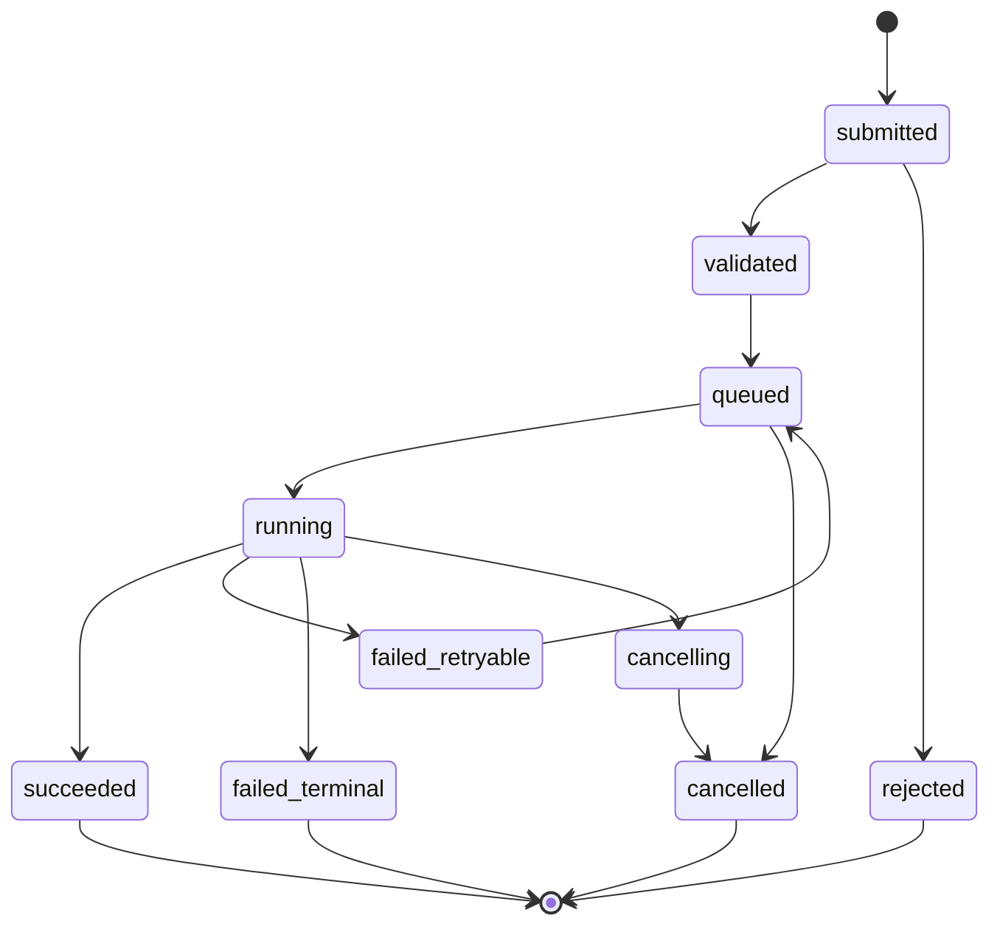
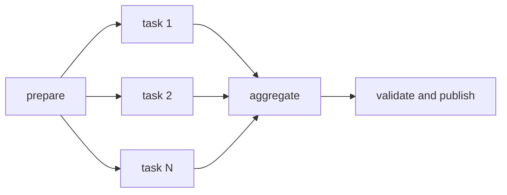
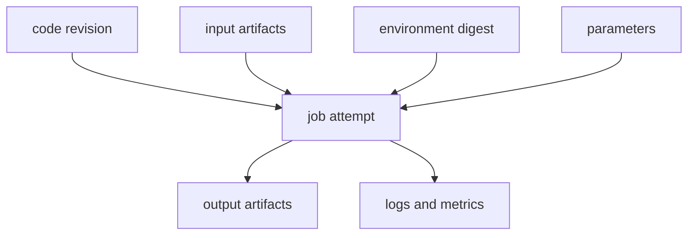



科学・エンジニアリングソフトウェアは、計算式より実行管理で失敗することが多い。
利用者のリクエストが途切れたときに計算も消え、再試行が重複実行を作り、結果ファイルと入力versionを接続できないなら、信頼できるプラットフォームではない。

核心は、計算をHTTPリクエストの中で直接行わず、**耐久性のあるJobと不変のArtifactへ昇格**させることである。

## 1. Jobを第一級オブジェクトにする

Job recordは最低限、次を持つ。

- `job_id`：安定した内部識別子
- `job_type`：executor選択用の型
- `state`：state machineの現在状態
- `input_manifest`：入力artifactとparameterの参照
- `execution_spec`：image、command、resource、environment
- `attempt`：再試行回数
- `idempotency_key`：重複投入の防止
- `created_at`、`started_at`、`finished_at`
- `result_manifest`：出力artifactの参照
- `provenance`：codeとruntime identity
- `error_class`：分類された失敗原因

UIのprogress barより、このrecordがsingle source of truthでなければならない。

## 2. state machineを明示する

推奨する基本状態は次のとおりである。



transitionは条件付きatomic operationとして行う。
2つのworkerが同じJobを同時に`running`として取得しないよう、versionまたはcompare-and-swapを使う。

## 3. Submit APIとidempotency

network timeoutの後、clientは同じリクエストを再送し得る。
サーバーはidempotency keyとcanonical request hashを保存する。

- 同じkeyと同じpayload：既存Jobを返す
- 同じkeyと異なるpayload：conflictとして拒否
- 新しいkey：新規Jobを作成

idempotencyの保持期間とtenant scopeを定義する。
Job execution自体も可能な限り、output pathとside effectをattemptごとに分離する。

## 4. Queueが保証すること、しないこと

実用的なqueueの多くはat-least-once deliveryに近い。
messageが重複配信され得るため、consumerはidempotentでなければならない。

queue messageへ巨大な入力を入れず、job IDと小さなrouting metadataだけを置く。
実際の状態とmanifestはtransactional storeから読む。

delivery acknowledgmentは次の順序を検討する。

1. Job lease取得
2. 実行準備とattempt作成
3. 結果・状態commit
4. queue ack

ack前にworkerが停止するとmessageが再配信され、state/leaseが重複実行を防止する。

## 5. Leaseとheartbeat

running workerが停止したかを知るため、lease expiryとheartbeatを使う。

- `lease_owner`
- `lease_expires_at`
- `heartbeat_at`
- scheduler/worker epoch

heartbeatの遅延だけで直ちに2つ目のworkerを実行すると、長いgarbage collectionやnetwork partitionでsplit-brainが生じる。
fencing tokenを外部side effectへ渡し、古いownerからの書き込みを拒否できる。

## 6. Retry taxonomy

すべての失敗を再試行すると、コストの暴走と反復的な破損が生じる。

### Retryable

- 一時的なnetworkエラー
- scheduler temporary rejection
- preemption
- 一時的なartifact storeエラー
- 外部サービスのrate limit

### Terminal

- 誤ったinput schema
- 存在しないartifact
- license・権限拒否
- deterministic solver error
- 非対応runtimeの組み合わせ

### Unknown

原因を分類できない場合、制限付きretryの後にquarantineする。

exponential backoffとjitterを使い、maximum attemptとtotal retry budgetを設ける。

## 7. 入力manifestは不変でなければならない

Job開始後に「最新ファイル」を読むと、実行時点によって結果が変わる。
入力はcontent-addressed digestまたはimmutable version IDで固定する。

manifestの例は概念上、次の情報を持つ。

```yaml
schema_version: v1
inputs:
  - role: mesh
    artifact: sha256:<digest>
  - role: parameters
    artifact: sha256:<digest>
runtime:
  image: registry.example/solver@sha256:<digest>
entrypoint: ["solver", "--manifest", "input.yml"]
```

例中のplaceholderは実際のsecretやprivate addressではない。

## 8. Artifact storeとmetadata storeを分離する

大きなbinaryとlogはobject storageへ、検索・状態・関係はdatabaseへ置く。

artifact metadataには次を含める。

- digestとsize
- media typeとschema version
- producer job/attempt
- logical role
- created timestamp
- retention class
- encryption/key policy reference
- validation status

clientが送ったchecksumとserverが計算したchecksumを比較し、転送損傷を検出する。

## 9. Atomic publish

workerがoutput directoryへ書き込み中に別サービスが読むと、partial resultが見えてしまう。

1. attempt専用の一時prefixへ出力
2. 各fileのchecksumとmanifestを作成
3. validation実行
4. immutable final locationへpublish
5. DB transactionでresult manifestを接続
6. Jobを`succeeded`へ遷移

成功状態はartifactが実際に読み取られ、検証された後だけ設定する。

## 10. logとprogress

stdout全体をDB rowへ継続的にappendしない。
chunked log artifactとsearchable event indexを分離する。

progressはsolverが定義したmonotonic stageとmetricで表現する。

- stage：preprocessing、solving、postprocessing
- completed unit / total unit
- current iterationとresidual
- last heartbeat
- estimated timeは任意とし、不確実性を表示

利用者向けmessageとoperator diagnosticを分け、内部path・command・secretを露出させない。

## 11. HPC schedulerとの境界

プラットフォームqueueとHPC scheduler queueは役割が異なる。

- プラットフォーム：利用者権限、validation、provenance、artifact、product state
- scheduler：compute resource allocation、priority、node placement、accounting

adapterはJob specをscheduler submissionへ変換し、external job IDを保存する。
submission成功後のレスポンス損失に備え、client-generated markerまたはcommentを使ってreconciliationする。

## 12. Slurm連携の基本概念

Slurmでは`sbatch`でbatch scriptを投入し、scheduler job IDを受け取る。
job arrayは同型taskの集合、dependencyは先後関係、`sacct`は完了Jobのaccounting確認に使う。

プラットフォームがshell command文字列を直接連結しないよう、安全なargument modelとtemplate allowlistを使う。
利用者入力をscheduler directiveやshellへそのまま挿入するとinjectionの危険がある。

## 13. Job arrayとworkflow DAG

parameter sweepを1つの巨大Jobにするよりchild taskへ分解すると、再試行性とobservabilityが向上する。



fan-out数にはquotaとbackpressureを適用する。
aggregateは完了したchild manifestをdeterministic orderで読む。

## 14. Resource requestとscheduling

Job specはCPU、memory、accelerator、wall time、local scratch、license tokenなどのリソースを明示する。

requestが小さすぎるとOOM・timeout、大きすぎるとqueue waitとコストが増える。
過去実行のpeak usageを観測してrecommendationを作るが、自動縮小には安全marginと利用者承認を考慮する。

resource quotaはtenantとproject単位で適用し、大量submitへadmission controlを設ける。

## 15. Containerとenvironment capture

container imageは実行環境の一部を固定するが、完全な再現性を保証しない。

- image digest
- host kernelとdriver compatibility
- accelerator runtime
- CPU instruction set
- localeとtimezone
- thread countとmath library
- external license/service
- random seedとnondeterministic algorithm

tagではなくimmutable digestを保存する。

## 16. Provenance graph

provenanceは「どの結果が、どの入力・コード・環境・parent結果から生成されたか」を表す。



再実行可能な`run manifest`と、人が読む`report manifest`の両方を提供するとよい。

## 17. キャンセルとtimeout

cancel APIは要求を記録した後、scheduler cancelとworker signalを実行する。
キャンセルは瞬間的な状態ではなくprotocolである。

- cancel requested
- external scheduler acknowledged
- process terminationの確認
- partial artifact方針の適用
- final cancelledへの遷移

graceful signal後、制限時間を過ぎれば強制終了できる。
partial outputを結果と誤認しないよう、`incomplete` markerを置く。

## 18. Reconciliation loop

event配信は欠落し得るため、内部状態と外部scheduler・artifact storeを定期的に照合する。

- 内部はrunningだが外部Jobがない
- 外部は完了したが内部はrunning
- succeededだがresult manifestが欠落
- leaseが失効したがprocessは生存
- orphan artifactまたはscheduler Job

reconcilerは修正前の証拠とaction logを残し、idempotentでなければならない。

## 19. セキュリティ境界

- 利用者入力をshellとして直接実行しない。
- worker identityは必要なartifact prefixだけへアクセスする。
- tenant別namespaceとauthorizationを強制する。
- logとerrorからsecret・内部pathをredactする。
- signed imageとdependency provenanceを検証する。
- output parserをuntrusted inputとして扱う。
- 管理者と利用者のactionをaudit logへ記録する。

## 20. 運用検証チェックリスト

- [ ] Job state transitionがcodeと文書で一意に定義される。
- [ ] 同じidempotency keyの再送が重複Jobを作らない。
- [ ] worker crashの前後で重複side effectがない。
- [ ] lease expiryとfencingを試験した。
- [ ] retryable/terminal errorの分類が明示的である。
- [ ] inputとimageをimmutable digestで固定する。
- [ ] partial artifactがpublishされない。
- [ ] success前にresult checksumを検証する。
- [ ] schedulerのレスポンス損失をreconciliationで復旧する。
- [ ] cancellationとtimeoutのraceを試験した。
- [ ] queue backlogとsubmit rateへbackpressureがある。
- [ ] provenanceにより結果から入力まで逆追跡できる。
- [ ] disaster recoveryでDBとobject storeの一貫性を検証した。
- [ ] コスト・queue time・run time・failure rateを観測する。

## 21. よく失敗するパターンと限界

### webリクエスト内で長時間計算する

client disconnectとgateway timeoutが計算lifecycleへ結合する。

### exactly-onceをqueue機能で解決したと主張する

分散システムでは重複deliveryを前提とし、state transitionとside effectをidempotentに設計する方が現実的である。

### 成功状態をprocess exit codeだけで決める

必須output、schema、checksum、domain validationが必要である。

### すべてのlogを永久保存する

コストと機密情報の露出面が増える。
retention、redaction、tieringを設計する。

### scheduler stateを製品状態としてそのまま露出する

schedulerごとに状態の意味が異なり、利用者視点のvalidation/publish段階が欠落する。

## 22. 公式・原典参考資料

- Slurm, [sbatch official documentation](https://slurm.schedmd.com/sbatch.html).
- Slurm, [Job array documentation](https://slurm.schedmd.com/job_array.html).
- Slurm, [sacct accounting documentation](https://slurm.schedmd.com/sacct.html).
- W3C, [PROV-DM: The PROV Data Model](https://www.w3.org/TR/prov-dm/).
- OCI, [Image and Distribution Specifications](https://opencontainers.org/).
- Kubernetes, [Jobs documentation](https://kubernetes.io/docs/concepts/workloads/controllers/job/).

信頼できる計算プラットフォームは、単にJobを実行するシステムではない。
**重複、失敗、キャンセル、再試行の中でも、入力・実行・結果の因果関係を保つシステム**である。
