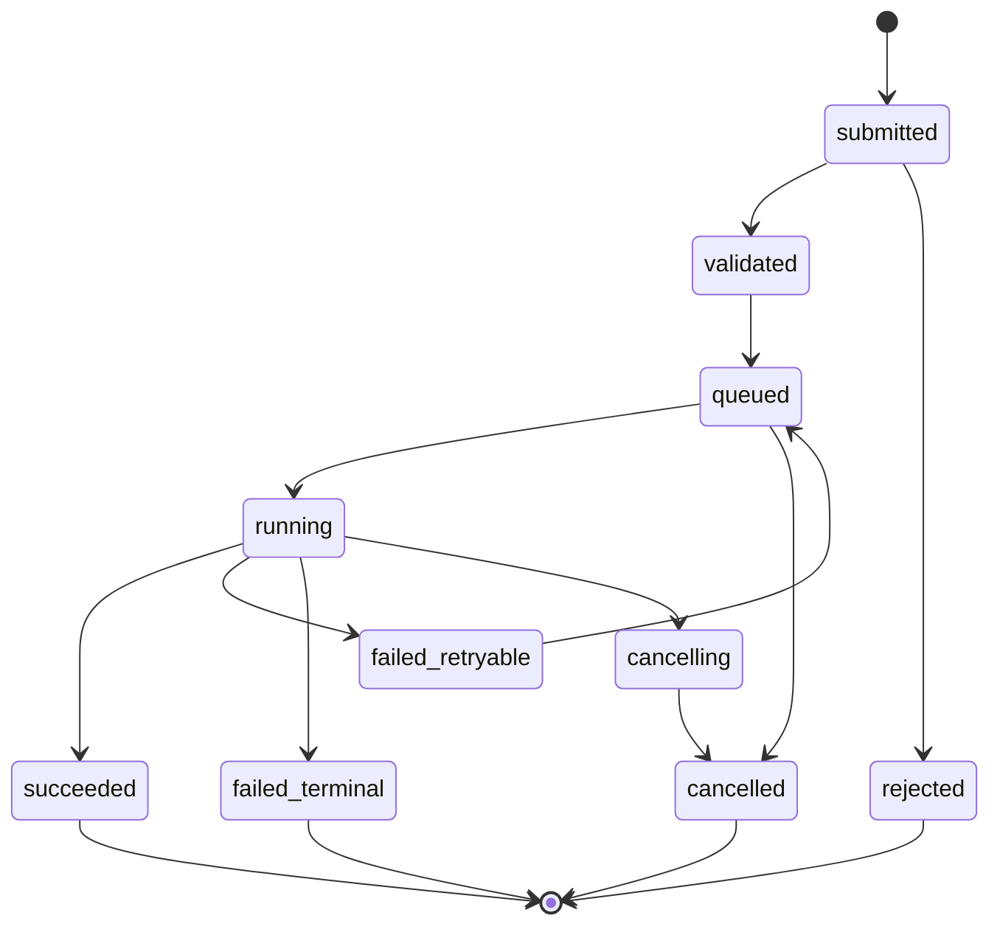
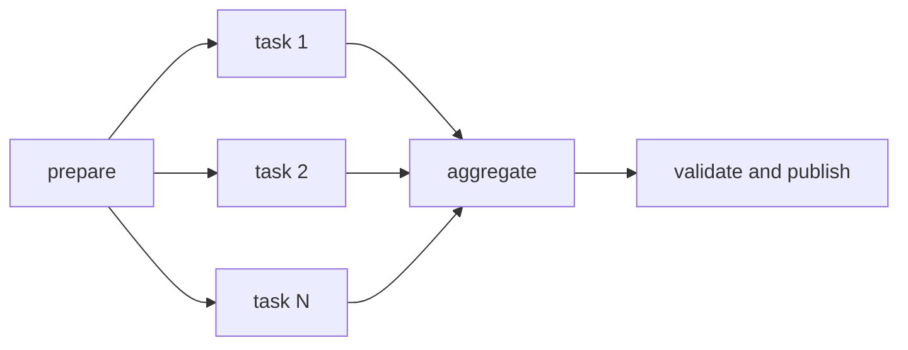
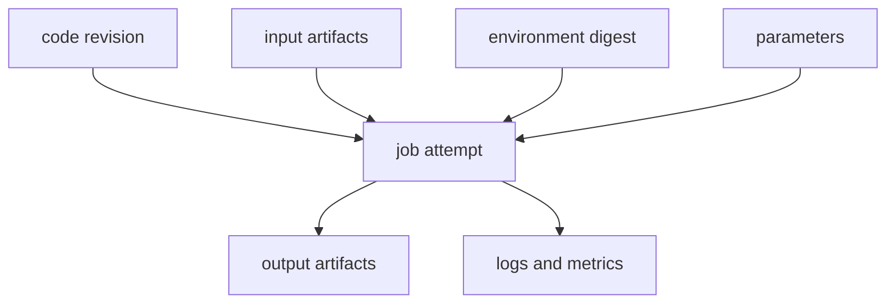



과학·엔지니어링 소프트웨어는 계산식보다 실행 관리에서 더 자주 실패한다.
사용자 요청이 끊겼을 때 계산도 사라지고, 재시도가 중복 실행을 만들고, 결과 파일과 입력 버전을 연결하지 못하면 신뢰할 수 있는 플랫폼이 아니다.

핵심은 계산을 HTTP 요청 안에서 직접 수행하지 않고 **내구성 있는 Job과 불변 Artifact로 승격**하는 것이다.

## 1. Job을 일급 객체로 만든다

Job record는 최소한 다음을 가진다.

- `job_id`: 안정적인 내부 식별자
- `job_type`: 실행기 선택용 유형
- `state`: 상태기계의 현재 상태
- `input_manifest`: 입력 artifact와 parameter 참조
- `execution_spec`: image, command, resource, environment
- `attempt`: 재시도 횟수
- `idempotency_key`: 중복 제출 방지
- `created_at`, `started_at`, `finished_at`
- `result_manifest`: 출력 artifact 참조
- `provenance`: code와 runtime identity
- `error_class`: 분류된 실패 원인

UI의 progress bar보다 이 record가 진실의 원천이어야 한다.

## 2. 상태기계를 명시한다

권장 기본 상태는 다음과 같다.



transition은 조건부 원자 연산으로 수행한다.
두 worker가 동시에 같은 Job을 `running`으로 가져가지 못하게 version 또는 compare-and-swap을 사용한다.

## 3. Submit API와 idempotency

네트워크 timeout 후 client는 같은 요청을 다시 보낼 수 있다.
서버는 idempotency key와 canonical request hash를 저장한다.

- 같은 key와 같은 payload: 기존 Job을 반환
- 같은 key와 다른 payload: conflict로 거절
- 새로운 key: 새 Job 생성

idempotency 보존기간과 tenant scope를 정의한다.
Job execution 자체도 가능한 한 output path와 side effect를 attempt별로 격리한다.

## 4. Queue가 보장하는 것과 보장하지 않는 것

대부분의 실용적인 queue는 at-least-once delivery에 가깝다.
message가 중복 전달될 수 있으므로 consumer가 idempotent해야 한다.

queue message에는 거대한 입력을 넣지 않고 job ID와 작은 routing metadata만 둔다.
진짜 상태와 manifest는 transactional store에서 읽는다.

delivery acknowledgment는 다음 순서를 고려한다.

1. Job lease 획득
2. 실행 준비와 attempt 생성
3. 결과/상태 commit
4. queue ack

ack 전에 worker가 죽으면 message가 재전달되고, state/lease가 중복 실행을 방지한다.

## 5. Lease와 heartbeat

running worker가 죽었는지 알기 위해 lease expiry와 heartbeat를 사용한다.

- `lease_owner`
- `lease_expires_at`
- `heartbeat_at`
- scheduler/worker epoch

heartbeat 지연만으로 즉시 두 번째 worker를 실행하면 긴 garbage collection이나 네트워크 partition에서 split-brain이 생긴다.
fencing token을 외부 side effect에 전달해 오래된 owner의 쓰기를 거부할 수 있다.

## 6. Retry taxonomy

모든 실패를 재시도하면 비용 폭주와 반복 손상이 생긴다.

### Retryable

- 일시적 network 오류
- scheduler temporary rejection
- preemption
- 일시적 artifact store 오류
- 외부 서비스 rate limit

### Terminal

- 잘못된 input schema
- 존재하지 않는 artifact
- 라이선스·권한 거부
- deterministic solver error
- 지원하지 않는 runtime 조합

### Unknown

원인을 분류할 수 없는 경우 제한된 retry 후 quarantine한다.

exponential backoff와 jitter를 사용하고 maximum attempt와 total retry budget을 둔다.

## 7. 입력 manifest는 불변이어야 한다

Job이 시작된 뒤 “최신 파일”을 읽으면 실행 시점에 따라 결과가 달라진다.
입력은 content-addressed digest 또는 immutable version ID로 고정한다.

manifest 예시는 개념적으로 다음 정보를 가진다.

```yaml
schema_version: v1
inputs:
  - role: mesh
    artifact: sha256:<digest>
  - role: parameters
    artifact: sha256:<digest>
runtime:
  image: registry.example/solver@sha256:<digest>
entrypoint: ["solver", "--manifest", "input.yml"]
```

예시의 placeholder는 실제 secret이나 사설 주소가 아니다.

## 8. Artifact store와 metadata store를 분리한다

큰 binary와 log는 object storage에, 검색·상태·관계는 database에 둔다.

artifact metadata는 다음을 포함한다.

- digest와 size
- media type과 schema version
- producer job/attempt
- logical role
- created timestamp
- retention class
- encryption/key policy reference
- validation status

client가 올린 checksum과 server가 계산한 checksum을 비교해 전송 손상을 검출한다.

## 9. Atomic publish

worker가 출력 directory에 쓰는 도중 다른 서비스가 읽으면 partial result를 볼 수 있다.

1. attempt 전용 임시 prefix에 출력
2. 각 file checksum과 manifest 생성
3. validation 수행
4. immutable final location에 publish
5. DB transaction으로 result manifest 연결
6. Job을 `succeeded`로 전이

성공 상태는 artifact가 실제로 읽히고 검증된 뒤에만 설정한다.

## 10. 로그와 progress

stdout 전체를 DB row에 계속 append하지 않는다.
chunked log artifact와 searchable event index를 분리한다.

progress는 solver가 정의한 monotonic stage와 metric으로 표현한다.

- stage: preprocessing, solving, postprocessing
- completed unit / total unit
- current iteration과 residual
- last heartbeat
- estimated time은 선택적이며 불확실성을 표시

사용자 메시지와 operator diagnostic을 분리해 내부 경로·명령·secret이 노출되지 않게 한다.

## 11. HPC scheduler와의 경계

플랫폼 queue와 HPC scheduler queue는 역할이 다르다.

- 플랫폼: 사용자 권한, validation, provenance, artifact, product state
- scheduler: compute resource allocation, priority, node placement, accounting

adapter는 Job spec을 scheduler submission으로 변환하고 external job ID를 저장한다.
submission 성공 후 응답 유실에 대비해 client-generated marker나 comment를 사용해 reconciliation한다.

## 12. Slurm 연동의 기본 개념

Slurm에서는 `sbatch`로 batch script를 제출하고 scheduler job ID를 받는다.
job array는 동형 task 집합, dependency는 선후행 관계, `sacct`는 완료된 Job의 accounting 확인에 사용된다.

플랫폼이 shell command 문자열을 직접 이어붙이지 않도록 안전한 argument model과 template allowlist를 사용한다.
사용자 입력을 scheduler directive나 shell에 그대로 삽입하면 injection 위험이 생긴다.

## 13. Job array와 workflow DAG

parameter sweep을 하나의 거대한 Job으로 만들기보다 child task로 분해하면 재시도와 관측성이 좋아진다.



fan-out 수에는 quota와 backpressure를 적용한다.
aggregate는 완료된 child manifest를 deterministic order로 읽는다.

## 14. Resource request와 scheduling

Job spec은 CPU, memory, accelerator, wall time, local scratch, license token 같은 자원을 명시한다.

request가 너무 작으면 OOM·timeout, 너무 크면 queue wait와 비용이 증가한다.
과거 실행의 peak usage를 관측해 recommendation을 만들되 자동 축소는 안전 margin과 사용자 승인을 고려한다.

resource quota는 tenant와 project 단위로 적용하고, 대량 submit에 admission control을 둔다.

## 15. Container와 environment capture

container image는 실행환경의 일부를 고정하지만 완전한 재현성을 보장하지 않는다.

- image digest
- host kernel과 driver compatibility
- accelerator runtime
- CPU instruction set
- locale와 timezone
- thread count와 math library
- external license/service
- random seed와 nondeterministic algorithm

tag가 아닌 immutable digest를 저장한다.

## 16. Provenance graph

provenance는 “어떤 결과가 어떤 입력·코드·환경·parent 결과에서 생성되었는가”를 나타낸다.



재실행 가능한 `run manifest`와 사람이 읽는 `report manifest`를 모두 제공하면 좋다.

## 17. 취소와 timeout

cancel API는 요청을 기록한 뒤 scheduler cancel과 worker signal을 수행한다.
취소는 순간적 상태가 아니라 protocol이다.

- cancel requested
- external scheduler acknowledged
- process termination 확인
- partial artifact 정책 적용
- final cancelled 전이

graceful signal 후 제한시간이 지나면 강제 종료할 수 있다.
partial output을 결과로 오인하지 않도록 `incomplete` marker를 둔다.

## 18. Reconciliation loop

event 전달은 누락될 수 있으므로 주기적으로 내부 상태와 외부 scheduler·artifact store를 대조한다.

- 내부 running인데 외부 Job이 없음
- 외부 완료인데 내부 running
- succeeded인데 result manifest 누락
- lease 만료인데 process 생존
- orphan artifact 또는 scheduler Job

reconciler는 수정 전 증거와 action log를 남기며 idempotent해야 한다.

## 19. 보안 경계

- 사용자 입력을 shell로 직접 실행하지 않는다.
- worker identity는 필요한 artifact prefix만 접근한다.
- tenant별 namespace와 authorization을 강제한다.
- log와 error에서 secret·내부 경로를 redact한다.
- signed image와 dependency provenance를 검증한다.
- output parser를 untrusted input처럼 다룬다.
- 관리자와 사용자 action을 audit log에 기록한다.

## 20. 운영 검증 체크리스트

- [ ] Job state transition이 코드와 문서에서 하나로 정의된다.
- [ ] 동일 idempotency key 재전송이 중복 Job을 만들지 않는다.
- [ ] worker crash 전후에 중복 side effect가 없다.
- [ ] lease expiry와 fencing을 시험했다.
- [ ] retryable/terminal error 분류가 명시적이다.
- [ ] input과 image를 immutable digest로 고정한다.
- [ ] partial artifact가 publish되지 않는다.
- [ ] success 전 result checksum을 검증한다.
- [ ] scheduler 응답 유실을 reconciliation으로 복구한다.
- [ ] cancellation과 timeout의 race를 시험했다.
- [ ] queue backlog와 submit rate에 backpressure가 있다.
- [ ] provenance로 결과에서 입력까지 역추적된다.
- [ ] disaster recovery에서 DB와 object store 일관성을 검증했다.
- [ ] 비용·queue time·run time·failure rate를 관측한다.

## 21. 자주 실패하는 패턴과 한계

### 웹 요청 안에서 장시간 계산

client disconnect와 gateway timeout이 계산 lifecycle과 결합된다.

### exactly-once를 queue 기능으로 해결했다고 주장

분산시스템에서는 중복 delivery를 가정하고 state transition과 side effect를 idempotent하게 설계하는 편이 현실적이다.

### 성공 상태를 process exit code만으로 결정

필수 output, schema, checksum, domain validation이 필요하다.

### 모든 log를 영구 보관

비용과 민감정보 노출면이 커진다.
retention, redaction, tiering을 설계한다.

### scheduler state를 제품 상태로 그대로 노출

scheduler마다 상태 의미가 다르고 사용자 관점의 validation/publish 단계가 빠진다.

## 22. 공식·원전 참고자료

- Slurm, [sbatch official documentation](https://slurm.schedmd.com/sbatch.html).
- Slurm, [Job array documentation](https://slurm.schedmd.com/job_array.html).
- Slurm, [sacct accounting documentation](https://slurm.schedmd.com/sacct.html).
- W3C, [PROV-DM: The PROV Data Model](https://www.w3.org/TR/prov-dm/).
- OCI, [Image and Distribution Specifications](https://opencontainers.org/).
- Kubernetes, [Jobs documentation](https://kubernetes.io/docs/concepts/workloads/controllers/job/).

신뢰할 수 있는 계산 플랫폼은 Job을 실행하는 시스템이 아니다.
**중복, 실패, 취소, 재시도 속에서도 입력과 실행과 결과의 인과관계를 보존하는 시스템**이다.
