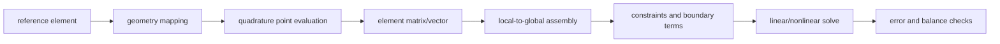



유한요소법(FEM)은 형상을 작은 조각으로 나누는 기법만이 아니다.
미분방정식을 적분 가능한 약한 형태로 바꾸고, 무한차원 함수공간의 문제를 유한차원 부분공간에 투영하는 방법이다.
이 관점을 잡으면 요소 종류와 solver 옵션이 하나의 수학적 구조로 연결된다.

## 1. 강형식에서 시작한다

Poisson 문제를 예로 들자.

$$
-\nabla\cdot(k\nabla u)=f \quad \text{in }\Omega,
$$

$$
u=g_D \quad \text{on }\Gamma_D,
\qquad
-k\nabla u\cdot n=g_N \quad \text{on }\Gamma_N.
$$

강형식은 (u)가 점별로 충분히 미분 가능하고 방정식과 경계조건을 점별로 만족하기를 요구한다.
복잡한 계수, 불연속 재료, 비매끄러운 domain에서는 이 요구가 지나치게 강할 수 있다.

## 2. 시험함수와 부분적분

Dirichlet 경계에서 0인 시험함수 (v)를 곱해 적분한다.

$$
\int_\Omega -v\nabla\cdot(k\nabla u)\,d\Omega
=\int_\Omega vf\,d\Omega.
$$

부분적분 또는 Green identity를 적용하면

$$
\int_\Omega k\nabla v\cdot\nabla u\,d\Omega
-\int_{\partial\Omega}v k\nabla u\cdot n\,d\Gamma
=\int_\Omega vf\,d\Omega.
$$

Neumann 조건을 대입해 약형식은

$$
a(u,v)=\ell(v)
$$

$$
a(u,v)=\int_\Omega k\nabla v\cdot\nabla u\,d\Omega,
$$

$$
\ell(v)=\int_\Omega vf\,d\Omega+\int_{\Gamma_N}vg_N\,d\Gamma
$$

가 된다.
미분 차수가 (u)의 2차에서 1차로 낮아졌고 natural boundary condition이 경계 적분으로 들어왔다.

## 3. essential과 natural boundary condition

- Dirichlet 조건은 trial space 자체를 제한하므로 essential condition이라 부른다.
- Neumann 조건은 약형식의 우변에 자연스럽게 나타나므로 natural condition이라 부른다.

이 구분은 구현에서도 중요하다.
Dirichlet 자유도를 행렬에서 제거하거나 constraint로 처리할 때 symmetry와 reaction 계산을 보존해야 한다.

순수 Neumann 문제는 상수만큼 이동한 해가 모두 가능해 nullspace가 생긴다.
compatibility condition

$$
\int_\Omega f\,d\Omega+\int_{\Gamma_N}g_N\,d\Gamma=0
$$

과 평균값 constraint 또는 reference가 필요하다.

## 4. 함수공간의 의미

Poisson 문제의 자연스러운 공간은 Sobolev 공간 (H^1(\Omega))다.

$$
H^1(\Omega)=
\{v\in L^2(\Omega):\nabla v\in[L^2(\Omega)]^d\}.
$$

즉 함수와 1차 약미분이 제곱적분 가능하면 된다.
점별 매끄러움보다 적분 가능한 에너지 norm이 핵심이다.

Galerkin FEM은 trial과 test space에 같은 유한차원 부분공간을 사용한다.

$$
V_h=\mathrm{span}\{N_1,\ldots,N_n\}.
$$

## 5. 요소 보간과 자유도

근사해를

$$
u_h(\mathbf x)=\sum_{j=1}^{n}N_j(\mathbf x)U_j
$$

로 나타낸다.
각 (N_j)는 shape function이고 (U_j)는 nodal value 또는 일반화된 자유도다.

시험함수로 각 basis (N_i)를 넣으면

$$
K_{ij}=\int_\Omega k\nabla N_i\cdot\nabla N_j\,d\Omega,
\qquad
F_i=\ell(N_i)
$$

이고 전역 시스템은

$$
\mathbf K\mathbf U=\mathbf F
$$

가 된다.

## 6. reference element와 mapping

실제 요소 (Omega_e)를 reference element (hat\Omega)에서 mapping한다.

$$
\mathbf x(\boldsymbol\xi)=
\sum_a N_a(\boldsymbol\xi)\mathbf x_a.
$$

Jacobian은

$$
J=\frac{\partial\mathbf x}{\partial\boldsymbol\xi}
$$

이며 gradient와 volume element를 변환한다.

$$
\nabla_x N=J^{-T}\nabla_\xi N,
\qquad
d\Omega=|\det J|d\hat\Omega.
$$

(det J\le0)인 요소는 뒤집혔거나 퇴화했다.
작은 determinant와 큰 condition number는 gradient 계산과 stiffness conditioning을 악화한다.

## 7. 수치적분은 모델의 일부다

요소 적분을 quadrature로 근사한다.

$$
\int_{\hat\Omega}g(\xi)d\xi
\approx
\sum_{q=1}^{n_q}w_q g(\xi_q).
$$

적분차수가 너무 낮으면 stiffness와 internal force를 정확히 구성하지 못해 hourglass 또는 zero-energy mode가 생길 수 있다.
반대로 지나친 quadrature는 비용만 늘리고 locking을 해결하지 못할 수 있다.

### reduced integration과 selective integration

reduced integration은 locking을 완화할 수 있지만 spurious mode 위험이 있다.
stabilization이 물리 에너지를 오염시키지 않는지 확인해야 한다.

### 비선형 재료와 수치적분점

내부 상태변수는 보통 quadrature point에서 업데이트된다.
consistent tangent를 사용하면 Newton 수렴을 크게 개선할 수 있다.
state update, rollback, load-step retry의 일관성이 중요하다.

## 8. 조립은 local-to-global 보존 규약이다

각 요소 행렬 (mathbf K^e)와 벡터 (mathbf F^e)를 자유도 mapping으로 전역 시스템에 더한다.

공유 node의 자유도는 인접 요소 기여를 합친다.
부호와 orientation이 있는 edge/face element에서는 local orientation을 전역 규약과 일치시켜야 한다.

## 9. 적합성, 안정성, locking

단순히 polynomial order가 높다고 모든 문제가 해결되지는 않는다.

- **conformity**: 근사공간이 필요한 연속성을 만족하는가?
- **coercivity/inf-sup stability**: 이산 문제가 안정적인가?
- **locking**: 얇은 구조나 거의 비압축성 조건에서 지나치게 stiff해지는가?
- **spurious mode**: 물리적 에너지 없이 변형하는 mode가 존재하는가?

혼합형 문제에서는 displacement와 pressure 공간 조합이 inf-sup 조건을 만족해야 한다.
동일 차수 interpolation을 무조건 쓰면 pressure oscillation이 생길 수 있다.

## 10. h-, p-, hp-refinement

- h-refinement: 요소 크기를 줄인다.
- p-refinement: basis 차수를 높인다.
- hp-refinement: smoothness에 따라 둘을 결합한다.

에너지 norm에서 전형적 오차는 충분한 regularity 아래

$$
\|u-u_h\|_{H^1}\le C h^p|u|_{H^{p+1}}
$$

형태다.
corner singularity, discontinuous coefficient, contact에서는 regularity가 낮아 nominal order가 나타나지 않을 수 있다.

## 11. a priori와 a posteriori error

a priori estimate는 해의 regularity와 mesh size로 수렴률을 설명한다.
a posteriori estimator는 계산된 해의 residual과 jump로 어디를 refine할지 결정한다.

개념적인 residual estimator는

$$
\eta^2=\sum_e h_e^2\|R_e\|^2
+\sum_f h_f\|J_f\|^2
$$

처럼 element residual (R_e)와 inter-element flux jump (J_f)를 결합한다.
effectivity index가 문제군에서 안정적인지 benchmark로 확인해야 한다.

## 12. 비선형 문제와 Newton 방법

잔차 벡터를 (mathbf R(\mathbf U)=0)이라 하면 Newton step은

$$
\mathbf J(\mathbf U^k)\Delta\mathbf U
=-\mathbf R(\mathbf U^k),
$$

$$
\mathbf U^{k+1}=\mathbf U^k+\alpha\Delta\mathbf U
$$

이다.
consistent Jacobian, line search, load/time increment control, state rollback이 견고성을 좌우한다.

## 13. 권장 워크플로

1. 강형식, domain, boundary partition을 명시한다.
2. 시험함수를 곱하고 부분적분해 약형식을 손으로 유도한다.
3. trial/test space와 essential constraint를 정의한다.
4. reference element, mapping, shape function을 검증한다.
5. quadrature order를 integrand와 비선형성에 맞춘다.
6. element-level patch test와 manufactured solution을 수행한다.
7. 전역 balance, reaction, energy를 검사한다.
8. 세 수준 이상의 systematic refinement를 수행한다.
9. QoI별 수렴과 error estimator를 보고한다.

## 14. 검증 체크리스트

- [ ] 약형식의 경계항 부호를 다시 유도했다.
- [ ] essential과 natural boundary condition을 구분했다.
- [ ] pure Neumann nullspace와 compatibility를 처리했다.
- [ ] reference-to-physical Jacobian 방향이 일관된다.
- [ ] 모든 요소의 determinant가 양수이고 충분히 크다.
- [ ] rigid-body mode와 expected nullspace를 확인했다.
- [ ] patch test와 constant-state test를 통과했다.
- [ ] quadrature order sensitivity를 평가했다.
- [ ] reaction 합과 외력이 balance를 이룬다.
- [ ] strain energy와 work의 일관성을 확인했다.
- [ ] h 또는 p refinement에서 observed order를 계산했다.
- [ ] point singularity 값을 수렴된 QoI처럼 보고하지 않는다.

## 15. 자주 실패하는 패턴과 한계

### mesh를 촘촘하게만 만들기

distorted element를 늘리거나 singularity에 균일 refinement만 적용하면 비용 대비 효과가 낮다.

### contour가 매끄러우면 정확하다고 판단

후처리 nodal averaging이 discontinuous stress를 매끄럽게 보일 수 있다.
원래 quadrature-point 값과 equilibrium을 확인해야 한다.

### reduced integration을 만능 해결책으로 사용

locking을 줄이는 대신 hourglass mode가 생길 수 있다.
stabilization energy와 mesh sensitivity를 함께 본다.

### solver tolerance와 discretization error를 혼동

linear residual이 작아도 mesh error가 클 수 있다.
반대로 algebraic error가 큰 상태에서 mesh refinement를 비교하면 observed order가 오염된다.

### 특정 point의 최대응력만 비교

re-entrant corner나 concentrated load에서 point stress가 발산할 수 있다.
integral, averaged, fracture parameter처럼 well-defined QoI를 선택한다.

## 16. 공식·원전 참고자료

- Galerkin, B. G., “Series Solution of Some Problems of Elastic Equilibrium,” 1915.
- Courant, R., “Variational Methods for the Solution of Problems of Equilibrium and Vibrations,” 1943.
- Ciarlet, P. G., *The Finite Element Method for Elliptic Problems*.
- NIST, [OOF finite-element analysis documentation](https://www.ctcms.nist.gov/oof/oof2/).
- PETSc, [Finite element and discretization interfaces](https://petsc.org/release/manual/dmplex/).
- The FEniCS Project, [Official documentation](https://docs.fenicsproject.org/).

FEM의 핵심은 요소 모양이 아니라 **약형식, 함수공간, 수치적분, 조립, 오차 추정이 하나의 일관된 근사 문제를 이루는가**에 있다.
