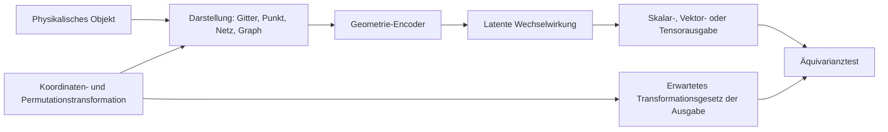



Bei räumlichen Problemen sind die Reihenfolge des Eingabearrays und Koordinatensysteme keine bloßen Details der Vorverarbeitung.
Ändert sich eine Vorhersage unangemessen, wenn dieselbe Form gedreht oder nur ihre Knotennummerierung geändert wird, hat das Modell Zufälligkeiten der Darstellung statt der Geometrie gelernt.

## 1. Problem: Dasselbe Objekt besitzt mehrere numerische Darstellungen

Geometriedaten treten in vielen Formen auf.

- Voxel oder regelmäßiges Gitter
- Punktwolke
- Oberflächennetz
- Volumennetz
- Graph
- vorzeichenbehaftetes Abstandsfeld
- parametrische Koordinaten

Ein einzelner physikalischer Zustand kann folgenden Transformationen unterliegen:

- Translation
- Rotation
- Spiegelung
- Skalierung
- Knotenpermutation
- Netzverfeinerung
- lokaler Koordinatenwechsel

Einige Transformationen sollten die Vorhersage nicht verändern.
Bei anderen sollte sich die Ausgabe nach derselben Regel ändern.
Zuerst wird der Symmetrievertrag des Problems formuliert.

## 2. Denkmodell: Darstellung, Transformationsgruppe und Ausgabegesetz



Für eine Transformation \(g\) sollte das Modell \(f\) erfüllen:

$$
f(\rho_{in}(g)x)=\rho_{out}(g)f(x)
$$

- Eine Ausgabe wie Klasse oder Energie ist gewöhnlich invariant.
- Ein Vektor wie Position, Geschwindigkeit oder Kraft sollte rotationsäquivariant sein.
- Ein Tensor wie Spannung folgt einem Tensortransformationsgesetz.

Jede Symmetrie zu erzwingen ist nicht zwangsläufig vorteilhaft.
Schwerkraft, feste Grenzen und Materialanisotropie zeichnen bestimmte Richtungen physikalisch aus.

## 3. Zuerst den Typ jeder physikalischen Größe festlegen

Jedes Feature nur als reellwertigen Kanal zu behandeln, verliert sein Transformationsgesetz.

Beispiele:

- Skalar: Temperatur, Dichte, Druck
- polarer Vektor: Position, Geschwindigkeit, Kraft
- axialer Vektor: Winkelgeschwindigkeit oder je nach Kontext ein Magnetfeld
- Tensor zweiter Stufe: Spannung, Dehnung, Diffusionstensor
- kategorial: Randtyp, Materialbezeichnung

Für jedes Feature wird Folgendes aufgezeichnet.

```yaml
feature:
  name: velocity
  support: node
  geometric_type: polar-vector
  units: length-per-time
  frame: global-cartesian
  normalization: dimensionless-reference-scale
```

Ohne Metadaten zu Einheit und Bezugssystem erzeugt das Zusammenführen unterschiedlicher Datensätze stille Fehler.

## 4. Wahl einer Darstellung

### Regelmäßiges Gitter

Vorteile:

- Effiziente Nutzung von Faltungen und FFTs.
- Einfaches Batching und Speicherlayout.
- Ausgereifte Mehrskalenstrukturen.

Einschränkungen:

- Komplexe Grenzen können treppenförmig dargestellt werden.
- Auch leerer Raum wird berechnet.
- Die Darstellung reagiert möglicherweise nicht natürlich auf Koordinatenrotationen.

### Punktwolke

Vorteile:

- Direkte Nutzung einer Menge von Abtastpunkten.
- Keine Netztopologie erforderlich.
- Natürlich für Sensoren und Oberflächenscans.

Einschränkungen:

- Empfindlich gegenüber der Nachbarschaftsdefinition.
- Änderungen der Abtastdichte erzeugen Bias.
- Oberflächenorientierung und Topologie können unklar sein.

### Netze und Graphen

Vorteile:

- Bilden unregelmäßige Geometrie und Konnektivität ab.
- Können Features an Knoten, Kanten, Flächen und Zellen tragen.
- Lassen sich gut mit Artefakten vorhandener Solver verbinden.

Einschränkungen:

- Das Modell kann empfindlich auf Netzqualität und -verfeinerung reagieren.
- Ein Graph-Hop ist nicht dasselbe wie physikalischer Abstand.
- Langreichweitige Wechselwirkungen erfordern tiefes Message Passing.

Eine Darstellung wird nach der zu bewahrenden Information und den Rechenkosten gewählt, nicht nach der bequemsten Bibliothek.

## 5. Message Passing auf Graphen

Allgemeines Message Passing lässt sich schreiben als

$$
m_{ij}=\phi_e(h_i,h_j,e_{ij}),\qquad
h_i'=\phi_v\left(h_i,\bigoplus_{j\in\mathcal{N}(i)}m_{ij}\right)
$$

Wird der Aggregationsoperator ​\(\bigoplus\)​ wie Summe, Mittelwert oder Maximum permutationsinvariant gestaltet, ist das Modell robust gegenüber Änderungen der Knotenreihenfolge.

Beispiele für Kantenfeatures:

- relative Position
- Abstand und Richtung
- Flächenvektor
- Verbindungstyp
- Materialschnittstelle
- Flussorientierung

Absolute Koordinaten sollten nicht grundsätzlich entfernt werden.
Die absolute Position kann wegen einer Randlage oder eines äußeren Felds wichtig sein.
Stattdessen werden lokale relative Features vom globalen Kontext unterschieden.

## 6. Wege zur Invarianz

Ansätze fallen in drei Kategorien.

### Datenaugmentation

Auf translatierten und rotierten Eingaben mit demselben Label trainieren.

- Einfach zu implementieren.
- Liefert approximative Robustheit gegenüber den gewählten Transformationen.
- Garantiert keine vollständige Äquivarianz.
- Benötigt Abdeckung durch Augmentation und Rechenaufwand.

### Kanonisierung

Das Koordinatensystem anhand einer Regel wie der Hauptachse standardisieren.

- Kann das nachgelagerte Modell vereinfachen.
- Bei symmetrischen Formen oder Rauschen kann die Orientierung instabil sein.
- Eine kleine Änderung kann einen großen Wechsel des Bezugssystems verursachen.

### Äquivariante Architektur

Jede Schicht so entwerfen, dass sie das Transformationsgesetz bewahrt.

- Integriert Symmetrie strukturell.
- Kann die Stichprobeneffizienz verbessern.
- Kann Rechen- und Implementierungskomplexität erhöhen.
- Das Erzwingen der falschen Symmetrie verringert die Ausdruckskraft.

Die drei Ansätze werden dem Problem entsprechend kombiniert.

## 7. Geometrie und Randbedingungen

Erhält ein Modell die Form, aber keine Randbedingungen, kann es unterschiedliche physikalische Probleme auf derselben Geometrie nicht unterscheiden.

Folgendes kann auf Knoten, Flächen und Zellen abgelegt werden:

- Randtyp
- vorgegebener Wert
- Normalenvektor
- Abstand zum Rand
- Materialbereich
- Quellterm
- lokale Netzweite

Normalenrichtungen müssen einer konsistenten Orientierungskonvention folgen.
Eine umgekehrte Flächennormale ist ein Datenfehler, kein Äquivarianzproblem.

Prüfungen der Geometrievorverarbeitung:

- doppelter Knoten
- nicht verbundene Komponente
- invertiertes Element
- nichtmannigfaltige Kante
- inkonsistente Umlaufrichtung
- degenerierte Zelle
- nicht übereinstimmende Koordinateneinheiten

## 8. Praktischer Workflow

### Schritt 1. Zuerst den Transformationstest schreiben

```python
def equivariance_error(model, sample, transform):
    y1 = model(transform.input(sample))
    y0 = transform.output(model(sample))
    return relative_norm(y1 - y0, y0)
```

Noch vor dem Modelltraining wird geprüft, dass Datentransformationen zum Ausgabegesetz passen.

### Schritt 2. Geometrie-Splits erstellen

- Knotenpermutationen derselben Geometrie
- Parameteränderungen innerhalb derselben Familie
- bisher ungesehene Geometrieinstanzen
- bisher ungesehene Topologien
- Änderungen von grobem zu feinem Netz

Zufällige Knoten- oder Stichproben-Splits erzeugen Geometrie-Leakage.

### Schritt 3. Einfache Basislinien etablieren

- globale Features + mehrschichtiges Perzeptron
- Gitterinterpolation + Faltung
- nicht äquivariantes Graphnetz
- physikalische Basislinie oder Modell reduzierter Ordnung

Den tatsächlichen Nutzen einer komplexen Geometriearchitektur isolieren.

### Schritt 4. Erhaltung und Symmetrie gemeinsam evaluieren

Ein Modell kann einen kleinen Vorhersagefehler besitzen und dennoch Rotations- sowie Erhaltungstests nicht bestehen.
Beide werden als getrennte Akzeptanz-Gates behandelt.

## 9. Evaluationsentwurf

Erforderliche Evaluationsachsen:

- Aufgabenfehler
- Fehler der Permutationsinvarianz
- Fehler der Rotations-/Translationsäquivarianz
- Empfindlichkeit gegenüber Netzauflösung
- Generalisierung auf zurückgehaltene Geometrien
- Generalisierung auf zurückgehaltene Topologien
- Erhaltungsfehler
- Inferenzspeicher und -laufzeit

Unterschiedliche Netze besitzen möglicherweise keine punktweise Korrespondenz.
Es wird auf gemeinsame physikalische Orte interpoliert oder es werden Integralgrößen verglichen.

Auch lokale Fehlerkarten untersuchen:

- scharfe Ecke
- dünnes Merkmal
- Schnittstelle
- Grenzschicht
- dünn abgetasteter Bereich

Ein mittlerer Fehler verbirgt Fehler in kleinen Bereichen mit hohem Risiko.

## 10. Prüfliste zur Evaluation

- [ ] Sind die geometrischen Typen von Eingabe- und Ausgabefeatures definiert?
- [ ] Ist die physikalisch gültige Transformationsgruppe angegeben?
- [ ] Werden symmetriebrechende Elemente wie Schwerkraft und Grenzen berücksichtigt?
- [ ] Sind die Ergebnisse nach Änderung der Knotenreihenfolge konsistent?
- [ ] Gibt es einen numerischen Äquivarianztest für Rotation und Translation?
- [ ] Sind Trainings- und Testdaten nach Geometrieinstanz geteilt?
- [ ] Wurden Änderungen von Netzauflösung und -qualität evaluiert?
- [ ] Wird ungesehene Topologie als eigene Kategorie berichtet?
- [ ] Werden Normalenorientierung und Elementinversion geprüft?
- [ ] Werden neben punktweisem Fehler auch erhaltene Größen und Zielgrößen untersucht?
- [ ] Wird das komplexe äquivariante Modell mit einer einfachen Basislinie verglichen?
- [ ] Sind Vorverarbeitung und Koordinatenkonventionen als Artefakte versioniert?

## 11. Häufige Fehler und Einschränkungen

### Augmentation als Symmetriegarantie beschreiben

Eine endliche Stichprobe von Rotationen liefert nur approximative Robustheit und garantiert nicht sämtliche Transformationen.
Ein eigener Äquivarianztest ist erforderlich.

### Absolute Koordinaten als grundsätzlich schlechte Features behandeln

Besitzt das physikalische Problem ein globales Bezugssystem, ist die absolute Position erforderlich.
Zuerst ist zu bestimmen, welche Symmetrien tatsächlich gelten.

### Graphkanten mit physikalischen Wechselwirkungen gleichsetzen

Netzadjazenz ist eine Diskretisierungsstruktur.
Fernwirkungen oder nichtlokale Operatoren können zusätzliche Verbindungen oder einen globalen Mechanismus erfordern.

### Leistung auf grobem Netz als Generalisierung auf feines Netz bezeichnen

Eine Auflösungsänderung verändert sowohl Eingabeverteilung als auch numerischen Fehler.
Referenzen müssen in einem gemeinsamen physikalischen Raum verglichen werden.

Selbst eine äquivariante Architektur kann Daten-Bias, falsche Randbedingungen oder Geometrie außerhalb der Domäne nicht beheben.
Ein struktureller Prior stärkt die Verifikation; er befreit nicht von ihr.

## 12. Offizielle Referenzen

- [Geometric Deep Learning Blueprint](https://arxiv.org/abs/2104.13478)
- [Offizielle Dokumentation von PyTorch Geometric](https://pytorch-geometric.readthedocs.io/)
- [Offizielle e3nn-Dokumentation](https://docs.e3nn.org/)
- [Ursprüngliche MeshGraphNets-Veröffentlichung](https://arxiv.org/abs/2010.03409)
- [Ursprüngliche PointNet-Veröffentlichung](https://arxiv.org/abs/1612.00593)

## 13. Fazit

Geometriebewusstes ML ist nicht bloß eine Technik, um Formen in ein Netz einzuspeisen, sondern eine Entwurfsdisziplin, die Konsistenz über mehrere Darstellungen desselben physikalischen Objekts bewahrt.
Werden Feature-Typen, Symmetrien, Konnektivität und Randverträge ausdrücklich angegeben, lassen sich Aussagen zur Modellgeneralisierung in echte Tests verwandeln.
