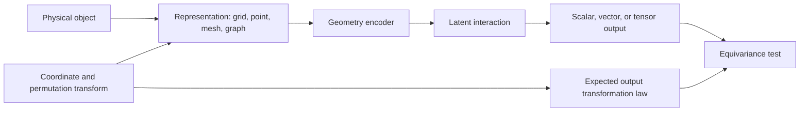



In spatial problems, input-array order and coordinate systems are not mere preprocessing details.
If a prediction changes unreasonably when the same shape is rotated or only its node numbering changes, the model has learned accidents of the representation rather than geometry.

## 1. Problem: the same object has multiple numerical representations

Geometry data comes in many forms.

- voxel or regular grid
- point cloud
- surface mesh
- volume mesh
- graph
- signed distance field
- parametric coordinates

A single physical state may undergo the following transformations:

- translation
- rotation
- reflection
- scale
- node permutation
- mesh refinement
- local coordinate change

Some transformations should not change the prediction.
For others, the output should change according to the same rule.
Write the problem's symmetry contract first.

## 2. Mental model: representation, transformation group, and output law



For a transformation (g), the model (f) should satisfy

$$
f(\rho_{in}(g)x)=\rho_{out}(g)f(x)
$$

- An output such as a class or energy is commonly invariant.
- A vector such as position, velocity, or force should be equivariant to rotation.
- A tensor such as stress follows a tensor transformation law.

Enforcing every symmetry is not necessarily beneficial.
Gravity, fixed boundaries, and material anisotropy physically distinguish particular directions.

## 3. Specify the type of each physical quantity first

Treating every feature as merely a real-valued channel loses its transformation law.

Examples:

- scalar: temperature, density, pressure
- polar vector: position, velocity, force
- axial vector: angular velocity, or a magnetic field depending on context
- rank-2 tensor: stress, strain, diffusion tensor
- categorical: boundary type, material label

Record the following for each feature.

```yaml
feature:
  name: velocity
  support: node
  geometric_type: polar-vector
  units: length-per-time
  frame: global-cartesian
  normalization: dimensionless-reference-scale
```

Without unit and frame metadata, combining different datasets creates silent errors.

## 4. Choosing a representation

### Regular grid

Advantages:

- Efficient use of convolutions and FFTs.
- Simple batching and memory layout.
- Mature multi-resolution structures.

Limitations:

- Complex boundaries may be represented as staircases.
- Empty space is computed as well.
- The representation may not respond naturally to coordinate rotations.

### Point cloud

Advantages:

- Direct use of a set of sampling points.
- No mesh connectivity is required.
- Natural for sensors and surface scans.

Limitations:

- Sensitive to the neighborhood definition.
- Changes in sampling density create bias.
- Surface orientation and topology may be unclear.

### Meshes and graphs

Advantages:

- Represent irregular geometry and connectivity.
- Can hold node, edge, face, and cell features.
- Connect well with artifacts from existing solvers.

Limitations:

- The model may be sensitive to mesh quality and refinement.
- A graph hop is not the same as physical distance.
- Long-range interactions require deep message passing.

Choose a representation according to the information that must be preserved and the computational cost, not according to the most convenient library.

## 5. Graph message passing

General message passing can be written as

$$
m_{ij}=\phi_e(h_i,h_j,e_{ij}),\qquad
h_i'=\phi_v\left(h_i,\bigoplus_{j\in\mathcal{N}(i)}m_{ij}\right)
$$

Making the aggregation operator ​\(\bigoplus\)​ permutation-invariant, as with sum, mean, or max, makes the model robust to changes in node ordering.

Examples of edge features:

- relative position
- distance and direction
- face area vector
- connection type
- material interface
- flux orientation

Do not always remove absolute coordinates.
Absolute position may matter because of a boundary location or an external field.
Instead, distinguish local relative features from global context.

## 6. Ways to obtain invariance

Approaches fall into three categories.

### Data augmentation

Train on translated and rotated inputs with the same label.

- Simple to implement.
- Provides approximate robustness to the selected transformations.
- Does not guarantee complete equivariance.
- Requires augmentation coverage and computation.

### Canonicalization

Standardize the coordinate system with a rule such as the principal axis.

- Can simplify the downstream model.
- Orientation may be unstable for symmetric shapes or in the presence of noise.
- A small change can cause a large frame flip.

### Equivariant architecture

Design each layer to preserve the transformation law.

- Structurally incorporates symmetry.
- Can improve sample efficiency.
- May increase computation and implementation complexity.
- Enforcing the wrong symmetry reduces expressiveness.

Combine the three approaches according to the problem.

## 7. Geometry and boundary conditions

If a model receives the shape but omits boundary conditions, it cannot distinguish different physical problems on the same geometry.

The following can be placed on nodes, faces, and cells:

- boundary type
- prescribed value
- normal vector
- distance to boundary
- material region
- source term
- local mesh size

Normal directions must follow a consistent orientation convention.
A flipped face normal is a data error, not an equivariance problem.

Geometry preprocessing checks:

- duplicate node
- disconnected component
- inverted element
- non-manifold edge
- inconsistent winding
- degenerate cell
- coordinate unit mismatch

## 8. Practical workflow

### Step 1. Write the transformation test first

```python
def equivariance_error(model, sample, transform):
    y1 = model(transform.input(sample))
    y0 = transform.output(model(sample))
    return relative_norm(y1 - y0, y0)
```

Even before training the model, verify that data transformations match the output law.

### Step 2. Create geometry splits

- node permutations of the same geometry
- parameter changes within the same family
- unseen geometry instances
- unseen topologies
- coarse-to-fine mesh changes

Random node or sample splits create geometry leakage.

### Step 3. Establish simple baselines

- global features + multilayer perceptron
- grid interpolation + convolution
- non-equivariant graph network
- physics baseline or reduced-order model

Isolate the actual benefit of a complex geometry architecture.

### Step 4. Evaluate conservation and symmetry together

A model may have low prediction error yet fail rotation and conservation tests.
Treat them as separate acceptance gates.

## 9. Evaluation design

Required evaluation axes:

- task error
- permutation invariance error
- rotation/translation equivariance error
- mesh resolution sensitivity
- geometry holdout generalization
- topology holdout generalization
- conservation error
- inference memory and runtime

Different meshes may have no pointwise correspondence.
Interpolate to common physical locations or compare integral quantities.

Inspect local error maps too.

- sharp corner
- thin feature
- interface
- boundary layer
- sparse sampling region

Average error hides failures in small, high-risk regions.

## 10. Evaluation checklist

- [ ] Are the geometric types of input and output features defined?
- [ ] Is the physically valid transformation group stated?
- [ ] Are symmetry-breaking elements such as gravity and boundaries reflected?
- [ ] Are results consistent after changing node ordering?
- [ ] Is there a numerical equivariance test for rotation and translation?
- [ ] Are train and test data split by geometry instance?
- [ ] Have changes in mesh resolution and quality been evaluated?
- [ ] Is unseen topology reported as a separate category?
- [ ] Are normal orientation and element inversion checked?
- [ ] Are conserved and target quantities examined in addition to pointwise error?
- [ ] Is the complex equivariant model compared with a simple baseline?
- [ ] Are preprocessing and coordinate conventions versioned as artifacts?

## 11. Common failures and limitations

### Describing augmentation as a symmetry guarantee

A finite sample of rotations provides only approximate robustness; it does not guarantee all transformations.
A separate equivariance test is required.

### Treating absolute coordinates as inherently bad features

If the physical problem has a global frame, absolute position is necessary.
First determine which symmetries are real.

### Equating graph edges with physical interactions

Mesh adjacency is a discretization structure.
Long-range physics or nonlocal operators may require additional connections or a global mechanism.

### Calling coarse-mesh performance fine-mesh generalization

A change in resolution alters both the input distribution and numerical error.
References must be compared in a common physical space.

Even an equivariant architecture cannot resolve data bias, incorrect boundaries, or out-of-domain geometry.
A structural prior strengthens verification; it does not provide an exemption from it.

## 12. Official references

- [Geometric Deep Learning blueprint](https://arxiv.org/abs/2104.13478)
- [Official PyTorch Geometric documentation](https://pytorch-geometric.readthedocs.io/)
- [Official e3nn documentation](https://docs.e3nn.org/)
- [Original MeshGraphNets paper](https://arxiv.org/abs/2010.03409)
- [Original PointNet paper](https://arxiv.org/abs/1612.00593)

## 13. Conclusion

Geometry-aware ML is not merely a technique for putting shapes into a network; it is a design discipline that preserves consistency across multiple representations of the same physical object.
By stating feature types, symmetries, connectivity, and boundary contracts explicitly, claims about model generalization can be turned into real tests.
