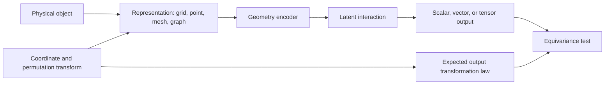



En problemas espaciales, el orden de las matrices de entrada y los sistemas de coordenadas no son meros detalles de preprocesamiento.
Si una predicción cambia de manera irrazonable cuando se gira la misma forma o solo cambia la numeración de sus nodos, el modelo ha aprendido accidentes de la representación en lugar de geometría.

## 1. Problema: el mismo objeto tiene múltiples representaciones numéricas

Los datos geométricos se presentan en muchas formas.

- vóxel o cuadrícula regular
- nube de puntos
- malla de superficie
- malla de volumen
- gráfico
- campo de distancia firmado
- coordenadas paramétricas

Un solo estado físico puede sufrir las siguientes transformaciones:

- traducción
- rotación
- reflexión
- escala
- permutación de nodos
- refinamiento de malla
- cambio de coordenadas locales

Algunas transformaciones no deberían cambiar la predicción.
Para otros, la salida debería cambiar según la misma regla.
Primero escribe el contrato de simetría del problema.

## 2. Modelo mental: representación, grupo de transformación y ley de salida.



Para una transformación (g), el modelo (f) debe satisfacer

$$
f(\rho_{in}(g)x)=\rho_{out}(g)f(x)
$$

- Una salida como una clase o energía suele ser invariante.
- Un vector como la posición, la velocidad o la fuerza debe ser equivalente a la rotación.
- Un tensor como el estrés sigue una ley de transformación tensorial.

Hacer cumplir todas las simetrías no es necesariamente beneficioso.
La gravedad, los límites fijos y la anisotropía material distinguen físicamente direcciones particulares.

## 3. Especifique primero el tipo de cada cantidad física

Tratar cada característica como simplemente un canal de valor real pierde su ley de transformación.

Ejemplos:

- escalar: temperatura, densidad, presión
- vector polar: posición, velocidad, fuerza
- vector axial: velocidad angular o campo magnético según el contexto
- tensor de rango 2: tensión, deformación, tensor de difusión
- categórico: tipo de límite, etiqueta de material

Registre lo siguiente para cada característica.

```yaml
feature:
  name: velocity
  support: node
  geometric_type: polar-vector
  units: length-per-time
  frame: global-cartesian
  normalization: dimensionless-reference-scale
```

Sin metadatos de unidades y marcos, la combinación de diferentes conjuntos de datos crea errores silenciosos.

## 4. Elegir una representación

### Cuadrícula regular

Ventajas:

- Uso eficiente de convoluciones y FFT.
- Diseño de memoria y procesamiento por lotes sencillo.
- Estructuras maduras multiresolución.

Limitaciones:

- Los límites complejos pueden representarse como escaleras.
- También se calcula el espacio vacío.
- La representación puede no responder naturalmente a las rotaciones de coordenadas.

### Nube de puntos

Ventajas:

- Utilización directa de un conjunto de puntos de muestreo.
- No se requiere conectividad de malla.
- Natural para sensores y escaneos de superficies.

Limitaciones:

- Sensible a la definición de barrio.
- Los cambios en la densidad de muestreo crean sesgos.
- La orientación y la topología de la superficie pueden no estar claras.

### Mallas y gráficos

Ventajas:

- Representar geometría irregular y conectividad.
- Puede contener características de nodos, aristas, caras y celdas.
- Conecta bien con artefactos de solucionadores existentes.

Limitaciones:

- El modelo puede ser sensible a la calidad y al refinamiento de la malla.
- Un salto de gráfico no es lo mismo que una distancia física.
- Las interacciones de largo alcance requieren una transmisión profunda de mensajes.

Elegir una representación según la información que se debe preservar y el coste computacional, no según la biblioteca más conveniente.

## 5. Paso de mensajes gráficos

El paso de mensajes generales se puede escribir como

$$
m_{ij}=\phi_e(h_i,h_j,e_{ij}),\qquad
h_i'=\phi_v\left(h_i,\bigoplus_{j\in\mathcal{N}(i)}m_{ij}\right)
$$

Hacer que el operador de agregación ​\(\bigoplus\)​ sea invariante de permutación, como ocurre con la suma, la media o el máximo, hace que el modelo sea robusto ante cambios en el orden de los nodos.

Ejemplos de características de borde:

- posición relativa
- distancia y dirección
- vector de área de la cara
- tipo de conexión
- interfaz de materiales
- orientación del flujo

No elimine siempre las coordenadas absolutas.
La posición absoluta puede ser importante debido a una ubicación límite o a un campo externo.
En lugar de ello, distinga las características relativas locales del contexto global.

## 6. Formas de obtener invariancia

Los enfoques se dividen en tres categorías.

### Aumento de datos

Entrene sobre entradas traducidas y rotadas con la misma etiqueta.

- Sencillo de implementar.
- Proporciona robustez aproximada a las transformaciones seleccionadas.
- No garantiza la equivarianza completa.
- Requiere cobertura de aumento y cálculo.

### Canonicalización

Estandarice el sistema de coordenadas con una regla como el eje principal.

- Puede simplificar el modelo downstream.
- La orientación puede ser inestable para formas simétricas o en presencia de ruido.
- Un pequeño cambio puede provocar un gran cambio de marco.

### Arquitectura equivalente

Diseñe cada capa para preservar la ley de transformación.

- Incorpora estructuralmente simetría.
- Puede mejorar la eficiencia de la muestra.
- Puede aumentar la complejidad de cálculo e implementación.
- Aplicar una simetría incorrecta reduce la expresividad.

Combine los tres enfoques según el problema.

## 7. Geometría y condiciones de contorno.

Si un modelo recibe la forma pero omite las condiciones de contorno, no puede distinguir diferentes problemas físicos en la misma geometría.

Se puede colocar lo siguiente en nodos, caras y celdas:

- tipo de límite
- valor prescrito
- vectores normales
- distancia al límite
- región material
- término fuente
- tamaño de malla local

Las direcciones normales deben seguir una convención de orientación consistente.
Una cara normal invertida es un error de datos, no un problema de equivarianza.

Comprobaciones de preprocesamiento de geometría:

- nodo duplicado
- componente desconectado
- elemento invertido
- borde no múltiple
- bobinado inconsistente
- célula degenerada
- unidad de coordenadas no coincide

## 8. Flujo de trabajo práctico

### Paso 1. Escribe primero la prueba de transformación.

```python
def equivariance_error(model, sample, transform):
    y1 = model(transform.input(sample))
    y0 = transform.output(model(sample))
    return relative_norm(y1 - y0, y0)
```

Incluso antes de entrenar el modelo, verifique que las transformaciones de datos coincidan con la ley de salida.

### Paso 2. Crear divisiones de geometría

- permutaciones de nodos de la misma geometría
- cambios de parámetros dentro de la misma familia
- instancias de geometría invisibles
- topologías invisibles
- cambios de malla de grueso a fino

Las divisiones aleatorias de nodos o muestras crean fugas de geometría.

### Paso 3. Establecer líneas de base simples

- características globales + perceptrón multicapa
- interpolación de cuadrícula + convolución
- red gráfica no equivalente
- línea base de física o modelo de orden reducido

Aislar el beneficio real de una arquitectura de geometría compleja.

### Paso 4. Evaluar la conservación y la simetría juntas

Un modelo puede tener un error de predicción bajo pero no superar las pruebas de rotación y conservación.
Trátelos como puertas de aceptación independientes.

## 9. Diseño de evaluación

Ejes de evaluación requeridos:

- error de tarea
- error de invariancia de permutación
- error de equivarianza de rotación/traslación
- sensibilidad de resolución de malla
- generalización de la geometría reservada
- generalización de reserva de topología
- error de conservación
- memoria de inferencia y tiempo de ejecución

Es posible que diferentes mallas no tengan correspondencia puntual.
Interpolar a ubicaciones físicas comunes o comparar cantidades integrales.

Inspeccione también los mapas de errores locales.

- esquina afilada
- rasgo delgado
- interfaz
- capa límite
- región de muestreo escasa

El error promedio oculta fallas en regiones pequeñas y de alto riesgo.

## 10. Lista de verificación de evaluación

- [ ] ¿Están definidos los tipos geométricos de características de entrada y salida?
- [ ] ¿Se indica el grupo de transformación físicamente válido?
- [ ] ¿Se reflejan los elementos que rompen la simetría, como la gravedad y los límites?
- [] ¿Son consistentes los resultados después de cambiar el orden de los nodos?
- [ ] ¿Existe una prueba de equivarianza numérica para rotación y traslación?
- [] ¿Los datos de entrenamiento y prueba están divididos por instancia de geometría?
- [ ] ¿Se han evaluado cambios en la resolución y calidad de la malla?
- [] ¿Se informa la topología invisible como una categoría separada?
- [ ] ¿Se verifica la orientación normal y la inversión de elementos?
- [ ] ¿Se examinan las cantidades conservadas y objetivo además del error puntual?
- [ ] ¿Se compara el modelo equivariante complejo con una línea base simple?
- [] ¿Las convenciones de coordenadas y preprocesamiento están versionadas como artefactos?

## 11. Fallos y limitaciones comunes

### Describir el aumento como una garantía de simetría

Una muestra finita de rotaciones proporciona sólo una robustez aproximada; no garantiza todas las transformaciones.
Se requiere una prueba de equivarianza separada.

### Tratar las coordenadas absolutas como características inherentemente malas

Si el problema físico tiene un marco global, es necesaria la posición absoluta.
Primero determine qué simetrías son reales.

### Igualar los bordes del gráfico con las interacciones físicas

La adyacencia de malla es una estructura de discretización.
La física de largo alcance o los operadores no locales pueden requerir conexiones adicionales o un mecanismo global.

### Llamar a la generalización de malla fina del rendimiento de malla gruesa

Un cambio en la resolución altera tanto la distribución de entrada como el error numérico.
Las referencias deben compararse en un espacio físico común.

Ni siquiera una arquitectura equivariante puede resolver el sesgo de datos, los límites incorrectos o la geometría fuera del dominio.
Un previo estructural fortalece la verificación; no proporciona una exención de ello.

## 12. Referencias oficiales

- [Plano de aprendizaje profundo geométrico](https://arxiv.org/abs/2104.13478)
- [Documentación geométrica oficial PyTorch](https://pytorch-geometric.readthedocs.io/)
- [Documentación oficial de e3nn](https://docs.e3nn.org/)
- [Documento original de MeshGraphNets](https://arxiv.org/abs/2010.03409)
- [Documento original de PointNet](https://arxiv.org/abs/1612.00593)

## 13. Conclusión

ML con reconocimiento de geometría no es simplemente una técnica para poner formas en una red; es una disciplina de diseño que preserva la coherencia entre múltiples representaciones del mismo objeto físico.
Al establecer explícitamente los tipos de características, las simetrías, la conectividad y los contratos de límites, las afirmaciones sobre la generalización del modelo pueden convertirse en pruebas reales.
