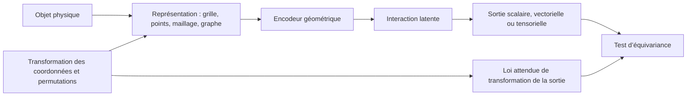



Dans les problèmes spatiaux, l’ordre du tableau d’entrée et le système de coordonnées ne sont pas de simples détails de prétraitement.
Si la prédiction change de façon injustifiée lorsque l’on fait pivoter la même forme ou que l’on modifie seulement la numérotation de ses nœuds, le modèle a appris les contingences de la représentation plutôt que la géométrie.

## 1. Problème : un même objet possède plusieurs représentations numériques

Les données géométriques se présentent sous de nombreuses formes.

- voxel ou grille régulière
- nuage de points
- maillage surfacique
- maillage volumique
- graphe
- champ de distance signé
- coordonnées paramétriques

Un même état physique peut subir les transformations suivantes :

- translation
- rotation
- réflexion
- changement d’échelle
- permutation des nœuds
- raffinement du maillage
- changement de coordonnées locales

Certaines transformations ne doivent pas modifier la prédiction.
Pour d’autres, la sortie doit se transformer selon la même règle.
Il faut commencer par rédiger le contrat de symétrie du problème.

## 2. Modèle mental : représentation, groupe de transformations et loi de sortie



Pour une transformation (g), le modèle (f) doit vérifier la relation suivante.

$$
f(\rho_{in}(g)x)=\rho_{out}(g)f(x)
$$

- Une sortie telle qu’une classe ou une énergie est généralement invariante.
- Un vecteur tel qu’une position, une vitesse ou une force doit être équivariant aux rotations.
- Un tenseur tel qu’une contrainte suit une loi de transformation tensorielle.

Imposer toutes les symétries n’est pas nécessairement souhaitable.
La gravité, les frontières fixes et l’anisotropie des matériaux distinguent physiquement certaines directions.

## 3. Commencer par préciser le type de chaque grandeur physique

Considérer toutes les caractéristiques comme de simples canaux réels fait perdre leurs lois de transformation.

Exemples :

- scalaire : température, masse volumique, pression
- vecteur polaire : position, vitesse, force
- vecteur axial : vitesse angulaire, champ magnétique selon le contexte
- tenseur de rang 2 : contrainte, déformation, tenseur de diffusion
- catégorie : type de frontière, étiquette de matériau

Consignez les informations suivantes pour chaque caractéristique.

```yaml
feature:
  name: velocity
  support: node
  geometric_type: polar-vector
  units: length-per-time
  frame: global-cartesian
  normalization: dimensionless-reference-scale
```

Sans métadonnées d’unité et de repère, l’association de jeux de données différents engendre des erreurs silencieuses.

## 4. Choix de la représentation

### Grille régulière

Avantages :

- Utilisation efficace des convolutions et des FFT.
- Regroupement en lots et organisation mémoire simples.
- Structures multi-résolutions éprouvées.

Limites :

- Les frontières complexes peuvent être représentées en escalier.
- Les calculs couvrent aussi les espaces vides.
- La représentation peut ne pas réagir naturellement aux rotations du système de coordonnées.

### Nuage de points

Avantages :

- Utilisation directe d’un ensemble de points d’échantillonnage.
- Aucune connectivité de maillage n’est nécessaire.
- Représentation naturelle pour les capteurs et les relevés de surface.

Limites :

- Sensibilité à la définition du voisinage.
- Les variations de densité d’échantillonnage créent un biais.
- L’orientation et la topologie de la surface peuvent être ambiguës.

### Maillages et graphes

Avantages :

- Représentation de géométries et de connectivités irrégulières.
- Possibilité de porter des caractéristiques sur les nœuds, arêtes, faces et cellules.
- Bonne intégration aux artefacts des solveurs existants.

Limites :

- Le modèle peut être sensible à la qualité et au raffinement du maillage.
- Un saut dans le graphe ne correspond pas à une distance physique.
- Les interactions à longue portée exigent une propagation de messages profonde.

La représentation doit être choisie en fonction des informations à préserver et du coût de calcul, et non de la bibliothèque la plus pratique.

## 5. Propagation de messages sur un graphe

La propagation générale de messages peut s’écrire comme suit.

$$
m_{ij}=\phi_e(h_i,h_j,e_{ij}),\qquad
h_i'=\phi_v\left(h_i,\bigoplus_{j\in\mathcal{N}(i)}m_{ij}\right)
$$

Choisir un opérateur d’agrégation ​\(\bigoplus\)​ invariant aux permutations, comme la somme, la moyenne ou le maximum, rend le modèle robuste aux changements d’ordre des nœuds.

Exemples de caractéristiques d’arête :

- position relative
- distance et direction
- vecteur d’aire de face
- type de connexion
- interface entre matériaux
- orientation du flux

Il ne faut pas supprimer systématiquement les coordonnées absolues.
La position absolue peut avoir un sens en raison de l’emplacement d’une frontière ou d’un champ extérieur.
Il convient plutôt de distinguer les caractéristiques relatives locales du contexte global.

## 6. Méthodes pour obtenir l’invariance

Les approches se répartissent en trois catégories.

### Augmentation des données

Le modèle est entraîné sur des entrées translatées et pivotées portant la même étiquette.

- Mise en œuvre simple.
- Robustesse approximative aux transformations choisies.
- Aucune garantie d’équivariance complète.
- Nécessite une couverture suffisante des augmentations et davantage de calculs.

### Canonisation

Le système de coordonnées est normalisé selon une règle telle que l’axe principal.

- Peut simplifier le modèle en aval.
- L’orientation peut être instable pour des formes symétriques ou en présence de bruit.
- Une faible variation peut provoquer un grand basculement de repère.

### Architecture équivariante

Chaque couche est conçue de façon à préserver la loi de transformation.

- Intègre structurellement la symétrie.
- Peut améliorer l’efficacité en nombre d’échantillons.
- Peut accroître le coût de calcul et la complexité de mise en œuvre.
- Imposer une symétrie erronée réduit la capacité d’expression.

Ces trois approches peuvent être combinées selon le problème.

## 7. Géométrie et conditions aux limites

Si le modèle reçoit la forme, mais pas les conditions aux limites, il ne peut pas distinguer différents problèmes physiques définis sur une même géométrie.

Les informations suivantes peuvent être placées sur les nœuds, faces et cellules :

- type de frontière
- valeur imposée
- vecteur normal
- distance à la frontière
- région matérielle
- terme source
- taille locale du maillage

Les directions normales doivent suivre une convention d’orientation cohérente.
Une normale de face inversée est une erreur de données, et non un problème d’équivariance.

Contrôles du prétraitement géométrique :

- nœud dupliqué
- composante déconnectée
- élément inversé
- arête non-manifold
- orientation incohérente
- cellule dégénérée
- incohérence d’unités des coordonnées

## 8. Flux de travail pratique

### Étape 1. Écrire d’abord le test de transformation

```python
def equivariance_error(model, sample, transform):
    y1 = model(transform.input(sample))
    y0 = transform.output(model(sample))
    return relative_norm(y1 - y0, y0)
```

Avant même d’entraîner le modèle, vérifiez que les transformations des données correspondent à la loi de sortie.

### Étape 2. Créer des partitions géométriques

- permutations des nœuds d’une même géométrie
- variations de paramètres au sein d’une même famille
- instances géométriques jamais vues
- topologies jamais vues
- passage d’un maillage grossier à un maillage fin

Une partition aléatoire des nœuds ou des échantillons crée une fuite d’information géométrique.

### Étape 3. Établir des références simples

- caractéristiques globales + perceptron multicouche
- interpolation sur grille + convolution
- réseau de graphes non équivariant
- référence physique ou modèle d’ordre réduit

Isolez le bénéfice réel d’une architecture géométrique complexe.

### Étape 4. Évaluer conjointement conservation et symétrie

Un modèle peut présenter une faible erreur de prédiction tout en échouant aux tests de rotation et de conservation.
Traitez-les comme des critères d’acceptation distincts.

## 9. Conception de l’évaluation

Axes d’évaluation indispensables :

- erreur sur la tâche
- erreur d’invariance aux permutations
- erreur d’équivariance aux rotations et translations
- sensibilité à la résolution du maillage
- généralisation aux géométries laissées de côté
- généralisation aux topologies laissées de côté
- erreur de conservation
- mémoire et temps d’exécution lors de l’inférence

Des maillages différents peuvent ne présenter aucune correspondance point par point.
Interpolez vers des positions physiques communes ou comparez des grandeurs intégrales.

Examinez aussi les cartes d’erreur locales.

- angle vif
- détail mince
- interface
- couche limite
- zone d’échantillonnage clairsemé

L’erreur moyenne masque les défaillances dans de petites zones à haut risque.

## 10. Liste de contrôle de l’évaluation

- [ ] Les types géométriques des caractéristiques d’entrée et de sortie sont-ils définis ?
- [ ] Le groupe de transformations physiquement valide est-il indiqué ?
- [ ] Les éléments qui brisent la symétrie, tels que la gravité et les frontières, sont-ils pris en compte ?
- [ ] Les résultats restent-ils cohérents lorsque l’ordre des nœuds change ?
- [ ] Existe-t-il un test numérique d’équivariance aux rotations et translations ?
- [ ] Les données d’entraînement et de test sont-elles séparées par instance géométrique ?
- [ ] Les variations de résolution et de qualité du maillage ont-elles été évaluées ?
- [ ] Une topologie jamais vue est-elle rapportée dans une catégorie distincte ?
- [ ] L’orientation des normales et l’inversion des éléments sont-elles contrôlées ?
- [ ] Les grandeurs conservées et les grandeurs d’intérêt sont-elles examinées en plus de l’erreur point par point ?
- [ ] Le modèle équivariant complexe est-il comparé à une référence simple ?
- [ ] Le prétraitement et les conventions de coordonnées sont-ils versionnés sous forme d’artefacts ?

## 11. Échecs fréquents et limites

### Présenter l’augmentation comme une garantie de symétrie

Un nombre fini de rotations échantillonnées n’apporte qu’une robustesse approximative ; il ne garantit pas toutes les transformations.
Un test d’équivariance distinct reste nécessaire.

### Considérer les coordonnées absolues comme de mauvaises caractéristiques par nature

Si le problème physique possède un repère global, la position absolue est nécessaire.
Il faut d’abord déterminer quelles symétries sont réelles.

### Assimiler les arêtes du graphe aux interactions physiques

L’adjacence du maillage est une structure de discrétisation.
Une physique à longue portée ou un opérateur non local peut nécessiter des connexions supplémentaires ou un mécanisme global.

### Qualifier les performances sur maillage grossier de généralisation au maillage fin

Un changement de résolution modifie à la fois la distribution des entrées et l’erreur numérique.
Les références doivent être comparées dans un espace physique commun.

Même une architecture équivariante ne résout ni le biais des données, ni les conditions aux limites erronées, ni les géométries hors distribution.
Un a priori structurel renforce la vérification, mais n’en dispense pas.

## 12. Références officielles

- [Cadre de référence de l’apprentissage profond géométrique](https://arxiv.org/abs/2104.13478)
- [Documentation officielle de PyTorch Geometric](https://pytorch-geometric.readthedocs.io/)
- [Documentation officielle d’e3nn](https://docs.e3nn.org/)
- [Article original sur MeshGraphNets](https://arxiv.org/abs/2010.03409)
- [Article original sur PointNet](https://arxiv.org/abs/1612.00593)

## 13. Conclusion

L’apprentissage automatique sensible à la géométrie ne consiste pas simplement à introduire des formes dans un réseau : c’est une discipline de conception qui préserve la cohérence entre plusieurs représentations d’un même objet physique.
En explicitant les types de caractéristiques, les symétries, la connectivité et les contrats de frontière, les affirmations sur la généralisation du modèle deviennent de véritables tests.
