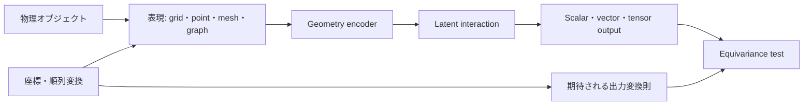



空間問題では、入力配列の順序と座標系は単なる前処理の詳細ではない。
同じ形状を回転させたり、node番号だけを変えたりしたときに予測が不合理に変わるなら、モデルはgeometryではなく表現上の偶然を学習している。

## 1. 問題：同じ物体が複数の数値表現を持つ

geometryデータにはさまざまな形式がある。

- voxelまたはregular grid
- point cloud
- surface mesh
- volume mesh
- graph
- signed distance field
- parametric coordinates

一つの物理状態も、次の変換を受けることがある。

- translation
- rotation
- reflection
- scale
- node permutation
- mesh refinement
- local coordinate change

ある変換では予測が変わってはならない。
別の変換では、出力も同じ規則に従って変わらなければならない。
まず問題のsymmetry contractを記述する必要がある。

## 2. Mental model：表現、変換群、出力則



変換 \(g\)に対してモデル \(f\)が満たすべき関係は次のとおりである。

$$
f(\rho_{in}(g)x)=\rho_{out}(g)f(x)
$$

- 出力がclassやenergyのようなscalarであれば、一般にinvariantである。
- 位置、速度、forceのようなvectorはrotationに対してequivariantでなければならない。
- stressのようなtensorはtensor変換則に従う。

すべてのsymmetryを強制することが望ましいとは限らない。
gravity、固定boundary、材料の方向性は、特定の方向を物理的に区別する。

## 3. まず物理量のtypeを指定する

featureをすべて実数channelとしてのみ扱うと、変換則が失われる。

例：

- scalar：温度、密度、pressure
- polar vector：位置、速度、force
- axial vector：angular velocity、magnetic fieldの文脈
- rank-2 tensor：stress、strain、diffusion tensor
- categorical：boundary type、material label

各featureについて次の項目を記録する。

```yaml
feature:
  name: velocity
  support: node
  geometric_type: polar-vector
  units: length-per-time
  frame: global-cartesian
  normalization: dimensionless-reference-scale
```

単位とframe metadataがなければ、異なるdatasetを結合するときにsilent errorが生じる。

## 4. 表現の選択

### Regular grid

長所：

- convolutionとFFTを効率的に利用できる。
- batchとmemory layoutが単純である。
- multi-resolution構造が成熟している。

制約：

- 複雑なboundaryがstaircase状に表現されることがある。
- 空の空間まで計算する。
- 座標の回転に対して自然でない場合がある。

### Point cloud

長所：

- sampling pointの集合を直接使用する。
- mesh connectivityがなくてもよい。
- センサーと表面scanに自然に適合する。

制約：

- neighborhoodの定義に敏感である。
- sampling densityの変化がbiasを生む。
- surface orientationとtopologyが明確でない場合がある。

### Meshとgraph

長所：

- 不規則なgeometryとconnectivityを表現できる。
- node、edge、face、cell featureを保持できる。
- 既存のsolver artifactと接続しやすい。

制約：

- モデルがmeshの品質とrefinementに敏感な場合がある。
- graph hopは物理的距離と同じではない。
- 長距離の相互作用には深いmessage passingが必要である。

表現は使いやすいlibraryではなく、保存すべき情報と演算コストに基づいて決める。

## 5. Graph message passing

一般的なmessage passingは次のように書ける。

$$
m_{ij}=\phi_e(h_i,h_j,e_{ij}),\qquad
h_i'=\phi_v\left(h_i,\bigoplus_{j\in\mathcal{N}(i)}m_{ij}\right)
$$

集約演算​\(\bigoplus\)​をsum、mean、maxのようにpermutation-invariantにすれば、node orderingの変化に強くなる。

edge featureの例：

- 相対位置
- 距離と方向
- face area vector
- 接続タイプ
- material interface
- flux orientation

絶対座標を無条件に取り除いてはならない。
boundaryの位置やexternal fieldによって、絶対位置が意味を持つ場合がある。
その代わり、local relative featureとglobal contextを区別する。

## 6. 不変性を確保する方法

アプローチは三つに分けられる。

### Data augmentation

入力を回転・移動させ、同じlabelを学習する。

- 実装が単純である。
- 選択した変換に対する近似的なrobustnessを与える。
- 完全なequivarianceは保証しない。
- augmentation coverageと計算量が必要である。

### Canonicalization

principal axisのような規則で座標系を標準化する。

- downstream modelを単純化できる場合がある。
- 対称形状とnoiseではorientationが不安定になることがある。
- 小さな変化が大きなframe flipを引き起こす場合がある。

### Equivariant architecture

layer自体が変換則を保存するように設計する。

- symmetryを構造的に反映する。
- sample efficiencyを高められる場合がある。
- 計算量と実装の複雑さが増えることがある。
- 誤ったsymmetryを強制すると表現力が低下する。

三つのアプローチを問題に合わせて組み合わせる。

## 7. Geometryとboundary condition

形状だけを入力し、boundary conditionを欠落させると、同じgeometryに対する異なる物理問題を区別できない。

node・face・cellには次の情報を配置できる。

- boundary type
- prescribed value
- normal vector
- distance to boundary
- material region
- source term
- local mesh size

法線方向はorientation conventionが一貫していなければならない。
反転したface normalはequivarianceの問題ではなく、データの誤りである。

geometry preprocessingの検査項目：

- duplicate node
- disconnected component
- inverted element
- non-manifold edge
- inconsistent winding
- degenerate cell
- coordinate unit mismatch

## 8. 実践workflow

### Step 1. まず変換testを書く

```python
def equivariance_error(model, sample, transform):
    y1 = model(transform.input(sample))
    y0 = transform.output(model(sample))
    return relative_norm(y1 - y0, y0)
```

モデルの学習前であっても、データのtransformとoutput lawが一致しているか検査する。

### Step 2. geometry splitを作る

- 同一geometryのnode permutation
- 同じfamilyのparameter変化
- 未見のgeometry instance
- 未見のtopology
- coarse-to-fine meshの変化

nodeやsampleの無作為なsplitはgeometry leakageを生む。

### Step 3. 単純なbaselineを置く

- global feature + multilayer perceptron
- grid interpolation + convolution
- non-equivariant graph network
- physics baselineまたはreduced-order model

複雑なgeometry architectureの実際の利得を切り分ける。

### Step 4. 保存則とsymmetryを併せて見る

予測誤差が低くても、rotation testとconservation testに失敗することがある。
それぞれを異なるacceptance gateとして設定する。

## 9. 評価設計

必須の評価軸：

- task error
- permutation invariance error
- rotation/translation equivariance error
- mesh resolution sensitivity
- geometry holdout generalization
- topology holdout generalization
- conservation error
- inference memoryとruntime

meshが異なると、pointwiseな対応が存在しない場合がある。
共通のphysical locationへinterpolateするか、integral quantityを比較する。

local error mapも確認する。

- sharp corner
- thin feature
- interface
- boundary layer
- sparse sampling region

平均誤差は、小さいながら高リスクな領域での失敗を隠す。

## 10. 評価checklist

- [ ] 入力と出力featureのgeometric typeを定義したか？
- [ ] 物理的に有効な変換群を明示したか？
- [ ] gravity・boundaryのようにsymmetryを破る要素を反映したか？
- [ ] node orderingを変えても結果に一貫性があるか？
- [ ] 回転・移動に対する数値equivariance testがあるか？
- [ ] geometry instance単位でtrain/testを分割したか？
- [ ] mesh resolutionと品質の変化に対して評価したか？
- [ ] unseen topologyを別のカテゴリとして報告しているか？
- [ ] normal orientationとelement inversionを検査しているか？
- [ ] pointwise error以外に保存量と関心量を確認しているか？
- [ ] 複雑なequivariant modelを単純なbaselineと比較したか？
- [ ] preprocessingとcoordinate conventionをartifactとしてversion管理しているか？

## 11. よくある失敗と限界

### augmentationをsymmetryの保証として表現する

有限個の回転サンプルは近似的なrobustnessを与えるだけで、すべての変換を保証するものではない。
別途equivariance testが必要である。

### absolute coordinateを無条件に悪いfeatureとみなす

物理問題にglobal frameが存在する場合、絶対位置が必要である。
どのsymmetryが実在するのかを先に判断する。

### graph edgeを物理的相互作用と同一視する

mesh adjacencyはdiscretizationの構造である。
長距離physicsやnonlocal operatorには、追加の接続またはglobal mechanismが必要な場合がある。

### coarse meshでの性能をfine meshへの汎化と呼ぶ

resolutionの変化はinput distributionとnumerical errorを同時に変える。
referenceを共通の物理空間で比較しなければならない。

equivariant architectureも、データの偏り、誤ったboundary、out-of-domain geometryを解決することはできない。
構造的priorは検証を強化するが、検証を免除するものではない。

## 12. 公式参考資料

- [Geometric Deep Learning blueprint](https://arxiv.org/abs/2104.13478)
- [PyTorch Geometric公式ドキュメント](https://pytorch-geometric.readthedocs.io/)
- [e3nn公式ドキュメント](https://docs.e3nn.org/)
- [MeshGraphNets原論文](https://arxiv.org/abs/2010.03409)
- [PointNet原論文](https://arxiv.org/abs/1612.00593)

## 13. まとめ

Geometry-aware MLは、shapeをnetworkに入力する技術ではなく、同じ物理オブジェクトの複数の表現間で一貫性を守る設計である。
feature type、symmetry、connectivity、boundary contractを明示すれば、モデルの汎化に関する主張を実際のtestに変えられる。
