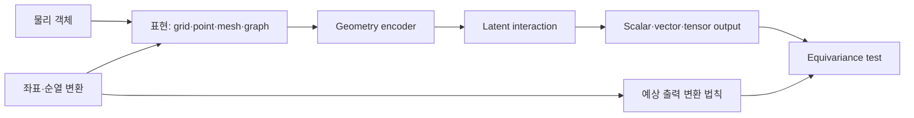



공간 문제에서 입력 배열의 순서와 좌표계는 단순한 전처리 세부사항이 아니다.
같은 형상을 회전하거나 node 번호만 바꿨을 때 예측이 불합리하게 달라지면 모델은 geometry가 아니라 표현의 우연을 학습한 것이다.

## 1. 문제: 동일한 물체가 여러 숫자 표현을 가진다

geometry 데이터는 다양한 형태로 들어온다.

- voxel 또는 regular grid
- point cloud
- surface mesh
- volume mesh
- graph
- signed distance field
- parametric coordinates

한 물리 상태도 다음 변환을 받을 수 있다.

- translation
- rotation
- reflection
- scale
- node permutation
- mesh refinement
- local coordinate change

어떤 변환은 예측을 바꾸지 않아야 한다.
어떤 변환은 출력도 같은 규칙으로 바뀌어야 한다.
문제의 symmetry contract를 먼저 작성해야 한다.

## 2. Mental model: 표현, 변환군, 출력 법칙



변환 (g)에 대해 모델 (f)가 만족해야 할 관계는 다음이다.

$$
f(\rho_{in}(g)x)=\rho_{out}(g)f(x)
$$

- 출력이 class나 energy 같은 scalar면 흔히 invariant하다.
- 위치, 속도, force 같은 vector는 rotation에 equivariant해야 한다.
- stress 같은 tensor는 tensor 변환 법칙을 따른다.

모든 symmetry를 강제하는 것이 좋은 것은 아니다.
gravity, 고정 boundary, 재료 방향성은 특정 방향을 물리적으로 구분한다.

## 3. 물리량의 type을 먼저 지정한다

feature를 모두 실수 channel로만 보면 변환 법칙을 잃는다.

예:

- scalar: 온도, 밀도, pressure
- polar vector: 위치, 속도, force
- axial vector: angular velocity, magnetic field 문맥
- rank-2 tensor: stress, strain, diffusion tensor
- categorical: boundary type, material label

각 feature에 다음을 기록한다.

```yaml
feature:
  name: velocity
  support: node
  geometric_type: polar-vector
  units: length-per-time
  frame: global-cartesian
  normalization: dimensionless-reference-scale
```

단위와 frame metadata가 없으면 서로 다른 dataset을 결합할 때 silent error가 생긴다.

## 4. 표현 선택

### Regular grid

장점:

- convolution과 FFT를 효율적으로 사용한다.
- batch와 memory layout이 단순하다.
- multi-resolution 구조가 성숙하다.

한계:

- 복잡한 boundary가 staircase로 표현될 수 있다.
- 빈 공간까지 계산한다.
- 좌표 회전에 자연스럽지 않을 수 있다.

### Point cloud

장점:

- sampling point 집합을 직접 사용한다.
- mesh connectivity가 없어도 된다.
- 센서와 표면 scan에 자연스럽다.

한계:

- neighborhood 정의에 민감하다.
- sampling density 변화가 bias를 만든다.
- surface orientation과 topology가 명확하지 않을 수 있다.

### Mesh와 graph

장점:

- 불규칙 geometry와 connectivity를 표현한다.
- node, edge, face, cell feature를 담을 수 있다.
- 기존 solver artifact와 연결하기 좋다.

한계:

- mesh 품질과 refinement에 모델이 민감할 수 있다.
- graph hop이 물리적 거리와 같지 않다.
- 긴 범위 상호작용은 깊은 message passing이 필요하다.

표현은 편한 library가 아니라 보존해야 할 정보와 연산 비용으로 결정한다.

## 5. Graph message passing

일반적 message passing은 다음과 같이 쓸 수 있다.

$$
m_{ij}=\phi_e(h_i,h_j,e_{ij}),\qquad
h_i'=\phi_v\left(h_i,\bigoplus_{j\in\mathcal{N}(i)}m_{ij}\right)
$$

집계 연산 ​\(\bigoplus\)​을 sum, mean, max처럼 permutation-invariant하게 두면 node ordering 변화에 강해진다.

edge feature 예:

- 상대 위치
- 거리와 방향
- face area vector
- 연결 유형
- material interface
- flux orientation

절대 좌표를 무조건 제거하지 않는다.
boundary 위치나 external field 때문에 절대 위치가 의미 있을 수 있다.
대신 local relative feature와 global context를 구분한다.

## 6. 불변성 확보 방법

접근은 세 가지로 나눌 수 있다.

### Data augmentation

입력을 회전·이동해 같은 label을 학습한다.

- 구현이 단순하다.
- 선택한 변환에 대한 근사적 robustness를 준다.
- 완전한 equivariance를 보장하지 않는다.
- augmentation coverage와 계산량이 필요하다.

### Canonicalization

principal axis 같은 규칙으로 좌표계를 표준화한다.

- downstream model이 단순해질 수 있다.
- 대칭 형상과 noise에서 orientation이 불안정할 수 있다.
- 작은 변화가 큰 frame flip을 만들 수 있다.

### Equivariant architecture

layer 자체가 변환 법칙을 보존하도록 설계한다.

- symmetry를 구조적으로 반영한다.
- sample efficiency를 높일 수 있다.
- 계산량과 구현 복잡성이 증가할 수 있다.
- 잘못된 symmetry를 강제하면 표현력이 줄어든다.

세 접근을 문제에 맞게 조합한다.

## 7. Geometry와 boundary condition

형상만 넣고 boundary condition을 빠뜨리면 같은 geometry의 다른 물리 문제를 구분할 수 없다.

node·face·cell에 다음을 배치할 수 있다.

- boundary type
- prescribed value
- normal vector
- distance to boundary
- material region
- source term
- local mesh size

법선 방향은 orientation convention이 일관돼야 한다.
뒤집힌 face normal은 equivariance 문제가 아니라 데이터 오류다.

geometry preprocessing 검사:

- duplicate node
- disconnected component
- inverted element
- non-manifold edge
- inconsistent winding
- degenerate cell
- coordinate unit mismatch

## 8. 실전 workflow

### Step 1. 변환 test를 먼저 쓴다

```python
def equivariance_error(model, sample, transform):
    y1 = model(transform.input(sample))
    y0 = transform.output(model(sample))
    return relative_norm(y1 - y0, y0)
```

모델 학습 전에도 데이터 transform과 output law가 맞는지 검사한다.

### Step 2. geometry split을 만든다

- 동일 geometry의 node permutation
- 같은 family의 parameter 변화
- 보지 못한 geometry instance
- 보지 못한 topology
- coarse-to-fine mesh 변화

무작위 node나 sample split은 geometry leakage를 만든다.

### Step 3. 단순 baseline을 둔다

- global feature + multilayer perceptron
- grid interpolation + convolution
- non-equivariant graph network
- physics baseline 또는 reduced-order model

복잡한 geometry architecture의 실제 이득을 분리한다.

### Step 4. 보존과 symmetry를 함께 본다

예측 오차가 낮아도 rotation test와 conservation test를 실패할 수 있다.
서로 다른 acceptance gate로 둔다.

## 9. 평가 설계

필수 평가 축:

- task error
- permutation invariance error
- rotation/translation equivariance error
- mesh resolution sensitivity
- geometry holdout generalization
- topology holdout generalization
- conservation error
- inference memory와 runtime

mesh가 다르면 pointwise 대응이 없을 수 있다.
공통 physical location으로 interpolate하거나 integral quantity를 비교한다.

local error map도 본다.

- sharp corner
- thin feature
- interface
- boundary layer
- sparse sampling region

평균 오차는 작은 고위험 영역의 실패를 숨긴다.

## 10. 평가 checklist

- [ ] 입력과 출력 feature의 geometric type을 정의했는가?
- [ ] 물리적으로 유효한 변환군을 명시했는가?
- [ ] gravity·boundary처럼 symmetry를 깨는 요소를 반영했는가?
- [ ] node ordering을 바꿔도 결과가 일관되는가?
- [ ] 회전·이동에 대한 수치 equivariance test가 있는가?
- [ ] geometry instance 단위로 train/test를 분리했는가?
- [ ] mesh resolution과 품질 변화에 대해 평가했는가?
- [ ] unseen topology를 별도 범주로 보고하는가?
- [ ] normal orientation과 element inversion을 검사하는가?
- [ ] pointwise error 외에 보존량과 관심량을 보는가?
- [ ] 복잡한 equivariant model을 단순 baseline과 비교했는가?
- [ ] preprocessing과 coordinate convention을 artifact로 버전 관리하는가?

## 11. 흔한 실패와 한계

### augmentation을 symmetry 보장으로 표현한다

유한한 회전 표본은 근사적 robustness를 줄 뿐 모든 변환을 보장하지 않는다.
별도 equivariance test가 필요하다.

### absolute coordinate를 무조건 나쁜 feature로 본다

물리 문제에 global frame이 존재하면 절대 위치가 필요하다.
어떤 symmetry가 실제인지 먼저 판단한다.

### graph edge를 물리 상호작용과 동일시한다

mesh adjacency는 discretization 구조다.
장거리 physics나 nonlocal operator에는 추가 연결 또는 global mechanism이 필요할 수 있다.

### coarse mesh 성능을 fine mesh 일반화로 부른다

resolution 변화는 input distribution과 numerical error를 함께 바꾼다.
reference를 공통 물리 공간에서 비교해야 한다.

equivariant architecture도 데이터 편향, 잘못된 boundary, out-of-domain geometry를 해결하지 못한다.
구조적 prior는 검증을 강화하지만 면제하지 않는다.

## 12. 공식 참고자료

- [Geometric Deep Learning blueprint](https://arxiv.org/abs/2104.13478)
- [PyTorch Geometric 공식 문서](https://pytorch-geometric.readthedocs.io/)
- [e3nn 공식 문서](https://docs.e3nn.org/)
- [MeshGraphNets 원 논문](https://arxiv.org/abs/2010.03409)
- [PointNet 원 논문](https://arxiv.org/abs/1612.00593)

## 13. 마무리

Geometry-aware ML은 shape를 network에 넣는 기술이 아니라 같은 물리 객체의 여러 표현 사이에서 일관성을 지키는 설계다.
feature type, symmetry, connectivity, boundary contract를 명시하면 모델의 일반화 주장을 실제 test로 바꿀 수 있다.
