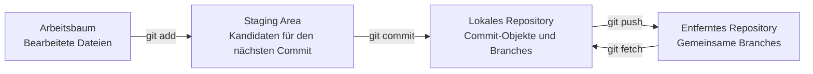



## Das Problem: Warum Git selbst nach dem Auswendiglernen von Befehlen unsicher wirkt

Die häufigste Git-Verwirrung beginnt damit, `add`, `commit` und `push` als eine einzige „Speicheroperation“ zu behandeln. Die drei Befehle verändern jedoch verschiedene Räume. Auch `pull` ist kein einfacher Download, sondern eine zusammengesetzte Operation, die entfernte Änderungen abruft und anschließend in den aktuellen Branch integriert.

Ohne diese Unterscheidung sind folgende Fragen schwer zu beantworten.

- Warum wurde eine geänderte Datei nicht in den Commit aufgenommen?
- Warum ist ein Commit im entfernten Repository nicht sichtbar?
- Warum zeigt `git status` Änderungen, wenn `git diff` nichts zeigt?
- Warum erschien unmittelbar nach `pull` ein Konflikt oder unerwarteter Merge-Commit?

Der Schlüssel zur zuverlässigen Git-Nutzung liegt nicht in vielen Befehlen, sondern darin, **zu beobachten, welcher Raum aktuell jede Änderung enthält**.

## Denkmodell: Arbeit bewegt sich zwischen vier Räumen



### 1. Arbeitsbaum

Dies sind die tatsächlichen, in Editor und Dateibrowser sichtbaren Dateien. Speichern bedeutet nur, dass sich eine Datei auf dem Datenträger geändert hat; die Änderung wurde noch nicht in der Git-Historie erfasst.

### 2. Staging Area (Index)

Hier wird „der Schnappschuss für den nächsten Commit“ zusammengestellt. Git scheint Dateien zu speichern, erfasst aber tatsächlich zum Commit-Zeitpunkt einen Schnappschuss des Projektbaums. `git add` kopiert den aktuellen Dateiinhalt in die Staging Area.

Wird eine Datei nach dem Hinzufügen erneut geändert, können gleichzeitig zwei Versionen bestehen.

- Staged-Version: Inhalt, der in den nächsten Commit eingeht
- Arbeitsbaumversion: danach weiter bearbeiteter Inhalt

### 3. Lokales Repository

Commit-Objekte, Trees, Blobs und Branchreferenzen liegen unter `.git`. `git commit` erzeugt aus dem Staging-Schnappschuss einen neuen Commit und lässt den aktuellen Branch darauf zeigen. Noch fand keine Netzwerkkommunikation statt.

### 4. Entferntes Repository

Dieses Repository wird von Team und CI geteilt. `origin` ist nur ein konventioneller Remote-Name, kein besonderes Schlüsselwort. `git push origin main` fordert Git auf, die vom lokalen `main` referenzierten Commits zu übertragen und die entfernte Referenz `main` zu verschieben.

Auch `origin/main` ist nicht der entfernte Server selbst. Es ist ein **Remote-Tracking-Branch**, der den vom lokalen Git beim letzten `fetch` oder `push` gemerkten Zustand darstellt. Um den neuesten Serverzustand zu erfahren, wird zuerst `git fetch` ausgeführt.

### HEAD und Branches sind Zeiger

Commits sind gewöhnlich unveränderliche Objekte, Branches dagegen verschiebbare Namen, die auf bestimmte Commits zeigen. `HEAD` zeigt üblicherweise auf den aktuell ausgecheckten Branch.

```text
HEAD -> main -> C3 -> C2 -> C1
```

Ein neuer Commit `C4` verändert keinen früheren Commit, sondern verschiebt den Zeiger `main` zu `C4`. Mit diesem Modell lassen sich Branch, Reset, Rebase und Reflog sämtlich als „welcher Zeiger wurde wohin verschoben?“ interpretieren.

## Praktisches Muster: beobachten, in kleinen Einheiten erfassen und ausdrücklich synchronisieren

### Vier grundlegende Befehle zur Zustandsprüfung

```bash
git status --short --branch
git diff
git diff --staged
git log --oneline --decorate --graph --all -n 20
```

Jeder Befehl beantwortet eine andere Frage.

| Befehl | Beantwortete Frage |
|---|---|
| `git status --short --branch` | Welches sind aktueller Branch und geänderte Dateien? |
| `git diff` | Wie unterscheiden sich Arbeitsbaum und Staging Area? |
| `git diff --staged` | Wie unterscheiden sich Staging Area und `HEAD`-Commit? |
| `git log ...` | Welche Form besitzen Branches und Commitgraph? |

Aus einem leeren `git diff` darf nicht geschlossen werden, dass nichts geändert wurde. Bereits hinzugefügte Änderungen erscheinen in `git diff --staged`.

### Eine Arbeitseinheit in einen prüfbaren Commit verwandeln

```bash
# 1) 전체 상태를 본다.
git status --short --branch

# 2) 필요한 hunk만 선택한다.
git add --patch

# 3) 실제 커밋될 내용을 검토한다.
git diff --staged --check
git diff --staged

# 4) 의도를 설명하는 메시지로 기록한다.
git commit -m "docs: explain cache invalidation policy"

# 5) 커밋 후 작업 트리와 이력을 다시 확인한다.
git status --short --branch
git show --stat --oneline HEAD
```

`git add .` ist nicht immer falsch, erweitert aber den Prüfumfang, wenn nicht zusammenhängende Arbeit und temporäre Dateien vermischt sind. Mit `git add --patch` kann die Aufnahme nach Änderungshunk gewählt werden, was die Kohäsion des Commits erhöht.

Ein guter Commit besitzt folgende Eigenschaften.

- Sein Zweck lässt sich in einem Satz erklären.
- Er bewahrt einen build- oder testbaren Zustand.
- Er trennt Formatierungs- möglichst von Verhaltensänderungen.
- Er enthält weder Secrets, generierte Ausgaben noch Dateien persönlicher Umgebungen.
- Seine Meldung erfasst bei Bedarf neben dem „Was“ auch das „Warum“.

### Vor dem Push Unterschiede zum Remote untersuchen

```bash
git fetch --prune origin

# 로컬에만 있는 커밋
git log --oneline origin/main..HEAD

# 원격에만 있는 커밋
git log --oneline HEAD..origin/main

# 양쪽 차이와 갈라진 지점
git log --left-right --graph --oneline HEAD...origin/main
```

Da `fetch` Arbeitsbaum oder aktuellen Branch nicht automatisch verändert, eignet es sich als sicherer Beobachtungsschritt. Nach Untersuchung der Remote-Änderungen wird ihre Integrationsweise gewählt.

Liegt der aktuelle Branch ohne lokale Commits hinter dem Remote, erlaubt folgender Befehl nur einen Fast-forward.

```bash
git pull --ff-only
```

Sind die Branches divergiert, stoppt `--ff-only`. Dieser Fehler ist eine Schutzmaßnahme, die das Problem nicht verbirgt und zu einer bewussten Wahl zwischen Merge und Rebase zwingt.

Beim ersten Teilen eines neuen Branches wird der Upstream gesetzt.

```bash
git switch -c docs/cache-policy
git push --set-upstream origin docs/cache-policy
```

Danach kennen `git push` und `git pull --ff-only` den verfolgten Branch. Ein vorhandener Upstream garantiert jedoch nicht, dass er stets das richtige Push-Ziel ist; deshalb wird zuerst `git status --short --branch` geprüft.

### Pull als zwei getrennte Operationen verstehen

Konzeptionell ist `pull` Folgendes.

```text
git pull = git fetch + 통합(merge 또는 rebase)
```

Beim Lernen oder auf einem wichtigen Branch macht die tatsächliche Trennung beider Operationen den Entscheidungspunkt deutlich.

```bash
git fetch origin
git log --left-right --graph --oneline HEAD...origin/main

# fast-forward 가능한 경우에만 현재 브랜치를 이동
git merge --ff-only origin/main
```

Verwendet die Teamrichtlinie Rebase, kann `git rebase origin/main` ausdrücklich auf einem Feature-Branch ausgeführt werden. Commits auf einem bereits von anderen genutzten öffentlichen Branch dürfen nicht umgeschrieben werden.

### `.gitignore` gilt für noch nicht verfolgte Dateien

```gitignore
# 로컬 환경과 생성물 예시
.env
.env.*
!.env.example
build/
dist/
*.log
```

Eine bereits committete Datei bleibt nach Aufnahme in `.gitignore` verfolgt. Außerdem ist `.gitignore` keine Sicherheitskontrolle. Secret-Werte werden niemals eingecheckt; bei versehentlicher Offenlegung sind sie unverzüglich zu widerrufen und neu auszugeben.

Teilbare Vorlagen ohne echte Werte werden getrennt aufbewahrt.

```dotenv
# .env.example
SERVICE_ENDPOINT=https://example.invalid
API_TOKEN=<SET_IN_SECRET_STORE>
```

## Prüfliste zur Verifikation

Vor dem Teilen von Änderungen wird der Reihe nach Folgendes geprüft.

- [ ] Aktueller Branch und Upstream in `git status --short --branch` entsprechen den Erwartungen.
- [ ] Sowohl `git diff` als auch `git diff --staged` wurden gelesen.
- [ ] `git diff --staged --check` meldet keine Whitespace-Fehler.
- [ ] Build, Tests und Linting wurden proportional zum Änderungsumfang ausgeführt.
- [ ] Es gibt keine `.env`-Dateien, Schlüssel, Token, Kundendaten, persönlichen Pfade oder großen generierten Ausgaben.
- [ ] Unterschiede zwischen lokalem und entferntem Repository wurden nach `git fetch --prune origin` untersucht.
- [ ] Jeder Commit drückt eine Absicht aus, und seine Meldung erklärt diese Absicht.
- [ ] Remote-Branch und CI-Ergebnisse wurden nach dem Push geprüft.

Folgender Alias ist optional, aber beim wiederholten Betrachten des Graphen nützlich.

```bash
git config --global alias.lg "log --graph --decorate --oneline --all"
```

In Teamdokumentation oder Automatisierung sollten Aliase nicht vorausgesetzt werden, weil Befehle in einer anderen Umgebung möglicherweise nicht reproduzierbar sind.

## Fehlerfälle und Einschränkungen

### „Ich habe committet, also ist es gesichert“

Bei beschädigtem lokalen Datenträger können nicht gepushte Commits verschwinden. Ein Commit erzeugt Historie; Remote-Push oder getrenntes Backup schafft Dauerhaftigkeit. Dies sind verschiedene Anliegen.

### „Pull überschreibt Dateien mit den neuesten Versionen“

Git integriert Commitgraphen. Sind lokaler und entfernter Branch fortgeschritten, können Konflikte oder ein Merge-Commit entstehen. Deshalb bevorzugt Automatisierung `fetch` und eine ausdrückliche Integrationsrichtlinie gegenüber `git pull`.

### „Ein sauberer Arbeitsbaum ist mit dem Remote identisch“

Ein sauberer Arbeitsbaum bedeutet nur, dass es gegenüber `HEAD` keine nicht committeten Änderungen gibt. Der lokale Branch kann dem Remote voraus oder hinterher sein.

### „Git eignet sich für jede Art von Dateihistorie“

Git ist stark bei Quellcode- und Textänderungen, doch große Binärdateien, häufig veränderte Modelldateien und Datensätze verursachen Speicherkosten und Diff-Grenzen. Git LFS, Artefakt-Repositorys und Datenversionierungswerkzeuge werden je Zweck getrennt.

### „Git-Historie liefert vollständige Reproduzierbarkeit“

Codeversionen allein stellen Ausführungsumgebungen, externe Dienste, Datenschnappschüsse, Secret-Konfiguration und Build-Werkzeuge nicht wieder her. Lockdateien, Container-Image-Digests, IaC, Datenprovenienz und Ausführungsmetadaten sind sämtlich nötig, um sich einem reproduzierbaren System anzunähern.

Die wichtigste Git-Gewohnheit ist kurz: **Zustand prüfen, Unterschiede lesen, kleine Schnappschüsse erzeugen, Remote-Graph prüfen und erst dann teilen**.
