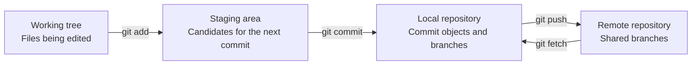



## The Problem: Why Git Still Feels Uncertain Even After Memorizing Commands

The most common confusion in Git begins with treating `add`, `commit`, and `push` as one “save” operation. But the three commands change different spaces. `pull` is also not a simple download; it is a compound operation that fetches remote changes and then integrates them into the current branch.

Without this distinction, the following questions are difficult to answer.

- Why was a modified file not included in the commit?
- Why is a commit not visible in the remote repository?
- Why does `git status` show changes when `git diff` shows nothing?
- Why did a conflict or unexpected merge commit appear immediately after `pull`?

The key to using Git reliably is not knowing many commands, but **observing which space currently contains each change**.

## Mental Model: Work Moves Among Four Spaces



### 1. Working tree

These are the actual files visible in an editor and file browser. Pressing Save means only that a file on disk changed; it does not mean the change was recorded in Git history.

### 2. Staging area (index)

This is the space where you assemble “the snapshot for the next commit.” Git appears to store files, but it actually records a snapshot of the project tree at commit time. `git add` copies the current file contents into the staging area.

If you modify a file again after adding it, two versions of that file can exist simultaneously.

- Staged version: the content that will enter the next commit
- Working-tree version: content edited further afterward

### 3. Local repository

Commit objects, trees, blobs, and branch references are stored under `.git`. `git commit` creates a new commit from the staging-area snapshot and makes the current branch point to it. No network communication has occurred yet.

### 4. Remote repository

This is the repository shared by the team and CI. `origin` is merely a conventional remote name, not a special keyword. `git push origin main` asks Git to transmit the commits referenced by the local `main` and move the remote `main` reference.

`origin/main` is not the remote server itself either. It is a **remote-tracking branch** representing the state remembered by local Git at the time of the last `fetch` or `push`. To learn the server's latest state, first run `git fetch`.

### HEAD and branches are pointers

Commits are generally immutable objects, while branches are movable names pointing to particular commits. `HEAD` usually points to the currently checked-out branch.

```text
HEAD -> main -> C3 -> C2 -> C1
```

Creating a new commit `C4` does not modify a past commit; it moves the `main` pointer to `C4`. With this model, branch, reset, rebase, and reflog can all be interpreted as “which pointer moved where?”

## Practical Pattern: Observe, Record in Small Units, and Synchronize Explicitly

### Four basic commands for inspecting state

```bash
git status --short --branch
git diff
git diff --staged
git log --oneline --decorate --graph --all -n 20
```

Each command answers a different question.

| Command | Question answered |
|---|---|
| `git status --short --branch` | What are the current branch and changed files? |
| `git diff` | How do the working tree and staging area differ? |
| `git diff --staged` | How do the staging area and `HEAD` commit differ? |
| `git log ...` | What shape do the branches and commit graph have? |

Do not conclude that nothing changed just because `git diff` is empty. Changes already added appear in `git diff --staged`.

### Turn one piece of work into one reviewable commit

```bash
# 1) 전체 상태를 본다.
git status --short --branch

# 2) 필요한 hunk만 선택한다.
git add --patch

# 3) 실제 커밋될 내용을 검토한다.
git diff --staged --check
git diff --staged

# 4) 의도를 설명하는 메시지로 기록한다.
git commit -m "docs: explain cache invalidation policy"

# 5) 커밋 후 작업 트리와 이력을 다시 확인한다.
git status --short --branch
git show --stat --oneline HEAD
```

`git add .` is not always wrong, but it enlarges the review scope when unrelated work and temporary files are mixed together. `git add --patch` lets you choose inclusion by change hunk, increasing commit cohesion.

A good commit has the following properties.

- Its purpose can be explained in one sentence.
- It preserves a buildable or testable state.
- It separates formatting changes from behavioral changes when possible.
- It contains no secrets, generated outputs, or personal environment files.
- Its message records not only “what changed,” but also “why” when needed.

### Inspect differences from the remote before pushing

```bash
git fetch --prune origin

# 로컬에만 있는 커밋
git log --oneline origin/main..HEAD

# 원격에만 있는 커밋
git log --oneline HEAD..origin/main

# 양쪽 차이와 갈라진 지점
git log --left-right --graph --oneline HEAD...origin/main
```

Because `fetch` does not automatically change the working tree or current branch, it is useful as a safe observation step. After inspecting the remote changes, choose how to integrate them.

If the current branch is behind the remote and has no local commits, the following command permits only a fast-forward.

```bash
git pull --ff-only
```

If the branches have diverged, `--ff-only` stops. This failure is a safeguard that avoids hiding the problem and forces a conscious choice between merge and rebase.

Set the upstream when sharing a new branch for the first time.

```bash
git switch -c docs/cache-policy
git push --set-upstream origin docs/cache-policy
```

Afterward, `git push` and `git pull --ff-only` know the tracked branch. However, the existence of an upstream does not guarantee that it is always the correct push target, so inspect `git status --short --branch` first.

### Think of pull as two separate operations

Conceptually, `pull` is the following.

```text
git pull = git fetch + 통합(merge 또는 rebase)
```

Actually separating these operations during initial learning or on an important branch makes the decision point clear.

```bash
git fetch origin
git log --left-right --graph --oneline HEAD...origin/main

# fast-forward 가능한 경우에만 현재 브랜치를 이동
git merge --ff-only origin/main
```

If team policy uses rebase, `git rebase origin/main` can be run explicitly on a feature branch. Do not rewrite commits on a public branch already used by other people.

### `.gitignore` applies to files that are not yet tracked

```gitignore
# 로컬 환경과 생성물 예시
.env
.env.*
!.env.example
build/
dist/
*.log
```

A file that has already been committed remains tracked after it is added to `.gitignore`. And `.gitignore` is not a security control. Never commit secret values in the first place; if one is accidentally exposed, revoke and reissue it immediately.

Keep shareable templates separately without real values.

```dotenv
# .env.example
SERVICE_ENDPOINT=https://example.invalid
API_TOKEN=<SET_IN_SECRET_STORE>
```

## Verification Checklist

Before sharing changes, check the following in order.

- [ ] The current branch and upstream shown by `git status --short --branch` are as expected.
- [ ] Both `git diff` and `git diff --staged` have been read.
- [ ] `git diff --staged --check` reports no whitespace errors.
- [ ] Build, tests, and linting have been run in proportion to the change scope.
- [ ] There are no `.env` files, keys, tokens, customer data, personal paths, or large generated outputs.
- [ ] Differences between local and remote have been inspected after `git fetch --prune origin`.
- [ ] Each commit expresses one intent and its message explains that intent.
- [ ] The remote branch and CI results have been checked after pushing.

The following alias is optional, but useful when repeatedly viewing the graph.

```bash
git config --global alias.lg "log --graph --decorate --oneline --all"
```

It is better not to assume aliases in team documentation or automation, because commands may not reproduce in another environment.

## Failure Cases and Limitations

### “I committed it, so it is backed up”

If the local disk is damaged, unpushed commits can disappear. A commit creates history, while a remote push or separate backup provides durability. They are different concerns.

### “Pull overwrites files with the latest versions”

Git integrates commit graphs. If both local and remote advanced, conflicts or a merge commit can result. This is why automation favors `fetch` and an explicit integration policy over `git pull`.

### “A clean working tree is identical to the remote”

A clean working tree means only that there are no uncommitted changes relative to `HEAD`. The local branch may be ahead of or behind the remote.

### “Git is suitable for every kind of file history”

Git is strong for source and text changes, but large binaries, frequently changing model files, and datasets face storage costs and diff limitations. Separate Git LFS, artifact repositories, and data-versioning tools according to their purposes.

### “Git history provides complete reproducibility”

Code versions alone cannot restore execution environments, external services, data snapshots, secret configuration, and build tools. Lock files, container image digests, IaC, data provenance, and execution metadata are all needed to approach a reproducible system.

Git's most important habit is short: **inspect state, read differences, create small snapshots, check the remote graph, and then share**.
