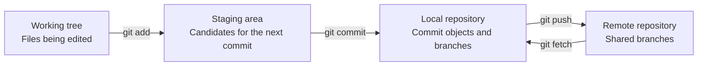



## El problema: por qué Git todavía se siente inseguro incluso después de memorizar comandos

La confusión más común en Git comienza al tratar `add`, `commit` y `push` como una operación de "guardar". Pero los tres comandos cambian espacios diferentes. `pull` tampoco es una descarga simple; es una operación compuesta que recupera cambios remotos y luego los integra en la rama actual.

Sin esta distinción, las siguientes preguntas son difíciles de responder.

- ¿Por qué no se incluyó un archivo modificado en la confirmación?
- ¿Por qué una confirmación no es visible en el repositorio remoto?
- ¿Por qué `git status` muestra cambios cuando `git diff` no muestra nada?
- ¿Por qué apareció un conflicto o una confirmación de fusión inesperada inmediatamente después de `pull`?

La clave para usar Git de manera confiable es no conocer muchos comandos, sino **observar qué espacio contiene actualmente cada cambio**.

## Modelo mental: el trabajo se mueve entre cuatro espacios



### 1. Árbol de trabajo

Estos son los archivos reales visibles en un editor y explorador de archivos. Presionar Guardar significa solo que un archivo en el disco cambió; no significa que el cambio se registró en el historial de Git.

### 2. Área de preparación (índice)

Este es el espacio donde se reúne "la instantánea para la próxima confirmación". Git parece almacenar archivos, pero en realidad registra una instantánea del árbol del proyecto en el momento de la confirmación. `git add` copia el contenido del archivo actual en el área de preparación.

Si modifica un archivo nuevamente después de agregarlo, pueden existir dos versiones de ese archivo simultáneamente.

- Versión preparada: el contenido que entrará en la próxima confirmación.
- Versión del árbol de trabajo: contenido editado posteriormente

### 3. Repositorio local

Los objetos de confirmación, árboles, blobs y referencias de ramas se almacenan en `.git`. `git commit` crea una nueva confirmación a partir de la instantánea del área de preparación y hace que la rama actual apunte a ella. Aún no se ha producido ninguna comunicación de red.

### 4. Repositorio remoto

Este es el repositorio compartido por el equipo y CI. `origin` es simplemente un nombre remoto convencional, no una palabra clave especial. `git push origin main` le pide a Git que transmita las confirmaciones a las que hace referencia el `main` local y que mueva la referencia remota de `main`.

`origin/main` tampoco es el servidor remoto. Es una **rama de seguimiento remoto** que representa el estado recordado por Git local en el momento del último `fetch` o `push`. Para conocer el estado más reciente del servidor, primero ejecute `git fetch`.

### HEAD y las ramas son punteros

Las confirmaciones son generalmente objetos inmutables, mientras que las ramas son nombres móviles que apuntan a confirmaciones particulares. `HEAD` normalmente apunta a la rama actualmente desprotegida.

```text
HEAD -> main -> C3 -> C2 -> C1
```

La creación de una nueva confirmación `C4` no modifica una confirmación anterior; mueve el puntero `main` a `C4`. Con este modelo, bifurcar, restablecer, rebase y volver a registrar se pueden interpretar como "¿qué puntero se movió adónde?"

## Patrón práctico: observar, registrar en unidades pequeñas y sincronizar explícitamente

### Cuatro comandos básicos para inspeccionar el estado

```bash
git status --short --branch
git diff
git diff --staged
git log --oneline --decorate --graph --all -n 20
```

Cada comando responde a una pregunta diferente.

| Comando | Pregunta respondida |
|---|---|
| `git status --short --branch` | ¿Cuáles son la rama actual y los archivos modificados? |
| `git diff` | ¿En qué se diferencian el árbol de trabajo y el área de preparación? |
| `git diff --staged` | ¿En qué se diferencian el área de preparación y el compromiso `HEAD`? |
| `git log ...` | ¿Qué forma tienen las ramas y el gráfico de compromiso? |

No concluya que nada cambió sólo porque `git diff` está vacío. Los cambios ya agregados aparecen en `git diff --staged`.

### Convierta un trabajo en un compromiso revisable

```bash
# 1) 전체 상태를 본다.
git status --short --branch

# 2) 필요한 hunk만 선택한다.
git add --patch

# 3) 실제 커밋될 내용을 검토한다.
git diff --staged --check
git diff --staged

# 4) 의도를 설명하는 메시지로 기록한다.
git commit -m "docs: explain cache invalidation policy"

# 5) 커밋 후 작업 트리와 이력을 다시 확인한다.
git status --short --branch
git show --stat --oneline HEAD
```

`git add .` no siempre es incorrecto, pero amplía el alcance de la revisión cuando se mezclan trabajos no relacionados y archivos temporales. `git add --patch` le permite elegir la inclusión por fragmento de cambio, lo que aumenta la cohesión de la confirmación.

Un buen compromiso tiene las siguientes propiedades.

- Su finalidad se puede explicar en una frase.
- Conserva un estado edificable o comprobable.
- Separa los cambios de formato de los cambios de comportamiento cuando es posible.
- No contiene secretos, resultados generados ni archivos de entorno personal.
- Su mensaje registra no sólo “qué cambió”, sino también “por qué” cuando es necesario.

### Inspeccione las diferencias con el control remoto antes de presionar

```bash
git fetch --prune origin

# 로컬에만 있는 커밋
git log --oneline origin/main..HEAD

# 원격에만 있는 커밋
git log --oneline HEAD..origin/main

# 양쪽 차이와 갈라진 지점
git log --left-right --graph --oneline HEAD...origin/main
```

Debido a que `fetch` no cambia automáticamente el árbol de trabajo o la rama actual, resulta útil como paso de observación seguro. Después de inspeccionar los cambios remotos, elija cómo integrarlos.

Si la rama actual está detrás de la remota y no tiene confirmaciones locales, el siguiente comando solo permite un avance rápido.

```bash
git pull --ff-only
```

Si las ramas han divergido, `--ff-only` se detiene. Este fallo es una salvaguardia que evita ocultar el problema y obliga a elegir conscientemente entre fusionar y rebase.

Configure el upstream cuando comparta una nueva rama por primera vez.

```bash
git switch -c docs/cache-policy
git push --set-upstream origin docs/cache-policy
```

Posteriormente, `git push` y `git pull --ff-only` conocen la rama rastreada. Sin embargo, la existencia de un flujo ascendente no garantiza que siempre sea el objetivo de empuje correcto, así que primero inspeccione `git status --short --branch`.

### Piensa en pull como dos operaciones separadas

Conceptualmente, `pull` es el siguiente.

```text
git pull = git fetch + 통합(merge 또는 rebase)
```

En realidad, separar estas operaciones durante el aprendizaje inicial o en una rama importante deja claro el punto de decisión.

```bash
git fetch origin
git log --left-right --graph --oneline HEAD...origin/main

# fast-forward 가능한 경우에만 현재 브랜치를 이동
git merge --ff-only origin/main
```

Si la política del equipo utiliza rebase, `git rebase origin/main` se puede ejecutar explícitamente en una rama de funciones. No reescriba confirmaciones en una rama pública que ya utilicen otras personas.

### `.gitignore` se aplica a archivos que aún no han sido rastreados

```gitignore
# 로컬 환경과 생성물 예시
.env
.env.*
!.env.example
build/
dist/
*.log
```

Se realiza un seguimiento de un archivo que ya se ha confirmado después de agregarlo a `.gitignore`. Y `.gitignore` no es un control de seguridad. En primer lugar, nunca cometas valores secretos; si uno queda expuesto accidentalmente, revocarlo y volver a emitirlo inmediatamente.

Mantenga las plantillas compartibles por separado sin valores reales.

```dotenv
# .env.example
SERVICE_ENDPOINT=https://example.invalid
API_TOKEN=<SET_IN_SECRET_STORE>
```

## Lista de verificación de verificación

Antes de compartir cambios, verifique lo siguiente en orden.

- [] La rama actual y la corriente ascendente mostradas por `git status --short --branch` son las esperadas.
- [ ] Se han leído tanto `git diff` como `git diff --staged`.
- [] `git diff --staged --check` no informa errores de espacios en blanco.
- [] La compilación, las pruebas y el linting se han ejecutado en proporción al alcance del cambio.
- [] No hay archivos `.env`, claves, tokens, datos de clientes, rutas personales ni resultados generados de gran tamaño.
- [ ] Se inspeccionaron las diferencias entre local y remoto después de `git fetch --prune origin`.
- [] Cada confirmación expresa una intención y su mensaje explica esa intención.
- [] La rama remota y los resultados de CI se verificaron después de presionar.

El siguiente alias es opcional, pero útil cuando se visualiza el gráfico repetidamente.

```bash
git config --global alias.lg "log --graph --decorate --oneline --all"
```

Es mejor no asumir alias en la documentación o automatización del equipo, porque es posible que los comandos no se reproduzcan en otro entorno.

## Casos de falla y limitaciones

### "Lo cometí, por lo que está respaldado"

Si el disco local está dañado, las confirmaciones no enviadas pueden desaparecer. Una confirmación crea un historial, mientras que una inserción remota o una copia de seguridad independiente proporciona durabilidad. Son preocupaciones diferentes.

### “Pull sobrescribe archivos con las últimas versiones”

Git integra gráficos de confirmación. Si tanto el local como el remoto son avanzados, pueden producirse conflictos o una confirmación de fusión. Es por eso que la automatización favorece a `fetch` y una política de integración explícita sobre `git pull`.

### “Un árbol de trabajo limpio es idéntico al remoto”

Un árbol de trabajo limpio significa únicamente que no hay cambios no confirmados en relación con `HEAD`. La sucursal local puede estar delante o detrás de la remota.

### “Git es adecuado para todo tipo de historial de archivos”

Git es sólido para cambios de fuente y texto, pero los binarios grandes, los archivos de modelo que cambian con frecuencia y los conjuntos de datos enfrentan costos de almacenamiento y limitaciones de diferencias. Separe Git LFS, los repositorios de artefactos y las herramientas de control de versiones de datos según sus propósitos.

### "El historial de Git proporciona una reproducibilidad completa"

Las versiones de código por sí solas no pueden restaurar entornos de ejecución, servicios externos, instantáneas de datos, configuraciones secretas y herramientas de compilación. Se necesitan archivos de bloqueo, resúmenes de imágenes de contenedores, IaC, procedencia de los datos y metadatos de ejecución para abordar un sistema reproducible.

El hábito más importante de Git es breve: **inspeccionar el estado, leer las diferencias, crear pequeñas instantáneas, verificar el gráfico remoto y luego compartir**.
