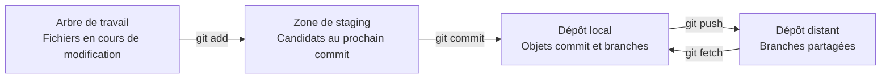



## Le problème : pourquoi Git reste source d'incertitude même quand on connaît les commandes

La confusion la plus courante avec Git vient du fait que l'on considère `add`, `commit` et `push` comme une seule opération de « sauvegarde ». Pourtant, ces trois commandes modifient des espaces différents. `pull` n'est pas non plus un simple téléchargement : c'est une opération composée qui récupère les changements distants, puis les intègre à la branche courante.

Sans cette distinction, il est difficile de répondre aux questions suivantes.

- Pourquoi un fichier modifié n'a-t-il pas été inclus dans le commit ?
- Pourquoi un commit n'apparaît-il pas dans le dépôt distant ?
- Pourquoi `git status` signale-t-il des changements alors que `git diff` n'affiche rien ?
- Pourquoi un conflit ou un merge commit inattendu est-il apparu juste après un `pull` ?

La clé d'une utilisation fiable de Git ne consiste pas à connaître beaucoup de commandes, mais à **observer dans quel espace se trouve actuellement chaque changement**.

## Modèle mental : le travail circule entre quatre espaces



### 1. Arbre de travail (working tree)

Il s'agit des fichiers réels visibles dans l'éditeur et l'explorateur de fichiers. Appuyer sur le bouton Enregistrer signifie uniquement que le fichier sur le disque a changé, pas que cette modification a été inscrite dans l'historique Git.

### 2. Zone de staging (index)

C'est l'espace où l'on assemble « l'instantané du prochain commit ». Git semble enregistrer des fichiers, mais il consigne en réalité un instantané de l'arborescence du projet au moment du commit. `git add` copie le contenu actuel du fichier dans la zone de staging.

Si vous modifiez de nouveau un fichier après l'avoir ajouté, deux versions de ce fichier peuvent coexister.

- Version indexée : le contenu qui fera partie du prochain commit
- Version de l'arbre de travail : le contenu modifié par la suite

### 3. Dépôt local (local repository)

Les objets commit, arbres, blobs et références de branches sont stockés sous `.git`. `git commit` crée un nouveau commit à partir de l'instantané de la zone de staging et fait pointer la branche courante vers celui-ci. Aucune communication réseau n'a encore eu lieu.

### 4. Dépôt distant (remote repository)

C'est le dépôt partagé par l'équipe et la CI. `origin` est simplement un nom de dépôt distant conventionnel, et non un mot-clé particulier. `git push origin main` demande à Git de transmettre les commits désignés par la branche locale `main` et de déplacer la référence `main` distante.

`origin/main` n'est pas non plus le serveur distant lui-même. C'est une **branche de suivi distant** qui représente l'état mémorisé par Git local lors du dernier `fetch` ou `push`. Pour connaître le dernier état du serveur, il faut d'abord exécuter `git fetch`.

### HEAD et les branches sont des pointeurs

Les commits sont en général des objets immuables, tandis que les branches sont des noms mobiles qui pointent vers un commit précis. `HEAD` pointe le plus souvent vers la branche actuellement extraite.

```text
HEAD -> main -> C3 -> C2 -> C1
```

Créer un nouveau commit `C4` ne modifie pas un commit antérieur : le pointeur `main` se déplace vers `C4`. Avec ce modèle, branch, reset, rebase et reflog peuvent tous s'interpréter par la question : « quel pointeur s'est déplacé, et vers où ? »

## Pratique : observer, enregistrer par petites unités et synchroniser explicitement

### Quatre commandes de base pour examiner l'état

```bash
git status --short --branch
git diff
git diff --staged
git log --oneline --decorate --graph --all -n 20
```

Chaque commande répond à une question différente.

| Commande | Question à laquelle elle répond |
|---|---|
| `git status --short --branch` | Quelle est la branche courante et quels fichiers ont changé ? |
| `git diff` | Quelle est la différence entre l'arbre de travail et la zone de staging ? |
| `git diff --staged` | Quelle est la différence entre la zone de staging et le commit `HEAD` ? |
| `git log ...` | Quelle forme ont les branches et le graphe des commits ? |

Ne concluez pas à l'absence de changement simplement parce que `git diff` est vide. Les changements déjà ajoutés apparaissent dans `git diff --staged`.

### Transformer une tâche en un commit vérifiable

```bash
# 1) 전체 상태를 본다.
git status --short --branch

# 2) 필요한 hunk만 선택한다.
git add --patch

# 3) 실제 커밋될 내용을 검토한다.
git diff --staged --check
git diff --staged

# 4) 의도를 설명하는 메시지로 기록한다.
git commit -m "docs: explain cache invalidation policy"

# 5) 커밋 후 작업 트리와 이력을 다시 확인한다.
git status --short --branch
git show --stat --oneline HEAD
```

`git add .` n'est pas toujours une mauvaise pratique, mais il élargit le périmètre de revue lorsque des travaux distincts et des fichiers temporaires sont mélangés. `git add --patch` permet de choisir les changements hunk par hunk et améliore ainsi la cohésion du commit.

Un bon commit présente les propriétés suivantes.

- Son objectif peut être expliqué en une phrase.
- Il conserve un état compilable ou testable.
- Il sépare autant que possible les changements de format des changements de comportement.
- Il ne contient ni secret, ni artefact généré, ni fichier d'environnement personnel.
- Son message indique non seulement « ce qui a été fait », mais aussi, si nécessaire, « pourquoi ».

### Examiner l'écart avec le dépôt distant avant de pousser

```bash
git fetch --prune origin

# 로컬에만 있는 커밋
git log --oneline origin/main..HEAD

# 원격에만 있는 커밋
git log --oneline HEAD..origin/main

# 양쪽 차이와 갈라진 지점
git log --left-right --graph --oneline HEAD...origin/main
```

Comme `fetch` ne modifie automatiquement ni l'arbre de travail ni la branche courante, il constitue une étape d'observation sûre. Après avoir examiné les changements distants, choisissez comment les intégrer.

Si la branche courante est en retard sur la branche distante et ne contient aucun commit local, la commande suivante n'autorise qu'un fast-forward.

```bash
git pull --ff-only
```

Si les branches ont divergé, `--ff-only` s'arrête. Cet échec est un garde-fou qui évite de masquer le problème et impose de choisir consciemment entre merge et rebase.

Définissez l'upstream lors du premier partage d'une nouvelle branche.

```bash
git switch -c docs/cache-policy
git push --set-upstream origin docs/cache-policy
```

Par la suite, `git push` et `git pull --ff-only` connaissent la branche suivie. Cependant, la présence d'un upstream ne garantit pas qu'il soit toujours la bonne cible du push ; commencez donc par examiner `git status --short --branch`.

### Considérer pull comme deux opérations distinctes

Conceptuellement, `pull` se décompose ainsi.

```text
git pull = git fetch + 통합(merge 또는 rebase)
```

Séparer réellement ces opérations pendant l'apprentissage ou sur une branche importante rend le point de décision explicite.

```bash
git fetch origin
git log --left-right --graph --oneline HEAD...origin/main

# fast-forward 가능한 경우에만 현재 브랜치를 이동
git merge --ff-only origin/main
```

Si la politique de l'équipe privilégie rebase, vous pouvez exécuter explicitement `git rebase origin/main` sur une branche de fonctionnalité. Ne réécrivez pas les commits d'une branche publique déjà utilisée par d'autres personnes.

### `.gitignore` s'applique aux fichiers qui ne sont pas encore suivis

```gitignore
# 로컬 환경과 생성물 예시
.env
.env.*
!.env.example
build/
dist/
*.log
```

Un fichier déjà commité reste suivi après son ajout à `.gitignore`. Par ailleurs, `.gitignore` n'est pas un dispositif de sécurité. Ne commitez jamais de valeur secrète ; si l'une d'elles a été exposée par erreur, révoquez-la et remplacez-la immédiatement.

Conservez séparément les modèles partageables, sans valeurs réelles.

```dotenv
# .env.example
SERVICE_ENDPOINT=https://example.invalid
API_TOKEN=<SET_IN_SECRET_STORE>
```

## Liste de vérification

Avant de partager des changements, effectuez les contrôles suivants dans l'ordre.

- [ ] La branche courante et l'upstream affichés par `git status --short --branch` correspondent à ce qui est attendu.
- [ ] `git diff` et `git diff --staged` ont tous deux été lus.
- [ ] `git diff --staged --check` ne signale aucune erreur d'espacement.
- [ ] La compilation, les tests et le linting ont été exécutés en fonction de l'étendue des changements.
- [ ] Aucun fichier `.env`, aucune clé, aucun jeton, aucune donnée client, aucun chemin personnel ni artefact généré volumineux n'est présent.
- [ ] Les écarts entre le dépôt local et le dépôt distant ont été examinés après `git fetch --prune origin`.
- [ ] Chaque commit exprime une intention unique et son message l'explique.
- [ ] La branche distante et les résultats de la CI ont été vérifiés après le push.

L'alias suivant est facultatif, mais pratique pour consulter régulièrement le graphe.

```bash
git config --global alias.lg "log --graph --decorate --oneline --all"
```

Il vaut mieux ne pas supposer l'existence d'alias dans la documentation de l'équipe ou l'automatisation, car les commandes risquent de ne pas être reproductibles dans un autre environnement.

## Cas d'échec et limites

### « J'ai fait un commit, donc j'ai une sauvegarde »

Si le disque local est endommagé, les commits non poussés peuvent disparaître. Un commit crée un historique ; un push distant ou une sauvegarde distincte assure la durabilité. Ce sont deux problèmes différents.

### « Pull remplace les fichiers par leurs dernières versions »

Git intègre des graphes de commits. Si les branches locale et distante ont toutes deux avancé, des conflits ou un merge commit peuvent survenir. C'est pourquoi l'automatisation privilégie `fetch` et une politique d'intégration explicite à `git pull`.

### « Un arbre de travail propre est identique au dépôt distant »

Un arbre de travail propre signifie uniquement qu'il n'existe aucun changement non commité par rapport à `HEAD`. La branche locale peut être en avance ou en retard sur la branche distante.

### « Git convient à l'historique de tous les types de fichiers »

Git est particulièrement adapté aux changements de code source et de texte, mais les binaires volumineux, les fichiers de modèles fréquemment modifiés et les jeux de données posent des problèmes de coût de stockage et de limites de diff. Il faut répartir les usages entre Git LFS, les dépôts d'artefacts et les outils de gestion de versions des données selon leur finalité.

### « L'historique Git garantit une reproductibilité complète »

La seule version du code ne suffit pas à restaurer l'environnement d'exécution, les services externes, les instantanés de données, la configuration secrète et les outils de compilation. Des fichiers lock, des digests d'images de conteneurs, l'IaC, la provenance des données et les métadonnées d'exécution sont également nécessaires pour se rapprocher d'un système reproductible.

L'habitude la plus importante avec Git tient en peu de mots : **examiner l'état, lire les différences, créer de petits instantanés, vérifier le graphe distant, puis partager**.
