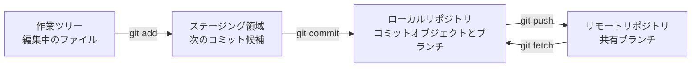



## 問題：コマンドを覚えてもGitが不安なままなのはなぜか

Gitで最も一般的な混乱は、`add`、`commit`、`push`を一つの「保存」操作のように考えることから始まる。しかし、この3つのコマンドはそれぞれ異なる空間を変更する。`pull`も単なるダウンロードではなく、リモートの変更を取得した後、現在のブランチへ統合する複合操作である。

この区別がなければ、次の問いに答えるのが難しい。

- ファイルを変更したのに、なぜコミットに含まれなかったのか。
- コミットしたのに、なぜリモートリポジトリに見えないのか。
- `git diff`には何もないのに、なぜ`git status`は変更ありと表示するのか。
- `pull`直後に、なぜ競合または予期しないmerge commitが生じたのか。

Gitを安定して使う鍵は、コマンドを多く知ることではなく、**現在の変更がどの空間にあるかを観察すること**である。

## Mental model：作業は4つの空間を移動する



### 1. 作業ツリー（working tree）

エディタやファイルエクスプローラーで見える実際のファイルである。保存ボタンを押したという事実は、ディスク上のファイルが変わったことを意味するだけで、Git履歴に記録されたことを意味しない。

### 2. ステージング領域（index）

「次のコミットに入れるスナップショット」を組み立てる空間である。Gitはファイルを保存する仕組みのように見えるが、実際にはコミット時点のプロジェクトツリーのスナップショットを記録する。`git add`は現在のファイル内容をステージング領域へコピーする。

ファイルを`add`した後に再び変更すると、1つのファイルに2つのバージョンが同時に存在し得る。

- ステージ済みバージョン：次のコミットへ入る内容
- 作業ツリーバージョン：その後に追加編集した内容

### 3. ローカルリポジトリ（local repository）

コミットオブジェクト、tree、blob、ブランチ参照が`.git`配下に保存される。`git commit`はステージング領域のスナップショットから新しいコミットを作り、現在のブランチがそのコミットを指すようにする。この時点ではネットワーク通信は行われない。

### 4. リモートリポジトリ（remote repository）

チームとCIが共有するリポジトリである。`origin`は慣例的なリモート名にすぎず、特別なキーワードではない。`git push origin main`は、ローカル`main`が指すコミットをリモートへ転送し、リモート`main`参照を移動するよう要求する。

`origin/main`もリモートサーバーそのものではない。最後の`fetch`または`push`時点でローカルGitが記憶した**remote-tracking branch**である。サーバーの最新状態を知るには、まず`git fetch`が必要である。

### HEADとブランチはポインターである

コミットは通常変更されないオブジェクトであり、ブランチは特定のコミットを指す移動可能な名前である。`HEAD`は通常、現在checkoutしているブランチを指す。

```text
HEAD -> main -> C3 -> C2 -> C1
```

新しいコミット`C4`を作ると、過去のコミットを修正するのではなく、`main`ポインターが`C4`へ移動する。このモデルを理解すれば、branch、reset、rebase、reflogも「どのポインターがどこへ動いたか」として解釈できる。

## 実践パターン：観察し、小さく記録し、明示的に同期する

### 状態を見る4つの基本コマンド

```bash
git status --short --branch
git diff
git diff --staged
git log --oneline --decorate --graph --all -n 20
```

各コマンドが答える問いは異なる。

| コマンド | 答える問い |
|---|---|
| `git status --short --branch` | 現在のブランチと変更ファイルは何か。 |
| `git diff` | 作業ツリーとステージング領域はどう異なるか。 |
| `git diff --staged` | ステージング領域と`HEAD`コミットはどう異なるか。 |
| `git log ...` | ブランチとコミットグラフはどのような形か。 |

`git diff`が空でも、変更がないと断定してはならない。すでに`add`した変更は`git diff --staged`に表示される。

### 1つの作業を1つのレビュー可能なコミットにする

```bash
# 1) 전체 상태를 본다.
git status --short --branch

# 2) 필요한 hunk만 선택한다.
git add --patch

# 3) 실제 커밋될 내용을 검토한다.
git diff --staged --check
git diff --staged

# 4) 의도를 설명하는 메시지로 기록한다.
git commit -m "docs: explain cache invalidation policy"

# 5) 커밋 후 작업 트리와 이력을 다시 확인한다.
git status --short --branch
git show --stat --oneline HEAD
```

`git add .`が常に悪いわけではないが、異なる作業や一時ファイルが混在するとレビュー範囲が広がる。`git add --patch`なら変更hunk単位で含めるかを選べるため、コミットの凝集度を高められる。

良いコミットには次の性質がある。

- 1文で目的を説明できる。
- buildまたはtest可能な状態を維持する。
- format変更と動作変更を可能な限り分離する。
- secret、生成物、個人環境ファイルを含まない。
- メッセージは「何をしたか」だけでなく、必要なら「なぜ行ったか」も残す。

### push前にリモートとの差を確認する

```bash
git fetch --prune origin

# 로컬에만 있는 커밋
git log --oneline origin/main..HEAD

# 원격에만 있는 커밋
git log --oneline HEAD..origin/main

# 양쪽 차이와 갈라진 지점
git log --left-right --graph --oneline HEAD...origin/main
```

`fetch`は作業ツリーや現在のブランチを自動変更しないため、安全な観察段階として使いやすい。リモート変更を確認してから統合方法を選ぶ。

現在のブランチがリモートより遅れていて、ローカルコミットがなければ、次のコマンドはfast-forwardのみを許可する。

```bash
git pull --ff-only
```

互いに分岐していれば`--ff-only`は停止する。この失敗は問題を隠さず、mergeまたはrebaseを意識的に選ばせる安全装置である。

新しいブランチを初めて共有するときはupstreamを設定する。

```bash
git switch -c docs/cache-policy
git push --set-upstream origin docs/cache-policy
```

その後は`git push`と`git pull --ff-only`が追跡対象ブランチを認識できる。ただし、upstreamが設定済みだからといってpush先が常に正しいとは限らないので、先に`git status --short --branch`を見る。

### pullを2つの操作に分けて考える

概念上、`pull`は次のとおりである。

```text
git pull = git fetch + 통합(merge 또는 rebase)
```

初期学習や重要ブランチでは、実際に分けて実行すると判断点が明確になる。

```bash
git fetch origin
git log --left-right --graph --oneline HEAD...origin/main

# fast-forward 가능한 경우에만 현재 브랜치를 이동
git merge --ff-only origin/main
```

チーム方針がrebaseなら、feature branchで明示的に`git rebase origin/main`を使える。すでに他者が利用する公開ブランチのコミットを書き換えてはならない。

### `.gitignore`はまだ追跡していないファイルに適用される

```gitignore
# 로컬 환경과 생성물 예시
.env
.env.*
!.env.example
build/
dist/
*.log
```

すでにコミットされたファイルは`.gitignore`に追加しても追跡が続く。そして`.gitignore`はセキュリティ機構ではない。秘密値は最初からコミットせず、誤って露出したら直ちに廃棄・再発行しなければならない。

共有可能なテンプレートは値を入れず、別に用意する。

```dotenv
# .env.example
SERVICE_ENDPOINT=https://example.invalid
API_TOKEN=<SET_IN_SECRET_STORE>
```

## 検証チェックリスト

変更を共有する前に、次の順序で確認する。

- [ ] `git status --short --branch`で現在のブランチとupstreamが想定どおりである。
- [ ] `git diff`と`git diff --staged`の両方を読んだ。
- [ ] `git diff --staged --check`が空白エラーを報告しない。
- [ ] build、test、lintを変更範囲に応じて実行した。
- [ ] `.env`、鍵、token、顧客データ、個人パス、大容量生成物がない。
- [ ] `git fetch --prune origin`後にローカルとリモートの差を確認した。
- [ ] 1コミットが1つの意図を表し、メッセージがその意図を説明する。
- [ ] push後にリモートブランチとCI結果を確認した。

次のaliasは必須ではないが、グラフを繰り返し見るときに有用である。

```bash
git config --global alias.lg "log --graph --decorate --oneline --all"
```

aliasをチーム文書や自動化の前提にしない方がよい。別の環境ではコマンドを再現できない可能性があるためである。

## 失敗事例と限界

### 「commitしたからバックアップされた」

ローカルディスクが破損すれば、pushしていないコミットは失われ得る。commitは履歴作成であり、リモートpushや別バックアップは耐久性の確保である。この2つは別問題である。

### 「pullは最新ファイルで上書きする」

Gitはコミットグラフを統合する。ローカルとリモートが両方進んでいれば、競合やmerge commitが生じ得る。自動化で`git pull`より`fetch`と明示的な統合方針を好む理由である。

### 「作業ツリーがcleanならリモートと同じ」

cleanな作業ツリーは`HEAD`に対する未コミット変更がないという意味にすぎない。ローカルブランチがリモートより先行または遅延している可能性がある。

### 「Gitはすべてのファイル履歴に適している」

Gitはソースとテキスト中心の変更に強いが、巨大binary、頻繁に変わるmodel file、datasetには保存コストとdiffの限界がある。Git LFS、artifact repository、data version management toolを目的に応じて分離すべきである。

### 「Git履歴が完全な再現性そのものである」

code versionだけでは、実行環境、外部service、data snapshot、secret configuration、build toolまで復元できない。lock file、container image digest、IaC、data provenance、execution metadataも揃って初めて再現可能なシステムに近づく。

Gitで最も重要な習慣は短い。**状態を見て、差分を読み、小さなスナップショットを作り、リモートグラフを確認してから共有する。**
